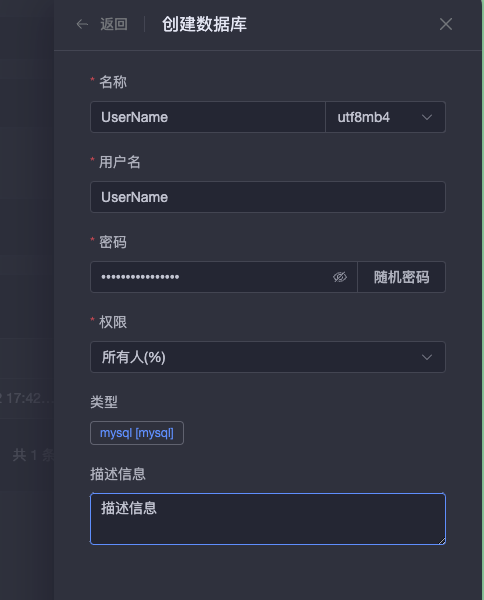

# 安装 1panel

基本上就按照官方教程：
- https://1panel.cn/docs/installation/online_installation/

# 快速整一个 word press 网页服务
登录到 1panel 的管理页面，去左侧的`应用商店`中找到并安装下面的应用：
1. 安装 OpenResty 
    - 注意：如果是大陆的服务器，比如阿里云，网站是需要备案的，因此怕麻烦的话不要用 `80` 和 `443`端口，修改一下
2. 安装 MySQL 
    - 注意：如果希望通过外网直接访问到数据库的话，需要打开外部端口，否则将无法通过`公网IP:端口号`的方式访问数据库

创建 PHP 环境
- 点击左侧的`网站->运行环境`, 点击`创建运行环境`
 
 

创建数据库
- 点击左侧的`数据库`, 点击创建数据库
    
    

创建网站环境
- 点击左侧`网站`, 点击`创建网站`
    
    
        - 注意: **这里的FTP用户密码会在Word Press下载主题的时候用到**!

配置 word press
- 需要注意`数据库名`和`用户名` 
    
    

- 设置好用户之后，就会需要使用刚刚创建的用户 (其实是后台管理员) 来进行其它设置
    
    

To be Continued

