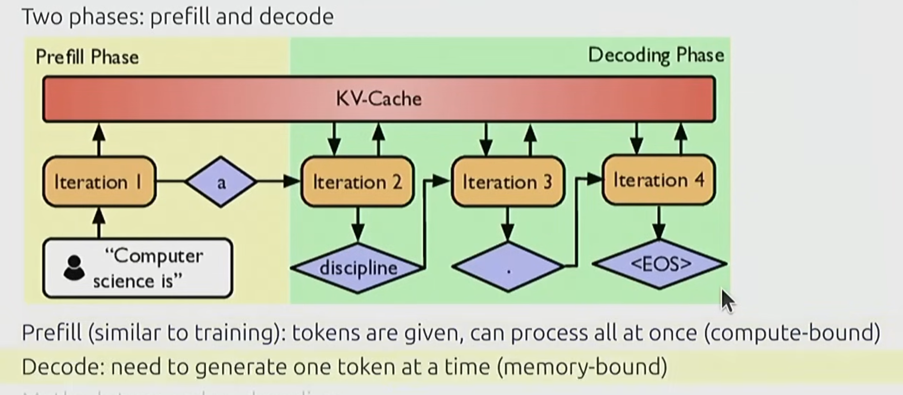
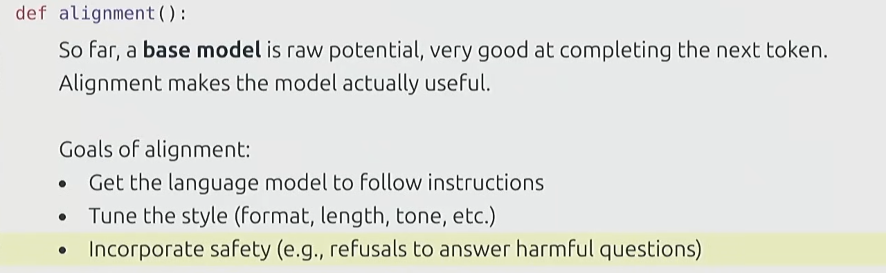
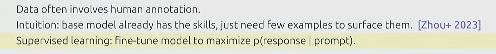

# 大纲

所有课件: https://github.com/stanford-cs336/spring2025-lectures

视频: https://www.youtube.com/watch?v=SQ3fZ1sAqXI&list=PLoROMvodv4rOY23Y0BoGoBGgQ1zmU_MT_

* L1: introduce
* L2: basic transformer concept, Triton, model training
* L3: Scaling law 
  > Simple rule: 要训练一个 n-B 大小的模型, 则**训练集数据量**就需要 $20*n$ billion tokens. 比如 7B大小的模型就需要140B token的训练数据.
* L4: 
  * Data (dataset) 
  * Model evaluation
    * perplexity, standardized testing (MMLU, HellaSwag, GSM8K), instruction following (AlpacaEval, IFEval, WildBench), scaling test-time compute (chain-of-thought, ensembling), LM-as-a-judge (evaluate generative tasks, need algorithms like PPO, DPO, GRPO), full system like RAG/agent

---

# 作业预告 
- A1: 实现 BPE
- A2: 实现 RMSNorm kernel in Triton, Distributed data parallel training, optimizer sharding, benchmarking
- A3: 
- A4: 
- A5: implement supervised fine-tuning, implement DPO, implement GRPO

---

# 课堂随手记

Model Inference
- Include two phases: prefill and decode

Alignment after basic modeling training (you got the base model):

  * supervised fine-tuning
    * 
  * learn from feedback

BPE (Byte Pair Encoding, from 1994)
- basic idea: train the tokenizer on raw text to automatically determine the vocabulary
- Intuition: common sequences of characters are represented by a single token, rare sequences are represented by many tokens.
> The GPT-2 paper used word-based tokenization to break up the text into inital segments and run the original BPE algorithm on each segment.
> > sketch: start with each byte as a token, and successively merge the most common pair of adjacent tokens.
>>> 简单来讲, BPE就是把出现频次高的 "字" 组成了 "词组", 然后用一个新的token去表示这个词组, 然后删掉原来这些单个字的token (只需要保留词组即可, 因为词组比单个字更有用). 

>>>>举个例子, "你" 和 "好" 很容易出现词组 "你好", BPE处理之后, 最终单词表里可能只保留 "你好" 对应的token, 而删掉了 "你" 和 "好" 这两个单独的字所对应的token, 从而实现更高效的编码. 

