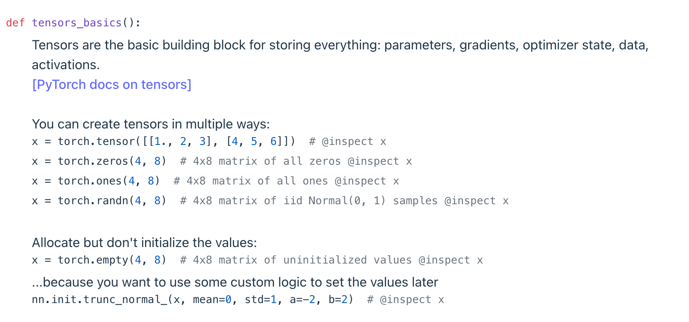
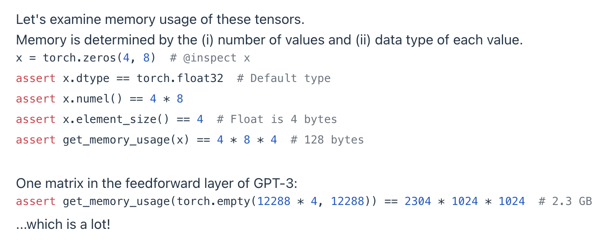
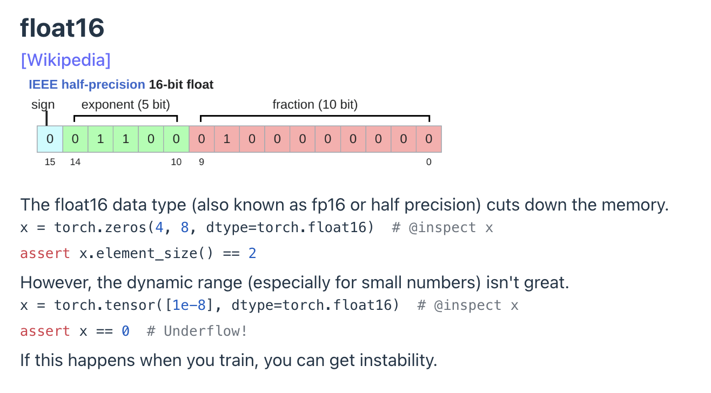
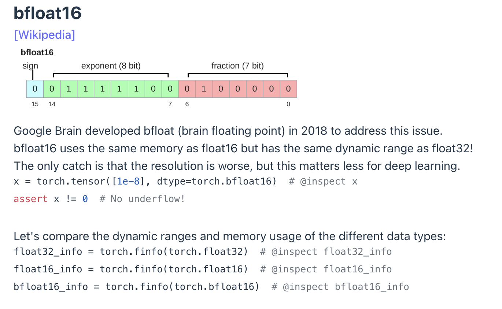
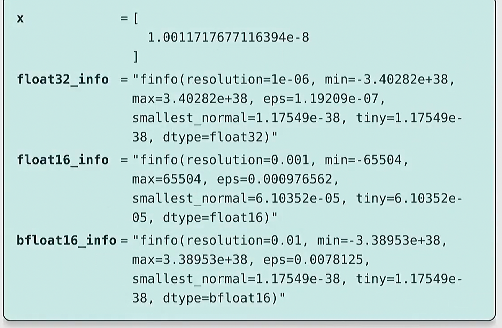
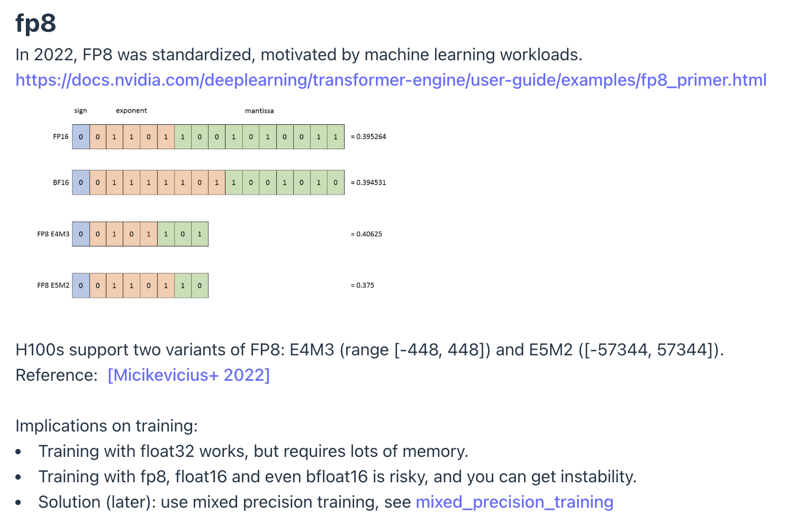
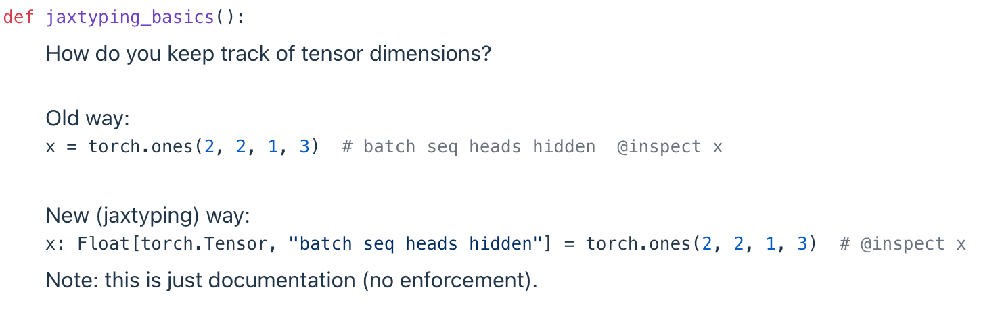
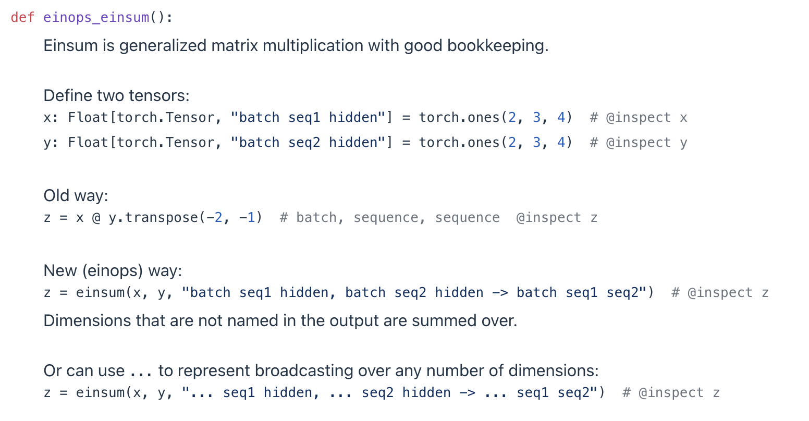

# 课件
课件: https://stanford-cs336.github.io/spring2025-lectures/?trace=var/traces/lecture_02.json
视频: https://www.youtube.com/watch?v=msHyYioAyNE&list=PLoROMvodv4rOY23Y0BoGoBGgQ1zmU_MT_&index=2


---
---


# 课堂随手记

Pytorch 中常用的创建 tensor 的方法:



## Tensor 数据类型
Float32 -- 也被称为 `单精度浮点型`, pytorch中使用`fp32`表示, 32表示这种数据类型一共使用 `32 bit`, 也就是每个数值占用 `4 byte` 内存空间; 双精度浮点型一般指的是 `float64`, 这种数值一般使用在物理相关的需要减少累计误差的仿真运算中.
> 一个符号位, 记录正负值
> 8 个指数位
> 23 个小数位
    

例子: 计算fp32矩阵占用的内存空间大小:

* 4x8大小的矩阵, 矩阵中一共有$4*8=32$个元素, 使用pytorch默认的 fp32 数据类型时, 每个元素占用空间为 4byte, 所以一共使用 $4*8*4 = 32*4 = 128$ byte 的内存空间.


---

Float16 -- 也被称为 `半精度浮点型`, pytorch中使用`fp16`表示, 每个数值占用`2 byte`内存空间.
- 只能用在小模型上, 最好**不要用于模型训练**
- 容易出现 `underflow`问题


---

bfloat16 -- Brain floating point, pytorch中使用`bf16`表示, 每个数值占用 `2byte`
- 使用的内存空间与 fp16 相同, 结构上的不同点是bf16调整了`指数位数为8bit`和`小数位数为7bit`
- 表达的动态数值范围与 float32 相同(整数部分越大损失了一部分小数), **解决了fp16的underflow问题**. 
- **bf16 数值类型适合绝大部分模型推理**, 对于模型训练来说 bf16 也不推荐用, 尤其对于优化器状态和参数来说(optimizer states and parameters)最好还是使用fp32来确保足够的精度, 由此出现了`混合精度`的训练模式.


    > 使用 `torch.finfo()` 可以查看数值范围等信息

---

FP8 

- 通常只会用于模型推理, 尤其是边缘设备的部署, 以及在非常有限的计算资源的机器上部署较大模型进行推理的时候用.

---

# tensor on GPU
* 使用 `torch.cuda.get_device_properties()` 可以查看GPU信息
* 使用 `torch.cuda.memory_allocated()` 可以查看当前GPU显存用量

tensor的存储方法

* 对于二维张量, 直接按行进行拼接成一个**很长的序列**, 寻址的时候使用 `行index * 行stride + 列index * 列stride` 的计算方式即可找到对应元素, 要注意行和列的stride对应的数值是不相同的.

---

# Tensor slicing
对于tensor来说, slice里的很多操作其实**不会进行多次复制**, 而仅仅是生成用不同"视角(view)", 这样可以极大节省时间和存储空间.
```python
def same_storage(x: torch.Tensor, y: torch.Tensor):
    # find the data pointer in the storage
    return x.untyped_storage().data_ptr() == y.untyped_storage().data_ptr()

def tensor_slicing():
    x = torch.tensor([[1., 2, 3], [4, 5, 6]])  # @inspect x
    # Many operations simply provide a different view of the tensor.
    # This does not make a copy, and therefore mutations in one tensor affects the other.
    
    # Get row 0:
    y = x[0]  # @inspect y
    assert torch.equal(y, torch.tensor([1., 2, 3]))
    assert same_storage(x, y)
    
    # Get column 1:
    y = x[:, 1]  # @inspect y
    assert torch.equal(y, torch.tensor([2, 5]))
    assert same_storage(x, y)
    
    # View 2x3 matrix as 3x2 matrix:
    y = x.view(3, 2)  # @inspect y
    assert torch.equal(y, torch.tensor([[1, 2], [3, 4], [5, 6]]))
    assert same_storage(x, y)
    
    # Transpose the matrix:
    y = x.transpose(1, 0)  # @inspect y
    assert torch.equal(y, torch.tensor([[1, 4], [2, 5], [3, 6]]))
    assert same_storage(x, y)
    
    # Check that mutating x also mutates y.
    x[0][0] = 100  # @inspect x, @inspect y
    assert y[0][0] == 100
    
    # Note that some views are non-contiguous entries, which means that further views aren't possible.
    x = torch.tensor([[1., 2, 3], [4, 5, 6]])  # @inspect x
    y = x.transpose(1, 0)  # @inspect y
    assert not y.is_contiguous()
    try:
        y.view(2, 3)
        assert False
    except RuntimeError as e:
        assert "view size is not compatible with input tensor's size and stride" in str(e)
    
    # One can enforce a tensor to be contiguous first:
    y = x.transpose(1, 0).contiguous().view(2, 3)  # @inspect y
    assert not same_storage(x, y)
    # Views are free, copying take both (additional) memory and compute.
```
- 不会改变数据存储位置(**不产生cop**y)的操作有: `view`, `transpose`, `mutate`
- 会 **使得元素不连续(non-contiguous)** 的操作: `transpose` 
  - 因为这个操作会**通过修改数据的指针来实现转置**, 因此在进行了 transpose 之后一定要重新使用contiguous(), 防止后续的某个 view 操作报错! 
    > y = x.transpose(1, 0).contiguous().view(2, 3)  
    >> contiguous 会执行一次拷贝.
- `.reshape()` 操作等价于执行 `.contiguous().view()`


---

# Tensor element-wise (逐元素操作/元素密集型操作) 
```python
def tensor_elementwise():
    # These operations apply some operation to each element of the tensor and return a (new) tensor of the same shape.
    x = torch.tensor([1, 4, 9])
    assert torch.equal(x.pow(2), torch.tensor([1, 16, 81]))
    assert torch.equal(x.sqrt(), torch.tensor([1, 2, 3]))
    assert torch.equal(x.rsqrt(), torch.tensor([1, 1 / 2, 1 / 3]))  # i -> 1/sqrt(x_i)
    assert torch.equal(x + x, torch.tensor([2, 8, 18]))
    assert torch.equal(x * 2, torch.tensor([2, 8, 18]))
    assert torch.equal(x / 0.5, torch.tensor([2, 8, 18]))
    
    # triu takes the upper triangular part of a matrix.
    x = torch.ones(3, 3).triu()  # @inspect x
    assert torch.equal(x, torch.tensor([
        [1, 1, 1],
        [0, 1, 1],
        [0, 0, 1]],
    ))
    
    # This is useful for computing an causal attention mask, where M[i, j] is the contribution of i to j.
```
- `pow`: 求幂
- `sqrt`: 开二次方
- `rsqrt`: 开二次方, 再求倒数
- `+`: 矩阵对应元素做加法
- `*`: 矩阵对应元素做乘法
- `/`: 矩阵对应元素做除法
- `triu`: 取出上三角矩阵


---

# tensor -- einops
Einops 是一个用于简化张量重排和变换的 Python 库, 采用了爱因斯坦助记符概念, 它提供了一种直观的方式来进行复杂的张量操作，比如重塑(rearrage)、转置(transpose)、重复(repeat)和降维(reduce)等，尤其在处理多维数组时非常有用。

安装: `pip3 install einops` 

> 注意: `torch.einsum()` 提供了 einops 库的所有功能, 但是用法上和einops库有点不一样, **torch 要求给出所有维度的定义**, 不可以用 `...` 的方式简写.

## motivation of einops
这个操作出现的起因:
```python
def einops_motivation():
    # Traditional PyTorch code:
    x = torch.ones(2, 2, 3)  # batch, sequence, hidden  @inspect x
    y = torch.ones(2, 2, 3)  # batch, sequence, hidden  @inspect y

    # 这里的负数指的是从右往前找index, 比如原来的维度定义是 (batch, sequence, hidden), -1 表示 hidden 这个维度, -2 表示 sequence 维度 
    z = x @ y.transpose(-2, -1)  # batch, sequence, sequence  @inspect z

    # Easy to mess up the dimensions (what is -2, -1?)...
    # 随着时间推移, 人们总是会忘记负数对应了哪个含义, 于是发明了 einops 
```

## jaxtyping 风格的注释 

除了写注释 (comment), 现在有新的形式 `jaxtyping`
 
- 这样写只是相当于写了一个注释, 并不真正运行的代码, 使用 jaxtyping 的好处是 IDE 可以帮忙检查类型 或者 方便快速查看张量的维度定义.
  - 示例中其实还少了一句 `from jaxtyping import Float`

> 注意: jaxtyping 其实是 jax 的语法, 并非属于原生 torch
>> 安装: `pip3 install jaxtyping`
>>>  安装 jax: `pip3 install jax jaxlib`


## einops -- einsum

- 示例中其实还少了一句 `from jaxtyping import Float`
- `einsum`: 本质上就是一个矩阵求和, 它不直接写维度数字, 而是用注释的方式作为输入参数, 这样的好处是清晰告知哪个维度进行了求和.
  > 在图片的例子中, 没有被提及的`hidden`维度就是做了求和
    >> `z = einsum(x, y, "batch seq1 hidden, batch seq2 hidden -> batch seq1 seq2")`
  
  > 在`eisum`中, 如果Tensor有很多个维度, 为了简洁, 可以用 `...` 来省略一些维度, 如图片中的第二个例子
  >> `z = einops.einsum(x, y, "... seq1 hidden, ... seq2 hidden -> ... seq1 seq2") `.


## einops -- reduce (降维)
reduce操作一般指单个张量上的操作, 如 `sum, mean, max, min`
```python
def einops_reduce():
    from jaxtyping import Float
    # You can reduce a single tensor via some operation (e.g., sum, mean, max, min).
    x: Float[torch.Tensor, "batch seq hidden"] = torch.ones(2, 3, 4)  # @inspect x
    
    # Old way:
    y = x.mean(dim=-1)  # @inspect y
    
    # New (einops) way:
    y = reduce(x, "... hidden -> ...", "mean")  # @inspect y
```


