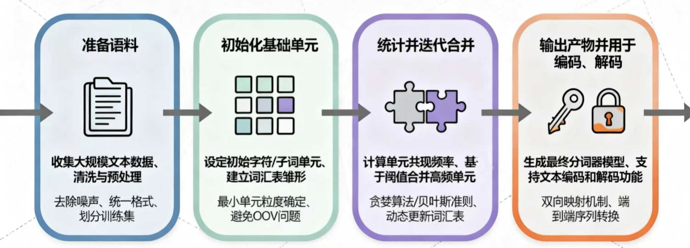
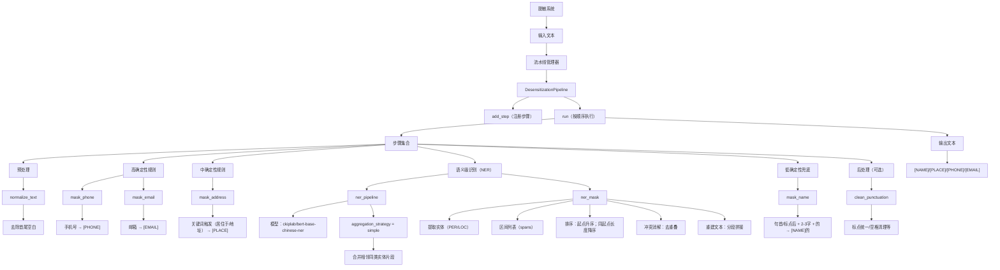

# 训练 Tokenizer
LLM推理的流程一般是:
自然语言 -> tokenizer -> encoder+position embedding -> decoder -> 自然语言

因此Tokenizer是自然语言与LLM对接的第一步.

## 准备语料 
准备预料即: 收集数据 + 基础的数据清洗工作.

对于Tokenizer来说, 最重要的一部分就是`构建词表 (vocabulary)`, 它的任务是**构建将文本片段与token_ID之间的映射关系**. 词表的映射决定了模型看到的是字, 词或是更加细致的字词片段, 词表的好坏会直接影响后续LLM的语义理解/语义建模, 从而直接影响到模型的训练质量.

通常来说, Tokenizer的训练是独立于LLM训练的, 但是却与LLM保持着*强耦合*关系.
训练Tokenizer一般分为4步: 


> 准备预料: 
>> a. 收集多样化数据(风格,语言等); 
>> b. 数据清洗(去除无用元数据, 修正&删除乱码等非法字符, 统一字符编码为UTF-8, 去重等); 
>> c. 对数据进行合规检查, 数据脱敏等.


----------


### 语义级脱敏
`NER + 规则流水线` 示例代码（含详细中文注释）:

> 目标：把文本中的敏感信息按“高确定性规则 → NER (Name Entity Recognition) 语义识别 → 低确定性兜底规则 → 后处理”的顺序进行替换（脱敏）。
> 输出：将人名替换为 `[NAME]`，地名/地址替换为 `[PLACE]`，手机号替换为 `[PHONE]`，邮箱替换为 `[EMAIL]`。

```python
# 说明：下面的代码依赖 transformers / re / typing 等库
# - transformers.pipeline：快速加载 Hugging Face 的预训练 NER 模型
# - re：正则表达式，用于高确定性/兜底规则
# - typing：类型标注，提升可读性与 IDE 提示

import re
from typing import Callable, List
from transformers import pipeline


# =========================
# 1) 初始化命名实体识别（NER）流水线
# =========================
# pipeline("ner", ...) 会返回一个“可调用对象”，传入字符串文本后输出实体列表。
# 这里选择 ckiplab 的中文 NER 模型（BERT base）。
# aggregation_strategy="simple" 的作用：
# - 模型输出常常是“子词级别”的片段（例如 WordPiece/BPE 造成的拆分）
# - simple 会把相邻且同类型的实体片段合并成一个更完整的实体
#   例如 “重” + “庆” 合并为 “重庆”，避免被拆开替换导致文本奇怪
ner_pipeline = pipeline(
    "ner",
    model="ckiplab/bert-base-chinese-ner",
    aggregation_strategy="simple"
)

# 备注：Hugging Face 新版本中，旧参数 grouped_entities=True 已逐步被
# aggregation_strategy 取代；使用 aggregation_strategy 可以避免弃用警告或异常提示。


def ner_mask(text: str) -> str:
    """
    利用 NER 模型做“语义级”脱敏：
    - 识别文本中的人名（PER）与地名/位置（LOC）
    - 将识别到的片段替换为占位符 [NAME] / [PLACE]

    关键点：
    - NER 输出包含实体的起止位置（start/end），我们用“区间替换”来保持原句结构
    - 需要处理“实体区间重叠/包含”的冲突，避免替换错位
    """
    # 调用模型得到实体列表，每个实体通常包含：
    # - entity_group：实体大类（如 PER/LOC/ORG...）
    # - start/end：在原始字符串中的字符位置区间 [start, end)
    # - word：实体文本片段
    # - score：置信度
    entities = ner_pipeline(text)

    spans = []  # 用于收集需要替换的区间 (start, end, tag)

    # 1.1 把模型识别出的实体映射成“待替换区间”
    for ent in entities:
        label = ent["entity_group"]
        start = ent["start"]
        end = ent["end"]

        # 映射实体类型到脱敏占位符
        # PER（Person）→ 人名
        # LOC（Location）→ 地名/位置/地址（取决于模型标注体系）
        if label == "PER":
            spans.append((start, end, "[NAME]"))
        elif label == "LOC":
            spans.append((start, end, "[PLACE]"))

    # 1.2 排序策略
    # - 先按 start 升序：从左到右处理替换
    # - 若 start 相同，按长度降序：优先保留更长的实体（更完整、更少碎片）
    spans.sort(key=lambda x: (x[0], -(x[1] - x[0])))

    # 1.3 冲突消解（去重叠/去包含）
    # NER 有时会产生重叠实体（或同一位置多种候选），如果直接替换会造成：
    # - 索引错位（替换后长度变化导致后续 start/end 不再对应原文本）
    # - 重复替换（同一片段被多次打码）
    #
    # 这里采用“贪心不重叠”策略：
    # - 维护 last_end，确保下一个 start 必须 >= last_end 才接受
    filtered_spans = []
    last_end = -1
    for start, end, tag in spans:
        if start >= last_end:
            filtered_spans.append((start, end, tag))
            last_end = end

    # 1.4 根据最终区间重建文本
    # 原理：不在原字符串上就地修改（避免索引位移），而是分段拼接：
    # - 先拼接上一段“非敏感文本”
    # - 再拼接当前占位符
    # - 更新 last_idx，继续向后推进
    result = []
    last_idx = 0
    for start, end, tag in filtered_spans:
        result.append(text[last_idx:start])  # 非敏感片段
        result.append(tag)                  # 敏感片段占位符
        last_idx = end
    result.append(text[last_idx:])          # 末尾剩余文本

    return "".join(result)


# =========================
# 2) 脱敏流水线架构设计
# =========================
class DesensitizationPipeline:
    """
    脱敏任务管理器（流水线/管道）：
    - 支持按顺序添加多个处理步骤（step）
    - 每个 step 接收字符串、返回字符串
    - run() 按添加顺序依次执行，形成“可组合”的脱敏流程

    设计动机：
    - 规则脱敏（正则）擅长强特征：手机号、邮箱等
    - NER 擅长语义实体：人名、地名等
    - 把二者组合成“先确定、再语义、再兜底”的流程，效果通常更稳
    """
    def __init__(self):
        # steps 存储一组函数：Callable[[str], str]
        self.steps: List[Callable[[str], str]] = []

    def add_step(self, func: Callable[[str], str]):
        """添加一个处理步骤（例如：正则替换、NER 替换、后处理等）"""
        self.steps.append(func)

    def run(self, text: str) -> str:
        """
        按顺序执行所有步骤。
        注意：步骤顺序非常重要，因为前一步会改变文本，影响后一步匹配/识别结果。
        """
        for step in self.steps:
            text = step(text)
        return text


# =========================
# 3) 具体处理步骤实现
# =========================
def normalize_text(text: str) -> str:
    """
    文本预处理：
    - 这里只做 strip()，去掉首尾空白
    - 真实场景可扩展：全角半角、繁简转换、空格归一化等
    """
    return text.strip()


# 3.1 高确定性规则（强特征：命中就基本确定）
def mask_phone(text: str) -> str:
    """
    用正则匹配中国大陆 11 位手机号：
    - 以 1 开头
    - 第二位 3-9
    - 后续 9 位数字
    """
    return re.sub(r'1[3-9]\d{9}', '[PHONE]', text)


def mask_email(text: str) -> str:
    """
    用正则匹配常见邮箱格式（简化版）：
    - 用户名：字母数字及 ._%+- 等
    - 域名：字母数字及 .- 等
    - 后缀：至少 2 位字母
    """
    return re.sub(r'[A-Za-z0-9._%+-]+@[A-Za-z0-9.-]+\.[A-Za-z]{2,}', '[EMAIL]', text)


# 3.2 中确定性规则（基于上下文关键词约束，减少误伤）
def mask_address(text: str) -> str:
    """
    通过关键词引导的“疑似地址”匹配：
    - 先匹配触发词：居住于 / 现居住于 / 现居于 / 地址
    - 再匹配一段连续的中英文数字串作为地址主体（简化）
    - 替换成：触发词 + [PLACE]

    注意：这里的地址主体正则比较粗糙，真实场景可结合更精细的地址词典/规则。
    """
    return re.sub(
        r'(居住于|现居住于|现居于|地址)([\u4e00-\u9fa5A-Za-z0-9]+)',
        r'\1[PLACE]',
        text
    )


# 3.3 低确定性规则（兜底：更容易误伤，建议放在 NER 之后）
def mask_name(text: str) -> str:
    """
    兜底姓名规则（风险较高，容易误伤）：
    - 匹配出现在“句首”或“标点（，。！？）之后”的 2-3 个中文字符
    - 后面紧跟“的”
    - 例如： “张三的手机…” / “，李四的邮箱…”
    - 替换为：[NAME]的

    为什么放在 NER 后：
    - NER 能更准确识别人名；兜底规则只是补漏
    - 若先兜底，可能把普通名词/短语误替换成姓名
    """
    return re.sub(
        r'(?:(?<=^)|(?<=[，。！？]))([\u4e00-\u9fa5]{2,3})(的)',
        r'[NAME]\2',
        text
    )


def clean_punctuation(text: str) -> str:
    """
    后处理环节（可选）：
    - 可用于统一标点、清理重复符号、修复替换产生的多余空格等
    - 当前示例不做任何改动，直接返回
    """
    return text


# =========================
# 4) 一个推荐的流水线组合顺序（示例）
# =========================
# 顺序建议：
# - normalize_text：先清理首尾空白
# - mask_phone/mask_email：先做“强特征”替换，最稳也最不依赖上下文
# - mask_address：有关键词约束，确定性较高
# - ner_mask：语义识别补充（人名/地名）
# - mask_name：最后兜底（防漏但有误伤风险）
# - clean_punctuation：最后统一格式
#
# pipeline_runner = DesensitizationPipeline()
# pipeline_runner.add_step(normalize_text)
# pipeline_runner.add_step(mask_phone)
# pipeline_runner.add_step(mask_email)
# pipeline_runner.add_step(mask_address)
# pipeline_runner.add_step(ner_mask)
# pipeline_runner.add_step(mask_name)
# pipeline_runner.add_step(clean_punctuation)
# output = pipeline_runner.run("张三居住于重庆，邮箱是 test@example.com，手机号 13800138000。")
# print(output)
```


- 完整代码: [数据脱敏处理完整代码](https://github.com/datawhalechina/diy-llm/blob/main/docs/chapter2/de_identified_data_processing.py)  

效果大概是:
```txt
处理前
    小明的邮箱是test111@gmail.com，电话是13312311111，现在居住于重庆两江新区的xxx小区。
         
脱敏后
    [NAME]的邮箱是[EMAIL]，电话是[PHONE]，现在居住于[PLACE]。
```


Note:
- 通常在数据处理流程中，会优先处理高确定性的信息（例如电话号码、邮箱等）以排除干扰，随后再处理姓名等非标准信息，从而降低因表达不规范或格式多样而导致的总体漏检风险。
- 数据脱敏不仅是出于隐私保护与合规要求，同时也有助于提升下游文本建模与分词过程的稳定性。**像姓名、电话号码、身份证号等高基数的信息，如果直接保留在语料中，往往会以近似唯一的形式出现。这类信息在统计上属于低频甚至单次出现的噪声，会干扰分词算法（如BPE、Unigram）在学习高频token结构时的统计效率**。
- *从信息论的角度来看，数据脱敏可以视为一种结构化的去噪过程——通过压缩或消除高熵但低语义价值的信号（如具体身份信息），提高语料中有效信号的占比，可以协助LLM在后面的训练过程更倾向于学习可复用的语义结构，而非记忆偶然出现的实例细节。*


下游任务本身需要识别真实实体（如信息抽取等），过度脱敏会削弱训练信号。因此需要在**保护隐私**与**保留关键语义信息**之间进行合理的策略选择与权衡。

### 注意预料种类的均衡分布

在多语言或混合语料场景中，应统计各语言占比，并评估是否对低资源语言进行过采样或定向保留，避免词表被高频语言主导。否则，语料类型与语言分布不均衡会加剧低资源语言的token碎片化，增加token开销，并降低其任务性能。

例如准备一种可以支持四种语言的分词器，这里假设提前收集到的原始未经过处理的各语言原始语料占比如下：
   
| 语言 | 语料量 |
| :--- | ---: |
| 中文 | 200 GB |
| 英文 | 150 GB |
| 法语 | 10 GB |
| 韩文 | 5 GB |

>这是一个典型的多语言语料不平衡场景。若将上述语料不经处理直接混合训练分词器，其统计过程会被中文和英文主导，导致法语与韩文的常见字串在合并阶段难以进入高频统计，从而无法占据足够的词表空间，最终在`vocab`中会出现大量被切得过碎的`token`，形成严重碎片化，下游LLM在法语与韩文任务上会因此表现显著劣化。

因此在准备语料的第4步应先按语言统计语料占比，并根据目标能力设定合理的采样策略。例如将语料比例调整为`中文:英文:法语:韩文=4:4:1:1`或者`采用完全均衡策略`。通过对高资源语言下采样或对低资源语言过采样、增强，可以获得更符合目标分布的训练语料，再使用验证集评估各语言的token覆盖率、平均其碎片化程度，以确保最终词表在多语言任务中具备稳定且均衡的表示能力。

建议保留一小部分未参与训练的验证语料比如训练集, 比如`验证集＝99:1`，用来**在训练过程中评估分词器对真实文本的编码效率与平均token长度等统计指标**。

--------


## 初始化基础单元
1. 预分词的主要任务是将原始文本切分成可统计、可合并的基础单元，例如字符、字节或Unicode片段。常见策略包括基于空格和标点的切分、按Unicode类别划分，或直接采用字节级切分。需要注意的是并不是所有的分词器都需要用户显式进行预分词。*例如基于SentencePiece的分词器将标准化和预分词逻辑内置，因此无需在外部额外执行预分词步骤。*

### 基于空格和标点的切分
一个完整的句子中遇到空格或者标点（.,!?[]{}...）可以分为独立的tokens，该方法适用于大多数预分词处理过程。

```python
      
   # 基于空格和标点切分的实现示例
   import re
         
   def part(text):
      # 将标点符号单独拆开，并按照空格进行分割
      text = re.sub(r'([.,!?;:()"\'\[\]{}])', r' \1 ', text)
      tokens = text.split()
      return tokens

# 测试
if __name__ == "__main__":         
   s = "I like Datawhale."
   print(part(s))
   
```
   
输入
>I like Datawhale.
         
输出token划分
>['I', 'like', 'Datawhale', '.']

---------

### Unicode类别切分

按照字符的Unicode类别（字母、数字、标点、中文、特殊字符等）自动切分，不同类别会进入不同的token块——*一句话概括，同一个token里的字符类型都是一致的*。这种方法天然适合多语言混合文本，能提供一个可靠的基线切分结果。

```python
import unicodedata

def get_char_category(ch: str) -> str:
    # 获取Unicode标准定义的分类（如'Lu'代表大写字母,'Po'代表其它标点）
    cat = unicodedata.category(ch)

    # 判定是否为中文字符（常用基本汉字区间）
    if '\u4e00' <= ch <= '\u9fff':
        return "CJK"
    
    # 判定是否为数字
    if ch.isdigit():
        return "DIGIT"
    
    # 判定是否为英文字母（或其他语言的字母）
    if ch.isalpha():
        return "ALPHA"

    # 判定是否为标点符号（Unicode 分类以 'P' 开头的均为标点）
    if cat.startswith("P"):
        return "PUNCT"

    # 其余字符（如 Emoji、空格、控制符等）统一归为 OTHER
    return "OTHER"


def segment_by_unicode_category(text: str):
    if not text:
        return []
    segments = []
    # 初始化缓冲区，放入第一个字符
    buffer = [text[0]]
    # 获取第一个字符的类别作为初始参考标准
    prev_type = get_char_category(text[0])

    # 第一阶段：线性扫描文本，按类别切分
    for ch in text[1:]:
        curr_type = get_char_category(ch)

        # 如果当前字符类别与前一个字符相同，则存入缓冲区合并
        if curr_type == prev_type:
            buffer.append(ch)
        else:
            # 类别发生变化，将缓冲区内容作为一个片段存入结果列表
            segments.append(("".join(buffer), prev_type))
            # 重置缓冲区，开始记录新类别的字符
            buffer = [ch]
            prev_type = curr_type

    # 处理最后一个留在缓冲区里的片段
    segments.append(("".join(buffer), prev_type))

    # 第二阶段：提取分段后的字符串内容
    tokens = [seg for seg, _ in segments]
    return tokens

# 测试运行
if __name__ == "__main__":
    # 测试字符串包含：英文、Emoji、中文标点、中文、数字、英文标点
    s = "Hello👋👋，Datawhale成立于2018年！！！"
    result = segment_by_unicode_category(s)
    print("原始文本:", s)
    print("分段结果:", result)
```

输入
>Hello👋👋，Datawhale成立于2018年！！！

输出
>['Hello', '👋👋', '，', 'Datawhale', '成立于', '2018', '年', '！！！']


------------------

### 字节级切分

先将每个字符拆成[UTF-8字节序列](https://datatracker.ietf.org/doc/html/rfc3629)，不依赖语言种类、字符，按照单个字节序列得到一个独立的token。

```python
     
      def tokenize_byte_level(text):
          tokens = []
          for ch in text:
              # 字符对应的UTF-8字节序列
              utf8_bytes = ch.encode("utf-8")
              hex_bytes = [f"{b:02X}" for b in utf8_bytes]
      
              # 打印转换过程
              print(f"{ch} 转化为UTF-8字节序列：{hex_bytes}")
      
              # 加入token列表
              tokens.extend(hex_bytes)
          return tokens

      # 测试
   if __name__ == "__main__":
      s = "All for learners！"
      print(tokenize_byte_level(s))

```

输入
>All for learners！

输出token划分
>['41', '6C', '6C', '20', '66', '6F', '72', '20', '6C', '65', '61', '72', '6E', '65', '72', '73', 'EF', 'BC', '81']

*英文字符和空格是ASCII，UTF-8下都是1字节。而全角感叹号`！`不是ASCII，在UTF-8下是3字节（`！ -> EF BC 81`）*


**Unicode与UTF-8的联系：**

  `Unicode`就像给全世界所有字符发的“身份证号”，不管是英文A、汉字“中”、还是emoji 😄等不同类型的字符都在Unicode里有一个唯一编号比如A是U+0041，“中”是U+4E2D。但“身份证号”本身只是一个抽象编号，电脑不能直接存储。

   `UTF-8`就像把这个字符对应的“身份证号”写进电脑的具体方式。它规定这个字符的编号应该用几个字节、按什么规则写下来。英文常用字符在UTF-8中只需要1个字节，而中文通常需要3个字节。不管是Unicode还是UTF-8都可以表示不同类别的字符，两者配合起来让自然语言可以被计算机准确存储、传输和解析，是人机交互之间的“桥梁”。

>Unicode是"编码标准"，为每个字符分配唯一码点；UTF-8是"编码格式"，负责将码点转换为字节序列。**UTF-8的一大优势是：ASCII字符（0-127）在UTF-8中的编码与ASCII码完全一致，且只占1个字节。这种向后兼容的特性，让它比UTF-16、UTF-32等编码方式更为常用。**

----

### 切分方法的对比
1. **基于空格和标点的方法以及Unicode类别方法的局限**: 
   - 文本缺乏显式分隔符，或出现长段同类字符（例如连续中文长句、拼接的代码标识符、压缩后的字符串）。在这些情况下，预处理阶段难以有效断句，为了保证文本可编码，可能会被迫回退到更细粒度的兜底切分（接近字符级）。


2. **UTF-8字节级策略具有最强的通用性**，它把任意文本统一拆为字节序列，从而从根本上减少`词汇表外（OOV）`问题并覆盖任意字符集。但因为它以最细粒度开始，训练时通常需要更多轮的共现统计与合并来把零散字节压缩为紧凑且具语义的token，才能在Transformer计算效率与语义表征之间取得平衡。

3. 对大多数**以空格为词边界的语言**，可先用`正则表达式按单词边界和标点进行初步切割`，而对**中文、日文等不以空格为词界的语言**则通常`采用逐字符或基于字的初始单元`来保证覆盖性。

4. 字节级预分词:
   - token利用率更高，提高BPE合并token的自由度以及尽可能合并共现频率高的单个字符，提高文本信息压缩率。
        > 文本压缩率：指一段文字被转换成token（数字化）后，用多少token来表示内容的紧凑程度，同样内容使用的token越少，压缩率就越高。
   - 可兼容处理多种语言。
   - 学到更多高频片段，减少词汇表外单词的出现情况，模型推理更快（token数少）。


