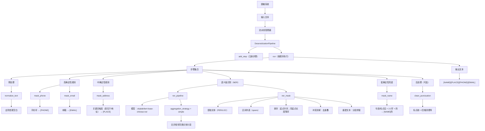
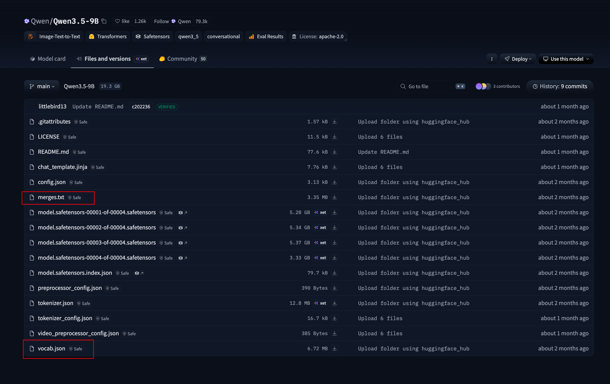

# 训练 Tokenizer
LLM推理的流程一般是:
自然语言 -> tokenizer -> encoder+position embedding -> decoder -> 自然语言

因此Tokenizer是自然语言与LLM对接的第一步.

## 准备语料 
准备预料即: 收集数据 + 基础的数据清洗工作.

对于Tokenizer来说, 最重要的一部分就是`构建词表 (vocabulary)`, 它的任务是**构建将文本片段与token_ID之间的映射关系**. 词表的映射决定了模型看到的是字, 词或是更加细致的字词片段, 词表的好坏会直接影响后续LLM的语义理解/语义建模, 从而直接影响到模型的训练质量.

通常来说, Tokenizer的训练是独立于LLM训练的, 但是却与LLM保持着*强耦合*关系.
训练Tokenizer一般分为4步: 


> 准备预料: 
>> a. 收集多样化数据(风格,语言等); 
>> b. 数据清洗(去除无用元数据, 修正&删除乱码等非法字符, 统一字符编码为UTF-8, 去重等); 
>> c. 对数据进行合规检查, 数据脱敏等.


----------


### 语义级脱敏
`NER + 规则流水线` 示例代码（含详细中文注释）:

> 目标：把文本中的敏感信息按“高确定性规则 → NER (Name Entity Recognition) 语义识别 → 低确定性兜底规则 → 后处理”的顺序进行替换（脱敏）。
> 输出：将人名替换为 `[NAME]`，地名/地址替换为 `[PLACE]`，手机号替换为 `[PHONE]`，邮箱替换为 `[EMAIL]`。

```python
# 说明：下面的代码依赖 transformers / re / typing 等库
# - transformers.pipeline：快速加载 Hugging Face 的预训练 NER 模型
# - re：正则表达式，用于高确定性/兜底规则
# - typing：类型标注，提升可读性与 IDE 提示

import re
from typing import Callable, List
from transformers import pipeline


# =========================
# 1) 初始化命名实体识别（NER）流水线
# =========================
# pipeline("ner", ...) 会返回一个“可调用对象”，传入字符串文本后输出实体列表。
# 这里选择 ckiplab 的中文 NER 模型（BERT base）。
# aggregation_strategy="simple" 的作用：
# - 模型输出常常是“子词级别”的片段（例如 WordPiece/BPE 造成的拆分）
# - simple 会把相邻且同类型的实体片段合并成一个更完整的实体
#   例如 “重” + “庆” 合并为 “重庆”，避免被拆开替换导致文本奇怪
ner_pipeline = pipeline(
    "ner",
    model="ckiplab/bert-base-chinese-ner",
    aggregation_strategy="simple"
)

# 备注：Hugging Face 新版本中，旧参数 grouped_entities=True 已逐步被
# aggregation_strategy 取代；使用 aggregation_strategy 可以避免弃用警告或异常提示。


def ner_mask(text: str) -> str:
    """
    利用 NER 模型做“语义级”脱敏：
    - 识别文本中的人名（PER）与地名/位置（LOC）
    - 将识别到的片段替换为占位符 [NAME] / [PLACE]

    关键点：
    - NER 输出包含实体的起止位置（start/end），我们用“区间替换”来保持原句结构
    - 需要处理“实体区间重叠/包含”的冲突，避免替换错位
    """
    # 调用模型得到实体列表，每个实体通常包含：
    # - entity_group：实体大类（如 PER/LOC/ORG...）
    # - start/end：在原始字符串中的字符位置区间 [start, end)
    # - word：实体文本片段
    # - score：置信度
    entities = ner_pipeline(text)

    spans = []  # 用于收集需要替换的区间 (start, end, tag)

    # 1.1 把模型识别出的实体映射成“待替换区间”
    for ent in entities:
        label = ent["entity_group"]
        start = ent["start"]
        end = ent["end"]

        # 映射实体类型到脱敏占位符
        # PER（Person）→ 人名
        # LOC（Location）→ 地名/位置/地址（取决于模型标注体系）
        if label == "PER":
            spans.append((start, end, "[NAME]"))
        elif label == "LOC":
            spans.append((start, end, "[PLACE]"))

    # 1.2 排序策略
    # - 先按 start 升序：从左到右处理替换
    # - 若 start 相同，按长度降序：优先保留更长的实体（更完整、更少碎片）
    spans.sort(key=lambda x: (x[0], -(x[1] - x[0])))

    # 1.3 冲突消解（去重叠/去包含）
    # NER 有时会产生重叠实体（或同一位置多种候选），如果直接替换会造成：
    # - 索引错位（替换后长度变化导致后续 start/end 不再对应原文本）
    # - 重复替换（同一片段被多次打码）
    #
    # 这里采用“贪心不重叠”策略：
    # - 维护 last_end，确保下一个 start 必须 >= last_end 才接受
    filtered_spans = []
    last_end = -1
    for start, end, tag in spans:
        if start >= last_end:
            filtered_spans.append((start, end, tag))
            last_end = end

    # 1.4 根据最终区间重建文本
    # 原理：不在原字符串上就地修改（避免索引位移），而是分段拼接：
    # - 先拼接上一段“非敏感文本”
    # - 再拼接当前占位符
    # - 更新 last_idx，继续向后推进
    result = []
    last_idx = 0
    for start, end, tag in filtered_spans:
        result.append(text[last_idx:start])  # 非敏感片段
        result.append(tag)                  # 敏感片段占位符
        last_idx = end
    result.append(text[last_idx:])          # 末尾剩余文本

    return "".join(result)


# =========================
# 2) 脱敏流水线架构设计
# =========================
class DesensitizationPipeline:
    """
    脱敏任务管理器（流水线/管道）：
    - 支持按顺序添加多个处理步骤（step）
    - 每个 step 接收字符串、返回字符串
    - run() 按添加顺序依次执行，形成“可组合”的脱敏流程

    设计动机：
    - 规则脱敏（正则）擅长强特征：手机号、邮箱等
    - NER 擅长语义实体：人名、地名等
    - 把二者组合成“先确定、再语义、再兜底”的流程，效果通常更稳
    """
    def __init__(self):
        # steps 存储一组函数：Callable[[str], str]
        self.steps: List[Callable[[str], str]] = []

    def add_step(self, func: Callable[[str], str]):
        """添加一个处理步骤（例如：正则替换、NER 替换、后处理等）"""
        self.steps.append(func)

    def run(self, text: str) -> str:
        """
        按顺序执行所有步骤。
        注意：步骤顺序非常重要，因为前一步会改变文本，影响后一步匹配/识别结果。
        """
        for step in self.steps:
            text = step(text)
        return text


# =========================
# 3) 具体处理步骤实现
# =========================
def normalize_text(text: str) -> str:
    """
    文本预处理：
    - 这里只做 strip()，去掉首尾空白
    - 真实场景可扩展：全角半角、繁简转换、空格归一化等
    """
    return text.strip()


# 3.1 高确定性规则（强特征：命中就基本确定）
def mask_phone(text: str) -> str:
    """
    用正则匹配中国大陆 11 位手机号：
    - 以 1 开头
    - 第二位 3-9
    - 后续 9 位数字
    """
    return re.sub(r'1[3-9]\d{9}', '[PHONE]', text)


def mask_email(text: str) -> str:
    """
    用正则匹配常见邮箱格式（简化版）：
    - 用户名：字母数字及 ._%+- 等
    - 域名：字母数字及 .- 等
    - 后缀：至少 2 位字母
    """
    return re.sub(r'[A-Za-z0-9._%+-]+@[A-Za-z0-9.-]+\.[A-Za-z]{2,}', '[EMAIL]', text)


# 3.2 中确定性规则（基于上下文关键词约束，减少误伤）
def mask_address(text: str) -> str:
    """
    通过关键词引导的“疑似地址”匹配：
    - 先匹配触发词：居住于 / 现居住于 / 现居于 / 地址
    - 再匹配一段连续的中英文数字串作为地址主体（简化）
    - 替换成：触发词 + [PLACE]

    注意：这里的地址主体正则比较粗糙，真实场景可结合更精细的地址词典/规则。
    """
    return re.sub(
        r'(居住于|现居住于|现居于|地址)([\u4e00-\u9fa5A-Za-z0-9]+)',
        r'\1[PLACE]',
        text
    )


# 3.3 低确定性规则（兜底：更容易误伤，建议放在 NER 之后）
def mask_name(text: str) -> str:
    """
    兜底姓名规则（风险较高，容易误伤）：
    - 匹配出现在“句首”或“标点（，。！？）之后”的 2-3 个中文字符
    - 后面紧跟“的”
    - 例如： “张三的手机…” / “，李四的邮箱…”
    - 替换为：[NAME]的

    为什么放在 NER 后：
    - NER 能更准确识别人名；兜底规则只是补漏
    - 若先兜底，可能把普通名词/短语误替换成姓名
    """
    return re.sub(
        r'(?:(?<=^)|(?<=[，。！？]))([\u4e00-\u9fa5]{2,3})(的)',
        r'[NAME]\2',
        text
    )


def clean_punctuation(text: str) -> str:
    """
    后处理环节（可选）：
    - 可用于统一标点、清理重复符号、修复替换产生的多余空格等
    - 当前示例不做任何改动，直接返回
    """
    return text


# =========================
# 4) 一个推荐的流水线组合顺序（示例）
# =========================
# 顺序建议：
# - normalize_text：先清理首尾空白
# - mask_phone/mask_email：先做“强特征”替换，最稳也最不依赖上下文
# - mask_address：有关键词约束，确定性较高
# - ner_mask：语义识别补充（人名/地名）
# - mask_name：最后兜底（防漏但有误伤风险）
# - clean_punctuation：最后统一格式
#
# pipeline_runner = DesensitizationPipeline()
# pipeline_runner.add_step(normalize_text)
# pipeline_runner.add_step(mask_phone)
# pipeline_runner.add_step(mask_email)
# pipeline_runner.add_step(mask_address)
# pipeline_runner.add_step(ner_mask)
# pipeline_runner.add_step(mask_name)
# pipeline_runner.add_step(clean_punctuation)
# output = pipeline_runner.run("张三居住于重庆，邮箱是 test@example.com，手机号 13800138000。")
# print(output)
```


- 完整代码: [数据脱敏处理完整代码](https://github.com/datawhalechina/diy-llm/blob/main/docs/chapter2/de_identified_data_processing.py)  

效果大概是:
```txt
处理前
    小明的邮箱是test111@gmail.com，电话是13312311111，现在居住于重庆两江新区的xxx小区。
         
脱敏后
    [NAME]的邮箱是[EMAIL]，电话是[PHONE]，现在居住于[PLACE]。
```


Note:
- 通常在数据处理流程中，会优先处理高确定性的信息（例如电话号码、邮箱等）以排除干扰，随后再处理姓名等非标准信息，从而降低因表达不规范或格式多样而导致的总体漏检风险。
- 数据脱敏不仅是出于隐私保护与合规要求，同时也有助于提升下游文本建模与分词过程的稳定性。**像姓名、电话号码、身份证号等高基数的信息，如果直接保留在语料中，往往会以近似唯一的形式出现。这类信息在统计上属于低频甚至单次出现的噪声，会干扰分词算法（如BPE、Unigram）在学习高频token结构时的统计效率**。
- *从信息论的角度来看，数据脱敏可以视为一种结构化的去噪过程——通过压缩或消除高熵但低语义价值的信号（如具体身份信息），提高语料中有效信号的占比，可以协助LLM在后面的训练过程更倾向于学习可复用的语义结构，而非记忆偶然出现的实例细节。*


下游任务本身需要识别真实实体（如信息抽取等），过度脱敏会削弱训练信号。因此需要在**保护隐私**与**保留关键语义信息**之间进行合理的策略选择与权衡。

### 注意预料种类的均衡分布

在多语言或混合语料场景中，应统计各语言占比，并评估是否对低资源语言进行过采样或定向保留，避免词表被高频语言主导。否则，语料类型与语言分布不均衡会加剧低资源语言的token碎片化，增加token开销，并降低其任务性能。

例如准备一种可以支持四种语言的分词器，这里假设提前收集到的原始未经过处理的各语言原始语料占比如下：
   
| 语言 | 语料量 |
| :--- | ---: |
| 中文 | 200 GB |
| 英文 | 150 GB |
| 法语 | 10 GB |
| 韩文 | 5 GB |

>这是一个典型的多语言语料不平衡场景。若将上述语料不经处理直接混合训练分词器，其统计过程会被中文和英文主导，导致法语与韩文的常见字串在合并阶段难以进入高频统计，从而无法占据足够的词表空间，最终在`vocab`中会出现大量被切得过碎的`token`，形成严重碎片化，下游LLM在法语与韩文任务上会因此表现显著劣化。

因此在准备语料的第4步应先按语言统计语料占比，并根据目标能力设定合理的采样策略。例如将语料比例调整为`中文:英文:法语:韩文=4:4:1:1`或者`采用完全均衡策略`。通过对高资源语言下采样或对低资源语言过采样、增强，可以获得更符合目标分布的训练语料，再使用验证集评估各语言的token覆盖率、平均其碎片化程度，以确保最终词表在多语言任务中具备稳定且均衡的表示能力。

建议保留一小部分未参与训练的验证语料比如训练集, 比如`验证集＝99:1`，用来**在训练过程中评估分词器对真实文本的编码效率与平均token长度等统计指标**。

--------


## 初始化基础单元
1. 预分词的主要任务是将原始文本切分成可统计、可合并的基础单元，例如字符、字节或Unicode片段。常见策略包括基于空格和标点的切分、按Unicode类别划分，或直接采用字节级切分。需要注意的是并不是所有的分词器都需要用户显式进行预分词。*例如基于SentencePiece的分词器将标准化和预分词逻辑内置，因此无需在外部额外执行预分词步骤。*

### 基于空格和标点的切分
一个完整的句子中遇到空格或者标点（.,!?[]{}...）可以分为独立的tokens，该方法适用于大多数预分词处理过程。

```python
      
   # 基于空格和标点切分的实现示例
   import re
         
   def part(text):
      # 将标点符号单独拆开，并按照空格进行分割
      text = re.sub(r'([.,!?;:()"\'\[\]{}])', r' \1 ', text)
      tokens = text.split()
      return tokens

# 测试
if __name__ == "__main__":         
   s = "I like Datawhale."
   print(part(s))
   
```
   
输入
>I like Datawhale.
         
输出token划分
>['I', 'like', 'Datawhale', '.']

---------

### Unicode类别切分

按照字符的Unicode类别（字母、数字、标点、中文、特殊字符等）自动切分，不同类别会进入不同的token块——*一句话概括，同一个token里的字符类型都是一致的*。这种方法天然适合多语言混合文本，能提供一个可靠的基线切分结果。

```python
import unicodedata

def get_char_category(ch: str) -> str:
    # 获取Unicode标准定义的分类（如'Lu'代表大写字母,'Po'代表其它标点）
    cat = unicodedata.category(ch)

    # 判定是否为中文字符（常用基本汉字区间）
    if '\u4e00' <= ch <= '\u9fff':
        return "CJK"
    
    # 判定是否为数字
    if ch.isdigit():
        return "DIGIT"
    
    # 判定是否为英文字母（或其他语言的字母）
    if ch.isalpha():
        return "ALPHA"

    # 判定是否为标点符号（Unicode 分类以 'P' 开头的均为标点）
    if cat.startswith("P"):
        return "PUNCT"

    # 其余字符（如 Emoji、空格、控制符等）统一归为 OTHER
    return "OTHER"


def segment_by_unicode_category(text: str):
    if not text:
        return []
    segments = []
    # 初始化缓冲区，放入第一个字符
    buffer = [text[0]]
    # 获取第一个字符的类别作为初始参考标准
    prev_type = get_char_category(text[0])

    # 第一阶段：线性扫描文本，按类别切分
    for ch in text[1:]:
        curr_type = get_char_category(ch)

        # 如果当前字符类别与前一个字符相同，则存入缓冲区合并
        if curr_type == prev_type:
            buffer.append(ch)
        else:
            # 类别发生变化，将缓冲区内容作为一个片段存入结果列表
            segments.append(("".join(buffer), prev_type))
            # 重置缓冲区，开始记录新类别的字符
            buffer = [ch]
            prev_type = curr_type

    # 处理最后一个留在缓冲区里的片段
    segments.append(("".join(buffer), prev_type))

    # 第二阶段：提取分段后的字符串内容
    tokens = [seg for seg, _ in segments]
    return tokens

# 测试运行
if __name__ == "__main__":
    # 测试字符串包含：英文、Emoji、中文标点、中文、数字、英文标点
    s = "Hello👋👋，Datawhale成立于2018年！！！"
    result = segment_by_unicode_category(s)
    print("原始文本:", s)
    print("分段结果:", result)
```

输入
>Hello👋👋，Datawhale成立于2018年！！！

输出
>['Hello', '👋👋', '，', 'Datawhale', '成立于', '2018', '年', '！！！']


------------------

### 字节级切分

先将每个字符拆成[UTF-8字节序列](https://datatracker.ietf.org/doc/html/rfc3629)，不依赖语言种类、字符，按照单个字节序列得到一个独立的token。

```python
     
      def tokenize_byte_level(text):
          tokens = []
          for ch in text:
              # 字符对应的UTF-8字节序列
              utf8_bytes = ch.encode("utf-8")
              hex_bytes = [f"{b:02X}" for b in utf8_bytes]
      
              # 打印转换过程
              print(f"{ch} 转化为UTF-8字节序列：{hex_bytes}")
      
              # 加入token列表
              tokens.extend(hex_bytes)
          return tokens

      # 测试
   if __name__ == "__main__":
      s = "All for learners！"
      print(tokenize_byte_level(s))

```

输入
>All for learners！

输出token划分
>['41', '6C', '6C', '20', '66', '6F', '72', '20', '6C', '65', '61', '72', '6E', '65', '72', '73', 'EF', 'BC', '81']

*英文字符和空格是ASCII，UTF-8下都是1字节。而全角感叹号`！`不是ASCII，在UTF-8下是3字节（`！ -> EF BC 81`）*


**Unicode与UTF-8的联系：**

  `Unicode`就像给全世界所有字符发的“身份证号”，不管是英文A、汉字“中”、还是emoji 😄等不同类型的字符都在Unicode里有一个唯一编号比如A是U+0041，“中”是U+4E2D。但“身份证号”本身只是一个抽象编号，电脑不能直接存储。

   `UTF-8`就像把这个字符对应的“身份证号”写进电脑的具体方式。它规定这个字符的编号应该用几个字节、按什么规则写下来。英文常用字符在UTF-8中只需要1个字节，而中文通常需要3个字节。不管是Unicode还是UTF-8都可以表示不同类别的字符，两者配合起来让自然语言可以被计算机准确存储、传输和解析，是人机交互之间的“桥梁”。

>Unicode是"编码标准"，为每个字符分配唯一码点；UTF-8是"编码格式"，负责将码点转换为字节序列。**UTF-8的一大优势是：ASCII字符（0-127）在UTF-8中的编码与ASCII码完全一致，且只占1个字节。这种向后兼容的特性，让它比UTF-16、UTF-32等编码方式更为常用。**

----

### 切分方法的对比
1. **基于空格和标点的方法以及Unicode类别方法的局限**: 
   - 文本缺乏显式分隔符，或出现长段同类字符（例如连续中文长句、拼接的代码标识符、压缩后的字符串）。在这些情况下，预处理阶段难以有效断句，为了保证文本可编码，可能会被迫回退到更细粒度的兜底切分（接近字符级）。


2. **UTF-8字节级策略具有最强的通用性**，它把任意文本统一拆为字节序列，从而从根本上减少`词汇表外（OOV）`问题并覆盖任意字符集。但因为它以最细粒度开始，训练时通常需要更多轮的共现统计与合并来把零散字节压缩为紧凑且具语义的token，才能在Transformer计算效率与语义表征之间取得平衡。

3. 对大多数**以空格为词边界的语言**，可先用`正则表达式按单词边界和标点进行初步切割`，而对**中文、日文等不以空格为词界的语言**则通常`采用逐字符或基于字的初始单元`来保证覆盖性。

4. 字节级预分词:
   - token利用率更高，提高BPE合并token的自由度以及尽可能合并共现频率高的单个字符，提高文本信息压缩率。
        > 文本压缩率：指一段文字被转换成token（数字化）后，用多少token来表示内容的紧凑程度，同样内容使用的token越少，压缩率就越高。
   - 可兼容处理多种语言。
   - 学到更多高频片段，减少词汇表外单词的出现情况，模型推理更快（token数少）。

--------------


## 统计和迭代更新
遍历语料以收集用于后续决策的统计信息，具体方法随算法不同而异:
- `BPE`：统计当前字符、子词序列中相邻对的出现频次，每次贪心合并出现频次最高的相邻对，迭代构建词表——其决策**仅基于频率统计**。
- `WordPiece`：**评估合并或保留某些子词对对语料似然即语言模型性能的贡献**，选择能显著提升语料拟合度的合并操作。
- `Unigram`：从一个过大的种子词表出发，初始化每个token的概率。
- `SentencePiece`：是一个**语言无关的子词分词框架**，提供统一的训练与编码流程，支持多种分词算法（如BPE和Unigram）。这些算法在同一框架下独立使用，而非直接融合使用，其互补性体现在不同任务和数据条件下的适用性差异。


| 算法                           | 适用场景                               | 常见实现方式                                             | 典型LLM / 模型                                                                          |
| ---------------------------- | ---------------------------------- | -------------------------------------------------- | ----------------------------------------------------------------------------------- |
| [BPE](https://arxiv.org/pdf/1508.07909)| 简单高效；<br>高频子词压缩效果好；<br>适合大规模语料     | 字节级BPE<br>代码点级BPE                  | GPT-2、GPT-3、GPT-4（tiktoken体系）<br>LLaMA（改进BPE）<br>RoBERTa                        |
|[WordPiece](https://huggingface.co/learn/llm-course/en/chapter6/6) | 控制词表大小；<br>减少OOV；<br>适合MLM类模型      | 字符级、代码点级                                         | BERT（原始实现）<br>DistilBERT<br>早期RoBERTa（兼容）                                           |
| [Unigram LM](https://arxiv.org/abs/1808.06226)            | 概率建模子词；<br>对低频词更友好；<br>多语言适配强      | SentencePiece（Unigram模式）<br>支持byte-fallback       | T5、mT5<br>UL2<br>Gemma（Google系）                                                   |
| [SentencePiece](https://arxiv.org/pdf/1804.10959)（框架）       | 语言无关；<br>端到端训练tokenizer；<br>适合多语种 | **BPE或 Unigram的训练框架**（不是新算法）<br>支持byte-fallback | LLaMA（使用SP-BPE）<br>DeepSeek系列|

总体来说，以上四种子词分词算法各有特点，没有哪一种是绝对最好的。选择算法时应根据具体的文本内容（语料分布）、任务类型（理解或生成）、词表规模以及是否需要处理多语言来决定，这样才能让训练出来的LLM模型发挥最佳性能。


### 迭代过程

BPE、WordPiece、Unigram、SentencePiece这四种迭代算法简要分析：

 - BPE算法：可以借助第一步子词候选统计数据作为初始化数据，进行单个token合并形成新的token，然后**在多次迭代过程中动态统计共现次数**，得到新的token。
 - WordPiece算法：会在迭代过程中动态统计当前词汇表中所有相邻子词对的出现情况。**其关键并非简单合并频率最高的对子，而是优先选择能最大提升语料整体似然的子词对，从而形成更有表征意义的token**，一个常用的近似评分为：

    $$
    \text{score}(A,B)=\frac{P(A,B)}{P(A) \times P(B)}
    $$

    >   这个比值衡量A与B的“关联性”是否强于独立出现时的期望。如果score>1，则说明A与B的结合比随机独立出现更有义，更可能被WordPiece合并。【Google没有公开WordPiece算法详情，这里参考huggingface相关原理介绍】


 - Unigram算法：它基于一个子词概率语言模型，将一个句子的概率定义为其所有可能分词方式概率的总和。核心思想是通过迭代优化子词概率，使得整个语料的似然最大化。**算法采用期望最大化（EM）方法**，主要包含两步：

    1. E步（期望步）：在当前词表和子词概率下，为语料中的每个句子计算最可能的分词方式或前n个高概率分词方案，并据此估计每个子词在语料中的期望使用次数。

    2. M步（最大化步）：根据E步的统计结果，更新每个子词的概率，使整体语料的似然最大化。

    3. 在每次迭代中，模型会剪枝（淘汰）概率较低的token如丢弃底部10%~20%，从而逐步收敛到一个较小且优化后的词表，直到达到预设的目标词表大小。这种方法相比BPE或WordPiece更依赖概率建模，能够灵活处理不同长度的子词，并自然保留最能解释语料的高频段。

- SentencePiece算法：它是一个独立的分词工具和实现库，能够**直接从原始文本训练子词模型**，因此无需用户在外部显式执行预分词步骤。它在内部会将空格、词边界等信息编码为特殊字符（训练输出中常见的`▁`用于表示词首空格），从而**可以将空格也作为建表对象之一**，接着会在这些初始 token 上应用 BPE 或 Unigram 算法，生成最终的token词表及映射。


迭代过程中需要保持特殊控制token（如`<PAD>`、`<UNK>`、`<CLS>`、`<MASK>`等），在分词器迭代更新过程中不参与修改，这样可以确保它们的词——数字映射保持固定，编码后的离散数字序列能够准确还原为原始文本。同时，这些token不会在统计合并或概率优化中被拆分或覆盖，从而有效减少碎片化token的出现。无论使用BPE、WordPiece、SentencePiece还是Unigram等算法，这一策略都适用有助于保护关键token的完整性，保证模型训练和推理的一致性。


### 通用终止条件
当继续训练已无法显著提升分词压缩效率或语言建模质量时（如词表达到上限或高频合并不再明显），算法停止。例如，在BPE训练中，早期“is”、“he”合并能明显减少token数，但后期只剩低频组合（比如拼写错误词），继续合并几乎不减少token数，这时就可以停止。

### 大规模语料优化
通过分布式统计与近似计数等工程手段，在保证结果稳定可复现的前提下高效处理超大规模语料。例如，训练1TB语料的tokenizer时，不可能单机统计所有"词组"频率，通常**会把数据切分到多台机器并行统计，再合并结果，同时固定随机种子保证每次训练得到同一个词表**。

###  监控与评估指标
通过token粒度、压缩率和OOV等指标评估分词器是否在“表达能力”和“效率”之间取得良好平衡。例如，如果一个tokenizer把*“international”*切成20个token，说明粒度太细；如果直接当成一个token，又会容易导致OOV问题，因此**需要在token粒度和词表覆盖之间找到平衡点**。

> **总结**：分词器训练的核心是<ins>迭代更新候选子词 → 控制词表大小或收敛指标 → 监控质量指标</ins>，不同算法仅在“候选生成方式”和“迭代更新策略”上有差异。


--------

## Tokenizer 训练得到的输出产物

1. **导出核心产物**
训练完成后需要导出至少两个关键文件：   
    
   - **vocab文件**：记录所有token及其对应的id，是编码器和解码器的核心索引。
   - **merges文件**：按顺序记录所有子词合并规则或概率模型。二者共同决定tokenizer的编码与解码逻辑，并确保编码的可逆。


1. **下游使用前的验证与评估**

   - 将tokenizer应用于一部分验证集后，建议统计以下关键指标：`平均token数与最大长度分布`，直接影响显存占用、训练速度和推理效率；`碎片化情况`，检查关键实体、专业术语是否被拆得过碎，避免影响模型理解；`跨语言token平衡度`，多语言任务中需确保不同语言的常见模式都有足够的token支持。

   - 如果后续需要扩表如加入新领域术语、专业词或品牌名等，建议优先采用这些方式而非完全重训tokenizer：**增量训练**、**加入新的merges项**、**清理极低频token**。

   - 扩表后应进行一次**回归测试**，确保：与旧模型保持兼容且根据数字化编码可以还原回到最开始的输入文本、不发生token分配冲突或token耗尽问题。

2. **版本管理与可复现性保证**
   词表与merges文件应纳入严格的版本控制，包括：语义化版本号（如1.2.0 ）、每次修改的变更日志、在训练脚本和推理pipeline中显式固定tokenizer版本，防止模型训练阶段与推理部署阶段使用不同tokenizer，导致结果不可复现或性能下降。


-----

# 常用的Tokenizer介绍
我们主要关注四种最典型的范式：字符、字节、词级、BPE分词器，以及结合课程[lecture1](https://stanford-cs336.github.io/spring2025-lectures/?trace=var/traces/lecture_01.json)各个分词器伪代码转化为python代码实践。


## 字符分词器

**原理介绍**

这是最直观、最简单的分词方式，它将文本拆解为最小的字符单位即单个字符形如英语中的字母（a, b, c）或者中文里的单字（你，好）。

  - **优点：**
      - **词表极小：** 英语只需包含26个字母+符号；中文只需包含常用汉字（约几千个）。
      - **无OOV问题：** 任何生僻词都是由基础字符组成的，不会出现“未知词”。
  - **缺点：**
      - **序列过长：** 一句话变成字符后，长度会增加数倍，大大消耗LLM宝贵的上下文窗口，从而加大LLM的transformer计算显存消耗。
      - **语义稀疏：** 单个字符（如t）通常不具备独立的语义，模型需要更深的网络层数来组合出意义。


```python
# =========================
# 字符级 Tokenizer（CharacterTokenizer）
# =========================
# 原理说明：
# - 字符级分词是最基础的分词策略，将文本拆解为单个字符作为最小单位。
# - 每个字符对应一个唯一的整数 ID，使用 Python 内置的 ord() 和 chr() 函数完成映射：
#     - ord(ch)：获取字符 ch 的 Unicode 码点（code point），即该字符在 Unicode 中的唯一整数编号。
#     - chr(i)：将整数 i（Unicode 码点）还原为对应的字符，是 ord() 的逆操作。
# - 由于 ord() 和 chr() 是严格可逆的一对函数，因此这种编码/解码过程保证了文本的完全可逆还原。
#
# 为什么使用 Unicode 码点：
# - Unicode 为世界上几乎所有字符分配了一个唯一的编号（码点），例如：
#     'A' 的码点是 65，'中' 的码点是 20013，'🐋' 的码点是 128043。
# - 直接使用码点作为 token ID，避免了手动维护词表的麻烦，天然支持任意语言、emoji 等特殊字符。
#
# 优缺点：
# - 优点：实现极简、无 OOV（词表外）问题、完全可逆。
# - 缺点：序列过长（消耗 Transformer 的上下文窗口）、单字符语义稀疏。


class CharacterTokenizer:
    """
    字符级分词器实现。

    该类提供最简单的编码/解码功能：
    - encode()：将字符串转换为 Unicode 码点列表（整数列表）。
    - decode()：将码点列表还原为原始字符串。
    """

    def __init__(self):
        # 字符级 Tokenizer 不需要额外参数或词表，
        # 直接依赖 Python 内置的 ord() 和 chr() 函数即可。
        pass  # 不需要额外参数，直接用 ord、chr

    def encode(self, text: str) -> list[int]:
        """
        将字符串编码为字符索引列表（Unicode code points）。

        参数：
            text：待编码的原始字符串，可包含任意语言字符、emoji 等。

        返回：
            一个整数列表，每个整数是对应字符的 Unicode 码点。

        示例：
            encode("hi") -> [104, 105]
            其中 104 是 'h' 的码点，105 是 'i' 的码点。
        """
        # 遍历字符串中的每个字符，调用 ord() 获取其 Unicode 码点，
        # 使用列表推导式生成完整的码点序列。
        return [ord(ch) for ch in text]

    def decode(self, indices: list[int]) -> str:
        """
        将索引列表（Unicode 码点列表）解码为原始字符串。

        参数：
            indices：由 encode() 生成的整数列表，每个整数代表一个字符的 Unicode 码点。

        返回：
            还原后的字符串。

        示例：
            decode([104, 105]) -> "hi"
        """
        # 遍历码点列表，调用 chr() 将每个码点还原为对应的字符，
        # 使用 ''.join() 将字符列表拼接为完整字符串。
        return ''.join([chr(i) for i in indices])


# =========================
# 测试代码
# =========================
if __name__ == "__main__":
    # 实例化分词器
    tokenizer = CharacterTokenizer()

    # 构造测试字符串，包含中英文、标点符号、emoji 等多种字符类型，
    # 用于验证该 Tokenizer 对不同字符集的兼容性。
    string = "hi，很好的，terrific！🐋"  # 测试字符串

    # 编码：将字符串转换为 Unicode 码点列表
    indices = tokenizer.encode(string)
    print("编码ID:", indices)

    # 解码：将码点列表还原为字符串
    reconstructed_string = tokenizer.decode(indices)
    print("解码:", reconstructed_string)

    # 验证可逆性：确保编码后再解码的结果与原始字符串完全一致。
    # 这是 Tokenizer 的基本要求，保证信息在编码/解码过程中不丢失。
    assert string == reconstructed_string, "字符编码、解码不一致!"

    # 计算词汇量上限：
    # 理论上，字符级 Tokenizer 的词表大小取决于所处理文本中出现的最大 Unicode 码点。
    # 这里用当前测试字符串中的最大码点 + 1 作为词汇量估算值。
    # 注意：这只是一个近似上界，实际词表大小应覆盖所有可能出现的字符。
    vocabulary_size = max(indices) + 1
    print("词汇量（上限）", vocabulary_size)

    # 简单压缩率计算
    def get_compression_ratio(text: str, indices: list[int]) -> float:
        """
        计算原始文本与编码后数据的压缩比率。

        压缩率定义：
            压缩率 = 原始文本的 UTF-8 字节数 / 编码后数据的字节数

        参数：
            text：原始字符串。
            indices：编码后的码点列表。

        返回：
            压缩率（浮点数）。
            - 大于 1 表示编码后比原始数据更紧凑（压缩效果好）。
            - 小于 1 表示编码后比原始数据更占空间（压缩效果差）。

        说明：
            - 原始字节数：使用 text.encode('utf-8') 获取字符串的 UTF-8 编码字节长度，
              UTF-8 是一种变长编码，ASCII 字符占 1 字节，中文通常占 3 字节，emoji 占 4 字节。
            - 编码字节数：假设每个 Unicode 码点用 4 字节（32 位整数）存储，
              因此总字节数 = 码点数量 × 4。
        """
        import sys  # 此处未实际使用，仅保留以备后续扩展

        # 计算原始文本的 UTF-8 编码字节数
        original_bytes = len(text.encode('utf-8'))

        # 计算编码后数据的字节数：
        # 每个码点用 4 字节存储（32 位整数足够覆盖所有 Unicode 码点，
        # Unicode 最大码点为 U+10FFFF，即十进制 1114111，小于 2^32）。
        encoded_bytes = len(indices) * 4  # 假设每个Unicode code point用4字节存储

        # 返回压缩比率
        return original_bytes / encoded_bytes

    # 计算并打印测试字符串的压缩率
    compression_ratio = get_compression_ratio(string, indices)
    print("压缩比率:", compression_ratio)
```

----

## 字节分词器
计算机底层存储文本本质上都是**字节**，在UTF-8编码中，**英文通常占1个字节**，**汉字通常占3个字节**。字节分词器直接对二进制字节进行操作。

  - **核心逻辑：** 不再维护“字符”的词表，而是`维护一个大小为256的基础词表（0x00到0xFF）`。
  - **应用：** 现代LLM如GPT-4, Llama通常不单独使用纯字节分词，而是将字节作为 BPE 的基础单位即`BBPE`，这样可以**彻底解决跨语言和特殊符号如emoji 🌍等的编码问题**。

```python
# 字节级 Tokenizer（Byte-level Tokenizer）
# 目标：把任意 Unicode 字符串先变成 UTF-8 字节序列（0~255），再基于“字节”做后续建模/合并。
# 优点：天然覆盖所有语言与符号（包括 emoji），不会遇到“某个字符不在词表里”的 OOV 问题。
# 代价：如果只用字节（不做合并），序列会偏长；因此工程上常与 BPE/Unigram 等子词算法结合（BBPE）。

from collections import Counter
from typing import Iterable, List, Sequence


class ByteTokenizer:
    """
    最朴素的字节分词器：
    - 词表大小固定为 256，对应所有可能的单字节取值：0x00~0xFF（十进制 0~255）
    - 编码：text -> UTF-8 bytes -> 每个 byte 转成 int
    - 解码：int 序列 -> bytes -> UTF-8 decode 还原成字符串
    """

    def __init__(self):
        # 0~255 一共 256 个取值，代表“基础 token”（单字节 token）
        self.vocab_size = 256

    def encode(self, text: str) -> List[int]:
        """
        把字符串编码成“字节 token”序列。

        关键点：
        - 使用 UTF-8 编码是因为它是事实标准，且对 ASCII 兼容；
        - 结果一定是 0~255 的整数列表，可直接喂给后续的 BPE 合并或模型 embedding。
        """
        # text.encode("utf-8") 的结果类型是 bytes；bytes 本身可迭代，迭代时返回每个 byte 的 int 值
        return list(text.encode("utf-8"))

    def decode(self, indices: Sequence[int]) -> str:
        """
        把字节 token 序列还原成字符串。

        注意：
        - indices 必须是合法的字节值（0~255）；否则 bytes(indices) 会报错或产生不可预期结果。
        - UTF-8 是变长编码：单个中文通常由 3 个字节组成；因此这里不是“token 对 token”的直观映射，
          而是“字节流 -> 字符串”的还原。
        """
        return bytes(indices).decode("utf-8")


class CharTokenizer:
    """
    字符级 Tokenizer：
    - 把“字符”（Python 的 str 单个字符，按 Unicode code point 迭代）作为最小单位
    - 词表随数据增长：遇到新字符就分配新 id

    适用与局限：
    - 适合教学与小场景验证；
    - 对多语言/emoji/稀有字符，词表会迅速膨胀，且序列长度仍可能很长。
    """

    def __init__(self):
        # vocab: 字符 -> id
        self.vocab: dict[str, int] = {}
        # inverse_vocab: id -> 字符（解码用）
        self.inverse_vocab: dict[int, str] = {}

    def encode(self, text: str) -> List[int]:
        """
        编码逻辑：
        - 逐字符扫描
        - 若字符没出现过：分配一个新的整数 id（从 0 开始递增）
        - 输出 id 序列
        """
        tokens: List[int] = []
        for ch in text:
            if ch not in self.vocab:
                idx = len(self.vocab)
                self.vocab[ch] = idx
                self.inverse_vocab[idx] = ch
            tokens.append(self.vocab[ch])
        return tokens

    def decode(self, indices: Iterable[int]) -> str:
        """
        解码逻辑：
        - 把每个 id 映射回字符并拼接
        - 这要求 inverse_vocab 中必须存在对应 id；否则会 KeyError
        """
        return "".join(self.inverse_vocab[i] for i in indices)


def get_compression_ratio(text: str, token_len: int) -> float:
    """
    计算“压缩率”（byte/token）。

    定义：
    - 输入字节长度：len(text.encode("utf-8"))，表示原始文本以 UTF-8 存储时占用的字节数
    - token_len：token 序列长度（token 数量）
    - 压缩率 = 输入字节长度 / token 数量

    解读：
    - 值越大：平均每个 token 覆盖的字节越多（token 更“长”，更省 token）
    - 值越小：token 更碎，模型需要处理更多 token（推理更慢、上下文更贵）

    注意：
    - 这只是一个非常粗的指标，用来直观比较不同 tokenizer 的“token 粒度”；
      在工程上还会看平均 token 长度、OOV、跨语种覆盖率、下游效果等。
    """
    input_byte_len = len(text.encode("utf-8"))
    return input_byte_len / token_len if token_len > 0 else 1


class BPETokenizer:
    """
    简易 BPE（Byte Pair Encoding）Tokenizer（教学版）。

    思路（极简版）：
    - 先把文本表示成 token 序列（常见做法是从“字节 token”开始，所以 base vocab = 256）
    - 统计当前 token 序列里相邻 token 对 (a, b) 的出现频次
    - 每轮选择出现最频繁的一对进行合并：把所有 (a,b) 替换为一个新 token
    - 重复 num_merges 轮，得到 merges 规则与更大的词表

    重要提醒：
    - 这个实现只覆盖了“统计 + 合并”的核心机制，并不包含完整的训练/应用流程（如对整语料训练、保存 merges、推理时按 merges 贪心合并等）。
    """

    def __init__(self, num_merges: int):
        # 计划执行多少次合并（合并次数越多，词表越大、token 越长）
        self.num_merges = num_merges

        # merges 用于记录“某个相邻对”被合并成了哪个新 token id
        # 这里用 {(a, b): new_token_id} 的形式保存，便于编码阶段复用同一套合并规则
        self.merges: dict[tuple[int, int], int] = {}

        # 从字节开始时，基础词表大小为 256；每做一次合并，词表 size +1
        self.vocab_size = 256

    def get_stats(self, tokens: Sequence[int]) -> Counter:
        """
        统计 tokens 中所有相邻 token 对 (tokens[i], tokens[i+1]) 的频次。

        为什么统计“相邻对”：
        - BPE 的基本操作是把“经常一起出现”的相邻片段合成一个更大的片段；
        - 相邻对频次高，意味着它可能是语言中的常见组合（如英文里的 't'+'h' -> 'th'）。
        """
        pairs: Counter = Counter()
        for i in range(len(tokens) - 1):
            pairs[(tokens[i], tokens[i + 1])] += 1
        return pairs

    def merge_tokens(self, tokens: Sequence[int], pair: tuple[int, int], new_token: int) -> List[int]:
        """
        把 tokens 里所有出现的相邻对 pair=(a,b) 合并成 new_token。

        关键实现细节：
        - 使用指针 i 线性扫描
        - 当看到 (tokens[i], tokens[i+1]) == pair 时：
          - 输出 new_token
          - i += 2（跳过这两个已被合并的 token）
        - 否则输出 tokens[i]，i += 1

        这样做的效果：
        - 一次合并能把序列长度缩短（如果 pair 出现多次），从而减少 token 数；
        - 合并是“非重叠”的：例如 [a,b,b] 合并 (a,b) 只会影响前两个位置，不会产生重叠歧义。
        """
        i = 0
        new_tokens: List[int] = []
        while i < len(tokens):
            if i < len(tokens) - 1 and (tokens[i], tokens[i + 1]) == pair:
                new_tokens.append(new_token)
                i += 2
            else:
                new_tokens.append(tokens[i])
                i += 1
        return new_tokens
```

值得注意的是**字节级分词器的压缩比恒等于1**，原因在于：

- 输入文本中单个字符首先被编码为UTF-8字节序列；
- 字节级分词器将每一个UTF-8字节（0-255）直接作为一个token；
- 因此`token数量=UTF-8字节数`。

所以

$$
compression_{ratio}
= \frac{\text{UTF-8 字节长度}}{\text{token 数量}}
= \frac{N}{N}
= 1
$$

**也就是说，字节级分词器完全不具备压缩能力即每个字节对应一个token，不会产生更长或更短的词片段。**


------

## 词级分词器

在深度学习早期（如RNN时代）这是最主流的方法。它基于空格（英文）或分词算法（中文）将文本切分为具备独立语义的“词”。

  - **优点：** Token保留了完整的语义信息比如"apple" 直接对应一个Token ID...。
  - **缺点：**
      - **词表爆炸：** 英语中 `look, looks, looked, looking` 会被视为4个完全不同的ID，导致词表巨大几十万甚至上百万。
      - **OOV 问题严重：** 遇到没见过的词如人名、新造词等，只能标记为`<UNK>` ，导致信息丢失从而影响LLM的表现能力。

```python
import regex

# deepseek tokenizer 中常见的“预分词/切片”正则（示意简化版）
# 说明：
# - 这里使用第三方库 `regex`（PyPI: regex），而不是内置 `re`：
#   - `regex` 支持 Unicode 属性类（Unicode property）例如 \p{L}、\p{N}
#   - Python 内置 `re` 不支持 \p{...} 语法（因此需要 `regex`）
#
# 这个模式的目标是把文本切成 4 类片段（四个分支用 | 连接）：
# 1) 连续的“字母”（所有语言的字母） -> 一段
# 2) 连续的“数字” -> 一段
# 3) 连续的“非字母/非数字/非空白”的符号（标点、emoji 等） -> 一段
# 4) 连续的空白（空格、换行、制表符等） -> 一段
#
# 这样切的直觉：
# - 让常见的“词”或“数字串”尽量保持连续（更长、更少 token）
# - 把符号（包括 emoji）作为独立片段（减少和字母/数字互相粘连导致的混乱）
# - 保留空白段（有些 tokenizer 会保留空白作为 token 的一部分，以学习格式/缩进等）
TOKENIZER_REGEX = r"\p{L}+|\p{N}+|[^\p{L}\p{N}\s]+|\s+"


def get_compression_ratio(text: str, segments) -> float:
    """
    计算一个非常粗的“压缩率”（byte/token）。

    - byte_len：原始字符串按 UTF-8 编码后的字节长度
    - token_count：切片（segments）数量
    - 返回：byte_len / token_count

    解读：
    - 值越大：平均每个 token 覆盖的字节越多（切得更“粗”）
    - 值越小：token 更碎（序列更长）
    """
    byte_len = len(text.encode("utf-8"))
    token_count = len(segments)
    return byte_len / token_count if token_count > 0 else 1


class WordTokenizer:
    """
    Word-level Tokenizer（这里更准确说是“基于正则切片的片段级 tokenizer”）：
    - 先用正则把文本切成 segments（字符串片段列表）
    - 再把每个 segment 映射到一个整数 id

    注意：
    - 这类 tokenizer 的质量高度依赖正则 pattern 的设计；
    - 本例只做最小可运行示范，不包含复杂的词表裁剪、频次过滤、特殊 token 等工程细节。
    """

    def __init__(self, pattern: str = r"\w+|."):
        """
        pattern：用于切分文本的正则表达式。

        默认值 r"\w+|." 的含义（非常基础、偏“演示”）：
        - \w+ ：尽可能长地匹配连续“单词字符”（字母/数字/下划线；在 Unicode 模式下也会覆盖一部分非 ASCII 字母）
        - |   ：或
        - .   ：匹配任意单个字符（兜底，把剩下的符号/标点/emoji 等一个个吃掉）

        这个默认模式的特点：
        - 优点：简单、不会漏字符（因为有 '.' 兜底）
        - 缺点：对 emoji/标点会切得非常碎；对 CJK 文本也往往不理想
        """
        self.pattern = pattern
        self.word2id: dict[str, int] = {}
        self.id2word: dict[int, str] = {}

    def build_vocab(self, texts) -> None:
        """
        根据训练文本列表建立词表（去重后排序，再分配 id）。

        实现要点：
        - 用 set 去重，得到所有出现过的片段
        - 排序保证 id 分配稳定（可复现实验；否则 set 的遍历顺序不稳定）
        """
        vocab = set()
        for text in texts:
            segments = regex.findall(self.pattern, text)
            vocab.update(segments)

        vocab = sorted(vocab)
        self.word2id = {w: i for i, w in enumerate(vocab)}
        self.id2word = {i: w for w, i in self.word2id.items()}

    def encode(self, text: str):
        """
        编码：文本 -> segments（字符串片段）-> token id 列表。

        - 未登录词（OOV）这里用 -1 表示（简化做法）
          工程上通常会用专门的 <UNK> token，并保证其 id >= 0

        返回：
        - ids：token id 列表
        - segments：对应的字符串片段（便于观察分词效果与调试）
        """
        segments = regex.findall(self.pattern, text)
        return [self.word2id.get(seg, -1) for seg in segments], segments

    def decode(self, ids) -> str:
        """
        解码：token id -> 片段 -> 拼回字符串。

        注意：
        - 如果有 OOV（-1），这里会被映射为 "<UNK>"，因此解码并不保证严格可逆
        - 真正可逆的 tokenizer 一般会：
          - 保证 encode 不会产生非法 id
          - 或者把所有可能字符都覆盖（例如 byte-level 或带回退机制的子词方案）
        """
        return "".join(self.id2word.get(i, "<UNK>") for i in ids)


if __name__ == "__main__":
    string = "It's so supercalifragilisticexpialidocious!👋👋"
    print("原始字符串：", string)

    # 1) 使用基础正则分词（演示版）：\w+|. 让“单词字符串”尽量合并，其余字符逐个匹配
    basic_segments = regex.findall(r"\w+|.", string)
    print("基础正则分词结果：")
    print(basic_segments)

    # 2) 使用 deepseek 风格正则：按“字母串 / 数字串 / 符号串 / 空白串”切片
    segments = regex.findall(TOKENIZER_REGEX, string)
    print(f"deepseek风格分词结果：{segments}")

    # 3) 构建词表（这里只用一条样本文本，纯演示）
    tokenizer = WordTokenizer(pattern=TOKENIZER_REGEX)
    tokenizer.build_vocab([string])
    print("词表大小：", len(tokenizer.word2id))

    # 4) 编码
    ids, segs = tokenizer.encode(string)
    print(f"编码token IDs：{ids}")
    print(f"编码segments：{segs}")

    # 5) 查看原始 UTF-8 字节序列（对比 byte-level tokenizer 的“最底层单位”）
    byte_tokens = list(string.encode("utf-8"))
    print(f"UTF-8字节序列：{byte_tokens}")

    # 6) 解码（注意：若存在 OOV，会出现 <UNK>，因此不一定完全还原）
    decoded = tokenizer.decode(ids)
    print("解码结果：", decoded)

    # 7) 压缩率（粗指标）
    ratio = get_compression_ratio(string, segs)
    print("压缩率：", ratio)
```

`TOKENIZER_REGEX` 正则逐片段解释（为什么这样写、有什么效果）

- [ ] 模式：`r"\p{L}+|\p{N}+|[^\p{L}\p{N}\s]+|\s+"`  
它由 4 个分支组成，按从左到右的顺序尝试匹配（“或”关系）。

- **分支 1：`\p{L}+`**
  - **`\p{L}`**：Unicode 属性类，表示“Letter（字母）”这一大类字符，覆盖所有语言的字母（不仅是 a-z）。
  - **`+`**：重复 1 次或多次，贪婪匹配，尽可能把连续字母合成一个片段（例如 `supercalifragilistic...` 不会被拆碎）。
  - **效果**：更像“词”的直觉切分（至少对字母语言很有效），降低 token 数。

- **分支 2：`\p{N}+`**
  - **`\p{N}`**：Unicode 属性类，表示“Number（数字）”，不仅包含 ASCII 数字，也包含其他数字字符。
  - **`+`**：把连续数字合成一个片段（例如 `2026` 作为一个 token）。
  - **效果**：数字串不会被拆成单个数字，提升压缩率/可读性。

- **分支 3：`[^\p{L}\p{N}\s]+`**
  - **`[...]`**：字符类，匹配“单个字符属于集合”。
  - **`^`（在字符类内）**：取反，表示“不属于后面这些集合的字符”。
  - **`\p{L}`**：字母；**`\p{N}`**：数字；**`\s`**：空白字符（space/newline/tab 等）。
  - **整体含义**：匹配“既不是字母、也不是数字、也不是空白”的字符序列。
  - **`+`**：把连续符号合并成一个片段。
  - **效果**：
    - 标点、emoji、各种符号会被当作“符号串 token”，例如 `!👋👋` 中的 `!` 与 `👋👋` 会落到这个分支；
    - 相比 `\w+|.` 逐字符兜底，这个分支能把连续符号合并，减少 token 碎片化。

- **分支 4：`\s+`**
  - **`\s`**：空白字符（空格、换行、制表符等）。
  - **`+`**：连续空白合成一个片段。
  - **为什么要单独保留空白**：很多 tokenizer 会把空白当成有意义的格式信息（缩进/对齐/换行），尤其对代码与带格式文本有用。

- [ ]  `r"\w+|."`（基础测试正则）逐片段解释

- **`\w+`**
  - **`\w`**：单词字符（通常是字母/数字/下划线；在 Unicode 模式下也会包含一部分非 ASCII 字母）。
  - **`+`**：把连续“单词字符”合并为一个片段。
- **`|`**：或。
- **`.`**
  - **`.`**：匹配任意单个字符（默认不匹配换行，具体取决于库与 flags）。
  - **为什么要有 `.`**：作为兜底，保证“剩下的任何字符都能被匹配”，从而不会漏字符。
  - **副作用**：非 `\w` 的内容（标点、emoji、空格等）容易被切成非常碎的单字符片段。


--------

## BPE分词器

**原理介绍**

这是目前LLM（GPT, BERT, Llama等）最主流的分词算法，BPE是一种试图在<ins>字符级(粒度太细)</ins>和<ins>词级(粒度太粗)</ins>之间找到平衡。

  - **核心思想：** 统计语料中相邻字符对出现的频率，迭代地将**最频繁出现的字符对**合并成一个新的Token。

  - **过程：**
    1. 初始化：将单词拆成字符序列。
    2. 统计：计算所有相邻字符对的频率（如'e' 和's'经常一起出现）。
    3. 合并：将频率最高的对（'e', 's'）合并为新 Token ('es')。
    4. 循环：重复上述步骤，直到达到预设的词表大小。

```python
import regex
from collections import Counter

# DeepSeek 风格的“预分词（pre-tokenization）”正则：
# - 目标不是直接“最终分词”，而是先把文本切成较稳定的片段（字母串 / 数字段 / 符号串 / 空白串）。
# - 好处：BPE 训练与编码时只在这些片段内部做字符合并，避免跨越空白/跨越字母与符号边界产生奇怪 token。
#
# 这个正则由 4 个分支（用 | 连接）组成，按从左到右的优先级匹配：
#   1) \p{L}+                    连续的“字母”（任何 Unicode 语言的字母：中文、英文、日文假名等）
#   2) \p{N}+                    连续的“数字”（任何 Unicode 数字：0-9、全角数字等）
#   3) [^\p{L}\p{N}\s]+          连续的“非字母/非数字/非空白”的符号（标点、emoji、各种符号）
#   4) \s+                      连续空白（空格、换行、制表符等）
#
# 注意：这里使用第三方 regex 库而不是 re：
# - regex 支持 \p{L} / \p{N} 这类 Unicode 属性，以及 \X（grapheme cluster），更适合多语言与 emoji。
DEEPSEEK_REGEX = r"\p{L}+|\p{N}+|[^\p{L}\p{N}\s]+|\s+"


# 用 grapheme cluster（用户感知字符）切分，尽量保证 emoji 不被拆散：
# - 例如 "🐕‍🦺" 实际是多个 code point 组合的序列；如果按 code point 拆会把它拆碎。
# - \X 会把“一个可见字符”视作一个簇（cluster），更贴近人类直觉。
def split_graphemes(token: str):
    return tuple(regex.findall(r"\X", token))


# BPE 训练函数：在给定语料 texts 上学习 merges（合并规则）
def train_bpe(texts, num_merges: int = 50):
    """
    texts: 文本列表（用于训练 BPE）
    num_merges: BPE 迭代合并次数（次数越多，子词粒度越粗，词表也会更“凝聚”）
    """
    # 1) 构建初始 vocab（“字符序列 + </w> 词尾符”的计数表）
    #
    # vocab 的 key 是一个 tuple，表示一个“词/片段”被拆成的符号序列：
    #   ("这", "只", "猫", "🐈", "</w>") 之类
    # value 是该序列在语料中出现次数
    vocab = Counter()
    for text in texts:
        # 先用正则做预分词：把 text 切成若干 token（字母串/数字串/符号串/空白串）
        tokens = regex.findall(DEEPSEEK_REGEX, text)
        for token in tokens:
            # 再把每个 token 切成 grapheme 序列，并追加词尾标记 </w>
            # </w> 的作用：让 BPE 学到“词尾”信息，避免把跨 token 边界的东西合并到一起
            chars = split_graphemes(token) + ("</w>",)
            vocab[chars] += 1

    merges = []  # 记录每一次选中的“最佳 pair”（合并规则），按顺序保存

    # 2) 迭代 num_merges 次：每次找出最频繁的相邻 pair，并在 vocab 中整体替换为合并后的新符号
    for _ in range(num_merges):
        # 2.1) 统计所有“相邻 pair”的出现次数
        pairs = Counter()
        for word, freq in vocab.items():
            # word 是一个符号序列 tuple；freq 是它出现的次数
            for i in range(len(word) - 1):
                pairs[(word[i], word[i + 1])] += freq

        # 如果没有任何 pair（例如 vocab 为空），训练结束
        if not pairs:
            break

        # 2.2) 找到最常见的 pair，作为本轮的合并规则
        best_pair = max(pairs, key=pairs.get)
        merges.append(best_pair)

        # 2.3) 把 vocab 里所有出现该 pair 的地方合并
        new_vocab = {}
        for word, freq in vocab.items():
            w = []
            i = 0
            while i < len(word):
                # 若当前位置与下一个符号正好组成 best_pair，则合并成一个新符号（字符串拼接）
                if i < len(word) - 1 and (word[i], word[i + 1]) == best_pair:
                    w.append(word[i] + word[i + 1])
                    i += 2
                else:
                    w.append(word[i])
                    i += 1
            new_vocab[tuple(w)] = freq
        vocab = new_vocab

    # merges：BPE 合并规则（有序）；vocab：最终被合并后的词表统计（可用于分析）
    return merges, vocab


# BPE Tokenizer：用训练得到的 merges 对新文本做编码/解码
class BPETokenizer:
    def __init__(self, merges):
        # merges 是一个 list[tuple[str, str]]，表示按顺序应用的合并规则
        self.merges = merges

    def encode_word(self, token: str):
        # 将单个预分词 token 编码成 BPE token 序列
        #
        # 1) 初始拆成 grapheme + </w>
        word = list(split_graphemes(token)) + ["</w>"]

        # 2) 按 merges 的顺序依次合并
        # 注意：BPE 的关键是“合并顺序”——同一对符号在不同轮被合并会影响最终结果
        for pair in self.merges:
            i = 0
            new_word = []
            while i < len(word):
                if i < len(word) - 1 and (word[i], word[i + 1]) == pair:
                    new_word.append(word[i] + word[i + 1])
                    i += 2
                else:
                    new_word.append(word[i])
                    i += 1
            word = new_word
        return word

    def encode(self, text: str):
        # 对整段文本编码：
        # - 先正则预分词得到 token 序列
        # - 再对每个 token 做 BPE encode_word，并拼接结果
        tokens = regex.findall(DEEPSEEK_REGEX, text)
        bpe_tokens = []
        for t in tokens:
            bpe_tokens.extend(self.encode_word(t))
        return bpe_tokens

    def decode(self, tokens):
        # 解码：把 BPE token 直接拼回字符串，并移除 </w>
        # 这里是极简实现：没有处理“空白的可逆性/特殊符号”等工程细节
        text = "".join(tokens).replace("</w>", "")
        return text


# 简单测试
if __name__ == "__main__":
    train_texts = ["这只猫🐈很可爱", "the quick brown fox jumps over the lazy 🐕‍🦺"]
    merges, vocab = train_bpe(train_texts, num_merges=20)
    print("BPE 合并:", merges)

    tokenizer = BPETokenizer(merges)
    test_text = "敏捷的棕色狐狸🦊"
    encoded = tokenizer.encode(test_text)
    print("编码:", encoded)

    decoded = tokenizer.decode(encoded)
    print("解码:", decoded)
```

`DEEPSEEK_REGEX` 逐片段解释（为什么这么写、有什么效果）

- [ ] `DEEPSEEK_REGEX = r"\p{L}+|\p{N}+|[^\p{L}\p{N}\s]+|\s+"`

- 这是一个“4 选 1”的 alternation（用 `|` 连接）。`regex.findall()` 会从左到右扫描文本，每次选择**能匹配的最左端**，并在该位置按分支规则取一个匹配片段，然后继续往后走。

- **分支 1：`\p{L}+`**
  - **含义**：`\p{L}` 表示 Unicode 属性 `Letter`（所有语言的字母，包括中文汉字、拉丁字母、日文假名等），`+` 表示“连续多个”。
  - **为什么这样写**：比 `a-zA-Z` 或 `\w` 更“语言无关”，对中文/多语种更稳。
  - **效果**：把连续字母合成一个片段，例如 `"hello"`、`"棕色狐狸"` 会各自成为一个 token（在进入 BPE 之前）。

- **分支 2：`\p{N}+`**
  - **含义**：`\p{N}` 表示 Unicode 属性 `Number`（数字），`+` 表示连续数字。
  - **为什么这样写**：数字通常希望整段保留（如年份、编号、版本号），而不是被拆得很碎；同时也覆盖全角数字等。
  - **效果**：`"2026"`、`"３１４"` 会被当作一个 token 进入 BPE。

- **分支 3：`[^\p{L}\p{N}\s]+`**
  - **含义**：`[...]` 是字符类；开头的 `^` 在字符类内部表示“取反”；`\s` 是空白字符。
    - 所以该分支匹配“**既不是字母、也不是数字、也不是空白**”的字符序列，`+` 让它把连续符号合并起来。
  - **为什么这样写**：
    - 现实文本里标点、符号、emoji 很多；如果用 `.` 兜底，常常会变成单字符碎片；
    - 这个分支能把连续符号（如 `"!!!"`、`"🐕‍🦺"`、`"...)"`）先聚成一段，再交给 BPE 决定是否合并/拆分。
  - **效果**：标点/emoji/各种符号会被当成“符号串 token”，减少碎片化；并且与字母/数字/空白天然分界，不会跨边界合并。

- **分支 4：`\s+`**
  - **含义**：`\s` 空白字符；`+` 连续空白。
  - **为什么这样写**：很多 tokenizer 会把空白显式保留（尤其对代码、带格式文本）；否则空格/换行信息可能在编码-解码后丢失或变形。
  - **效果**：连续空格/换行会作为一个 token 进入 BPE，能让模型“看见”格式结构（当然工程版通常会更精细地处理空白）。

- **整体取舍（总结）**
  - **优点**：多语种友好、对 emoji/符号更稳、空白可保留，能让 BPE 在更合理的边界内学习合并规则。
  - **局限**：这是简化版预分词；真实生产 tokenizer 往往还会加入特殊规则（如英文缩写、URL、数字与单位、不同类型空白的归一化等）。


在BPE编码阶段，如果没有`</w>`算法可能把`the`错误地拆成'th'、'e'或在后续合并时与其他token错误合并。加上`</w>`后，`the`会被表示为['t', 'h', 'e', '</w>']，BPE就知道这是一个完整单词的结尾不会跨单词错误合并，那么解码阶段去掉`</w>`就能把token拼回`the`，保证原文恢复正确。

*因此，`</w>`的核心作用是保证单词完整性，并让编码可逆即可以从相应的数字序列转化为原文。*

**4种分词器对比表**
| 分词器类型           | 粒度         | 词表大小              | 词表外(OOV) | 序列长度   | 代表模型               |
| :-------------- | :--------- | :---------------- | :------- | :----- | :----------------- |
| 字符级             | 细          | 小 (100–5k)        | 无        | 非常长    | Char-RNN           |
| 字节级             | 更细（字节）     | 很小 (~256–1k)      | 无        | 很长     | GPT-2              |
| 词级              | 粗          | 极大 (>100k)        | 严重       | 短      | Word2Vec, GloVe    |
| **BPE**         | **中（自适应）** | **适中 (30k–100k)** | **极少**   | **适中** | **GPT-4, Llama 3** |


除了`分词器的选择`与`训练语料`直接影响LLM的输入稀疏度与表示效率。用大规模、高质量且多样的语料训练分词器通常会`减少token碎片化`即生成更常见、更稳定的子词单元，使得同一段文字被编码为更少的token，同时在固定的上下文窗口长度下单位token承载更多实际信息，这意味着模型能够在有限窗口内“看到”更多内容——从而在一定程度上缓解因上下文长度受限引起的信息丢失。

>注意上述情况这依赖于语料的覆盖与质量；若语料偏颇或过度合并罕见词，反而可能损害少数语言或专业术语的表示能力。


---- 

## DeepSeek分词器的处理逻辑
DeepSeek优化的字节级BPE词表通过对中文字词分布与代码缩进的精细建模，显著缩短了token序列长度，这种设计在确保语义完整性的同时，大幅提升了推理吞吐。本文将通过剖析中文分词实例，直观展现其如何通过高频词簇聚合来优化文本序列的效率。


**举例分析: 中文文本处理**

观察DeepSeek如何处理中文短语，通常它也会使用子词或单个汉字Token来提高效率。
```python
chinese_text = "hello world!注意力机制是AI的核心技术。 🚀 🚀"
# 编码
encoded_ids = tokenizer.encode(chinese_text, add_special_tokens=False)
# 解码回Token字符串 (用于观察子词)
tokens = tokenizer.convert_ids_to_tokens(encoded_ids)
text = tokenizer.decode(encoded_ids)
print(f"\n原文: {chinese_text}")
print(f"原始子编码: {tokens}")
print(f"最终解码: {text}")
print(f"IDs:{encoded_ids}")
```

部分输出：
>分词器词表大小V: 32022
>
>原始子编码: ['hello', 'Ġworld', '!', '注æĦı', 'åĬĽ', 'æľºåĪ¶', 'æĺ¯', 'AI', 'çļĦ', 'æł¸å¿ĥ', 'æĬĢæľ¯', 'ãĢĤ', 'ĠðŁ', 'ļ', 'Ģ', 'ĠðŁ', 'ļ', 'Ģ']
>
>最终解码: hello world!注意力机制是AI的核心技术。 🚀 🚀

**这种现象并非词表映射（AutoTokenizer转换正常）、覆盖异常，而是由大模型词表设计机制导致**——英文基础词汇与常用子词已被完整收录至词表中，因此通过`convert_ids_to_tokens`查看时可呈现正常可读的英文片段；而*受限于词表容量，模型无法将全部汉字逐一收录*，转而采用**字节级编码（UTF-8 编码）** 对中文进行兜底表示，因此中文会显示为类似乱码的字节串。`convert_ids_to_tokens`仅输出模型底层的原始编码形式，需通过`decode`对结果统一解析还原，才能得到符合人类阅读习惯的正常中英文混合文本。


除了加`decode`的方法，还有通过训练BPE解决这个问题：

```python
"""
DeepSeek-V3 Tokenizer 简易实现示例
（核心思路：DeepSeek 风格正则做「预分词」+ 在每个预分词片段内部做「字节级 BPE」）

与「字符级 BPE + </w>」的区别：
- 字节级 BPE 的初始符号是 0–255 的单字节（用 latin1 字符承载），任意 UTF-8 文本都可表示，天然避免汉字/emoji 的 OOV；
- 合并后得到的 token 是「多字节拼接成的 latin1 字符串」，decode 时再拼回 bytes 做 UTF-8 解码。
"""
import regex as re
from collections import Counter
from typing import List, Tuple, Iterable, Optional
import json
import base64

# ---------------------------------------------------------------------------
# 预分词正则（与上文 DeepSeek 风格一致）
# ---------------------------------------------------------------------------
# 四个分支用 | 连接，findall 从左到右匹配，每次取最长符合当前分支的一段：
#   \p{L}+              Unicode 字母连续段（含中文汉字、拉丁字母等）
#   \p{N}+              Unicode 数字连续段
#   [^\p{L}\p{N}\s]+    非字母、非数字、非空白的连续符号（标点、emoji 等）
#   \s+                 连续空白（空格、换行、制表等）
# 作用：先在大粒度上切开文本，BPE 只在每个 chunk 内部合并字节，不会跨 chunk 乱合并。
DEEPSEEK_REGEX = r"\p{L}+|\p{N}+|[^\p{L}\p{N}\s]+|\s+"


def pretokenize(text: str) -> List[str]:
    """按 DeepSeek 风格正则切分为若干片段（预分词 / pre-tokenization）。"""
    return re.findall(DEEPSEEK_REGEX, text)


def bytes2tokens(b: bytes) -> List[str]:
    """
    将 UTF-8 原始字节序列转为「单字节 token」列表。

    每个字节 0–255 用 latin1 解码成**恰好一个**字符（一一对应），
    因此列表里每个元素对应一个字节，便于 BPE 在字节粒度上统计 pair、做合并。
    """
    return [bytes([x]).decode("latin1") for x in b]


def tokens2bytes(tokens: List[str]) -> bytes:
    """将 latin1 字符列表按顺序编码回 bytes（与 bytes2tokens 互逆）。"""
    return b"".join(t.encode("latin1") for t in tokens)


def build_corpus(texts: Iterable[str]) -> List[List[str]]:
    """
    构建字节级 BPE 的训练语料。

    对每个文本：预分词 → 每个 chunk 单独 UTF-8 编码 → 展成单字节 token 序列。
    注意：不在 chunk 之间插入显式分隔符；边界已由预分词保证，合并不会跨 chunk。
    """
    corpus: List[List[str]] = []
    for text in texts:
        for chunk in pretokenize(text):
            corpus.append(bytes2tokens(chunk.encode("utf-8")))
    return corpus


def pair_freq(corpus: List[List[str]]) -> Counter:
    """统计语料中所有相邻 (token_i, token_{i+1}) 的出现次数。"""
    pairs: Counter = Counter()
    for word in corpus:
        for i in range(len(word) - 1):
            pairs[(word[i], word[i + 1])] += 1
    return pairs


def merge_pair(word: List[str], pair: Tuple[str, str]) -> List[str]:
    """在一条字节 token 序列中，从左到右贪心地将连续出现的 pair 合并为一个新 token（字符串拼接）。"""
    a, b = pair
    merged: List[str] = []
    i = 0
    while i < len(word):
        if i < len(word) - 1 and word[i] == a and word[i + 1] == b:
            merged.append(a + b)
            i += 2
        else:
            merged.append(word[i])
            i += 1
    return merged


def train_bpe(
    texts: Iterable[str],
    vocab_size: int = 5000,
    num_merges: Optional[int] = None,
) -> Tuple[List[Tuple[str, str]], List[str]]:
    """
    训练字节级 BPE。

    - 初始「词表」可视为 256 个单字节符号；
    - 每轮选频率最高的相邻 pair 合并，直到达到 merge 次数或 vocab_size 上限；
    - 返回 merges（有序合并规则）与 vocab_tokens（特殊符号 + 256 基元 + 合并产生的新串）。

    注意：不能用 `num_merges or (...)`，否则 num_merges=0 会被当成「未指定」而误用 vocab 推导的步数。
    """
    corpus = build_corpus(texts)
    base_tokens = [bytes([i]).decode("latin1") for i in range(256)]
    merges: List[Tuple[str, str]] = []
    merged_set: set[str] = set()
    cur_vocab_size = 256

    merge_steps = num_merges if num_merges is not None else (vocab_size - 256)

    for _ in range(merge_steps):
        pfreq = pair_freq(corpus)
        if not pfreq:
            break

        best_pair, _ = pfreq.most_common(1)[0]

        if cur_vocab_size + 1 > vocab_size:
            break

        merges.append(best_pair)
        corpus = [merge_pair(word, best_pair) for word in corpus]

        merged_set.add(best_pair[0] + best_pair[1])
        cur_vocab_size += 1

    special_tokens = ["<pad>", "<bos>", "<eos>", "<unk>"]
    # 顺序：特殊 token 在前（占较小 id），再接 256 字节基元，最后是合并出的新 token（排序仅便于稳定落盘）
    vocab_tokens = special_tokens + base_tokens + sorted(merged_set)
    return merges, vocab_tokens


class DeepSeekV3Tokenizer:
    """推理侧：同一套 merges 顺序 + 词表，对文本做 encode（id）/ decode（utf-8 字符串）。"""

    def __init__(self, merges: List[Tuple[str, str]], vocab_tokens: List[str]):
        self.merges = merges
        self.vocab_tokens = vocab_tokens

        self.token2id = {tok: i for i, tok in enumerate(vocab_tokens)}
        self.id2token = {i: tok for tok, i in self.token2id.items()}

        self.pad_token = "<pad>"
        self.bos_token = "<bos>"
        self.eos_token = "<eos>"
        self.unk_token = "<unk>"

    def encode_chunk(self, chunk: str) -> List[str]:
        """
        对**单个预分词片段**做 BPE 编码，返回 token 字符串列表（尚未转成 id）。

        步骤：chunk → UTF-8 bytes → 单字节 token → 按训练得到的 merges 顺序依次合并；
        若某合并结果不在词表中，则拆成单字符（单字节）逐个查表，仍不在则置 <unk>（教学示例，可改进）。
        """
        tokens = bytes2tokens(chunk.encode("utf-8"))

        for pair in self.merges:
            new_tokens: List[str] = []
            i = 0
            a, b = pair
            while i < len(tokens):
                if i < len(tokens) - 1 and tokens[i] == a and tokens[i + 1] == b:
                    new_tokens.append(a + b)
                    i += 2
                else:
                    new_tokens.append(tokens[i])
                    i += 1
            tokens = new_tokens

        out: List[str] = []
        for t in tokens:
            if t in self.token2id:
                out.append(t)
            else:
                # 合并产物未入表时，退回按「字符」（即单字节）尝试；仍失败则 <unk>
                out.extend(ch if ch in self.token2id else self.unk_token for ch in t)
        return out

    def encode(self, text: str, add_bos=False, add_eos=False, print_chunks=False) -> List[int]:
        """整段文本：pretokenize → 每 chunk encode_chunk → 查 token2id；可选 BOS/EOS。"""
        ids: List[int] = []

        if add_bos:
            ids.append(self.token2id[self.bos_token])
            if print_chunks:
                print(f"[Special] <bos> -> {self.token2id[self.bos_token]}")

        for chunk in pretokenize(text):
            toks = self.encode_chunk(chunk)
            chunk_ids = [self.token2id.get(t, self.token2id[self.unk_token]) for t in toks]

            if print_chunks:
                readable = []
                for t in toks:
                    try:
                        r = tokens2bytes([t]).decode("utf-8", errors="ignore")
                        readable.append(r if r else t.encode("latin1").hex())
                    except Exception:
                        readable.append(t.encode("latin1").hex())
                print(f'[Chunk] "{chunk}" -> {readable} -> IDs: {chunk_ids}')

            ids.extend(chunk_ids)

        if add_eos:
            ids.append(self.token2id[self.eos_token])
            if print_chunks:
                print(f"[Special] <eos> -> {self.token2id[self.eos_token]}")
        return ids

    def decode(self, ids: Iterable[int]) -> str:
        """
        id 序列 → token 字符串 → 按 latin1 拼回字节流 → UTF-8 解码。

        跳过 pad/bos/eos；<unk> 在本示例中会参与 bytes 拼接，可能污染结果——生产环境应对 unk 单独处理。
        """
        byte_seq = bytearray()
        skip = {self.pad_token, self.bos_token, self.eos_token}
        for i in ids:
            tok = self.id2token.get(i, self.unk_token)
            if tok in skip:
                continue
            byte_seq.extend(tokens2bytes(list(tok)))
        return byte_seq.decode("utf-8", errors="replace")

    def save(self, vocab_path: str, merges_path: str) -> None:
        """词表存 JSON；merges 中每元是 latin1 字符串，用 base64 避免 JSON 二进制/转义问题。"""
        with open(vocab_path, "w", encoding="utf-8") as f:
            json.dump(self.token2id, f, ensure_ascii=False, indent=2)

        merges_b64 = []
        for a, b in self.merges:
            merges_b64.append(
                (
                    base64.b64encode(a.encode("latin1")).decode("ascii"),
                    base64.b64encode(b.encode("latin1")).decode("ascii"),
                )
            )
        with open(merges_path, "w", encoding="utf-8") as f:
            json.dump(merges_b64, f, ensure_ascii=False, indent=2)

    @classmethod
    def load(cls, vocab_path: str, merges_path: str) -> "DeepSeekV3Tokenizer":
        # 按 id 下标还原 vocab_tokens 列表顺序，使 enumerate(vocab_tokens) 与保存时的 token2id 一致
        with open(vocab_path, "r", encoding="utf-8") as f:
            token2id: dict = json.load(f)
        vocab_tokens = [None] * (max(token2id.values()) + 1)
        for tok, idx in token2id.items():
            vocab_tokens[idx] = tok

        with open(merges_path, "r", encoding="utf-8") as f:
            merges_b64 = json.load(f)
        merges: List[Tuple[str, str]] = []
        for a_b64, b_b64 in merges_b64:
            merges.append(
                (
                    base64.b64decode(a_b64).decode("latin1"),
                    base64.b64decode(b_b64).decode("latin1"),
                )
            )
        return cls(merges, vocab_tokens)


def train_tokenizer(texts, vocab_size=5000, num_merges=None) -> DeepSeekV3Tokenizer:
    merges, vocab_tokens = train_bpe(texts, vocab_size=vocab_size, num_merges=num_merges)
    return DeepSeekV3Tokenizer(merges, vocab_tokens)


if __name__ == "__main__":
    texts = [
        "Transformer是AI的核心技术。",
        "DeepSeek分词器支持中文、英文、emoji等多语言。",
        "Hello, 世界! 🌍🚀",
    ]

    print("训练 Tokenizer (vocab_size=1024)")
    tokenizer = train_tokenizer(texts, vocab_size=1024)
    print(f"完成训练，词表大小: {len(tokenizer.vocab_tokens)}")
    print("-" * 50)

    txt = "注意力机制是AI的核心技术。 🚀 🚀"
    print(f"编码文本: {txt}")
    ids = tokenizer.encode(txt, add_bos=True, add_eos=True, print_chunks=True)

    print("-" * 50)
    print("Token ID:", ids)
    decoded = tokenizer.decode(ids)
    print("解码结果:", decoded)
    print("是否可逆:", decoded == txt)
```


输入测试样例
>注意力机制是AI的核心技术。 🚀 🚀

输出分析
>本流程依据预设的分词算法将文本离散化为最小语义单元（token），并构建其与全局唯一数值ID及底层编码的确定性映射。相同字符（如空格、特定Emoji🚀）在文中均指向一致的ID与编码序列，确保了特征表征的稳定性。

从以上代码的运行结果可以看到，分词器中的`token ↔ id`映射只描述“这个token的内容”，并不包含它在句子中的任何位置信息。BPE或其他基于统计和概率的分词算法，其本质都是依据语料中的共现频率或概率分布，决定如何将常见的字符、字节或子串合并成更长、更高频的token。这类算法本身并不理解句子的语义，它更像一个纯统计模块，通过频率或概率原则对字符序列进行切分与合并，为模型*LLM*提供稳定而紧凑的离散输入单元。

>为什么DeepSeek要用latin1编解码?
>
>在DeepSeek的分词流程中最终处理得到的是数字化的token，但在BPE分词器训练阶段需要按“字符”操作。如果直接用UTF-8编解码，汉字或emoji等多字节字符在拆分为单字节时会出现不完整序列，Python会报错或替换，导致信息丢失。而latin-1是单字节编码，它把每个字节（0–255）机械映射为一个Unicode字符，保证任意字节序列都能完整、可逆地保存，从而让BPE或其他子词算法能把字节当作字符合并而不丢数据。简单来说使用latin-1是为了在分词器中安全地把原始字节当作字符处理，确保编码器阶段信息完整。


### Resources

>通过这里的可视化展示[DeepSeek的分词器](https://tiktokenizer.vercel.app/?model=deepseek-ai%2FDeepSeek-R1)输出，右边的最后一栏表示的是对应token ID映射，可以看到对于单独划分为一组token的空格，就算位置不同其ID值均为223。

