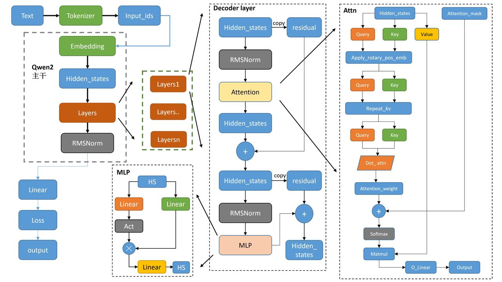
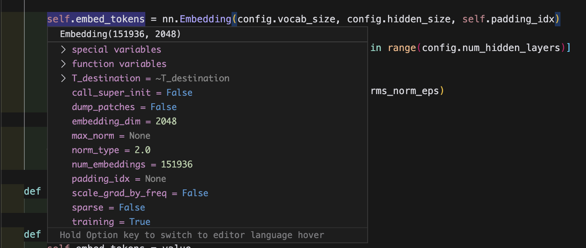
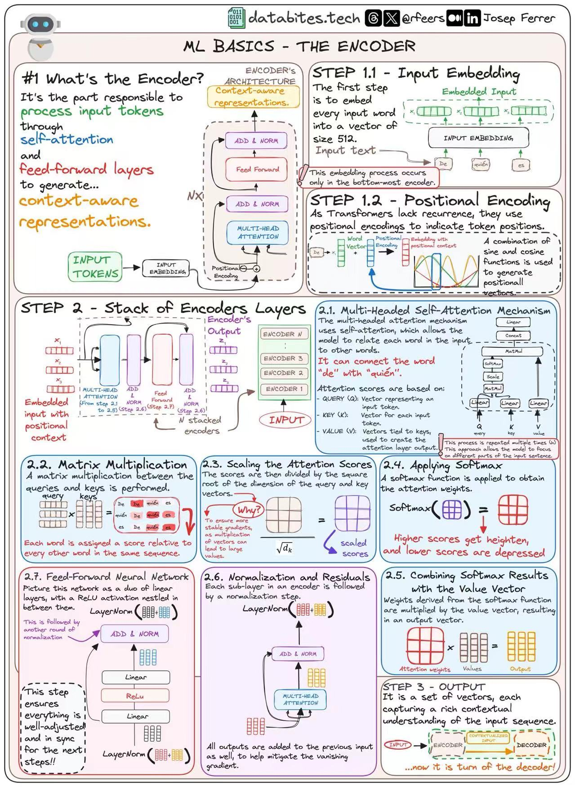
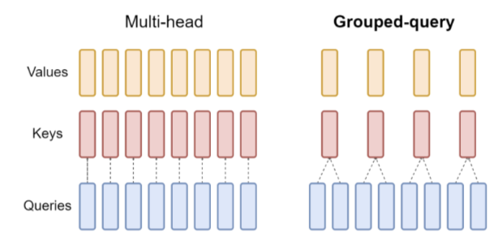

# Qwen 整体介绍


整体流程：
1. Tokenizer: 与一般的 LLM 没有什么太大区别，遵守 NLP 基本法，都是先将 Raw sentence 进行 Tokenizer (去掉停词，词形还原等操作), 此时，原来的句子将变成一个个可能不太完整的单词，称为`token`
2. Input_ids: 从一个训练好的`词表`中找出每一个 token 对应的 ID, 也就是 token_id
3. 把 token_id, 丢给一个预训练好的 Embedding Layer, 它负责将每一个 token_id 映射为固定长度的向量，也就是 embedding vector.
     
4. Layers 结构：主要由 transformer 的 Decoder 结构组成，值得注意的地方有：
   - 使用 RMS（`Root Mean Square`）Norm，并且是先进行 Normalization 再走 Attention 结构，这种操作称为 Pre-Normalization.
   - 整个 Attention Layer 用一个`残差结构`包起来，缓解梯度消失的问题。
   - MLP 层同样使用`残差结构`包起来，并且也是 pre-normalization.

5. 走一波 RMS Norm
6. 走 MLP 结构 (Linear 层)
7. 输出。

## 对于 Attention Layer 的细节
```python
class Qwen2Attention(nn.Module):
    """
    Multi-headed attention from 'Attention Is All You Need' paper. Modified to use sliding window attention: Longformer
    and "Generating Long Sequences with Sparse Transformers".
    """

    def __init__(self, config: Qwen2Config, layer_idx: Optional[int] = None):
        super().__init__()
        self.config = config
        self.layer_idx = layer_idx
        if layer_idx is None:
            logger.warning_once(
                f"Instantiating {self.__class__.__name__} without passing `layer_idx` is not recommended and will "
                "to errors during the forward call, if caching is used. Please make sure to provide a `layer_idx` "
                "when creating this class."
            )

        # 设置注意力层的基本参数
        self.hidden_size = config.hidden_size
        self.num_heads = config.num_attention_heads
        self.head_dim = self.hidden_size // self.num_heads
        self.num_key_value_heads = config.num_key_value_heads
        self.num_key_value_groups = self.num_heads // self.num_key_value_heads
        self.rope_theta = config.rope_theta
        self.is_causal = True
        self.attention_dropout = config.attention_dropout

        # 检查 hidden_size 是否能被 num_heads 整除
        if (self.head_dim * self.num_heads) != self.hidden_size:
            raise ValueError(
                f"hidden_size must be divisible by num_heads (got `hidden_size`: {self.hidden_size}"
                f" and `num_heads`: {self.num_heads})."
            )
        
        # 定义 query, key, value 和输出的线性投影层
        self.q_proj = nn.Linear(self.hidden_size, self.num_heads * self.head_dim, bias=True)
        self.k_proj = nn.Linear(self.hidden_size, self.num_key_value_heads * self.head_dim, bias=True)
        self.v_proj = nn.Linear(self.hidden_size, self.num_key_value_heads * self.head_dim, bias=True)
        self.o_proj = nn.Linear(self.num_heads * self.head_dim, self.hidden_size, bias=False)

        # 初始化旋转位置编码
        self.rotary_emb = Qwen2RotaryEmbedding(config=self.config)

    def forward(
        self,
        hidden_states: torch.Tensor,
        attention_mask: Optional[torch.Tensor] = None,
        position_ids: Optional[torch.LongTensor] = None,
        past_key_value: Optional[Cache] = None,
        output_attentions: bool = False,
        use_cache: bool = False,
        cache_position: Optional[torch.LongTensor] = None,
        position_embeddings: Optional[Tuple[torch.Tensor, torch.Tensor]] = None,  # will become mandatory in v4.46
    ) -> Tuple[torch.Tensor, Optional[torch.Tensor], Optional[Tuple[torch.Tensor]]]:
        bsz, q_len, _ = hidden_states.size()

        # 对输入进行线性变换得到 query, key, value
        query_states = self.q_proj(hidden_states)
        key_states = self.k_proj(hidden_states)
        value_states = self.v_proj(hidden_states)

        # 重塑并转置 query, key, value
        query_states = query_states.view(bsz, q_len, self.num_heads, self.head_dim).transpose(1, 2)
        key_states = key_states.view(bsz, q_len, self.num_key_value_heads, self.head_dim).transpose(1, 2)
        value_states = value_states.view(bsz, q_len, self.num_key_value_heads, self.head_dim).transpose(1, 2)

        # 计算或获取位置编码
        if position_embeddings is None:
            logger.warning_once(
                "The attention layers in this model are transitioning from computing the RoPE embeddings internally "
                "through `position_ids` (2D tensor with the indexes of the tokens), to using externally computed "
                "`position_embeddings` (Tuple of tensors, containing cos and sin). In v4.46 `position_ids` will be "
                "removed and `position_embeddings` will be mandatory."
            )
            cos, sin = self.rotary_emb(value_states, position_ids)
        else:
            cos, sin = position_embeddings
        
        # 应用旋转位置编码
        query_states, key_states = apply_rotary_pos_emb(query_states, key_states, cos, sin)

        # 处理过去的 key 和 value（如果有）
        if past_key_value is not None:
            cache_kwargs = {"sin": sin, "cos": cos, "cache_position": cache_position}  # Specific to RoPE models
            key_states, value_states = past_key_value.update(key_states, value_states, self.layer_idx, cache_kwargs)

        # repeat k/v heads if n_kv_heads < n_heads
        key_states = repeat_kv(key_states, self.num_key_value_groups)
        value_states = repeat_kv(value_states, self.num_key_value_groups)

        # 计算注意力权重
        attn_weights = torch.matmul(query_states, key_states.transpose(2, 3)) / math.sqrt(self.head_dim)
        if attention_mask is not None:  # no matter the length, we just slice it
            causal_mask = attention_mask[:, :, :, : key_states.shape[-2]]
            attn_weights = attn_weights + causal_mask

        # upcast attention to fp32
        attn_weights = nn.functional.softmax(attn_weights, dim=-1, dtype=torch.float32).to(query_states.dtype)
        attn_weights = nn.functional.dropout(attn_weights, p=self.attention_dropout, training=self.training)
        
        # 计算注意力输出
        attn_output = torch.matmul(attn_weights, value_states)

        # 检查注意力输出的形状
        if attn_output.size() != (bsz, self.num_heads, q_len, self.head_dim):
            raise ValueError(
                f"`attn_output` should be of size {(bsz, self.num_heads, q_len, self.head_dim)}, but is"
                f" {attn_output.size()}"
            )

        # 重塑注意力输出
        attn_output = attn_output.transpose(1, 2).contiguous()
        attn_output = attn_output.reshape(bsz, q_len, self.hidden_size)

        # 应用输出投影
        attn_output = self.o_proj(attn_output)

        # 如果不需要输出注意力权重，将其设为 None
        if not output_attentions:
            attn_weights = None

        return attn_output, attn_weights, past_key_value
```
- 从代码的`forward`函数可以看到，Qwen 的 Attention 结构与经典的 transformer 的 Attention 结构大体是一致的，流程为：
  - 输入的 hidden_states 经过线性变换得到 query, key, value (可以在 __init__ 中看到 Output 也经过了一个 Linear Layer)
  - 在转置的时候使用的是 torch 的 `view` 方法。
  - Position Embedding 使用的是`Rotary Embedding`，在`apply_rotary_pos_emb`函数中可以看到具体实现。
    - 如果前面有历史 token，则还需要特殊处理一下 Rotate 的 Position Embedding 部分。
  - `key_states = repeat_kv(key_states, self.num_key_value_groups)` 和 `value_states = repeat_kv(value_states, self.num_key_value_groups)` 这两行代码主要实现的是 `group query attention` 的逻辑，当 `self.num_key_value_heads < self.num_heads` 时，需要重复 key 和 value 的头，以匹配 query 的头数。
     - 好处：
       - **减少内存使用**：因为存储和处理的 key 和 value 更少。
       - **加快推理速度**：特别是在生成任务中，可以缓存更小的 key 和 value。
       - **保持性能**：尽管 key 和 value 的头数减少，但模型性能通常不会显著下降。
   - 计算 attention score 的时候，使用的是 `torch.matmul` 方法，并且除以 `math.sqrt(self.head_dim)`，这是为了防止由于向量维度增加而导致的 attention score 过大。
     - 与经典的 transformer 的 attention score 计算相比，Qwen 的 attention score 计算多了一个 `causal_mask`，这是为了保证每个 token 只能 attend 到它之前的 token。
   - `attn_weights = nn.functional.softmax(attn_weights, dim=-1, dtype=torch.float32).to(query_states.dtype)`
     - 原因：
       - Softmax 函数对数值敏感，特别是在处理大的负值时。
       - 使用 `torch.float32` 进行 softmax 计算，可以减少数值不稳定性和溢出的可能性。
       - 最后将结果转换回原始的 `query_states.dtype`，以保持数据类型的一致性。
   - `attn_weights = nn.functional.dropout(attn_weights, p=self.attention_dropout, training=self.training)`
     - 原因：
       - 使用 dropout 来防止过拟合。
       - 在训练过程中，dropout 会随机地将一些权重设置为零，从而减少神经网络的复杂性。
       - 相当于集成多个子网络：每次 dropout 都相当于训练了一个稍微不同的模型。
  - `attn_output = attn_output.transpose(1, 2).contiguous()`
    - 使用`contiguous()`方法有以下几个原因：
      1. 内存布局优化：
         - `transpose()`操作可能会改变张量在内存中的布局，使其不连续。
         - `contiguous()`确保张量在内存中是连续存储的，这通常可以提高后续操作的效率。

      2. 兼容性保证：
         - 某些 PyTorch 操作要求输入张量是连续的。使用`contiguous()`可以避免潜在的兼容性问题。

      3. 性能考虑：
         - 连续的内存布局通常可以更好地利用缓存，提高访问速度。
         - 对于大型模型和长序列，这种优化可能会带来显著的性能提升。

      4. 为 reshape 做准备：
         - 在代码中，`contiguous()`之后紧接着是`reshape()`操作。
         - `reshape()`要求张量是连续的，否则可能会引发错误或产生意外结果。

      5. 保持一致性：
         - 使用`contiguous()`是一种良好的编程习惯，可以确保张量始终处于预期的状态。

  - 值得注意的是，对于 Attention Layer 来说，它是不会改变 hidden state 的维度的，也就是 `Attention Layer 的输入输出 Tensor 都是相同的 shape`。

## 对于 Group Query Attention 的细节
```python
# Copied from transformers.models.llama.modeling_llama.repeat_kv
def repeat_kv(hidden_states: torch.Tensor, n_rep: int) -> torch.Tensor:  # 定义输入 x，n_rep 是需要重复的次数，在这里一般是组数
    """
    This is the equivalent of torch.repeat_interleave(x, dim=1, repeats=n_rep). The hidden states go from (batch,
    num_key_value_heads, seqlen, head_dim) to (batch, num_attention_heads, seqlen, head_dim)
    """
    batch, num_key_value_heads, slen, head_dim = hidden_states.shape
    if n_rep == 1:
        return hidden_states
    hidden_states = hidden_states[:, :, None, :, :].expand(batch, num_key_value_heads, n_rep, slen, head_dim)
    return hidden_states.reshape(batch, num_key_value_heads * n_rep, slen, head_dim)
```
- 在 GQA 中，key 和 value 都要比 query 小 group 倍，但是为在后续做矩阵乘法时方便，我们需要先把 key 和 value 的 head 利用 expand 扩展张量到和 query 相同的维度。方便后续计算。

- [ ] 为什么要用 expand 之后再 reshape 而不能直接用 tensor 自带的 repeat?
  - `expand` 方法用于对张量进行扩展，但**不实际分配新的内存**。它返回的张量**与原始张量共享相同的数据**
  - `repeat` 方法通过实际复制数据来扩展张量。它返回的新张量**不与原始张量共享数据**，扩展后的张量占用了更多的内存。


## RoPE
To Be Continued...


## 顺序读取 Attention Mask（Causal Attention）
To Be Continued...


## RMS Norm
To Be Continued...

## MLP
To Be Continued...

## 题外话：
- transformer encoder 的 cheat sheet (虽然 Qwen 里没有用到 Encoder 结构):


- Group Query Attention:
  
  - 好处：
    - 减少内存使用
    - 加快推理速度
    - 保持性能
  - 缺点：
    - 需要更多的计算资源
    - 需要更多的内存


## 学习 trick
- [ ] 下载源码包，比如[transfomers](https://github.com/huggingface/transformers.git), 然后将 clone 下来的 repo 改个名字，再安装到索引里，这样就不容易出错。
  - 安装的时候，先确保 conda 环境正确，然后确认一下基本依赖是否都安装好了，最后再进入这个代码目录，执行`pip install -e .`


