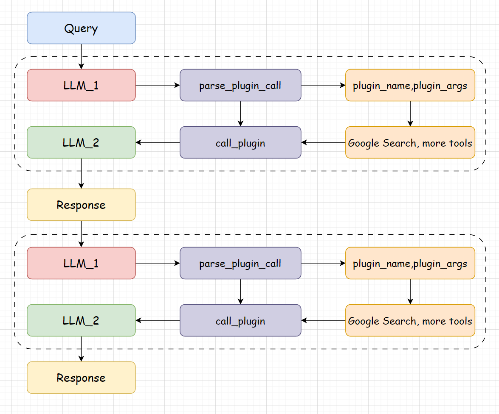

# 先扯点概念
## 什么是 Agent
Agent 是一个基于 LLM 发展出来的工具，翻译成中文被称为“智能体”。它可以：
- 在没有人类干预的情况下，基于 LLM 的回答做出一些必要的决策，然后执行这些决策。
- Agent 可以感知“环境”，并根据“环境”做出决策。 （这个概念我猜测是借鉴了强化学习的里的定义）

Agent 的执行逻辑：


## 什么是 ReAct
ReAct 是一种基于 Agent 的框架，它将 Agent 的决策过程分为以下几个步骤：
- 思考（Think）：Agent 根据当前的“环境”，进行思考，并生成一个决策。
  - 技术层面来说，就是 COT（Chain of Thought）
- 行动（Act）：Agent 根据思考的结果，执行一个动作。
  - 技术层面来说，就是 基于上一步的输出，构造一个请求，发送给 LLM。
- 反思（Reflect）：Agent 根据执行的结果，进行反思，并生成一个新的决策。
  - 技术层面来说，就是 基于上一步的输出，构造一个请求，发送给 LLM，获得更新后的决策。

ReAct 的执行逻辑：


## ReAct 和 Agent 的区别与联系
区别：
- [ ]从范围上说，Agent 是一个更宽泛的概念，它包括了 ReAct 以及其他一些框架。而 ReAct 一般是**针对某个特定任务优化过**的 Agent。
- [ ] 复杂性方面，Agent 一般会涵盖更多的技术和方法，而 ReAct 一般关注于怎么结合语言模型去调用外部工具。
- [ ] 应用角度，Agent 一般会关注于更加通用的场景，而 ReAct 一般关注于某个特定任务（比如推理和信息检索）。

联系：
- [ ] 都是基于 LLM 发展出来的工具。
- [ ] 都是通过多轮对话来完成任务。
- [ ] ReAct 可以视为 Agent 的一种实现方式
  - ReAct 的“推理 - 行动”的 loop 可以看作是 Agent 的“感知 - 决策 - 行动”的一种具体实现。

---

# Talk is cheap, Look at the code

## step1 先搞一个🐔类和它的瓜娃子派生类，这个瓜娃子要能调用 LLM
```python
class BaseModel:
    def __init__(self, path):
      self.path = path
    
    def chat(self, prompt, history):
        pass
    
    def load_model(self):
      pass
```

然后我们需要一个派生类，继承 BaseModel, 在派生类中我们需要针对不同模型进行定制。
- 这里我就无脑跟随 [DataWhale](https://github.com/datawhalechina/tiny-universe/tree/main/content/TinyAgent) 里给的例子啦~~~ (不糊你来写)

```python
class InternLM2Chat(BaseModel):
  def __init__(self, path):
    super().__init__(path)  ## 调用父类构造函数
    self.load_model()
  
  def load_model(self):
    print('================ Loading model ================')
        self.tokenizer = AutoTokenizer.from_pretrained(self.path, trust_remote_code=True)
        self.model = AutoModelForCausalLM.from_pretrained(self.path, torch_dtype=torch.float16, trust_remote_code=True).cuda().eval()
        print('================ Model loaded ================')

  def chat(self, prompt:str, history:List[dict], meta_instrcution:str):
    response, history = self.model.chat(self.tokenizer, prompt, history, teperature=0.1, meta_instruction=meta_instruction)
    return response, history
```

## step2 再来整一个工具箱
前面提到过，ReAct 主要关注于如何让 LLM 更好地使用现有的工具，那我们得有工具给它用才行。
- 同样地，这里直接无脑搬运了 DataWhale 提供的工具代码。

有了工具之后，我们如何让 LLM 去使用这些工具呢？答案是目前现有 LLM 基本都支持的 `function call` 功能。
- 使用方式：在 prompt 中添加 Function 的描述信息，同时也需要提供这个工具的具体实现方式。
  - 对于工具的描述信息，一般包含：
    - 工具的名称，这个功能的用途，以及这个工具的参数信息。

下面是一个 工具类，本质上它是 Google 搜索功能的一个 API, 叫做 `serper`.
- 申请 token 可以去`https://serper.dev/dashboard`, 注册后可以获得 2500 次的免费使用额度。

```python
class Tools:
    def __init__(self) -> None:
        self.toolConfig = self._tools()
    
    def _tools(self):
        tools = [
            {
                'name_for_human': '谷歌搜索',
                'name_for_model': 'google_search',
                'description_for_model': '谷歌搜索是一个通用搜索引擎，可用于访问互联网、查询百科知识、了解时事新闻等。',
                'parameters': [
                    {
                        'name': 'search_query',
                        'description': '搜索关键词或短语',
                        'required': True,
                        'schema': {'type': 'string'},
                    }
                ],
            }
        ]
        return tools

    def google_search(self, search_query: str):
        pass
```

## step3 搞一个 ReAct 范式的 Agent

先来看一个露骨的 (框架)
```python
class Agent:
    def __init__(self, path: str = '') -> None:
        pass

    def build_system_input(self):
        # 构造上文中所说的系统提示词
        pass
    
    def parse_latest_plugin_call(self, text):
        # 解析第一次大模型返回选择的工具和工具参数
        pass
    
    def call_plugin(self, plugin_name, plugin_args):
        # 调用选择的工具
        pass

    def text_completion(self, text, history=[]):
        # 整合两次调用
        pass
```

再来看一个丰满点的：
```python
from typing import Dict, List, Optional, Tuple, Union
import json5

from tinyAgent.LLM import InternLM2Chat
from tinyAgent.tool import Tools


TOOL_DESC = """{name_for_model}: Call this tool to interact with the {name_for_human} API. What is the {name_for_human} API useful for? {description_for_model} Parameters: {parameters} Format the arguments as a JSON object."""
REACT_PROMPT = """Answer the following questions as best you can. You have access to the following tools:

{tool_descs}

Use the following format:

Question: the input question you must answer
Thought: you should always think about what to do
Action: the action to take, should be one of [{tool_names}]
Action Input: the input to the action
Observation: the result of the action
... (this Thought/Action/Action Input/Observation can be repeated zero or more times)
Thought: I now know the final answer
Final Answer: the final answer to the original input question

Begin!
"""


class Agent:
    def __init__(self, path: str = '') -> None:
        self.path = path
        self.tool = Tools()
        self.system_prompt = self.build_system_input()
        self.model = InternLM2Chat(path)

    def build_system_input(self):
        tool_descs, tool_names = [], []
        for tool in self.tool.toolConfig:
            tool_descs.append(TOOL_DESC.format(**tool))
            tool_names.append(tool['name_for_model'])
        tool_descs = '\n\n'.join(tool_descs)
        tool_names = ','.join(tool_names)
        sys_prompt = REACT_PROMPT.format(tool_descs=tool_descs, tool_names=tool_names)
        return sys_prompt
    
    def parse_latest_plugin_call(self, text):
        plugin_name, plugin_args = '', ''
        i = text.rfind('\nAction:')
        j = text.rfind('\nAction Input:')
        k = text.rfind('\nObservation:')
        if 0 <= i < j:  # If the text has `Action` and `Action input`,
            if k < j:  # but does not contain `Observation`,
                text = text.rstrip() + '\nObservation:'  # Add it back.
            k = text.rfind('\nObservation:')
            plugin_name = text[i + len('\nAction:') : j].strip()
            plugin_args = text[j + len('\nAction Input:') : k].strip()
            text = text[:k]
        return plugin_name, plugin_args, text
    
    def call_plugin(self, plugin_name, plugin_args):
        plugin_args = json5.loads(plugin_args)
        if plugin_name == 'google_search':
            return '\nObservation:' + self.tool.google_search(**plugin_args)

    def text_completion(self, text, history=[]):
        text = "\nQuestion:" + text
        response, his = self.model.chat(text, history, self.system_prompt)
        print(response)
        plugin_name, plugin_args, response = self.parse_latest_plugin_call(response)
        if plugin_name:
            response += self.call_plugin(plugin_name, plugin_args)
        response, his = self.model.chat(response, history, self.system_prompt)
        return response, his

if __name__ == '__main__':
    agent = Agent('/root/share/model_repos/internlm2-chat-7b')  # 模型权重路径，这里决定了使用什么 LLM
    prompt = agent.build_system_input()
    print(prompt)
```
- 代码中的 `text_completion` 是这段代码的核心部分，它本质上是一个`对话`方法，里面调用了`InternLM2`模型
  - 执行逻辑：
    1. 按照 ReAct 的基本法，先调用 LLM 对初始 Prompt 进行解析 (也就是执行**Think**, 本质上是 CoT), 目的是解析出用户的问题可以用手头的什么工具来解决，同时给出使用这个工具的方式 (给工具输入什么参数)
      - 对于复杂的 ReAct, 它的 system_prompt 会将用户的 Prompt 拆解出多个子任务，每一个子任务相当于开一个独立的线程 (独立的对话)
    2. 执行 **Action**, 也就是调用工具函数，得到一些结果。
      - 如果有多个子任务，这里理所当然地会执行多个 Action. 
    3. 最后，对执行的结果进行反思 (**Reflect**), 也就是把工具的输出与原来的 prompt 一起丢给 LLM, 让 LLM 知道它刚刚做出的决策带来了什么新的变化，然后输出新的决策 (比如是否要再次调用工具)。
      - 如果有多个子任务，那么子任务的执行结果会和当时的子任务一起丢个 LLM, 让 LLM 自己去反思。
    4. 重复上述过程，(针对多个子任务的场景) 直到所有子任务都执行完毕，然后将子任务的 prompt 以及解决全部再塞回 LLM, 让 LLM 进行总结。

- 这块代码里第二重要的就是 `build_system_input` 方法，它本质上是一个**系统 Prompt**, 里面包含了所有工具的描述信息，以及 ReAct 的 Prompt 模板。
  - 这个 `system_prompt` 的作用是告诉大模型，你现在工具箱里有什么工具，这些工具应该在什么场合使用，这些工具的功能是什么，使用了这个工具应该提供什么参数，工具执行完之后可以获得什么输出。
  - 执行顺利的话，一般会得到下面样式的输出：
    ```txt
    Answer the following questions as best you can. You have access to the following tools:

    google_search: Call this tool to interact with the 谷歌搜索 API. What is the 谷歌搜索 API useful for? 谷歌搜索是一个通用搜索引擎，可用于访问互联网、查询百科知识、了解时事新闻等。Parameters: [{'name': 'search_query', 'description': '搜索关键词或短语', 'required': True, 'schema': {'type': 'string'}}] Format the arguments as a JSON object.

    Use the following format:

    Question: the input question you must answer
    Thought: you should always think about what to do
    Action: the action to take, should be one of [google_search]
    Action Input: the input to the action
    Observation: the result of the action
    ... (this Thought/Action/Action Input/Observation can be repeated zero or more times)
    Thought: I now know the final answer
    Final Answer: the final answer to the original input question

    Begin!
    ```

# 最后
所谓的 Agent 和 ReAct, 其实核心能力还是在 LLM 这边，如果 LLM 不够聪明，那么你的工具再好，可能也派不上用场... 好比一个没有手的机器人，就算给你一把刀，你也不知道怎么削苹果吧？
