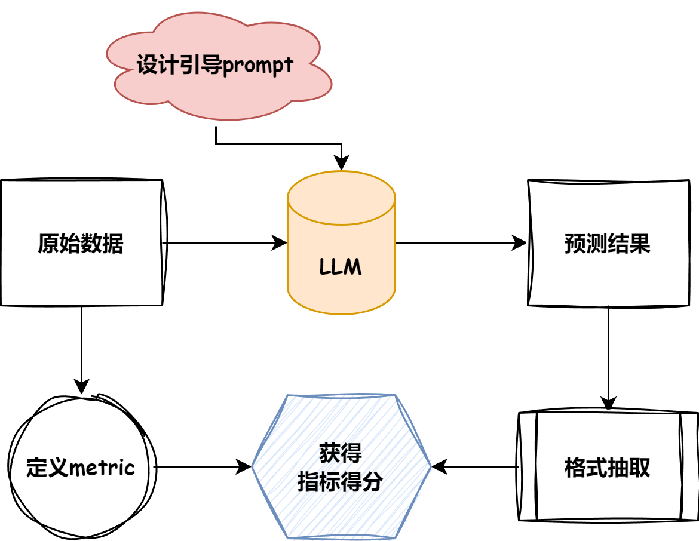

# Tiny Eval
Tiny Eval Repo 地址：https://github.com/datawhalechina/tiny-universe/tree/main/content/TinyEval

这个 repo 主要实现一个简单的 LLM evaluation 的框架，它是一个 two-stage 的测评体系。主要支持的功能有：
- 生成式问题
- 判别式问题
- 选择式问题

框架主要包含两个部分：
1. inference
2. evaluation


## LLM 的 Evaluation 一般包含哪些流程
Pipeline:

- [ ] 根据目标数据集的**任务类型**, 指定合理的`评测 metric`
- [ ] 根据目标数据的**形式**, 总结出`模型引导prompt` (也就是 System prompt)
- [ ] 根据模型**初步预测结果**采纳合理的`抽取方式`。
- [ ] 对相应的`pred`与`Answer`计算得分


## 当前 tiny eval 支持的 dataset 与 metric
所采用的数据集在这里[here](https://github.com/datawhalechina/tiny-universe/tree/main/content/TinyEval/Eval/dataset),目前有的数据集与类型包含 (后续会持续更新!): 

|name|type|metric|
|---|---|---|
|multi_news|长文本问答|Rouge|
|multifieldqa_zh|短文本问答|F1|
|trec|生成式选则|accuracy|

### 生成式的 F1 score

F1 这个指标以往常用于 `分类问题`, 在分类问题中，它尤其适用于`二元分类`和`多类别分类`问题。它综合考虑了模型的精确率（Precision）和召回率（Recall），并以调和平均数的方式平衡两者。
- precision: 指模型**预测为正例**的样本中，真正为正例的比例。
- recall: 指数**据集中所有正例**样本中，被模型正确预测为正例的比例
- F1 score 的取值范围是 `[0,1]`, 值越高表示性能越好。
  - 值为 1 表示模型完美地将每一个输入值分类为正确的类别。
  - 值为 0 表示模型无法将任何一个输入值分类为正确的类别。

F1 的计算公式：
$$
F1 = 2 * (Precision * Recall) / (Precision + Recall)
$$
- 使用**调和平均数**的原因在于，它会鼓励 precision 和 recall 的值**相似**。也就是说，精确率和召回率之间的**差异越大，F1 score 就越低**。


在生成式模型中，F1 score 的计算方式一般长这样：
```python
def f1_score(prediction, ground_truth, **kwargs):
    # Counter 以 dict 的形式存储各个句子对应的词与其对应个数，&操作符返回两个 Counter 中共同的元素的键值对
    common = Counter(prediction) & Counter(ground_truth)  
    num_same = sum(common.values())                       # 显示 prediction 与 gt 的共同元素的个数
    if num_same == 0:
        return 0
    precision = 1.0 * num_same / len(prediction)          # 即模型预测正确的样本数量与总预测样本数量的比值
    recall = 1.0 * num_same / len(ground_truth)           # 模型正确预测的样本数量与总实际样本数量的比值
    f1 = (2 * precision * recall) / (precision + recall)
    return f1
```

其他的 metric 计算样例可以在[这里](https://github.com/datawhalechina/tiny-universe/blob/main/content/TinyEval/Eval/metrics.py)找到。


## 结合代码介绍 Evaluation 的过程 

### LLM 进行 Inference 的准备工作
#### System prompt 设计
LLM 的 inference 于以往的神经网络模型不相同的地方就在于它通常需要用户提供 prompt, 也正是 prompt 的存在，使得大模型可以执行训练过程中从未见过的任务。

因此，我们首先需要构建引导模型回答的 prompt. 对于已有的数据集，大部分都提供了相应的 prompt，在自己数据集评测时，也可自行设计。以 `multifieldqa_zh` 为例，其引导 prompt 为：
```txt
阅读以下文字并用中文简短回答：\n\n{context}\n\n现在请基于上面的文章回答下面的问题，只告诉我答案，不要输出任何其他字词。\n\n问题：{input}\n回答：
```
- 项目中不同 LLM 所使用的 prompt 模板可以在[这里](https://github.com/datawhalechina/tiny-universe/blob/main/content/TinyEval/Eval/config/dataset2prompt.json)找到。


#### 模型超参数配置
之后，再指定**模型的输入长度**，在此主要是规定`每次送进模型多少 token 数`, 并且：
- 一般为了追求性能可以设置为模型最大长度，
- 一般情况下都可以在下载好的模型文件里面的 `config.json`里面的`"max_position_embeddings"`找到并进行设置，也可以不设置作为默认最大长度。本项目设置为了 2048，主要为了演示使用~

#### 封装 LLM
模型之外的准备工作做得差不多了，现在来看怎么把 LLM 放进我们的框架中。Tiny Eval 封装 LLM 所使用的基类为：
```python
class BaseLLM:
    def __init__(self, path: str, model_name: str) -> None:
        self.path = path
        self.model_name = model_name

    def build_chat(self, tokenizer: str, prompt: str, model_name: str):
        pass

    def load_model_and_tokenizer(self, path: str, model_name: str, device):
        pass

    def post_process(self, response: str, model_name: str):
        pass

    def get_pred(self, data: list, max_length: int, max_gen: int, prompt_format: str, device, out_path: str):
        pass
```
- [ ] `build_chat` 用于指定 LLM 所使用的固有的数据加载形式
- [ ] `load_model_and_tokenizer` 和 `post_process` 是根据 LLM 的特性进行定制的方法
- [ ] `get_pred`是一个非常重要的 method, 我们需要在这个 method 中指定`截断策略`, 对于模型而言，尤其是**制定了输入的长度**，如果使用截断命令，则该方法会在输入的**末尾进行截断**，但由于`引导性 prompt` 的存在，在 inputs 的两端均有关键信息，故需要对两端的信息进行保留，对中间部位进行截断操作，才能最大限度地保持输出效果！
  > tips: 对于 get_pred 部分，可以参考各大模型各自的 model 相关脚本中的 chat 函数 (internlm2 在 modeling_internlm2.py 里面),也可以更好的理解原始文本输入与结构化模型输出。
 - `get_pred`的代码样例：
    ```python
    def get_pred(self, data, max_length, max_gen, prompt_format, device, out_path):
            model, tokenizer = self.load_model_and_tokenizer(self.path, device)
            for json_obj in tqdm(data):
                prompt = prompt_format.format(**json_obj)
                # 在中间截断，因为两头有关键信息。
                tokenized_prompt = tokenizer(prompt, truncation=False, return_tensors="pt").input_ids[0]
                if len(tokenized_prompt) > max_length:
                    half = int(max_length/2)
                    prompt = tokenizer.decode(tokenized_prompt[:half], skip_special_tokens=True)+tokenizer.decode(tokenized_prompt[-half:], skip_special_tokens=True)

                prompt = self.build_chat(prompt)

                input = tokenizer(prompt, truncation=False, return_tensors="pt").to(device)
                # 表示喂进去的 tokens 的长度
                context_length = input.input_ids.shape[-1]
                eos_token_id = [tokenizer.eos_token_id, tokenizer.convert_tokens_to_ids(["<|im_end|>"])[0]]

                output = model.generate(
                    **input,
                    max_new_tokens=max_gen,
                    do_sample=False,
                    temperature=1.0,
                    eos_token_id=eos_token_id,
                )[0]
                
                pred = tokenizer.decode(output[context_length:], skip_special_tokens=True)
                pred = self.post_process(pred)
                
                with open(out_path, "a", encoding="utf-8") as f:
                    json.dump({"pred": pred, "answers": json_obj["answers"], "all_classes": json_obj["all_classes"], "length": json_obj["length"]}, f, ensure_ascii=False)
                    f.write('\n')
    ```

### 评估结果 (计算 metric)

这里直接使用一个输出样例进行说明，假设模型的 Prediction 和数据集中记录的 Answer 分别为：
```txt
"pred": "57081.86 元", "answers": "人民币 57081.86 元。"
```

1. 首先经过**数据清洗**以及`jieba`分词，将**短句划分为词组**, 对于上面的例子，我们会得到如下输出：
    ```txt
    "pred": ['5708186', '元'], "answers": ['人民币', '5708186', '元']"
    ```
   - 这个过程可以考虑封装在 `post_process` 中，也可以写在 metric 计算之前，作为一种辅助函数。
    - 在 metric 中的代码样例如下，完整的代码在[这里](https://github.com/datawhalechina/tiny-universe/blob/main/content/TinyEval/Eval/metrics.py)：
        ```python
        import jieba
        jieba.setLogLevel(jieba.logging.INFO)

        def rouge_zh_score(prediction, ground_truth, **kwargs):
            prediction = " ".join(list(jieba.cut(prediction, cut_all=False)))
            ground_truth = " ".join(list(jieba.cut(ground_truth, cut_all=False))) 
            score = rouge_score(prediction, ground_truth)
            return score

            def qa_f1_zh_score(prediction, ground_truth, **kwargs):
                prediction_tokens = list(jieba.cut(prediction, cut_all=False))
                ground_truth_tokens = list(jieba.cut(ground_truth, cut_all=False))
                prediction_tokens_norm = [normalize_zh_aswer(t) for t in prediction_tokens]
                ground_truth_tokens_norm = [normalize_zh_aswer(t) for t in ground_truth_tokens]
                prediction_tokens = [t for t in prediction_tokens_norm if len(t) > 0]
                ground_truth_tokens = [t for t in ground_truth_tokens_norm if len(t) > 0]
                return f1_score(prediction_tokens, ground_truth_tokens)
        ```

2. 将后处理过的数据放入 metric 的计算函数中，得到分数。
   - 比如上面说到的 F1 score:
     - [ ] 首先记录两个 list 中相同的元素，再统计相同的元素的总数，最终再按照 precision 与 recall 的定义分别计算相应的分数。
     - [ ] 得到该结果的对应分数之后再将所有的结果取平均值，即得到该 task 的 F1_score


当然，这些只是基础的 metric 评测指标，或许细心的你已经发现了相应的漏洞，比如在上述预测中，相比较的结果都是经过了相应的规则抽取的，如果出现了比如 answer 是"厦门大学",而 pred 是"不是厦门大学"/"厦大", 则二者的结果按照当前的评分指标则有失偏颇。


# 小结
总的来说，DataWhale 的大佬们提供的这个 repo 很有学习价值，他们提供了一个轻量级的代码模板供我们阅读和学习，非常感谢他们的付出！


