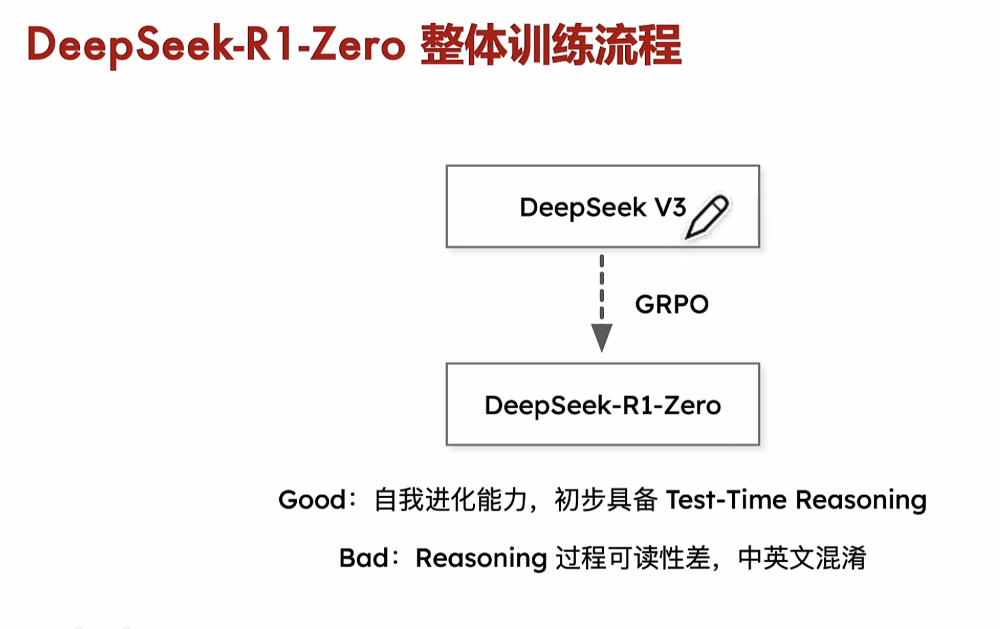
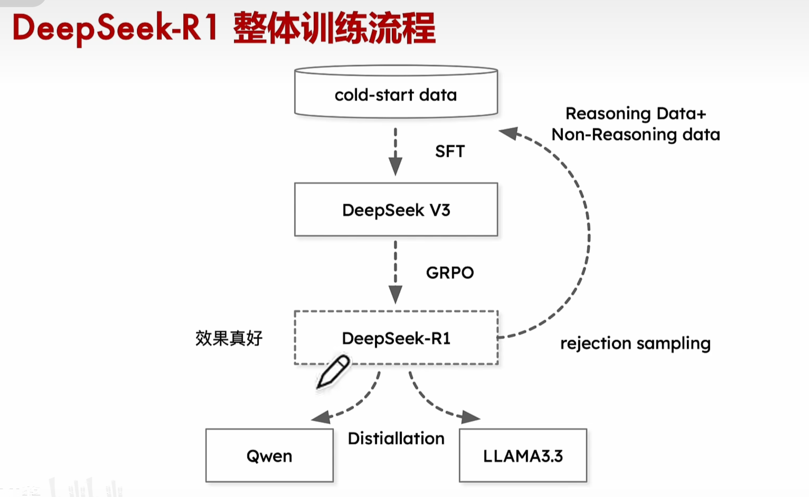
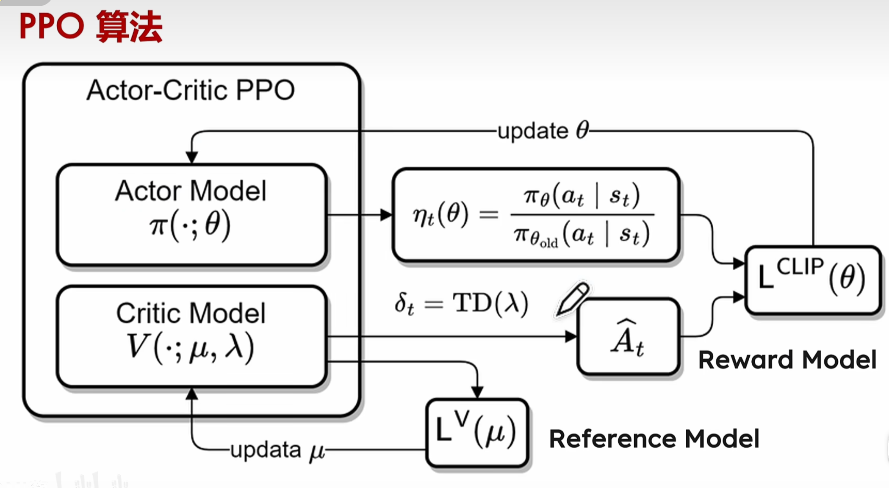
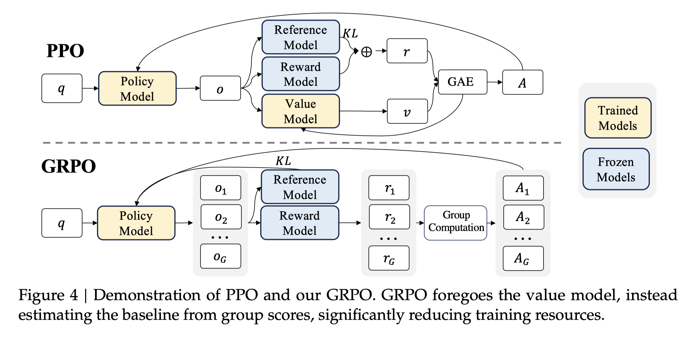
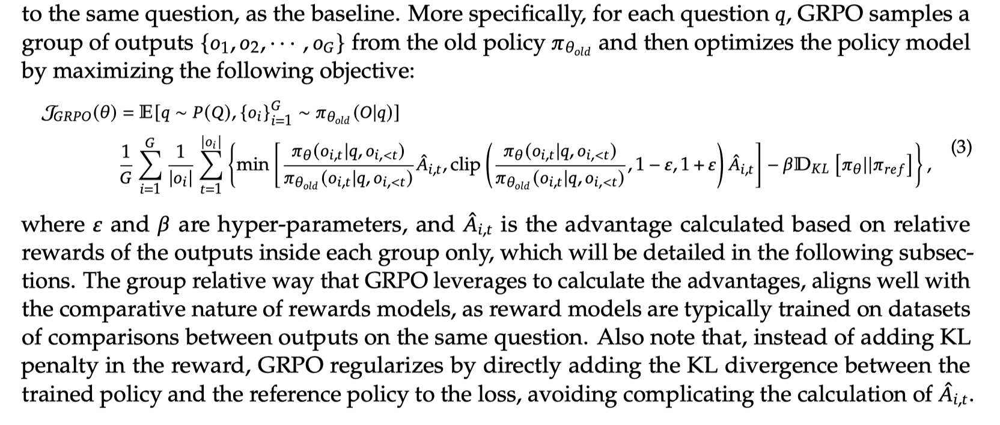
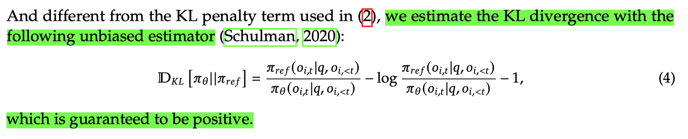
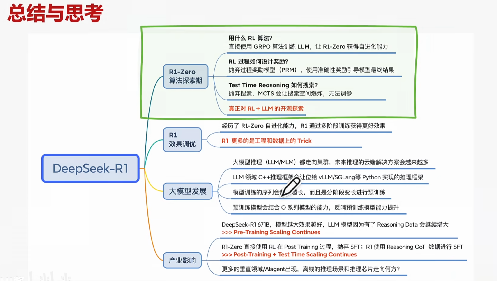

# Deepseek R1

前置知识 & 术语：
- 在提出 DeepSeek R1 之前，DeepSeek 发布了 `DeepSeek V3` 模型
    > 1. 具有多模态能力; 2. MoE 混合专家 trick; 3. Transformer 架构 
- GRPO: Group Relative Policy Optimization, 是 deepseek 自己提出的一种强化学习技巧

- Distillation: 蒸馏技术，用于减小模型体积，提高模型的推理能力
    ```mermaid
    graph TD
        A[模型蒸馏] --> B[教师模型]
        A --> C[学生模型]
        A --> D[知识传递]

        B --> B1[大型复杂模型]
        C --> C1[小型轻量模型]
        
        D --> D1[软标签]
        D --> D2[特征映射]
        
        B1 --> E1[高性能但资源密集]
        C1 --> E2[快速推理且高效部署]
        
        D1 --> F[性能提升]
        D2 --> F
    ```


- Rejection Sampling: 拒绝采样，是一种用于生成服从指定概率分布的随机样本的方法
    - 这里用于生成包含推理数据和非推理数据的数据集

---

## 训练流程
1. 从 DeepSeek V3 开始训练，得到 DeepSeek-R1-Zero，只用了 GRPO 技巧

-  优点：能够自我进化，获得了 `text-reasoning` 的能力，也就是 GPT4-o 的那种 thinking 的能力
-  缺点：推理过程中出现中英混淆等语言混乱问题，可读性差

1. 从第一步得知使用 GRPO 这个强化学习技巧可以让模型自我进化并获得推理能力之后，就着重解决语言混乱问题：

- Step1: cold-start data 进行 SFT(Supervised Fine-Tuning) 训练
- Step2: GRPO 强化学习
  - 此时得的模型就是 DeepSeek-R1, 最终训练结束的的时候的模型就是拿它的权重数据。
- Step3: Rejection Sampling (拿到包含 reasoning data 和 non-reasoning data)
- Step4: 用 rejection sampling 的数据进行 SFT 训练
  - 此时并不是回到 cold-start data 这个步骤，而是直接用 采样的数据进行 **SFT**, 继续微调 Deepseek v3
  - 然后再进行 GRPO 强化学习
  - 再进行 rejection sampling... 如此循环迭代

- Last Step: 为了减小模型的体积，使用 Distillation 进行蒸馏，于是得到网上公开的 Qwen 和 Llama3.3 的模型。


---


## GRPO 算法原理概述
- [ ] 这个技巧是在 DeepSeekMath 文章里提出的：https://arxiv.org/pdf/2402.03300

前置知识：

- [ ] 我们使用强化学习来训练一个 `Agent (智能体)`，让它在某个环境中学习到一个**策略**，使得在该环境中能够获得最大的**累积奖励**。强化学习中常见的几种模型 (或称为"组件"): 
  1. `Actor Model` 也叫做 `Policy model`: 它是一种**生成模型**，负责生成动作 (action)，在 LLM 中就是生成文本的模型 
        > 它定义了 Agent 如何根据当前状态选择动作。它接收状态作为输入，输出一个动作或动作的概率分布。Actor model 可以是：
        >> 神经网络：深度强化学习中常用神经网络作为演员模型。
        >> 决策树：也可以使用决策树等其他机器学习模型作为演员模型。
        >> 查找表：在状态空间和动作空间较小的情况下，可以使用查找表来表示策略。

  2. `Critic model`: 它是一种**评估模型**，负责评估 Actor model 生成的动作的好坏。在 Actor-Critic 框架中，Critic 帮助 Policy 改进，Critic 提供的价值估计用于指导 Policy 的更新。
        > 它用于评估当前策略的价值，它估计 Agent 在某个状态下或执行某个动作后能够获得的累积奖励。Critic model 的输出是一个**价值函数**，例如状态价值函数或动作价值函数。Actor model 可以是：
            >> 神经网络：深度强化学习中常用神经网络作为评论家模型。
            >> 线性函数：也可以使用线性函数等其他函数逼近方法来表示价值函数。
            >> 查找表：在状态空间和动作空间较小的情况下，可以使用查找表来存储价值函数。

  3. `Reward Model`: 它是一种**奖励模型**，负责定义 Agent 的目标，即 Agent 在某个状态下或执行某个动作后能够获得的奖励
        > 奖励模型定义了强化学习 Agent 的目标。它接收 Agent 所处的 "状态" 或 "状态 - 动作对" 作为输入，并输出一个奖励值，表示 Agent 在该状态下或执行该动作的好坏程度。奖励模型可以是：
            >> 环境内置：许多环境自带奖励函数，例如游戏中得分或者机器人模拟中完成任务与否。
            >> 人工设计：对于一些复杂任务，需要人工设计奖励函数来引导 Agent 学习期望的行为。
            >> 学习得到：在某些情况下，奖励函数难以人工设计，可以通过逆强化学习或偏好学习等方法从数据中学习得到。例如，通过人类反馈的强化学习 (RLHF) 训练奖励模型。 

  4. `Reference Model`: 它是一种**参考模型**，负责提供 Agent 期望的行为或轨迹，在训练的过程中扮演着`老师`的角色，**Policy model 通常在试图模仿 reference model 的行为**。
        > 参考模型提供了一种期望的行为或轨迹，Agent 的目标是模仿参考模型的行为。参考模型通常用于模仿学习，它可以是：
            >> 专家演示：由人类专家提供的示范轨迹。
            >> 预训练模型：使用其他方法训练好的模型，例如在监督学习环境下训练的模型。
            >> 最优策略：已知的最优策略，例如在某些简单环境中可以通过动态规划求解得到。

- 区别与联系：
    ```mermaid
    graph TD
        A[Reward Model] -->|提供即时奖励 | C[Critic Model]
        B[Reference Model] -->|提供参考行为 | D[Policy/Actor Model]
        C -->|价值估计 | D
        A -->|定义目标 | D
    ```
    - Critic: 需要持续学习和更新
    - Reward: 通常固定或单独训练
    - Reference: 通常保持不变
    - Reward Model 为 Critic Model 提供学习信号
    - Critic Model 基于 Reward Model 的信号学习价值函数
    - Reference Model 可以帮助定义 Reward Model
    - 三者共同服务于策略的学习和改进


---


- [ ] LLM 中主流的 RLHF 方向分为两种：
    - [ ] 1. 以 `PPO (Proximal Policy Optimization)` 为代表的基于梯度的强化学习算法，On Policy 路线
      > 每次训练都基于自己的生成模型 (actor) 执行推理等操作，然后通过教练模型 (critic) 进行评估反馈/奖励，共计需要 4 个模型 (actor model, critic model, reference model, reward model); 注意，**对于 LLM 来说，在评估模型的时候，通常只对最后一个 token 进行评估，相当于对整句话的质量进行评估**。
      >> 优点是训练稳定性高，毕竟有两个独立的模型去引导训练过程，但是缺点是模型的能力可能不够好，因为 Actor 和 crisis 的好坏很大程度会影响模型的训练效果; 另外，它需要与环境进行交互来采样数据，并且对超参数很敏感，需要非常小心。
    
    
    - [ ] 2. 以 `DPO (Direct Preference Optimization)` 为代表的基于价值的强化学习算法，Off Policy 路线
      > 优点：1. 需要数据标注，模型直接从数据中学习人类偏好，不需要显式的奖励建模 (不需要训练单独的奖励模型); 2. 简化了流程，去除了传统 RLHF 中的奖励模型训练步骤; 3. 计算效率更高，训练稳定性更好; 4. 理论基础扎实，有严格的数学推导。
      >> 缺点：需要大量人工标注，某些特定任务上可能不如传统 RLHF

---

GRPO 是一种改进的 PPO 算法，主要特点是引入了广义化的奖励惩罚机制。
  - 在传统 PPO 的基础上增加了惩罚项; 通过动态调整惩罚权重来平衡探索与利用; 可以更好地处理长期与短期奖励的权衡。
  - GRPO 在评估 LLM 的时候，会对同一个 prompt 生成的多个输出 (多句话) 进行评估，然后取平均值来作为最终奖励值。
    > 这个操作使得 Policy model 可以与 reward model 的"比较性质"对齐，通常来说，reward model 通常需要在同一问题的不同输出之间进行比较


- 可以看到 GRPO 相比 PPO 在结构上去掉了 Value Model, 值的注意的是 Value model 通常是一个和 Policy model 差不多大小的模型，GRPO 去掉 Value model 就使得整体需要的计算量和显存都减少了很大一部分。
- 在反馈阶段，GRPO 非常暴力地采样了 G 次，得到 $A_1, A_2, ..., A_G$ 个动作 (句子) 的 reward，然后取平均值，再结合 reference model 的输出作为反馈区更新 policy model。
- 从下面的目标函数还可以看到，GRPO 将 KL 散度直接加到了目标函数中，而不是 PPO 那种将 KL 散度加在 reward 函数里，这样可以简化$A_{i,t}$的 计算。
    
    




---

## reference:
- 哔哩哔哩视频：https://www.bilibili.com/video/BV1dHw4e8E3e/?vd_source=7cf7026bc2c23d0b0b88a3094e5ce55a

- DeepSeek R1 技术报告：https://arxiv.org/html/2501.12948v1


