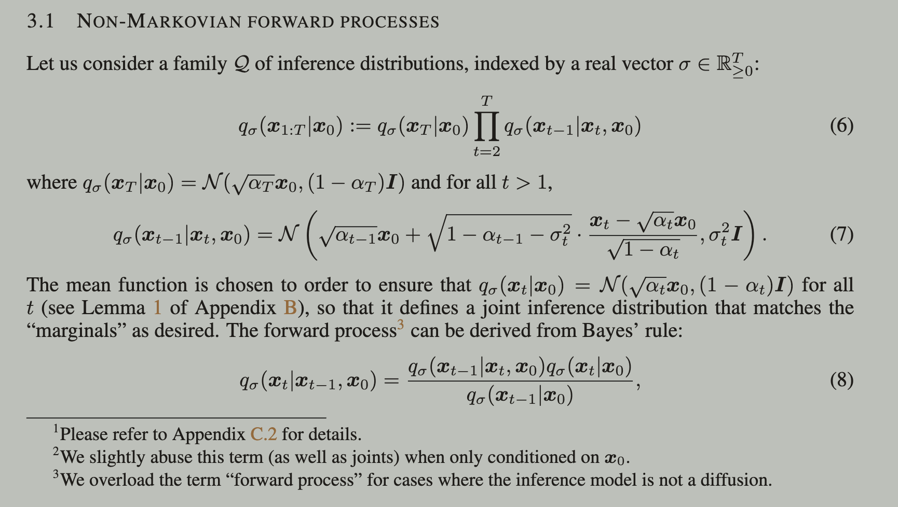
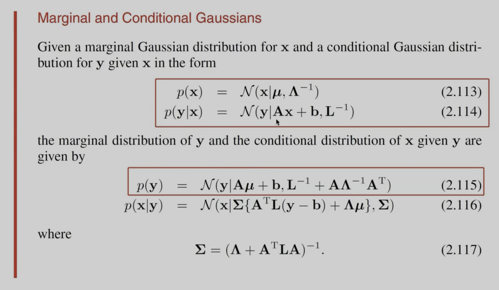

# DDIM (Denoising Diffusion Implicit Model)

DDIM 是 DDPM (Denoising Diffusion Probabilistic Model) 的改进版本，DDPM 其实就是原版的 Stable Diffusion. 

在 DDPM 中存在的问题：
1. 在生成图片时，需要模拟**多个步骤**的 Markov Chain (比如走 1000 次 Unet 来预测每一个 time step 的噪声，然后做减法去噪), 导致计算速度慢，计算量也大。
   - time step 一般设置比较大是因为 **只有加入的高斯噪声足够多的时候，最后一次加完噪声得到的图片才近似为一个高斯分布**.

DDIM 的主要改进&效果：
1. [改进]使用更一般化的 **non-Markov** 过程，**将随机的过程转化为确定性的过程，从而可以采用 trick 进行加速**. 
2. [效果]相比 DDPM, 生成图片的速度快 10 倍~50 倍。

DDIM 论文中的公式符号与 DDPM 公式符号的区别：
* DDPM 中用 $\bar{\alpha}$ 来表示$\alpha$连乘，但是**在 DDIM 中是直接用 $\alpha$ 来表示这个连乘**.
$$
\begin{aligned}
\text{DDPM 中的写法:} \quad &p(x_t | x_{t-1}, x_0) \sim \mathcal{N}(\sqrt{\bar{\alpha}_{t}} \cdot  \boldsymbol{x_{t-1}}, (1 - \bar{\alpha}_{t})\boldsymbol{I})  \\
\text{DDIM 中的写法:} \quad &p(x_t | x_{t-1}, x_0) \sim \mathcal{N}(\sqrt{\alpha_{t}} \cdot  \boldsymbol{x_0}, (1 - \alpha_{t})\boldsymbol{I})
\end{aligned}
$$

---

## 关于 DDIM 的目标函数
DDIM 使用的目标函与 DDPM 相同，都是噪声之间计算 L2 norm:
$$
\begin{aligned}
\mathcal{L}_{simple}(\theta) &= \mathbb{E}_{t, x_0, \epsilon} \left| \left| \epsilon - \epsilon_{\theta} (\sqrt{\alpha_t} x_0 + \sqrt{1-\alpha_t} \epsilon, t)  \right| \right|^2 
\end{aligned}
$$
- 不过，在 DDPM 中，损失函数 $\mathcal{L}(\theta)$ **只依赖于边缘分布** $q(x_t | x_0)$, 而在 DDIM 中，损失函数 $\mathcal{L}(\theta)$ 依赖于**联合分布** $q(x_{1:T}|x_0)$. 
  - 在 DDPM 里，因为每一个 time step 之间增加了一个 Markov-Chain 的假设，才使得本来的联合分布可以拆成边缘分布。
  -  作者发现，如果我们能设计出某种 non-Markov 的前向扩散过程，使得 DDIM 的 $q(x_t|x_0)$ 与 DDPM 里的 **$q(x_t|x_0)$ 相同**, 而且同时使得 **DDIM 中的联合分布 $q(x_{1:T}|x_0)$ 与 DDPM 中的联合分布不相同**(也就那些$\alpha_t$的连乘). 这时候，通过公式推导，作者发现这个 non-Markov 前向扩散过程得到的目标函数与这条目标函数只差一个与模型参数无关的常数项，于是 DDIM 可以直接用 DDPM 的目标函数来训练模型。
     - 对于 $q(x_t|x_0)$, 它对应的就是往 $x_0$ 加 t 次噪声之后的分布，我们一般假设为高斯分布，所以这个分布就被认为是已知的。所以 non-Markov 扩散过程的设计就剩下那个联合分布了。
     - 对于联合分布的部分，再回顾一下 DDPM, 它是基于 Markov Chain 的性质而获得 $q(x_t|x_{t-1},x_0) = q(x_t|x_{t-1})$, 所以在 DDIM 中其实只需要让 $q(x_t|x_{t-1},x_0)$ 具有更一般的形式就可以了。
- 这个目标函数还是`score diffusion model (score matching)`的目标函数 (**暂待考证...**).

在这个目标函数的过程中，其实可以发现：
- 前向扩散过程并没有直接关联到 **去噪过程 (生成图片的过程) 中的后验概率$p(x_{t-1}|x_t, x_0)$**, 所以，**只要保证$q(x_t|x_0)$的形式不变，甚至可以直接使用训练好的 DDPM 模型 (也就是那个 Unet) 走 DDIM 的生成过程**.  
  - 这个推导过程在论文中也有给出，作者先给出了根据 non-Markov 扩散过程的目标函数，然后用贝叶斯公式和 KL 散度进行了化简，最后证明了使用 non-Markov 扩散过程的话，目标函数与 DDPM 的目标函数其实就差一个常数项。(这里就不探究细节了)
  - 据此可知，生成图片的时候使用的噪声分布是可以另外找的，这也是作者能够把 生成图片的过程修改为 non-Markov 的理由。

---
## DDIM 里给出的 Non-Markov 前向扩散过程
DDIM 论文中，作者给出的 non-Markov 的各种分布的公式如下：

- 作者在`文章的附录B`中证明了图中的联合分布 $q_{\sigma}(x_{1:T}|x_0)$ 可以与 DDPM 里的 $q(x_t|x_0)$完全对应，也就是都能得到 $q(x_t|x_0) = \mathcal{N}(\sqrt{\alpha_t}\boldsymbol{x_0}, (1-\alpha_t) \boldsymbol{I}) $.
  - 证明的核心思路主要是：用了下面的`高斯分布定理`, 然后结合`数学归纳法(即先验证初始条件成立, 然后假设t时刻成立, 最后如果推出 t+1 时刻也成立, 就证完了)`
    

抛开证明过程，我们可以看到，作者给的这个 non-Markov 扩散过程的联合概率分布 $q_{\sigma}(x_{1:T}|x_0)$ 的均值和方差与超参数 $\sigma$ 有关，只要改变这个参数就会直接影响到图片生成过程中的每一个 time step 的去噪后的图片分布 (也就是后验概率) $q_{\sigma}(x_{t-1}|x_{t},x_0)$.

---

## DDIM 的图片生成过程 (去噪过程)
首先，在 DDPM 中给出了从边缘分布 $q(x_t|x_0) = \mathcal{N}(\sqrt{\alpha_t} \boldsymbol{x_0}, (1-\alpha_t) \boldsymbol{I}))$ 到 $x_t$ 的产生过程 (前向扩散过程) 可以用下式表达：
$$
\begin{aligned}
x_t = \sqrt{\alpha_t} x_{0} + \sqrt{1-\alpha_t} \epsilon_t
\end{aligned}
$$
- 其中 $\epsilon_t$ 是一个高斯噪声，服从 $\mathcal{N}(0, \boldsymbol{I})$.

由此，对应的去噪过程就是：
$$
\begin{aligned}
f_{\theta}^{(t)}(x_t) = \tilde{x}_{0} = \frac{1}{\sqrt{\alpha_t}} (x_t - \sqrt{1-\alpha_t} \epsilon_{\theta}^{(t)})
\end{aligned}
$$
- 也就是已知 $x_t$ 和 t 时刻预测的噪声$\epsilon_{\theta}^{(t)}$ 就能得到此时此刻去噪后的估计值 $f_{\theta}^{(t)}(x_t)$, 显然，**这个结果也可以理解为给定$x_t$的条件下，对$x_0$的观测**.
  - $\theta$表示模型参数，$t$表示当前的 time step.

如果我们将每个时刻的$f_{\theta}^{(t)}(x_t)$都视为对 $x_0$ 的观测，此时，结合一个固定先验 $p_{\theta}(\boldsymbol{x_T}) = \mathcal{N}(\boldsymbol{0},\boldsymbol{I})$, 也就是图片加完噪声之后服从正态分布。那么，我们就可以定义出每一个时刻的后验概率 $p_{\theta}(\boldsymbol{x_{t-1}}|\boldsymbol{x_t})$:

$$
\begin{equation}
p_{\theta}(\boldsymbol{x_{t-1}}|\boldsymbol{x_t}) = 
\left\{
    \begin{aligned}
    &\mathcal{N}(f_{\theta}^{(t)}(\boldsymbol{x_t}), \sigma_1^2\boldsymbol{I}) \quad &\text{if} \quad t = 1\\
    &q_{\sigma}(\boldsymbol{x_{t-1}}|\boldsymbol{x_t}, f_{\theta}^{(t)}(\boldsymbol{x_t})) \quad &\text{otherwise} 
    \end{aligned}
    \right.
\end{equation}
$$
- 公式里的$q_{\sigma}(\boldsymbol{x_{t-1}}|\boldsymbol{x_t}, f_{\theta}^{(t)}(\boldsymbol{x_t}))$ 就是论文提出的 non-Markov 扩散过程中的后验概率分布，即前面贴的`论文公式 (7)`.

整理之后，每个 time step 从这个后验概率分布采样的样本可以表示为：
$$
\begin{equation}
x_{t-1} = \underbrace{\sqrt{\alpha_{t-1}} \left( \frac{x_t - \sqrt{1 - \alpha_t} \epsilon_{\theta}^{(t)}(x_t)}{\sqrt{\alpha_t}} \right)}_{\text{``predicted } x_0\text{''}} + \underbrace{\sqrt{1 - \alpha_{t-1} - \sigma_t^2} \cdot \epsilon_{\theta}^{(t)}(x_t)}_{\text{``direction pointing to } x_t\text{''}} + \underbrace{\sigma_t \epsilon_t}_{\text{random noise}}
\end{equation}
$$
- 这其实是按照`reparameterization trick`公式写出来的表达式，前面两项其实是后验概率$p_{\theta}(\boldsymbol{x_{t-1}}|\boldsymbol{x_t})$的`均值`, 最后一项是`标准差 x 一个高斯噪声的采样值`.
- 可以发现，"均值" 和 "方差" 这两个部分都与超参数 $\sigma_t$ 相关，所以可以通过调整$\sigma_t$来改变生成图片的效果。
  - 我们训练的模型在这个式子中对应的是 $\epsilon_{\theta}^{(t)}(x_t)$, 这说明，**如果我们训练好了一个模型，那么我们在调整超参数 $\sigma_t$ 时是不需要重新训练的!!!** ($\sigma_t$只影响采样的结果!)
  - 当 $\sigma_t = \sqrt{(1-\alpha_{t-1})/(1-\alpha_t)} \sqrt{1-\alpha_t/\alpha_{t-1}}$ 时，这个采样公式就等价于 DDPM 中的采样公式。
    - 所以论文里提到，DDIM 是 DDPM 更一般化的形式。
  - **当 $\sigma_t = 0$ 时，整个表达式将没有任何随机项，一切都是确定性的，这个模型被作者成为 DDIM (Denoising Diffusion Implicit Model)**.
    - 因为这个模型在训练的时候采用的是 DDPM 的目标函数，训练得到一个概率模型$\epsilon_{\theta}$, 而它在生成图片的过程中是`隐藏式`地使用的，因此得名 `implicit model`. 

---

## DDIM 中加速图片生成的 Respacing 技巧
出发点：
- 从去噪过程的目标函数中可以发现，它并没有限制每个 time step 的噪声必须满足马尔可夫链的性质，只要我们能让 $q_{\sigma}(x_t|x_0)$ 在每个 time step 都是高斯分布即可。这表明，我们可以在生成图片的时候，**不必非要经历完前向扩散过程那么多个 time step**, 而是经历了$[1,T]$范围内的某个子集，这个子集的长度为 S，即：
$$
\begin{aligned}
&q(x_{\tau_i}|x_0) = \mathcal{N}(\sqrt{\alpha_{\tau_i}}x_0, (1-\alpha_{\tau_i})\boldsymbol{I} ), \quad x_{\tau_i} \in \{x_{\tau_1}, \cdots, x_{\tau_S}\}, S \in [1, \cdots, T] 
\end{aligned}
$$
  - 这种感觉有点像`空洞卷积`的出发点，标准卷积操作是 kernel size 范围内的所有相邻像素点都拿来做计算，但是这样的话感受野就不够大了，于是提出空洞卷积，它不再是那卷积核中心紧挨着的像素点，而是**跳着取点**，这样感受野就变大了。对比这里的 respacing, 就是生成图片的速度变快了。

Respacing 技巧既可以用在 DDIM 上，也可以用在 DDPM 上，由于采样的过程变短了，所以整个生成图片的过程就变快了。

--- 

# 参考资料
- [ ] 哔哩哔哩上的讲解视频
  - [DDPM 公式讲解](https://www.bilibili.com/video/BV1b541197HX/?vd_source=7cf7026bc2c23d0b0b88a3094e5ce55a)
  - [Improve Diffusion model 代码讲解](https://www.bilibili.com/video/BV1sG411s7vV/?vd_source=7cf7026bc2c23d0b0b88a3094e5ce55a)
  - [Score diffusion model 理论及代码讲解](https://www.bilibili.com/video/BV1Dd4y1A7oz/?vd_source=7cf7026bc2c23d0b0b88a3094e5ce55a)
  - [概率扩散模型 (DDPM) 与分数扩散模型 (SMLD) 的联系与区别](https://www.bilibili.com/video/BV1QG4y1674Q/?vd_source=7cf7026bc2c23d0b0b88a3094e5ce55a)

