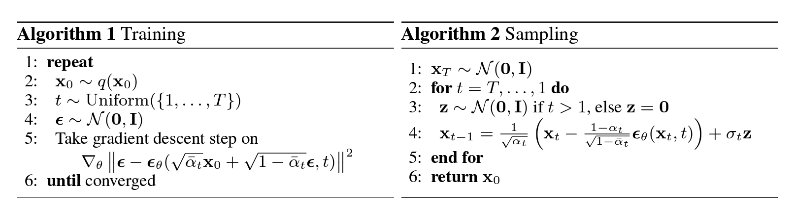
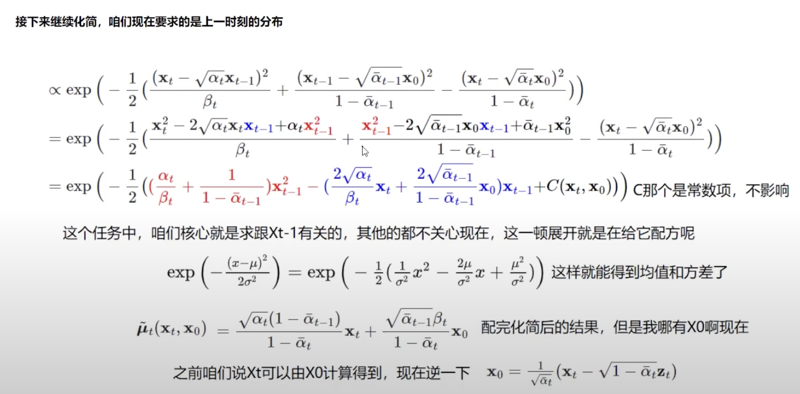

@author: Neil0306

# 什么是 Diffusion Model
原论文: [DDPM (Denoising Diffusion Probabilistic Models)](https://arxiv.org/abs/2006.11239)
- 原论文的数学推导是从 信息论 的角度出发的, 公式的中间推导过程并没有详细给出, 因此不好理解. 
- 下面我们会直接用**概率论的贝叶斯公式**来推导, 得到的结果是相同的, 重在理解结果的意义. 

扩散(diffusion)指的是在一个图片上加入噪声, 使得图片变得模糊. 通过加入噪声, 使得图片的信息变得不那么明显.

diffusion model 生成图片的过程简单来说就是: 
- 在已经训练好模型的前提下, 我们给模型一张固定大小的噪声图片(图片里的每一个像素点都是从高斯分布中采样而来的值), 图片的大小与模型有关, 看模型支持多大的图片. 然后整个 "生成图片" 的流程其实是一个 `for循环`, 一共循环 T 个 time step. 
  - 每一个 time step 的任务是让 上一个 time step 的图片更加清晰, 也就是逐步去噪. 
    - 具体来说, 我们会用模型预测当前 time step 下要去除的噪声, 然后用前一个 time step 的图片减去这个预测的噪声, 得到当前 time step 的图片.
    - 循环 T 次之后, 理论上就得到一张清晰的图片.

##  Diffusion model 和 GAN 的简单比较

* GAN 能生成的类别有限, 因为类别太多, 判别器就很容易分辨出合成的图像, 导致模型训练不收敛. 
  * 也就是类别多了, 模型很难训练.

* diffusion model 用更简单的方法诠释了生成模型应该如何学习以及生成, 更简单.

---

## Diffusion model 的 "过程"
forward:
* 向一个图片中逐步加入噪声, 加噪声的次数越多, 图片越模糊. 
  * 一共往图片中加入 `time steps` 次噪声.
  * 每一次加入的噪声一般不相同, 一开始加入的噪声都是比较少的, 越往后加入的噪声的幅度越大. (从直觉上讲, 后期加的噪声不够大的话, 效果就不明显) 

backward:
* 从 T 时刻开始, 输入到模型里的是一张纯噪声图片 (所有像素点都是从高斯分布中采样而来). 
  * 模型的任务是**预测当前时刻应该去除多大的噪声**, 然后拿当前时刻的图片减去预测的噪声(逐步去噪), 也就是逐步还原图片. 
  * 一共还原 `time steps` 次, 最后得到的图片就是我们想要的图片.

注意: 
* 如果是在训练模型的话, 在forward 阶段, 我们采样的噪声会暂时保存下来, 因为噪声在训练的过程中等价于`label`, 在走 backward 的时候, 模型在每一个 time step 所预测的噪声就会与 forward 阶段的那个噪声计算loss.

下图是 diffusion model 的训练和推理逻辑:

训练过程:
1. 首先设定整个模型的最大 time step: T
    > 这是一个超参数
2. 从数据集中随机拿出一张图(多模态的话可能是"文字+图片"), 也就是 $x_0$
   - 根据 batch size 取出多个 sample, 作为各自的 $x_0$
3. 对于每一个样本 $x_0$, 随机从 0~T 中取一个 time step, 作为当前样本要执行的 total time steps, 也就是 $t$ 
   - 也就是说, batch 内的每一个样本在训练的时候, 都会有各自的 total time steps.

4. 走 forward 过程 -- **这个过程并没有让模型参与进来**:
   - 从标准正态分布中采样噪声, 并根据当前 time step 的大小, 对噪声进行进行缩放(这里有公式计算的), time step 越往后, 加入的噪声就越大.
   > 由于每一个 time step 加入的噪声大小在 forward 的过程中是可以用公式直接算出来的, 因此在代码实现中我们是直接计算出 1~t 时刻的所有噪声大小并保存下来, 作为 backward 的训练 label.

5. 走 backward 过程 -- **训练模型**:
   - 用公式直接计算 loss: 图中的 $\epsilon_{\theta}$ 其实就是模型的预测值, 这里先不展开讲.
    > 在这个过程中, 由于我们始终规定噪声服从高斯分布, 因此我们需要的统计量就是`均值`和`方差`, 公式里给出的正是计算均值和方差的方法, 有了均值和方差, 我们就可以得到一个高斯分布, 噪声则是从这个分布中采样而来. 
    >> 由于`采样`这个操作是不可导的, 因此代码中用了`重参数化技巧(这个技巧)`来解决这个问题. 
    >> 
    >>使用这个技巧的前提是: **待采样的分布能够分解成一个可导的变换和一个标准分布的组合**, 这时候, 就可以将"从这个分布中采样一个样本"这个不可导的操作转化为"从标准分布中采样一个样本, 然后通过一个可导的变换得到我们想要的样本"这个可导的操作.
    >>> 直观理解: 想象你要制作一个点心，但你需要一些随机的调味料。你知道调味料的基本类型（均值  $\mu$  和标准差  $\sigma$ ），但每次你添加调味料时都是随机的（采样过程）。
    现在，假设你有一个非常基础的调味料包（标准正态分布），你可以通过调整这个基础调味料包来得到你想要的具体调味料（重参数化公式）。这样，每次你做点心时，虽然调味料是随机的，但你知道如何通过基础调味料包和一些简单的调整来得到它们。
    >>
    >>> 在深度学习中体现为: 在模型训练过程中，通过每次前向传播时重新从标准正态分布中采样  $\epsilon$ ，重参数化技巧确保了模型仍然具有随机采样的特性，同时使得整个计算过程变得可导，从而能够使用反向传播进行优化。

   - 有了loss, 模型就正常梯度反传更新参数就完事了.

6. 重复 2~4, 直到模型收敛.

推理过程:
1. 从标准正态分布中采样出 指定size 的纯噪声图片.
2. 指定一个 time step, 作为当前图片的 total time steps.
3. 执行 for-loop:
   - 用训练好的模型预测每一个像素点需要减去的噪声大小.  (代码中依然是用重参数化技巧来采样噪声) 
   - 用当前时刻的噪声图片减去预测的噪声, 得到当前时刻refine后的图片.
4. 执行完 for-loop, 理论上就得到了一张新生成的图片.

---

# 从概率论的角度理解 Diffusion model 的数学原理
有两个超参数, 它的具体含义得看信息论中怎么定义, 这里为了简单, 直接当它是一个`与time step 有关的噪声权重`好了:
1. $\beta_{t}$ : 用来控制噪声的大小, 也就是控制 t 时刻加入的噪声的**大小**. $\beta_t$通常是一个比较小的数值.
2. $\alpha_{t}$ : 用来控制噪声的分布, 控制 t 时刻的噪声所服从的高斯分布的**方差**. $\alpha_t$通常是一个比1小且大于0的数值.

> 它们之间具有关系: $\alpha_{t} = 1 - \beta_{t}$
> 在论文中, 作者给出了经验数值范围: $\alpha_t \in [0.0001, 0.002]$

噪声随着 time step 的增加而增加的理由:
- 一开始, 往原图中加一点点噪声就有效果, 越往后, 如果要看到 "乱糟糟" 的感觉, 就需要加入更大的噪声.

## 公式推导 (forward 过程)
一个显然而易见的关系是: 在 t 时刻, 增加噪声后的图片 与 前一个 time step 的图片之间的关系为:
$$
\begin{aligned}
x_{t} &= \sqrt{a_t} \cdot x_{t-1} + \sqrt{1 - a_t} \cdot \epsilon_{t} \\
      &= \sqrt{a_t} \cdot x_{t-1} + \sqrt{\beta_{t}} \cdot \epsilon_{t}
\end{aligned}
$$
- 首先明确的一点是, 随着t的增加, $\beta_{t}$ 在不断增大, 因此t时刻输出的图片 $x_t$ 的构成越来越偏向于一张噪声图片. (噪声越加越多, 前一个time step里的像素点的值占比越来越小)

这时候, 我们觉得要一步步增加噪声计算起来太麻烦了, 于是希望可以推导出一个公式, 直接从$x_0$计算 $x_t$, 我们从 t-1 时刻开始推:
$$
x_{t-1} = \sqrt{a_{t-1}} \cdot x_{t-2} + \sqrt{1 - \alpha_{t-1}} \cdot \epsilon_{t-1}
$$
带入到 $x_t$ 的公式中:
$$
\begin{aligned}
x_{t} &= \sqrt{a_t} \cdot (\sqrt{a_{t-1}} \cdot x_{t-2} + \sqrt{1 - \alpha_{t-1}} \cdot \epsilon_{t-1}) + \sqrt{1- \alpha_{t-1}} \cdot \epsilon_{t} \\
      &= \sqrt{a_t \cdot a_{t-1}} \cdot x_{t-2} + ( \sqrt{a_t \cdot (1 - \alpha_{t-1})} \cdot \epsilon_{t-1} + \sqrt{1 - \alpha_{t-1}} \cdot \epsilon_{t} )
\end{aligned}
$$
由于每次加入的噪声都服从`正态分布`, 即 $\epsilon_{t} \sim N(0, 1)$. 
> 这里提一下高斯分布的性质: 
> (1) 高斯随机变量乘以一个数$a$, 相当于改变了方差, 即方差乘以系数$a^2$; 
> (2) 高斯随机变量相加, 相当于改变了均值, 也就是将这两个随机变量的均值相加.
>>   $\mathcal{N}(0, \sigma_{1}^2\textbf{I})$ + $\mathcal{N}(0, \sigma_{2}^2\textbf{I})$ ~ $\mathcal{N}(0, (\sigma_{1}^2 + \sigma_{2}^2)\textbf{I})$  

所以, 上式可以通过简单的加减法化简, 进一步得到
$$
\begin{aligned}
x_{t} &= \sqrt{a_t} \cdot (\sqrt{a_{t-1}} \cdot x_{t-2} + \sqrt{1 - \alpha_{t-1}} \cdot \epsilon_{t-1}) + \sqrt{1- \alpha_{t-1}} \cdot \epsilon_{t} \\
 &= \sqrt{a_t \cdot a_{t-1}} \cdot x_{t-2} + \sqrt{1 - \alpha_{t} \alpha_{t-1} } \cdot \epsilon_{t-1}
\end{aligned}
$$
不断推导后, 就会发现其实就是将 $\alpha_{i}$ 进行连乘, 也就是 $\bar{\alpha}_{t} = \prod_{i=0}^{t} \alpha_{i}$

于是, 最终的递推式为:
$$
x_t = \sqrt{\bar{\alpha}_{t}} \cdot x_0 + \sqrt{1 - \bar{\alpha}_{t}} \cdot \epsilon_{i}
$$
- 其中 $\bar{\alpha}_{t}$ 表示连乘.
- 这说明, **在任意时刻, 加完噪声后的图像的分布都可以通过初始图像 $x_0$ 直接计算出来**.

## 公式推导 (backward 过程)
Motivation: 
- 在 backward 过程里, 如果像 forward 那样, 直接从 $x_t$ 一步到位得到 $x_0$ 是非常困难的, 原因就是从叠加后高斯分布无法唯一地分解回叠加前的状态. 得不到准确的不要紧, 我们可以`求近似解`, 但近似也不容易进行数学建模, 咋办? 当然是用神经网络啊!
- 所以, **SD模型本质上是一个预测噪声的模型, 它学习的是某种噪声的分布**, 当然, 这个噪声的分布是跟训练数据的分布存在复杂的隐藏关系的. 

所以, 我们的目标很明确: 
> 我要给一张加了噪声之后的图片去噪, 尽可能还原出原来的图片. 

操作逻辑也很明确: 
> 既然没办法直接从噪声图片嗖地一下得到去噪的图片, 那就一点点地来, 逐步去噪声咯.

**用概率论的方式去描述, 就是求去噪后的分布 $p(x_{t-1} | x_t)$, 然后再从这个分布中采样, 就得到去噪后的东西啦**~

- 此时又遇到困难了, 这概率咋求? 我现在就只有一个 $x_t$, 一张噪声图, **假设我们在跑backward之前也把forward给跑了**, 那我们顶多还知道了 forward 过程里记录下来的每次加进去的噪声, 但是我怎么直接得知去掉的噪声分布是啥啊? 老天都不知道好吧?!
- 不过, 好歹我们会forward过程, 往图片中加噪声总是会的嘛, 所以 $p(x_t|x_{t-1})$ 我们是会算的.

这时候咧, Bayes 大佬的公式就来了:
$$
\begin{aligned}
p(x_{t-1} | x_t) &= \frac{p(x_t | x_{t-1}) \cdot p(x_{t-1})}{p(x_t)}\\
                & = p(x_t | x_{t-1}) \cdot \frac{p(x_{t-1})}{p(x_t)}
\end{aligned}
$$

对于这个贝叶斯公式的每一项, 我们有以下分析:

- 在forward阶段的推导里, 我们知道, 无论是否知道 $x_0$, 我们只要有 $\alpha_t$, 就能直接计算出 $x_t$ 的分布. 也就是:
$$
p(x_t) = \sqrt{a_t} \cdot p(x_{t-1}) + \sqrt{1 - a_t} \cdot \epsilon_{t} 
$$

- 并且, 如果我们进一步有 $x_0$, 就能用递推式直接算出 $x_t$ 或者 $x_{t-1}$, 也就是 $p(x_{t-1}|x_0)$ 是能求的. 也就是:
$$
p(x_{t}) = p(x_t | x_0) = \sqrt{\bar{\alpha}_{t}} \cdot p(x_0) + \sqrt{1 - \bar{\alpha}_{t}} \cdot \epsilon_{t} \\
\\
p(x_{t-1}) = p(x_{t-1} | x_0) = \sqrt{\bar{\alpha}_{t-1}} \cdot p(x_0) + \sqrt{1 - \bar{\alpha}_{t-1}} \cdot \epsilon_{t-1}
$$
  - 注意这里的 $\bar{\alpha}_{t}$ 是从 0 到 t 的**连乘** (连乘的出现主要是因为这个加噪声的过程被假设是一个**马尔可夫链**).

所以, 给出已知项 $x_0$ 时, 贝叶斯公式改写为: 
$$
\begin{aligned}
p(x_{t-1} | x_t, x_{0}) &= p(x_t | x_{t-1}, x_{0}) \cdot \frac{p(x_{t-1} | x_0) \cdot p(x_0)}{p(x_t | x_0) \cdot p(x_0)}\\
                &= p(x_t | x_{t-1}, x_{0}) \cdot \frac{p(x_{t-1} | x_0)}{p(x_t | x_0)}
\end{aligned}
$$

先来分析一下每一项的数据分布(利用前面提到的高斯分布的性质):
$$
p(x_t | x_0) \sim \mathcal{N}(\sqrt{\bar{\alpha}_{t}} \cdot x_0, 1 - \bar{\alpha}_{t} ) \\ 
p(x_{t-1} | x_0) \sim \mathcal{N}(\sqrt{\bar{\alpha}_{t-1}} \cdot x_0, 1 - \bar{\alpha}_{t-1}) \\
p(x_t | x_{t-1}, x_0) \sim \mathcal{N}(\sqrt{\alpha}_{t} \cdot x_{t-1}, 1 - \alpha_{t})
$$

那么, 根据高斯分布的公式和性质(针对方差来说, 乘法相当于加, 除法就是减), 最后得到的 $p(x_{t-1}|x_t, x_0)$ 就应该有如下关系:
$$
p(x_{t-1}|x_t, x_0) \propto \exp{- \frac{1}{2} ( \frac{(x_t - \sqrt{\alpha_t} \cdot x_{t-1})^2}{\beta_t}  + \frac{(x_{t-1} - \sqrt{\bar{\alpha}_{t-1}} \cdot x_0)^2}{1 - \bar{\alpha}_{t-1}} - \frac{(x_{t} - \sqrt{\bar{\alpha}_{t}} \cdot x_0)^2}{1 - \bar{\alpha}_{t}}) }
$$

化简:

- 注意这里公式中的 $x_0$ 指的是最开始, 从数据集里拿出来的数据(比如图片), forward 的过程是用它走的.

所以, 最终的结果就是:
$$
\tilde{\mu}_{t} = \frac{1}{\sqrt{\alpha_t}} (x_t - \frac{\beta_t}{\sqrt{1-\bar{\alpha}_t}} \epsilon_t) \\ 
$$

$$
\sigma = \frac{\alpha_t^2}{\beta_t} + \frac{1}{1-\bar{\alpha}_{t-1}}
$$
- t 时刻的均值 只与 t-1 时刻的状态 以及 t 时刻的噪声有关.
- 注意: 这是原始版本的stable diffusion, 所以这里的 $\sigma$ 是一个跟超参数有关的值, 是一个固定值, 但是后续的改进版本中, 这里被改成了一个可学习的参数.

从这两个公式, 我们可以发现这没有出现 $x_0$ 哦! backward 这个流程似乎是可以单独跑的嘛~ 

那么, 如果我们现在只跑backward, 在均值的式子中, 我们可以看到, $\epsilon_t$ 是t时刻里的噪声, 这噪声咋整? 怎么来?

简单, 玄学的事情就交给玄学, 炼丹! 最难的事情肯定交给老天爷, 让模型去决定是多少呗~
- 所以, diffusion model 本质上是在学习一个噪声分布.

那这个模型怎么炼啊? 
- 跑`forward`, 通过前面那个公式计算每个time step下的噪声, 把噪声保存下来, 同时也把这个噪声加到图片里.
- 跑`backward`, 这时候就要用到模型了, 模型的输入是每个time step对应的含噪声的图片, 输出是预测的噪声值(**注意模型的输出是噪声**), 这时候, forward阶段保存的噪声就可以作为label, 计算loss, 然后更新参数, 也就是能训练模型啦!

--- 

放一个非常不错的notebook, 分析得很详细!
- https://lilianweng.github.io/posts/2021-07-11-diffusion-models/#forward-diffusion-process