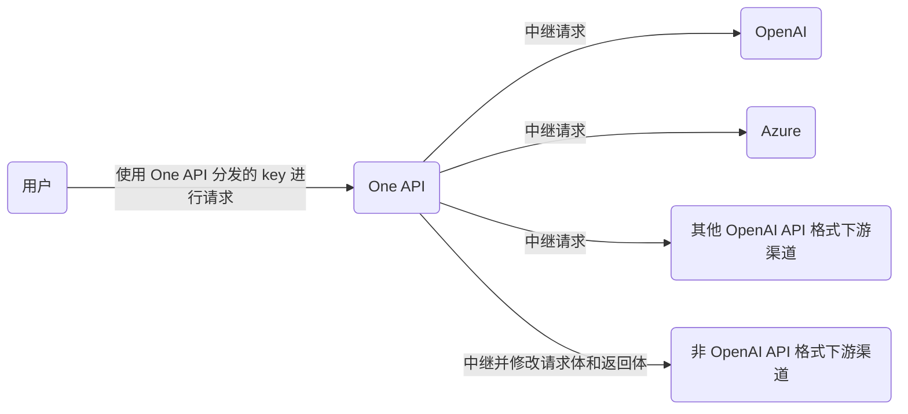
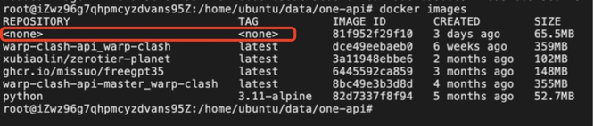

# About One API

One API 相当于一个反向代理器，它将各个厂商的大模型 API 封装成一个统一的 API, 使得用户可以通过一个 API 调用不同厂商的模型，而不需要关心底层的模型 API 是什么。

One-API 工作原理：



One API 的相关项目：
- [ ] 原始 One API 项目：https://github.com/songquanpeng/one-api
- [ ] One-Hub 项目 (提供了非常不错的 UI 界面进行管理，基于 One API 项目改进而来) : https://github.com/MartialBE/one-hub
- [ ] Simple One API 项目 (去掉了 token 用量统计等复杂功能，如果是个人自用的话，这个项目是个不错的选择): https://github.com/fruitbars/simple-one-api


## 使用方法
- 你需要在各种用到 OpenAI API 的地方设置 API Base 为你的 One API 的部署地址
  - 例如：https://openai.xxxx.cn，API Key 则为你在 One API 中生成的令牌。具体的 API Base 的格式取决于你所使用的客户端。

  - 对于 OpenAI 官方库：
    ```txt
    OPENAI_API_KEY="sk-xxxxxx"
    OPENAI_API_BASE="https://<HOST>:<PORT>/v1"
    ```


---

# 在阿里云服务器上部署 One Hub

准备环境：
```shell
# 更新一下软件源
sudo apt update
sudo apt upgrade -y
sudo apt install -y git curl build-essential

# 安装 nodejs
curl -o- https://raw.githubusercontent.com/nvm-sh/nvm/v0.39.1/install.sh | bash
source ~/.bashrc
nvm install --lts

# 反向代理工具 nginx (不设置的话外网无法直接通过域名/公网ip直接访问 One API 服务)
sudo apt install nginx
```

安装 Docker 这些操作就不记录了，直接 google 相关命令跑一下就行。
- 注意，这里的阿里云服务器运行的是 Ubuntu 22.04 系统，平台是`linux/amd64`，所以拉取镜像的时候要指定平台，避免拉错镜像。

1. 用自己的电脑拉取镜像并导出：
    - 由于国内众所周知的原因，pull 的时候大概率失败，或者等待超时。于是，可以考虑在自己的电脑上翻墙，然后拉取镜像
    ```shell
    # 拉取镜像，--platform 用来指定系统平台，避免拉错镜像
    docker pull --platform linux/amd64 ghcr.io/martialbe/one-api

    # 导出镜像 (one-api.tar 是导出的镜像文件; ghcr.io/martialbe/one-api 是镜像名，镜像名也可以用镜像 id 来替代)
    docker save ghcr.io/martialbe/one-api > one-api.tar
    ```

2. 上传导出的镜像文件到服务器中


3. 在服务器中导入镜像
    ```shell
    # 导入镜像
    docker load < one-api.tar

    # 查看导入镜像的 id (导入的镜像的名称此时会显示 <none>)
    docker images 

    # 由于导入的镜像没有 tag，所以需要给镜像打上 tag 以免以后管理镜像的时候懵逼
    docker tag <image_id> ghcr.io/martialbe/one-api:latest
    ```
    

4. 新建一个目录，用来存放 One API 的配置文件
    ```shell
    mkdir /home/ubuntu/data/one-api

    # 进入该目录
    cd /home/ubuntu/data/one-api
    ```

5. 按照项目的[wiki](https://github.com/MartialBE/one-hub/wiki/Deployment)说明来生成&运行容器：

    - 使用 `SQLite` 数据库 (Docker 镜像中自带的数据库)
    ```shell
    docker run -d -p 9494:3000 \
        --name one-api \
        --restart always \
        -e TZ=Asia/Shanghai \
        -v /home/ubuntu/data/one-api:/data \
        ghcr.io/martialbe/one-api
    ```

    - 使用宿主机的 `MySQL` 数据库 (**需要确保宿主机上已经有 MySQL 在正常使用!!**)
    ```shell
    docker run -d -p 9494:3000 \
        --name one-api \
        --restart always \
        -e TZ=Asia/Shanghai \
        -e SQL_DSN="root:123456@tcp(localhost:3306)/oneapi" \
        -v /home/ubuntu/data/one-api:/data \
        ghcr.io/martialbe/one-api
    ```

   - `-p 9494:3000` 意思是 `<宿主机端口>:<docker镜像里特定服务使用的端口>`，表示将 docker 内部服务的 3000 端口暴露出来，可以通过宿主机的 9494 端口进行访问，`宿主机端口`可以根据需要进行修改。
   - 数据和日志将会保存在宿主机的 `/home/ubuntu/data/one-api` 目录下面，请确保该目录存在且具有写入权限，或者更改为合适的目录。


## 部署过程中可能会用到的 Docker 指令
- [x] 停止容器 & 删除容器
    ```shell
    # 停止容器 one-api  (因为上面的 docker run 命令的 name 字段中，名字为 " one-api")
    docker stop one-api

    # 删除容器 one-api
    docker rm one-api
    ```


