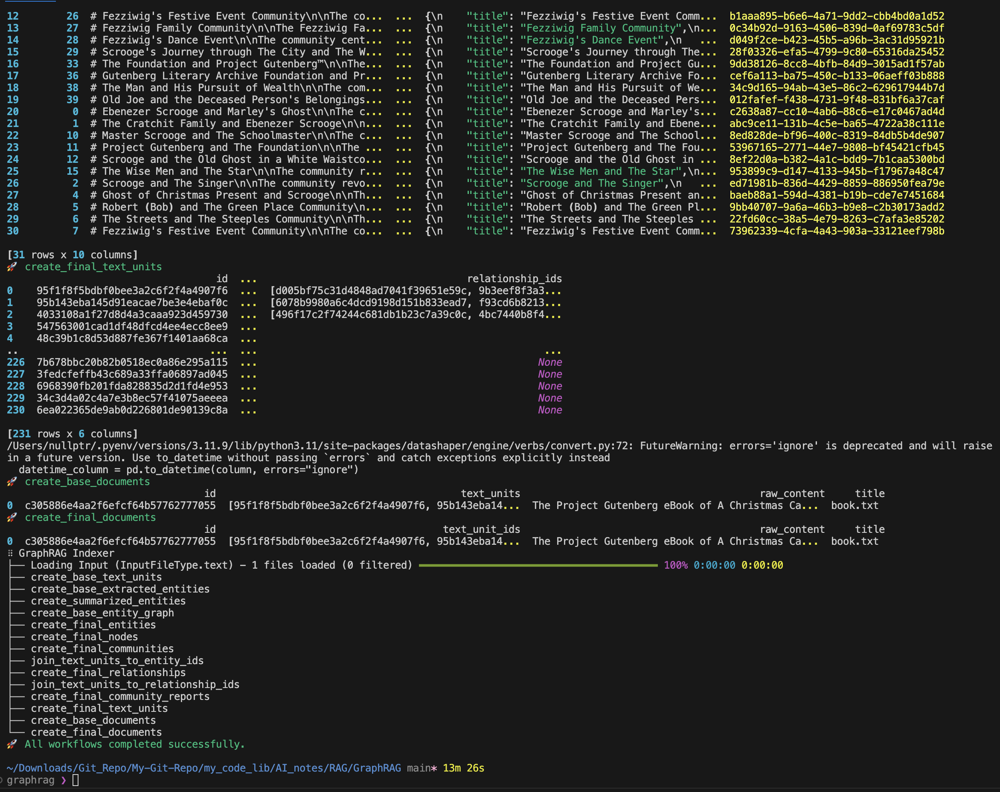

# 论文笔记

出发点：
1. 传统 RAG 的能力一般是拿 Query 去 vector store 中进行检索，然后返回相关的文档片段。这种方式一般会比较精细化，并且 retrieve 回来的东西无法用于回答诸如 "这个数据集有什么特征" 这种 high-level 的问题。
2. 能针对 Query 完成总结性的 high-level 回答的任务一般称为 QFS(Query Focus Summarization), 但是以往的 QFS 方法无法针对大规模数据进行总结。

为解决这两个问题，文章提出 GraphRAG, Pipeline 如下图所示。


整体流程可以画成如下形式：

  1. [Text Chunks] 先对 source text 进行切分，得到众多 chunks, 但需要注意切分的粒度 (granularity), 它会影响到后续的处理。
     - 注意：chunks 切得长虽然可以减少使用 LLM 的次数，但会导致 retrieve 阶段的 recall 变低，而 precision 会变高; chunk 切得短就需要调用更多次 LLM 进行处理，不过切得短能让 recall 变高，但 precision 会变低。
        > 这个问题的主要原因在于 LLM 在单词处理时很可能会遗漏某些有用的东西，比如对于长文本提取 entity 时容易出现缺漏等，然后导致 recall 下降。
  
  2. [Element Instances] 将每一份 Text chunk 送入 LLM, 通过使用不同的 prompt template 来`识别&提取`其中能作为 graph node, edges 的东西，也就是 `element instances`的提取。
     - 使用多个 llm prompt 来实现，首先识别文本中的所有 entity，包括它们的名称、类型和描述，然后识别"明显相关实体"之间的所有关系，包括源和目标实体及其关系的描述。
     - 这个过程是`multiple rounds`的，每一轮都要确定是否有遗漏的 entity, 并且通过这种方式可以缓解 large chunk size 带来的 recall 降低问题。
  
  3. [Element Summaries] 将 entity 和 relationship 继续丢到 LLM 中，让 LLM 针对能匹配的 instances 进行描述性的总结。
     - 值得留意的是，LLM 在提取 entity 的时候，尤其是进行多轮提取的时候，很可能会出现重复的 entity, 而这里额外增加的 summary 任务可以兼顾地实现去重的目的。
        > LLM 可能无法对某个 chunks 连续提取出 entity 以及相关的 relationship，然后使得此时构建的 Graph 可能出现多个冗余的 node 以及冗余的边（也就是 Graph 大概率是包含噪声的）。但是当我们直接将冗余的 entity 以及它们的 relationship 丢给 LLM 时（而不是让 LLM 一次性完成提取和去重这两个任务），LLM 是有能力将冗余信息筛掉的，这个特性使得 GraphRAG 能很好地完成全局的、query-focus 的总结性任务。同时也是 GraphRAG 与 typical knowledge graph 的主要区别。【这是作者给出的观点】
  
  4. [Graph Communities] 将 element instances 送入 community detection 算法中，得到 Graph Communities。
     - 第三步中精修后的 entity node 和 relation 可以被建模为`齐次无向加权图(homogeneous undirected weighted graph)`，其中实体节点由关系边连接，边的权重则为检测到的关系实例 (relationship instances) 的归一化计数。
     - 对建模好的无向加权图使用 community detection 算法进行社区划分，类似于进行聚类，将相互关系密切 (边的权重大) 的节点聚集为一个社区。

  5. [Community Summaries] 对 community 生成不同层级的总结性描述。
     - Leaf-level communities: 
        > 对叶级社区（节点、边、协变量）的 element summaries 进行优先排序，然后迭代地添加到 llm 上下文窗口中，直到达到标记限制。
        >> 优先规则为：对于每个社区边缘，按源节点和目标节点度数的总和（即总体显著性）**递减顺序**，依次添加源节点、目标节点、链接的协变量和边缘本身的描述。
     - High-level communities: 
        > 如果所有元素摘要 (element summaries) 都能适应上下文窗口的 token 限制，则按叶级社区的处理方式汇总社区内的所有元素摘要。否则，根据元素摘要所需的 token 数量按**递减的顺序**对子社区进行排名，并逐步用子社区摘要（较短）替换其相关的元素摘要（较长），直到适应 Context Window 的 toen 限制。

  6. [Community Summaries -> Community Answers -> Global Answers] 按照下面的顺序按层级生成回答
    1. Prepare Community Answers: 
        > 前面已经生成过 community summaries, 这里会将这些 summaries 进行 random shuffle, 然后再把它们切成指定长度的 chunks.
        >> 这样可以确保单个 context Window 中包含的与 Query 相关的信息不会集中在一起，而是分散在不同的 chunks 中，有助于提高 recall。


构建 community 的流程如下：


---

# 本地部署 (Mac)
这是按照微软官方教程走的。

## 安装
创建虚拟环境 & 激活虚拟环境
```shell
conda create -n graphrag python=3.10 
conda activate graphrag
```

安装 graphrag 
```shell
pip install graphrag
```

找一个地方作为知识库 (这里直接在当前路径下新建一个文件夹)
```shell
# 新建文件夹以存放数据
mkdir -p ./ragtest/input 

# 将原始数据放入文件夹中 (这里按照官方教程下载一份测试数据, 一共3970行内容的书)
curl https://www.gutenberg.org/cache/epub/24022/pg24022.txt > ./ragtest/input/book.txt
```

初始化环境变量 & 构建文档索引信息
```shell
python -m graphrag.index --init --root ./ragtest
```
- `python -m`: “-m”选项允许将库模块作为脚本运行。它在“sys.path”中搜索模块，并将其作为脚本运行。
- `graphrag.index --init --root ./ragtest`: `--init`初始化环境变量，创建`.env`和`settings.yaml`文件; 然后将`settings.yaml`中的`root`字段设置为`./ragtest`.
    > `.env` contains the environment variables required to run the GraphRAG pipeline. 
    >> If you inspect the file, you'll see a single environment variable defined, GRAPHRAG_API_KEY=<API_KEY>. This is the API key for the OpenAI API or Azure OpenAI endpoint. You can replace this with your own API key.
    >
    > `settings.yaml` contains the settings for the pipeline. 
    >> You can modify this file to change the settings for the pipeline.
    - `settings.yaml`中 LLM 有关的重要配置：
        ```yaml
        type: azure_openai_chat # Or azure_openai_embedding for embeddings
        api_base: https://<instance>.openai.azure.com
        api_version: 2024-02-15-preview # You can customize this for other versions
        deployment_name: <azure_model_deployment_name>
        ```
        - 更多详细信息去[官方文档](https://microsoft.github.io/graphrag/posts/get_started)查看。

- 运行后，还会在`./ragtest`文件夹下生成两个文件夹：`output`和`prompts`
  - `output`文件夹下主要按日期和时间生成 `reports`和`artifacts`, report 主要存放的是 `indexing-engine.log` 和 `logs.json` 等日志，`artifacts` 则是一些 `.parquet` 文件。
  - `prompts`文件夹下存放了一些 prompt 模板文件，这些模板会按照`settings.yaml`中的配置来调用。


修改好`.env`和`settings.yaml`文件后，就可以正式构建知识库索引了
```shell
python -m graphrag.index --root ./ragtest
```
- 输出如下：


- 仅构建这本书的内容，OpenAI 收费大概 2.5 美金，比较贵！
  


Query - 全局知识库搜索 (High Level, 比如概括一本书的内容)：
```shell
python -m graphrag.query \
--root ./ragtest \
--method global \
"What are the top themes in this story?"
```

Query - 局部知识库搜索：
```shell
python -m graphrag.query \
--root ./ragtest \
--method local \
"Who is Scrooge, and what are his main relationships?"
```


---

## 关于 settings.yaml
```yaml
encoding_model: cl100k_base
skip_workflows: []
llm:
  api_key: ${GRAPHRAG_API_KEY}     # 这个 key 在.env 文件中进行设置
  type: openai_chat # or azure_openai_chat
  model: gpt-4-turbo-preview     # 指定模型，想省点钱的话可以使用 gpt-4o
  model_supports_json: true # recommended if this is available for your model.

  # ---- 设置输入模型的最大 token 数 ----
  # max_tokens: 4000      

  # ---- 设置请求超时时间 ----
  # request_timeout: 180.0

  # ---- 如果需要改用本地模型或者其他模型 (如 groq 提供的 llama)，则需要修改下面的参数 -----
  # api_base: https://<instance>.openai.azure.com
  # api_version: 2024-02-15-preview


  # organization: <organization_id>
  # deployment_name: <azure_model_deployment_name>
  # tokens_per_minute: 150_000 # set a leaky bucket throttle
  # requests_per_minute: 10_000 # set a leaky bucket throttle
  # max_retries: 10
  # max_retry_wait: 10.0
  # sleep_on_rate_limit_recommendation: true # whether to sleep when azure suggests wait-times
  # concurrent_requests: 25 # the number of parallel inflight requests that may be made

parallelization:
  stagger: 0.3
  # num_threads: 50 # the number of threads to use for parallel processing

async_mode: threaded # or asyncio

embeddings:
  ## parallelization: override the global parallelization settings for embeddings
  async_mode: threaded # or asyncio
  llm:
    api_key: ${GRAPHRAG_API_KEY}
    type: openai_embedding # or azure_openai_embedding
    model: text-embedding-3-small
    # api_base: https://<instance>.openai.azure.com
    # api_version: 2024-02-15-preview
    # organization: <organization_id>
    # deployment_name: <azure_model_deployment_name>
    # tokens_per_minute: 150_000 # set a leaky bucket throttle
    # requests_per_minute: 10_000 # set a leaky bucket throttle
    # max_retries: 10
    # max_retry_wait: 10.0
    # sleep_on_rate_limit_recommendation: true # whether to sleep when azure suggests wait-times
    # concurrent_requests: 25 # the number of parallel inflight requests that may be made
    # batch_size: 16 # the number of documents to send in a single request
    # batch_max_tokens: 8191 # the maximum number of tokens to send in a single request
    # target: required # or optional
  


chunks:
  size: 300       # 每一份 chunk 包含的最大 token 数
  overlap: 100    # 每一份 chunk 的重叠部分 (如果没有重叠的部分，模型很容易丢失上下文)
  group_by_columns: [id] # by default, we don't allow chunks to cross documents
    
input:
  type: file # or blob
  file_type: text # or csv
  base_dir: "input"
  file_encoding: utf-8
  file_pattern: ".*\\.txt$"

cache:
  type: file # or blob
  base_dir: "cache"
  # connection_string: <azure_blob_storage_connection_string>
  # container_name: <azure_blob_storage_container_name>

storage:
  type: file # or blob
  base_dir: "output/${timestamp}/artifacts"
  # connection_string: <azure_blob_storage_connection_string>
  # container_name: <azure_blob_storage_container_name>

reporting:
  type: file # or console, blob
  base_dir: "output/${timestamp}/reports"
  # connection_string: <azure_blob_storage_connection_string>
  # container_name: <azure_blob_storage_container_name>

entity_extraction:
  ## llm: override the global llm settings for this task
  ## parallelization: override the global parallelization settings for this task
  ## async_mode: override the global async_mode settings for this task
  prompt: "prompts/entity_extraction.txt"      # 用于识别 entity 的 prompt 模板 (entity 指的是 organization, person, geo, event 等，在下面的 entity_types 中指定)
  entity_types: [organization,person,geo,event]
  max_gleanings: 0

summarize_descriptions:
  ## llm: override the global llm settings for this task
  ## parallelization: override the global parallelization settings for this task
  ## async_mode: override the global async_mode settings for this task
  prompt: "prompts/summarize_descriptions.txt"
  max_length: 500

claim_extraction:
  ## llm: override the global llm settings for this task
  ## parallelization: override the global parallelization settings for this task
  ## async_mode: override the global async_mode settings for this task
  # enabled: true
  prompt: "prompts/claim_extraction.txt"
  description: "Any claims or facts that could be relevant to information discovery."
  max_gleanings: 0

community_report:
  ## llm: override the global llm settings for this task
  ## parallelization: override the global parallelization settings for this task
  ## async_mode: override the global async_mode settings for this task
  prompt: "prompts/community_report.txt"
  max_length: 2000
  max_input_length: 8000

cluster_graph:
  max_cluster_size: 10

embed_graph:
  enabled: false # if true, will generate node2vec embeddings for nodes
  # num_walks: 10
  # walk_length: 40
  # window_size: 2
  # iterations: 3
  # random_seed: 597832

umap:
  enabled: false # if true, will generate UMAP embeddings for nodes

snapshots:
  graphml: false
  raw_entities: false
  top_level_nodes: false

local_search:
  # text_unit_prop: 0.5
  # community_prop: 0.1
  # conversation_history_max_turns: 5
  # top_k_mapped_entities: 10
  # top_k_relationships: 10
  # max_tokens: 12000

global_search:
  # max_tokens: 12000
  # data_max_tokens: 12000
  # map_max_tokens: 1000
  # reduce_max_tokens: 2000
  # concurrency: 32
```


--- 

# Reference 
- 微软官方介绍：https://microsoft.github.io/graphrag/

- 原论文：https://arxiv.org/pdf/2404.16130
