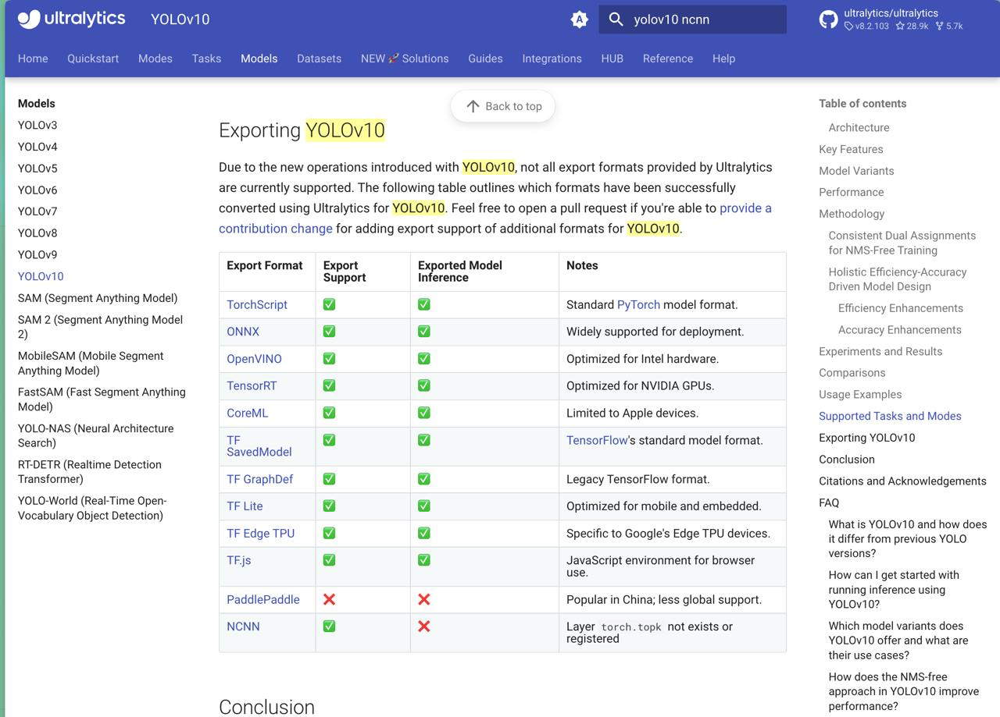

# 记录导出 Ultralitic 的 YOLO v8 为 NCNN
本笔记主要参考 [Ultralitic 官方教程](https://docs.ultralytics.com/zh/integrations/ncnn/#installation).

注意，对于大多数情况而言：
```txt
导出到 ONNX 或 OpenVINO 可将 CPU 的速度提高 3 倍。
导出到 TensorRT 可将 GPU 的速度提高 5 倍。
```

将 Ultralytics YOLOv8 模型导出到 NCNN 有几个好处：
- **效率：NCNN** 模型针对移动和嵌入式设备进行了优化，即使计算资源有限也能确保高性能。
- **量化**：NCNN 支持量化等技术，可提高模型速度并减少内存使用。
- **广泛的兼容性**：您可以在多个平台上部署 NCNN 模型，包括 Android、iOS、Linux 和 macOS。

## 安装依赖
```python
pip install ultralytics
pip install ncnn
```
-  `PNNX` Binary file must be placed in **current working directory**, 如果是使用 ultralitics 的话，这个库一般会自带，或者自动完成下载。

注：截止到 2024-9-29, ultralitic 的 yolov10 还不支持转成 NCNN 之后的推理。



