---
runme:
  id: 01HNMA6NVTEZ7492KKJF4M78GP
  version: v2.2
---

# 目标检测改述

目标检测在CV中指的是`检测图中的某种物体的位置` + `标注出所检测到的物体的类别`.

## Anchors Base
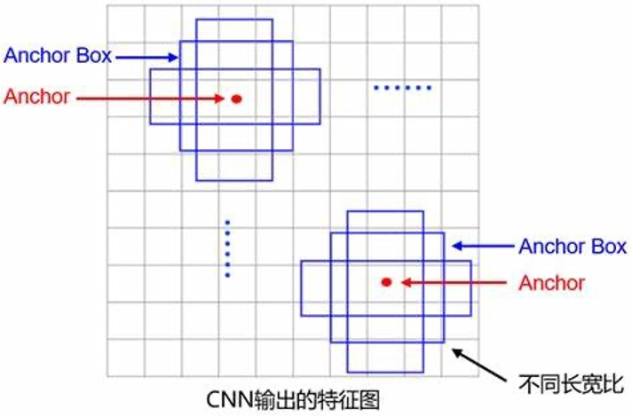
Anchor指的是`锚点`, Anchor base 就是通过锚点为基础构建不同大小的框, 然后对框里的东西进行检测&分类.
- Anchor可以在框的左上角, 也可以在框的中心

1. 为了使检测的成功率更高, 通常需要生成很多不同尺寸的框(人为设定固定的尺寸), 将框映射到图片(或者feature map)上, 然后再对框进行筛选, 筛选出框住物体面积最大的框出来.

2. 为了使框覆盖的更好而训练网络对 anchor box 进行调整(网络进行微调)
  - **本质上网络预测的是 anchor box 的偏移量(用于修正人为设定的框)**

Anchor base 的缺点:
- 生成的框太多, `计算量大`
- 在训练阶段, 与 ground truth 计算IoU(Intersection Over Union, 交并比)时, 通常需要`人为地进行正负样本的区分`(如: IoU > 0.7 为正样本, IoU < 0.3 为负样本, IoU处于0.3到0.7之前直接忽略), 这样会导致大量的负样本的不平衡, 从而导致`训练不平衡`.


## Anchor Free
最初的目的是解决 Anchor base 方法计算量大的问题而设计, 核心思想是: 不去生成大量框(只生成3个框, 然后回归出最准确的框), 而是直接预物体的中心点位置, 并预测框的高宽.
- 经典网络有 centerNet 和 cornerNet
  - centerNet 是预测中心点和高宽
  - cornerNet 则是预测框的左上角和右下角的坐标


# 回顾v1~v7
演变时间线
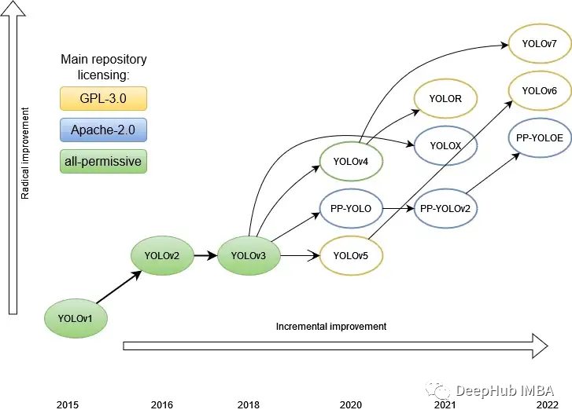


```txt
YOLO v1, v6, v8, YOLOX 都是 Anchor Free 的网络
YOLO v2, v3, v4, v5, v7 都是 Anchor Base 的网络

耦合头:
  v1, v2, v3, v4, v5, v7 都是耦合头

解耦头:
  YOLOX, v6, v8 都是解耦头
```

## YOLO v1 -- Anchor Free
提出时间: 2015年.
注意: **YOLO v1 是 Anchor Free 的网络**, 它把Anchor的预测当做`回归`问题来处理.

对于网络结构部分:
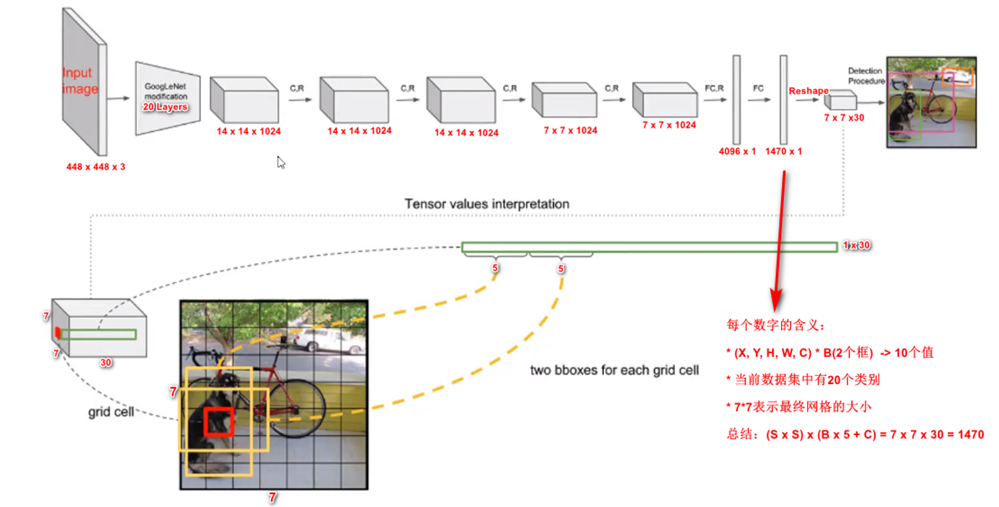
需注意:
- 由于输入层和最后的 FC(full connection) 层是固定的, 使得`输入的图片大小被固定`, 写死无法改变. 
  - 如果想要输入更大的图片, 那么整个网络都需要调整并重新训练

- 网络最后得到的 $7*7*30$ 指的是: 
  - 整个图片被分成了 $7*7$ 个网格(一共`49个anchor点`), 每个网格沿着通道方向可以取出一个**30维**的向量, 这30个数表示的是这个网格在 预测两个框, 每个框有 5 个坐标 $(X,Y,H,W,C)$ + 20 个类别的概率 + 1 个置信度
    - 坐标值里的 C 是confidence, 用来表征当前这个框里的东西是**前景还是背景**

对于Loss部分:

- 使用的loss主要是 softmax + cross entropy + MSE(mean square error)
  - 上面黄绿色的是第一部分 loss, 用来代`表框的定位loss`
  - 下面蓝色部分则是第二步 loss, 用来代表`类别的loss`
    - 类别分成两部分: 包含物体的类别和不包含物体的类别(2分类) + 物体所属的具体类别(多分类)


优缺点:
```txt
优点:
  1. 速度快, 达到 45fps
  2. end to end, 结构简单
  3. 可以检测多个物体

缺点:
  1. 定位不准, 定位精度不高
  2. 对小物体的检测效果不好
  3. 每个cell只能生成2个框, 并且只能检测1个具体类别.
      这是由最后输出的分类头决定的, 它的特征向量只能输出20个类别只中的1个类.
```

## YOLO v2 -- Anchor Base
提出时间: 2016年

改进目标: 解决 YOLOv1 定位精度差, 对小目标检测不友好的问题.

网络结构:
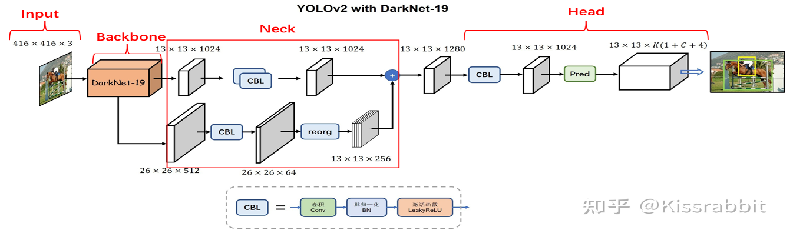
- 改进了backbone, 提出 `DarkNet19`, 速度没有变慢, 但是特征提取能力比V1更强

- 用**卷积层替代了 FC(Fully Connection) 层**, 使得**输入图片大小不再固定**(只要`输入图片尺寸是32的整数倍都可以`)

- 设计了 Neck 层: 在YOLOv1中, 它是直接一路卷积下来的, 没有进行多尺度的特征融合(v2对原图 1/16 的 feature map 和 1/32的 feature map 进行融合). 融合之后, 使用的是单一尺度接入任务的分类头.

- 在 Neck 层里使用了 `CBL模块`: 卷积和激活函数之间引入 `BN(Batch Normalization) 层`, 做的操作是: feature map每个元素减去均值, 再除以方差, 均值和方差是由当前的feature map计算出来的; 之后再对归一化后的feature map进行 平移和缩放(每个BN层包含两个可学习的参数 $\gamma$ 和 $\beta$ ).
    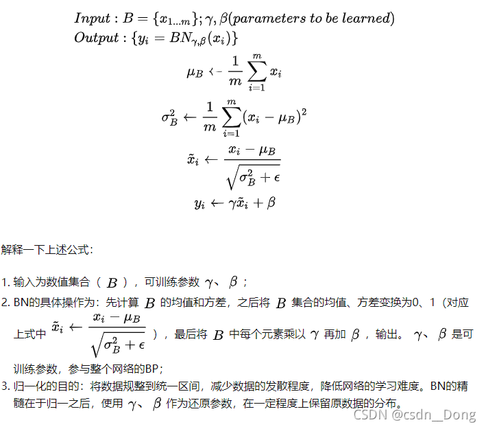
    - 加 BN 层可以使得网络收敛更快, 训练的时候梯度更稳定(因为调整了分布之后才丢进激活函数, 这样就不容易梯度爆炸以及梯度消失).
    - 参考博客: 
      - https://zhuanlan.zhihu.com/p/379721314
      - https://blog.csdn.net/weixin_42080490/article/details/108849715

- 分类头的输出中, 通道数是 3*(1+C+4), 3表示预测3个框; C在这里表示物体的具体类别, 也还是20类; 1 是confidence, 表示前景还是背景; 4则是框的坐标(Cx, Cy, H, W).
  - 这三个框(称之为`先验框`)的尺寸是从训练数据集得到的: 首先对数据集的 ground truth 框进行 `k-means` 聚类出`3个类`, 然后取出`这3个聚类中心的尺寸作为 anchor box 的尺寸`.

YOLOv2相比于v1的改进:
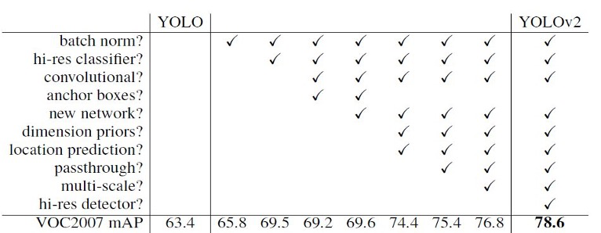
```txt
1. Batch Normalization：
  提升模型收敛速度, 起到一定正则化效果，降低模型的过拟合

2. High Resolution Classifier：
  使用448*448的分类头

3. Convolutional With Anchor Boxes：
  用卷积替换全连接

4. New Backbone Network: 
  Darknet-19, 特征提取能力比 v1 强

5. Dimension Clusters：
  先验框生成策略, 对训练数据集的ground truth框进行k-means聚类得到3个先验框
  这么做可以提高召回率(higher recall)

6. Direct location prediction

7. Fine-Grained Features：
  多尺度融合, Neck层对 1/32 和 1/16 的 feature map 进行融合, 相比 v1 增加了细粒度的特征.

8. Multi-Scale Training：
  去掉FC后，可多尺度输入(将同一张图进行1.5和0.5倍的缩放之后, 也丢进网络进行训练, 相当于一种数据增强), 这样可以模拟出包含小目标的图片.
```

## YOLO v3 -- Anchor Base
提出时间: 2018年

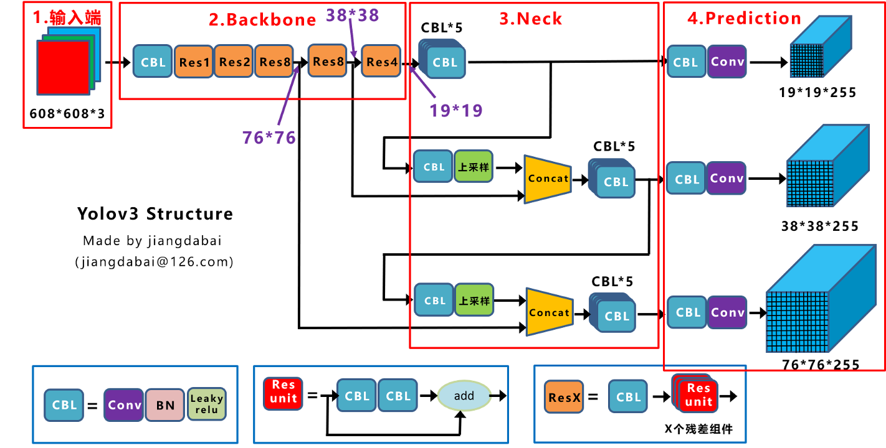
- backbone使用 DarkNet-53
- Neck部分: 特征融合之后, 分别使用3个不同的尺度(下采样到原图 1/8, 1/16, 1/32 的大小)接入不同的预测头.
  - 对于这三个尺寸所接入的预测头: 每个预测头都分别预测3个框, 所以最终效果是针对图片的每一个Anchor, 一共会预测9个框.
    - 这么做的效果是: 在原图的同一个区域内(同一个区域指的是同一个Anchor, 这里的Anchor表示框的中心位置), 在这个区域里生成了更小的框和更大的框(也就是预测了不同的宽高), 这样可以更好地适应不同尺寸的物体. 比如图中$76*76*225$的tensor, 它主要负责预测**小物体**(整个图切出更多的格子, 检测粒度更细), 用于预测小目标的分支也被称为`P3`分支; 然后 $38*38*225$ 的tensor, 它主要负责预测**中等**大小的物体, 也被称为`p4`分支; 最后 $19*19*225$ 的tensor, 它主要负责预测**大物体**, 也被分成为`p5`分支.

- 网络使用的模块:
  - CBL: Convolution + Batch Normalization + Leaky ReLU, 和 V2 一样
  - ResUnit:  对CBL构建更大的模块, 并加入的残差连接
  - ResX: 在ResUnit前面再拼接一个CBL模块, 名字里的x表示有x个ResUnit, 如Res2表示有两个ResUnit

- 输出通道数255: 这个数字由 $3*(1+C+4)$ 计算而来; 3表示预测3个框; C在这里表示物体的具体类别, 由于训练使用的是**COCO数据集, 所以有80个类别**; 1 是confidence, 表示前景还是背景; 4则是框的坐标(Cx, Cy, H, W).

## YOLO v4 -- Anchor Base
提出时间: 2020年.

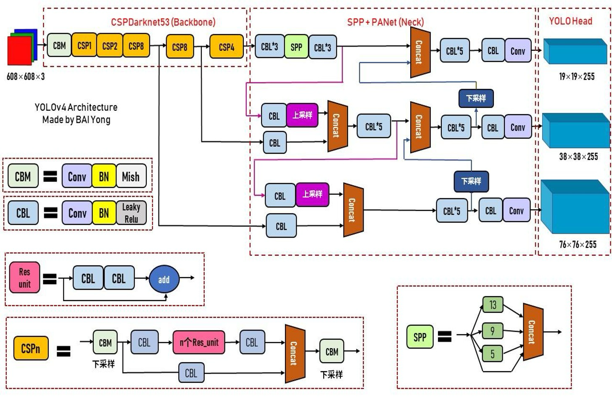
- SPP + PANet: SPP是空间金字塔池化, PANet是特征金字塔融合
  - SPP: 用来解决输入图片尺寸不固定的问题, 通过金字塔池化, 将不同尺寸的特征图融合到一起 (使用不同大小的池化核来获得高宽不同但通道数相同的feature)
    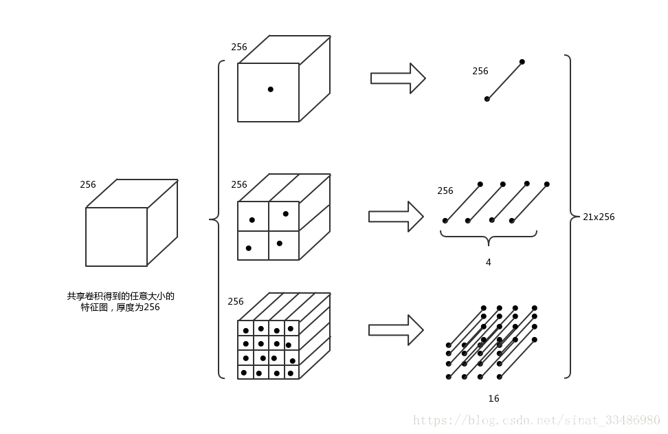
      - 参考博客: https://blog.csdn.net/weixin_38145317/article/details/106471322
  - PANet: 用来解决多尺度特征融合的问题, 通过特征金字塔融合, 将不同尺度的特征图融合到一起

    ```txt
    在YOLOv3中, 进行特征融合的时候只有"从下到上"的特征融合, 但在YOLOv4中, 还进行了"从上到下"的特征融合, 这样可以更好地适应不同尺寸的物体.
    ```

- 模块:
  ```txt
  CBL: 
    Convolution + Batch Normalization + Leaky ReLU
  CBM: 
    Convolution + Batch Normalization + Mish
    Mish也是一种激活函数
  ResUnit: 
    用CBL和残差连接构建的模块, 和 YOLOv3 一样
  CSPn: 
    利用CBM, CBL 和 ResUnit构建的模块, 并加入了残差连接
    n表示有n个CBM模块
  ```

- 加入新的数据增强方式
  - Mixup, Cutmix, Mosaic
    - Mixup: 将两张图片按照一定的比例混合在一起, 使得网络更加robust
    - Cutmix: 将两张图片按照一定的比例混合在一起, 并且将其中一张图片的一部分挖掉, 然后将另一张图片的一部分填充进去
    - Mosaic: 将四张图片按照一定的比例混合在一起, 使得网络更加robust
  - 参考博客: https://blog.csdn.net/u011984148/article/details/107572526


## YOLO v5 -- Anchor Base
提出时间: 2020年. (与V4同年)
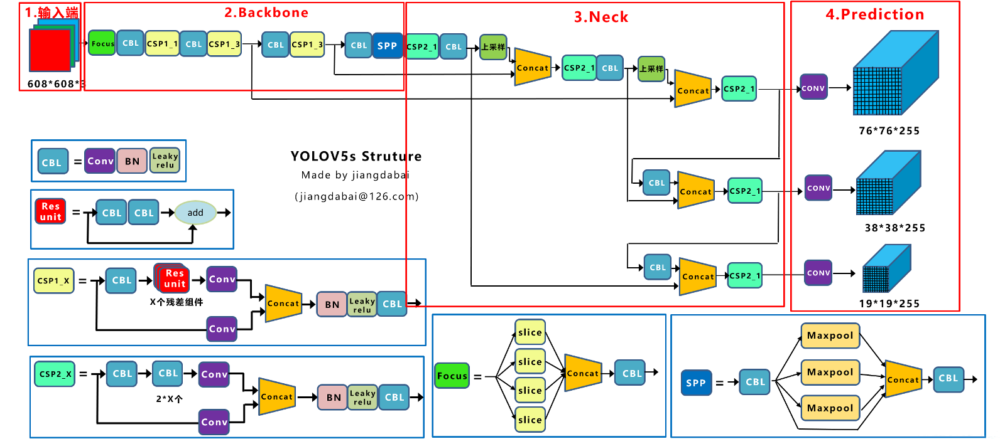

Backbone: 
- 使用Fucus模块, 进行下采样
- 后面分支分别得到原图的 1/8, 1/16, 1/32 的 feature map, 然后分别接入Neck模块的不同层

Neck:
- 就是简单的模块拼凑+特征融合

Head:
- 1/8, 1/16, 1/32 的 feature map 分别接入不同的预测头, 每个预测头都预测3个框, 所以最终效果是针对图片的每一个Anchor, 一共会预测9个框.

模块:
- CBL, 与v3, v4一样
- CSP模块:
  - 有两种, 构造方式与 V4 不同. 一种有残差, 一种没有残差.
- Focus:
  - 通过切片的方式, 将输入的输入tensor切片成四份(**偶数行+偶数列, 偶数行+奇数列, 奇数行+偶数列, 奇数行+奇数列**), 然后将这四份按顺序concate到通道上, 此时通道扩大4倍, 宽高各减少2倍, 这样可以减少计算量, 但是不会丢失信息. (直观地看, 实现了两倍下采样)
  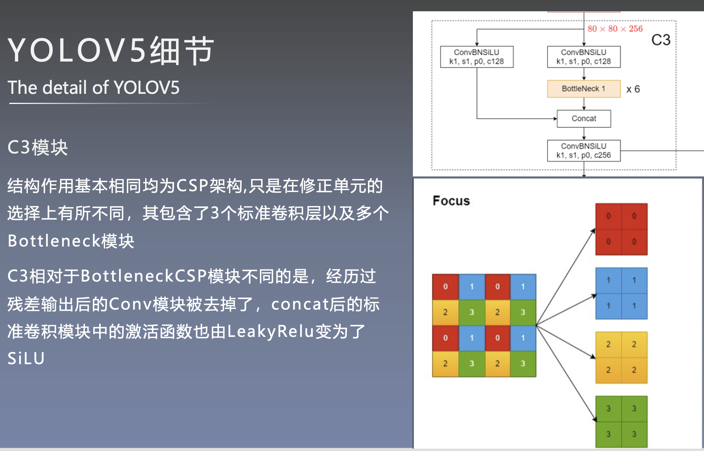
  - 参考博客: https://blog.csdn.net/qq_39056987/article/details/112712817


### YOLOv5 的 v6.0版本
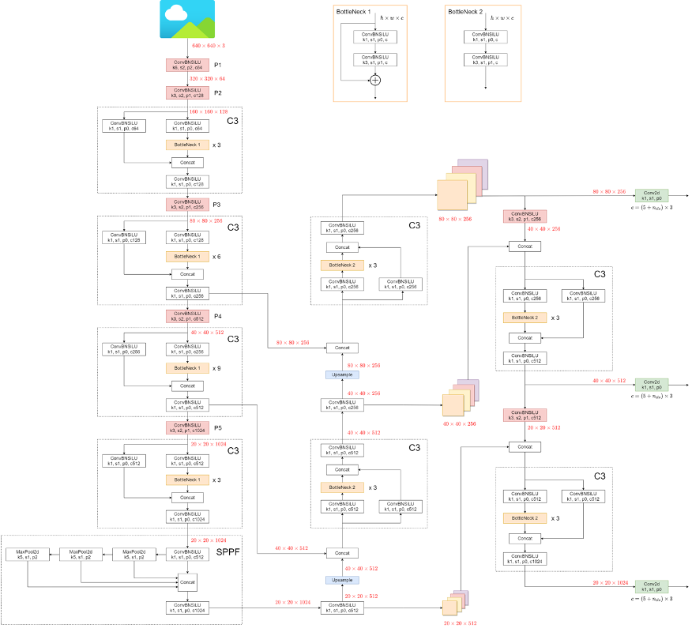

```txt
2021年10月12日，yolov5 发布了 V6.0 版本，改进：
  - 引入了全新的更小( Nano )的模型 P5(YOLOv5n) 和 P6(YOLOv5n6)，总参数减少了 75%，从 7.5M 缩小到了 1.9M，非常适合于移动端或者是 CPU 的环境

  - 用 Conv(k=6, s=2, p=2) 代替 Focus 层，主要是为了方便模型导出

  - 使用 SPPF 代替 SPP 层

  - 减少 P3 主干层 C3

  - 将 SPPF 放在主干的后面

  - 在最后一个 C3 主干层中重新引入shortcut 

  - 更新超参数
```

## YOLOX -- Anchor Free
提出时间: 2021年.

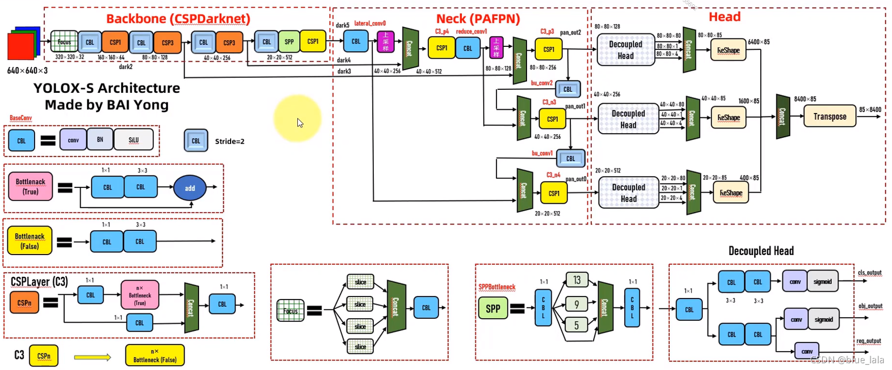
Backbone: 和 YOLOv5 差不多, 都有Focus模块, CBL模块, CSP模块

Neck: "从上到下" 与 "从下到上" 的特征融合, 中间再将输入concatenate (当前的目标检测都用这种方式)

Head(YOLOX不一样的地方)
- YOLO v1~v5, 预测头都是将3个任务(区分前景背景+定位+物体分类)合并在一个head上, YOLOX则将它们分开了(解耦)
- 注意在输出时, **有些边缘计算的框架可能支持不是那么好**, 此时在工程上会将网络止步于decouple head 部分, 后面的 concatenate 和 reshape 当做 `后处理`来做.


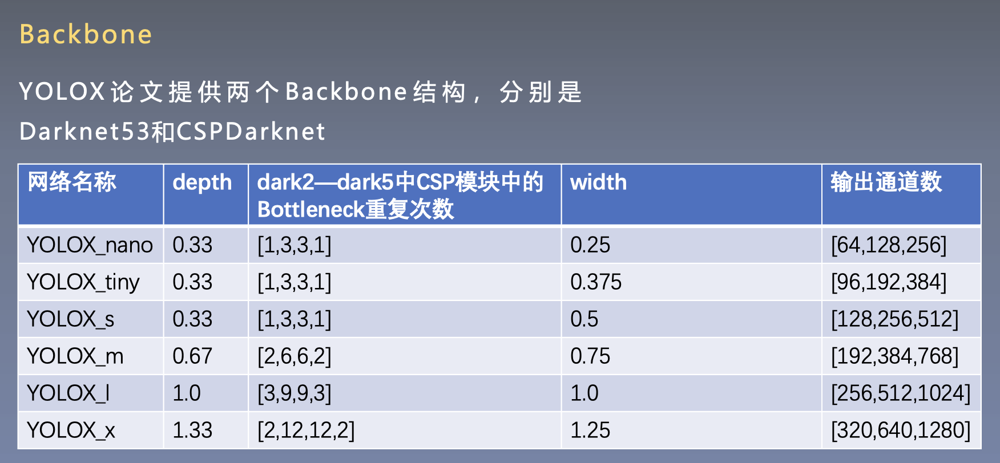
- 不同大小的网络主要通过调整backbone来实现: `Backbone`里**CSP模块中的BottleNeck的重复次数**可以控制网络的大小. (网络结构的左下角, CSP3模块里粉色的BottleNeck的数量)
- 输出通道数分别对应P3(小目标), P4(中等目标), P5(大目标)的预测头输出通道数


## YOLO v6 -- Anchor Free
美团提出的目标检测算法, 2022年.

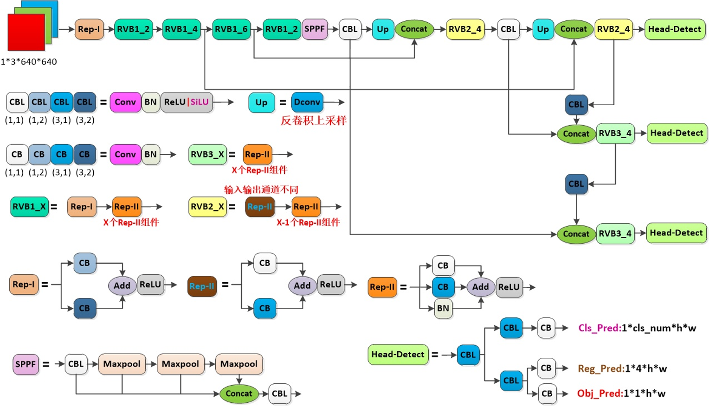
美团官方解读博客: https://mp.weixin.qq.com/s/RrQCP4pTSwpTmSgvly9evg

模块:
- CB: CB表示`Conv+BN`, 使用不同的大小卷积核的CB模块组成, 底下标注的数字为**卷积核大小**
- Rep-I: 
  - Rep表示`重新参数化`, 最早从REPVGG网络中引入. 
  - 这里的Rep-I模块使用的 卷积核大小 以及 stride 分别为 (k=1, s=2) 和 (k=3, s=2), 卷积之后相加, 再接一个ReLU
- Rep-II: 卷积核大小以及stride分别为 (k=1, s=1) 和 (k=3, s=1),  卷积之后相加, 再接一个ReLU
- Rep-III: 卷积核大小以及stride分别为 (k=1, s=1) 和 (k=3, s=1) 并加上一个BN,  之后相加, 再接一个ReLU
  ```txt
  1x1的卷积主要用来 改变通道数。
  3x3的卷积，步长为1，主要用来 特征提取。
  3x3的卷积，步长为2，主要用来 下采样。
  ```
- RVB1_x: RVB表示`Rep VGG Block`, 由不同的Rep子模块构成.
- SPPF: 先进行卷积(CBL模块), 然后按照图片中的形式**连续进行池化**, 最后再进行卷积, 用来提取不同尺度的特征
  - SPP是没有进行卷积的, 而是**分别**进行`直接的池化`并concatenate.

Neck部分:
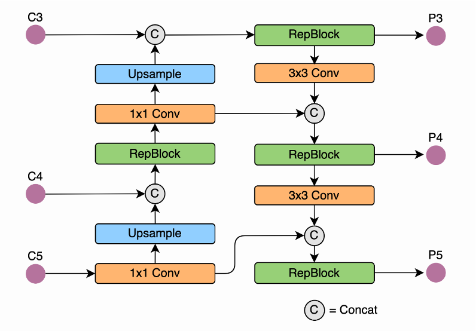
- 整体上逻辑与 v4, v5 一样, 都是自顶向下的特征融合与自底向上的特征融合都做, 中间层进行了连接; 但是这里不同的是没有使用CSP模块, 而是使用 RepBlock.

Head部分:

- 与YOLOX很像, 都是解耦头.
- head分成3个任务: Cls预测当前区域是前景或者背景; Reg预测框的位置; Obj预测物体的类别. 

小结:
```txt
设计了更高效的 Backbone 和 Neck ：
  受到硬件感知神经网络设计思想的启发，基于 RepVGG style 设计了可重参数化、更高效的骨干网络 EfficientRep Backbone 和 Rep-PAN Neck。

优化设计了更简洁有效的 Efficient Decoupled Head，在维持精度的同时，进一步降低了一般解耦头带来的额外延时开销。

在训练策略上:
  采用 Anchor-free 范式，同时辅以 SimOTA 标签分配策略以及 SIoU 边界框回归损失来进一步提高检测精度。
```

## YOLO v7 -- Anchor Base
提出时间: 2022年.

结构图画法1:
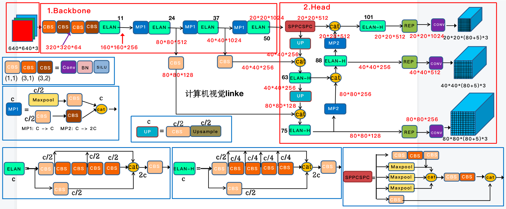
结构图画法2:
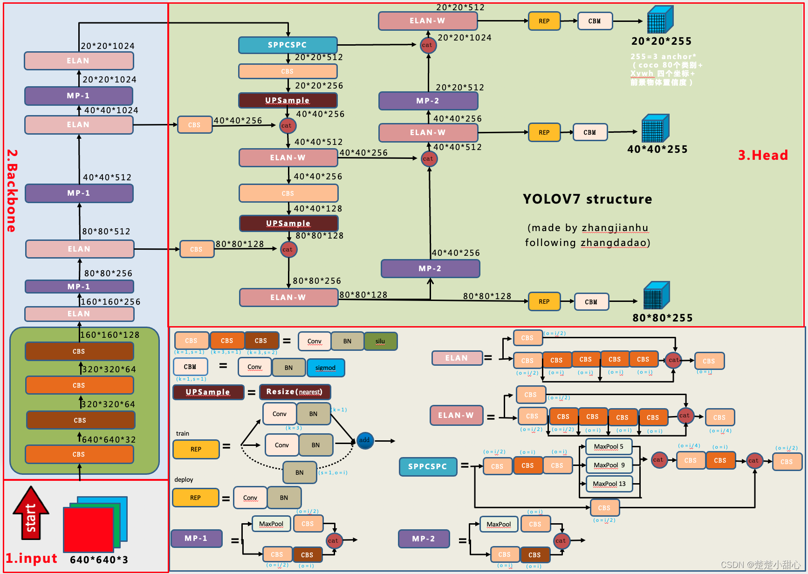
  - 参考博客: https://blog.csdn.net/qq128252/article/details/126673493


模块:
- CBS: Conv + BN + SILU
  - SILU 是 Swish 激活函数的一个变体, $silu(x)=x⋅sigmoid(x)$, $swish(x)=x⋅sigmoid(\beta x)$
  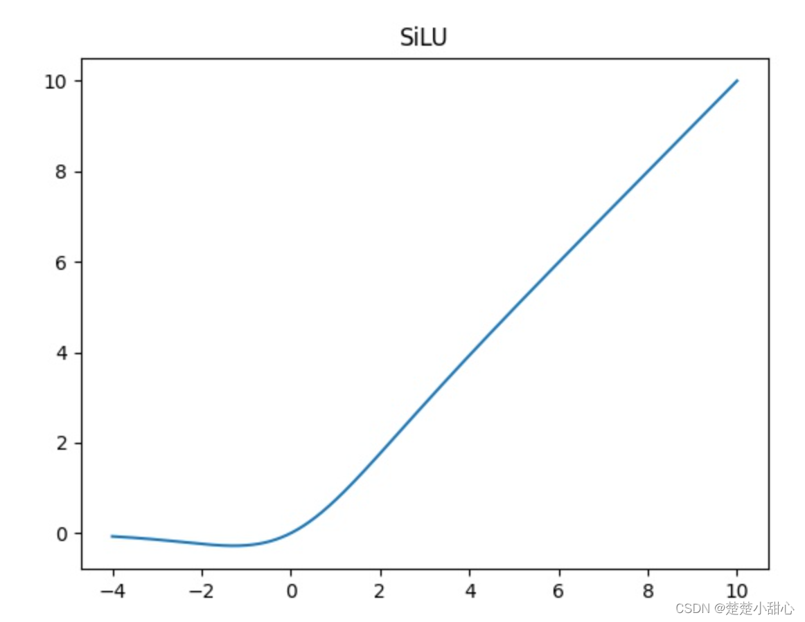

- Rep模块:
  - 分为 train(训练) 和 deploy(推理) 两种.
  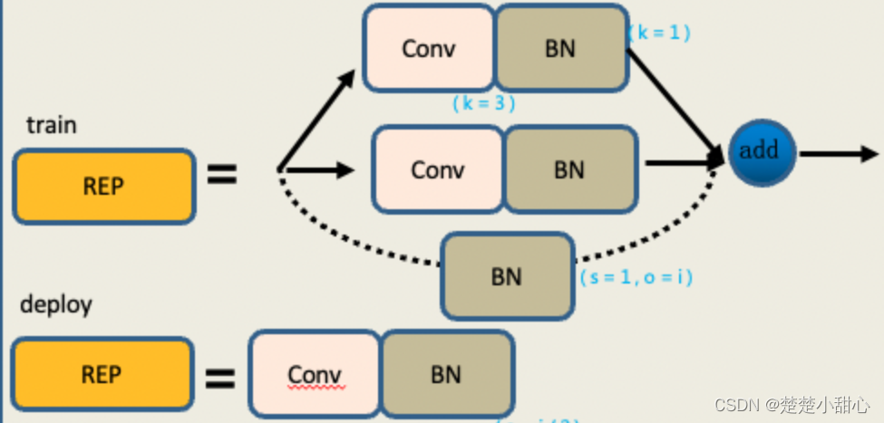
    ```txt
    训练模块，它有三个分支。
      最上面的分支是3x3的卷积，用于特征提取。
      中间的分支是1x1的卷积，用于平滑特征。
      最后分支是一个Identity，不做卷积操作，直接移过来。
      最后把它们相加在一起。
    
    推理模块，包含一个3x3的卷积，stride(步长为1)。是由训练模块重新参数化转换而来。
      在训练模块中，因为第一层是一个3x3的卷积，第二层是一个1x1的卷积，最后层是一个Identity。

      在模型重新参数化的时候，需要把1x1的卷积转换成3x3的卷积，把Identity也转换成3x3的卷积，然后进行一个矩阵的一个加法，也就是一个矩阵融合过程。

      然后最后将它的权重进行相加，就得到了一个3x3的卷积，也就是说，这三个分支就融合成了一条线，里面只有一个3x3的卷积。
      
      它们的权重是三个分支的叠加结果，矩阵，也是三个分支的叠加结果。
    ```

- MP模块:
  - 这是YOLO v7 **核心创新点之一**.
    ```txt
    MP模块有两个分支，作用是进行下采样。
      第一条分支先经过一个maxpool，也就是最大池化。最大值化的作用就是下采样，然后再经过一个1x1的卷积进行通道数的改变。

      第二条分支先经过一个1x1的卷积，做通道数的变化，然后再经过一个3x3卷积核、步长为2的卷积块，这个卷积块也是用来下采样的。

      最后把第一个分支和第二分支的结果加在一起，得到了超级下采样的结果。
    ```

- ELAN 和 ELAN-W(或叫做ELAN-H): 
  - Efficient Local Attention Network, 用来提取局部特征, 这是YOLO v7**核心的创新点之一**.
    ```txt
    ELAN模块是一个高效的网络结构，它通过控制最短和最长的梯度路径，使网络能够学习到更多的特征，并且具有更强的鲁棒性。
    
    ELAN有两条分支。
      第一条分支是经过一个1x1的卷积做通道数的变化。
      
      第二条分支就比较复杂了。它先首先经过一个1x1的卷积模块，做通道数的变化。然后再经过四个3x3的卷积模块，做特征提取。
    
      最后把四个特征叠加在一起得到最后的特征提取结果。
    
    ELAN-W 或 ELAN-H:
      对于 ELAN-W 模块，我们也看到它跟 ELAN 模块是非常的相似，所略有不同的就是它在第二条分支的时候选取的输出数量不同。
      ELAN模块选取了三个输出进行最后的相加。
      ELAN-W模块选取了五个进行相加。
    ```

- SPPCSPC (两种画法不一样, 具体需要看源码才能确认哪个画法是对的, 但是这个木块实现的目标是相同的):
  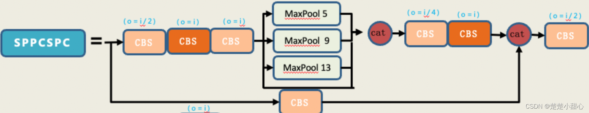
  - 这是改进的SPP模块, 与SPPF有点像, 都用了卷积层, 只不过卷积的位置不一样.
  - CSP模块是 YOLO v4 中主要使用的概念, 用于特征融合, 这里的CSPCSP模块是对CSP模块的改进, 用于特征融合. (个人感觉, 只要分成两个分支, 一个做下采样, 另一个搞点什么乱七八糟的处理, 然后concat, 形似这种结构的都叫CSP...).
  ```txt
    SPP的作用是能够 "增大感受野"，使得算法适应不同的分辨率图像，
      它是通过 最大池化 来获得不同感受野。

    我们可以看到在靠上的分支中，经理了maxpool的有四条分支。分别是5，9，13，1，这四个不同的maxpool就代表着他能够处理不同大小的对象。
      也就是说，它这四个不同尺度的最大池化有四种感受野，用来区别于大目标和小目标。
      比如一张照片中的狗和行人以及车，他们的尺度是不一样的，通过不同的maxpool，这样子就能够更好的区别小目标和大目标。

    整体看这个模块，它首先将特征分为两部分，其中的一个部分进行常规的处理，另外一个部分进行SPP结构的处理，最后把这两个部分合并在一起，这样子就能够减少一半的计算量，使得速度变得快，精度反而会提升。
  ```
- HEAD
  - 用回耦合头.

注: 原作者后续好像还给了一个 Anchor Free 版本.

## YOLO v8 -- Anchor Free
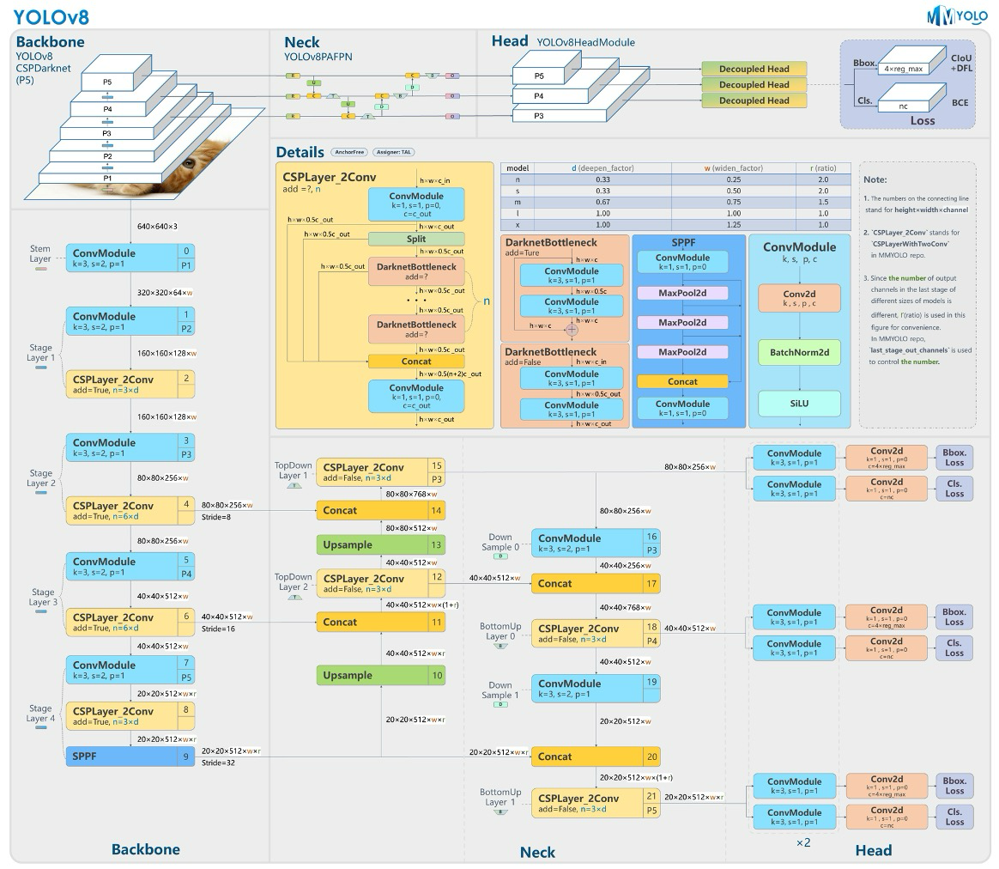

模块:
- Backbone:
  - P1~P5表示原图不同尺度的特征图, 用于不同尺度的物体检测. (P表示金字塔Pyramid)
    - P5是原图的 1/32, P4是原图的 1/16, P3是原图的 1/8, P2是原图的 1/4, P1是原图的 1/2
  - 图中 backbone 下方是金字塔的细节, 可以看到每一层的输出维度乘了一个 `w`, w是右侧不同大小的模型的宽度因子(Widen_factor), 用于控制模型的大小.
- CSP layer:
  - 使用了自己设计的结构(与v6, v7不一样)
    - 由 普通卷积层 + DarknetBottleneck 组成
      - DarknetBottleneck还有一个参数, true/false, 用于控制切换**有无残差的结构**.
  - 在CSP layer中, 还能看到 Darknet Bottlenet 里也出现了 $ n = 6 * d$ 的参数, n 是这个 bottleneck 结构的数量, `d` 则是一个参数, 用于控制模型的深度因子(Depth_factor), 也是用于控制模型的大小.

- HEAD:
  - 解耦头
    - 分成两个分支, 一个预测CLS(前景北京), 一个预测BBOX(位置+物体类别)
    - CLS分支loss用 binary cross entropy loss; BBOX分支loss用 CIOU 和 DFL(Focal loss改进版本)


### Loss Function
DFL(Distribution Focal Loss) 的参考博客:
- https://zhuanlan.zhihu.com/p/78743630

一些基本概念 -- Anchor Free 的做法是直接回归出 BBox, 故需要明确一下:
- 回归: 用大白话来描述就是`我给定一个ground truth, 你给我一个预测值, 我们要让这个预测值尽量接近ground truth`, 这个过程就叫做回归.
  - 在训练的时候, 为了衡量预测值与ground truth的差距, 一般会计算一下`预测值与ground truth的距离`, 这个距离就叫做`loss`.
  - 对于目标检测任务而言, 用来衡量距离的函数常见的是: `L1 loss, L2 loss, CIoU loss, DIoU loss, GIoU loss` 等等.

目标检测损失函数分析:
L1, L2 loss 与 IoU, GIoU 的对比:
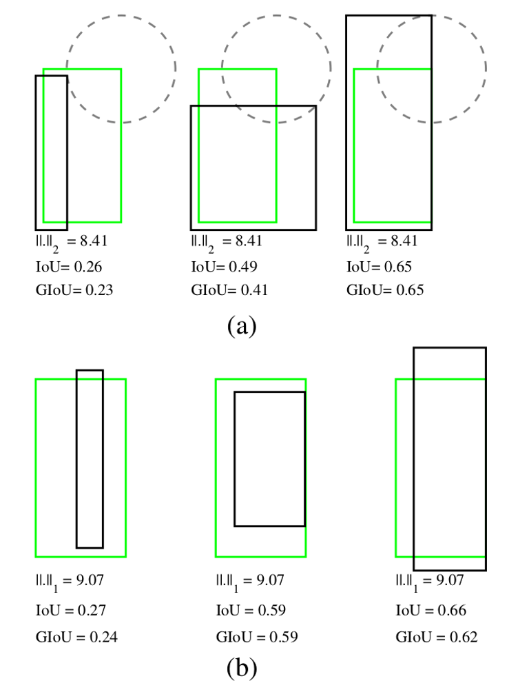
- 可以看到, 用IoU来计算两个框的距离, 会比L1, L2 loss更加合理
- IoU具有`尺度不变性`
  - IoU 的缺点:
    - IoU 无法衡量`中心点的偏移(水平 or 任意角度偏移)`,  无法衡量`长宽比`, 无法衡量`旋转角度`
      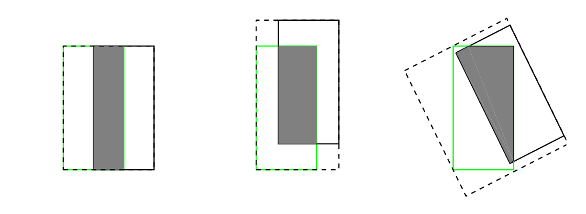

- IoU的改进版 -- GIOU:
  - 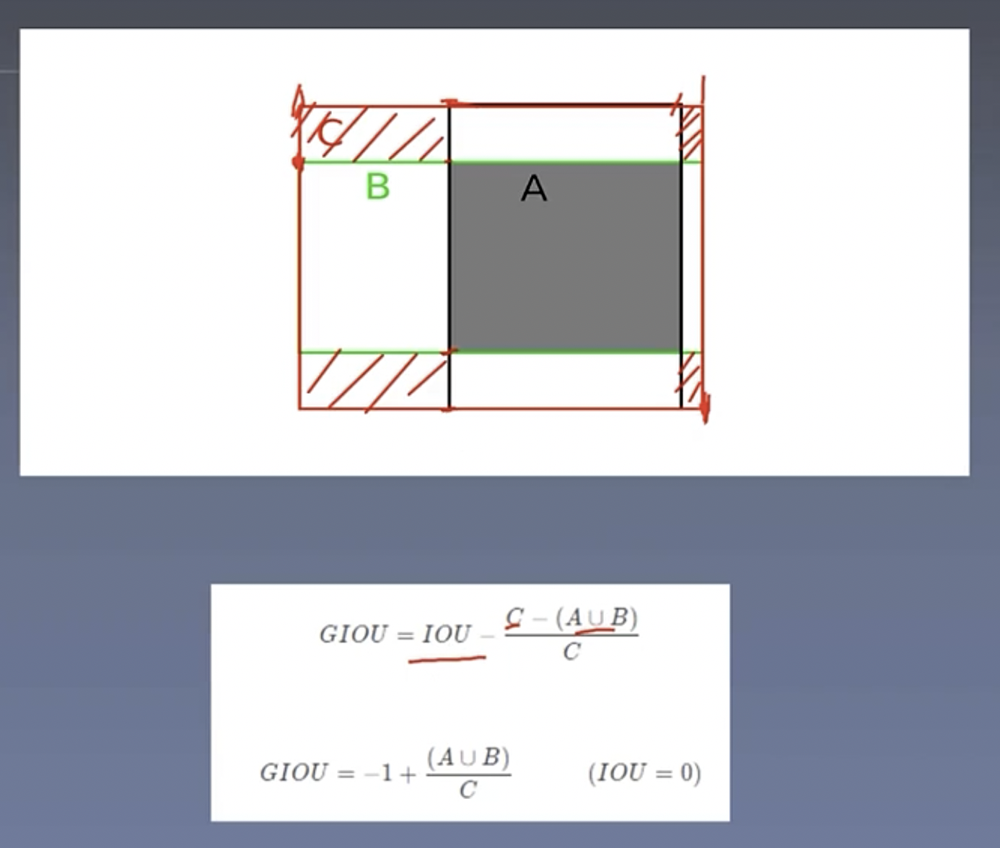
    - 公式里 $C - (A \cup B ) \over C$ 的分子表示 **红色阴影部分的面积**, 而C则表示的是A, B两个框的最小外接矩形的面积; 
      - 如果A和B两个框完全贴合时(**距离为0**), 分子的计算结果就是0, GIOU计算出来是1
      - 如果A和B两个**框距离非常远**, 此时这部分公式的结果就是1, 而IoU也是0, 由于整体公式是 IoU 减去 这部分式子, 所以最终 GIOU 为 -1.
        - 故 GIOU 的范围是 `[-1, 1]`, 并且 GIOU 有了`度量两个框距离多远(中心点水平偏移)`的能力.

- IoU 的改进版 -- DIOU
  - 它是在 GIOU 的基础上, 加入了`中心点的任意角度偏移`的衡量
    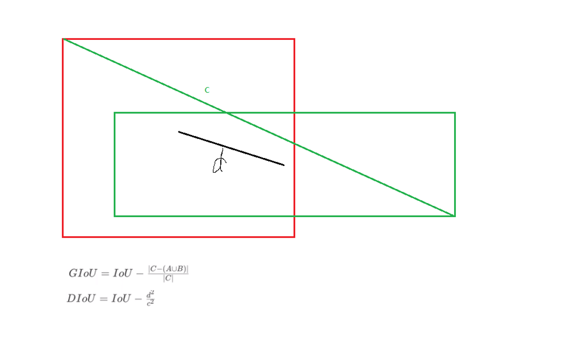
    - 公式的d是两个框中心点的距离, c是AB两个框的对角线长度
      - 两个框重叠时, $d = 0$, c是一个可以计算出来的常数, IoU 为 1, 此时 DIOU = 1
      - 两个框离得远时, `d`无限接近于 `c`, IoU 为 0, 故 DIOU = -1
      - 因此, DIOU 的范围是 `[-1, 1]`, 并且 DIOU 有了`度量两个框距离多远(中心点沿任意方向偏移)`的能力.

- IOU 改进版 -- CIOU
  - CIOU 可以衡量`中心点的偏移(水平 or 任意角度偏移)` 以及`长宽比`
    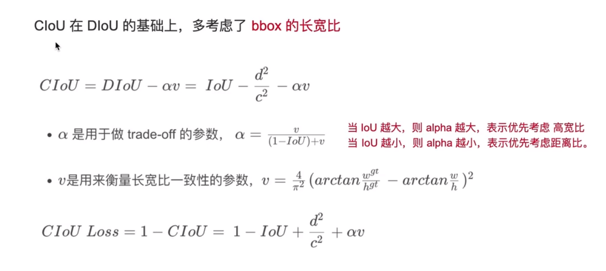
      - 这里的长宽比是基于 `v` 来度量的, 即基于`两个框各自对角线夹角`的比较(用反正切求出角度), 由于检测框是一个长方形或者正方形, 所以对角线夹角一定位于 $[0, \pi/2]$ 范围内, 前面的系数 $4\over \pi ^2$ 是方便求导的时候抵消常数用的.
      - 解释完 v, $\alpha$ 就是套一下公式罢了, 值得注意的就是`IOU越大, alpha 越小, 表示优先考虑高宽比`, `IOU越小, alpha 越大, 表示优先考虑框的距离`. 
      - 然后 CIOU 的整体公式中, d 依旧表示两个框中心点的距离, c 则是AB两个框的对角线长度.

实现代码:
```py
def bbox_iou(box1, box2, xywh=True, GIoU=False, DIoU=False, CIoU=False, eps=1e-7):
    """
    Calculate Intersection over Union (IoU) of box1(1, 4) to box2(n, 4).

    Args:
        box1 (torch.Tensor): A tensor representing a single bounding box with shape (1, 4).
        box2 (torch.Tensor): A tensor representing n bounding boxes with shape (n, 4).
        xywh (bool, optional): If True, input boxes are in (x, y, w, h) format. If False, input boxes are in
                               (x1, y1, x2, y2) format. Defaults to True.
        GIoU (bool, optional): If True, calculate Generalized IoU. Defaults to False.
        DIoU (bool, optional): If True, calculate Distance IoU. Defaults to False.
        CIoU (bool, optional): If True, calculate Complete IoU. Defaults to False.
        eps (float, optional): A small value to avoid division by zero. Defaults to 1e-7.

    Returns:
        (torch.Tensor): IoU, GIoU, DIoU, or CIoU values depending on the specified flags.
    """

    # Get the coordinates of bounding boxes
    if xywh:  # transform from xywh to xyxy    ## 传入框是中心点坐标 + 高宽
        (x1, y1, w1, h1), (x2, y2, w2, h2) = box1.chunk(4, -1), box2.chunk(4, -1)
        ## 计算两个框的半宽高
        w1_, h1_, w2_, h2_ = w1 / 2, h1 / 2, w2 / 2, h2 / 2   

        ## 计算两个框的左上角和右下角坐标
        b1_x1, b1_x2, b1_y1, b1_y2 = x1 - w1_, x1 + w1_, y1 - h1_, y1 + h1_
        b2_x1, b2_x2, b2_y1, b2_y2 = x2 - w2_, x2 + w2_, y2 - h2_, y2 + h2_
    else:  # x1, y1, x2, y2 = box1           ## 传入框是左上角坐标 + 右下角坐标
        b1_x1, b1_y1, b1_x2, b1_y2 = box1.chunk(4, -1)
        b2_x1, b2_y1, b2_x2, b2_y2 = box2.chunk(4, -1)
        ## 计算宽高 (注意为了计算时防止除零, 对高度加了一个 epslon)
        w1, h1 = b1_x2 - b1_x1, b1_y2 - b1_y1 + eps    
        w2, h2 = b2_x2 - b2_x1, b2_y2 - b2_y1 + eps

    # Intersection area
    inter = (b1_x2.minimum(b2_x2) - b1_x1.maximum(b2_x1)).clamp_(0) * (
        b1_y2.minimum(b2_y2) - b1_y1.maximum(b2_y1)
    ).clamp_(0)

    # Union Area
    union = w1 * h1 + w2 * h2 - inter + eps   ## 为了防止除零, 加了 epslon

    # IoU
    iou = inter / union

    if CIoU or DIoU or GIoU:
        ## cw, ch 是最小外接矩形的宽和高, 这是 GIOU 要用的东西
        cw = b1_x2.maximum(b2_x2) - b1_x1.minimum(b2_x1)  # convex (smallest enclosing box) width
        ch = b1_y2.maximum(b2_y2) - b1_y1.minimum(b2_y1)  # convex height
        
        if CIoU or DIoU:  # Distance or Complete IoU https://arxiv.org/abs/1911.08287v1
            ## 用勾股定理计算对角线的平方, 注意防止除零, 加了 epslon
            c2 = cw**2 + ch**2 + eps  # convex diagonal squared   
            
            ## 计算两个框中心点的距离: 使用了一个等价计算方式
            rho2 = ((b2_x1 + b2_x2 - b1_x1 - b1_x2) ** 2 + (b2_y1 + b2_y2 - b1_y1 - b1_y2) ** 2) / 4  # center dist ** 2

            ## 两面两行可以直接算出 DIOU, CIOU需要基于 DIOU 进行进一步计算才能得到
            if CIoU:  # https://github.com/Zzh-tju/DIoU-SSD-pytorch/blob/master/utils/box/box_utils.py#L47
                ## v 直接按照公式进行计算
                v = (4 / math.pi**2) * (torch.atan(w2 / h2) - torch.atan(w1 / h1)).pow(2)

                ## alpha 也是按照公式写一下
                with torch.no_grad():
                    alpha = v / (v - iou + (1 + eps))   ## 为了防止除零, 加上 epslon
                
                ## 组合 CIoU 的计算公式
                return iou - (rho2 / c2 + v * alpha)  # CIoU

            return iou - rho2 / c2  # DIoU
        
        # GIOU: 计算两个框的最小外接矩形的面积
        c_area = cw * ch + eps  # convex area
        return iou - (c_area - union) / c_area  # GIoU https://arxiv.org/pdf/1902.09630.pdf
    return iou  # IoU
```

# Ultralytics 的YOLO v8代码
代码已用子模块的形式添加到本repo中, 初始化并更新子模块的命令如下:
```sh
git submodule update --init --recursive
```


## 模型构建
Ultralytics `构建模型`是在`配置文件`中进行指的(如果需要修改模型结构, 则可以通过直接修改配置文件来完成). 配置文件路径位于:
```txt
ultralytics代码的路径/ultralytics/ultralytics/cfg/models/v8/yolov8.yaml
```
- 配置文件中有对应的注释笔记

在代码中, 读取配置文件并构建模型的代码位于:
```txt
ultralytics代码的路径/ultralytics/ultralytics/nn/tasks.py

在tasks.py 的 DetectionModel 类的 __init__ 方法中, 有一行代码:
  self.model, self.save = parse_model(deepcopy(self.yaml), ch=ch, verbose=verbose)  # model, savelist
```

对于这个`parse_model`函数:
```py
def parse_model(d, ch, verbose=True):  # model_dict, input_channels(3)     ## yml 文件读取之后转成一个字典, 传入这里的 d 变量中
    """Parse a YOLO model.yaml dictionary into a PyTorch model."""
    import ast

    # Args
    max_channels = float("inf")
    nc, act, scales = (d.get(x) for x in ("nc", "activation", "scales"))
    depth, width, kpt_shape = (d.get(x, 1.0) for x in ("depth_multiple", "width_multiple", "kpt_shape"))
    if scales:
        scale = d.get("scale")
        if not scale:
            scale = tuple(scales.keys())[0]
            LOGGER.warning(f"WARNING ⚠️ no model scale passed. Assuming scale='{scale}'.")
        depth, width, max_channels = scales[scale]

    if act:
        Conv.default_act = eval(act)  # redefine default activation, i.e. Conv.default_act = nn.SiLU()
        if verbose:
            LOGGER.info(f"{colorstr('activation:')} {act}")  # print

    if verbose:
        LOGGER.info(f"\n{'':>3}{'from':>20}{'n':>3}{'params':>10}  {'module':<45}{'arguments':<30}")

    ch = [ch]   ## channel 转成一个列表
    layers, save, c2 = [], [], ch[-1]  # layers, savelist, ch out

    ## 将 Backbone 和 head 的配置拼起来了, 因为这两个的配置书写格式都是 [from, repeats, module, args] 
    for i, (f, n, m, args) in enumerate(d["backbone"] + d["head"]):  # from, number, module, args
        m = getattr(torch.nn, m[3:]) if "nn." in m else globals()[m]  # get module   判断是否为 torch.nn, 如果是, 则可以当做模块叠起来
        for j, a in enumerate(args):
            if isinstance(a, str):
                with contextlib.suppress(ValueError):
                    args[j] = locals()[a] if a in locals() else ast.literal_eval(a)

        n = n_ = max(round(n * depth), 1) if n > 1 else n  # depth gain
        if m in (    ## 根据层的名字, 将参数进行配置 (如果要新增模块, 需要在这里新增一下模块对应的类的名字)
            Classify,
            Conv,
            ConvTranspose,
            GhostConv,
            Bottleneck,
            GhostBottleneck,
            SPP,
            SPPF,
            DWConv,
            Focus,
            BottleneckCSP,
            C1,
            C2,
            C2f,
            C3,
            C3TR,
            C3Ghost,
            nn.ConvTranspose2d,
            DWConvTranspose2d,
            C3x,
            RepC3,
        ):
            c1, c2 = ch[f], args[0]
            if c2 != nc:  # if c2 not equal to number of classes (i.e. for Classify() output)
                c2 = make_divisible(min(c2, max_channels) * width, 8)

            args = [c1, c2, *args[1:]]
            if m in (BottleneckCSP, C1, C2, C2f, C3, C3TR, C3Ghost, C3x, RepC3):
                args.insert(2, n)  # number of repeats
                n = 1
        elif m is AIFI:
            args = [ch[f], *args]
        elif m in (HGStem, HGBlock):
            c1, cm, c2 = ch[f], args[0], args[1]
            args = [c1, cm, c2, *args[2:]]
            if m is HGBlock:
                args.insert(4, n)  # number of repeats
                n = 1
        elif m is ResNetLayer:
            c2 = args[1] if args[3] else args[1] * 4
        elif m is nn.BatchNorm2d:
            args = [ch[f]]
        elif m is Concat:
            c2 = sum(ch[x] for x in f)
        elif m in (Detect, Segment, Pose, OBB):
            args.append([ch[x] for x in f])
            if m is Segment:
                args[2] = make_divisible(min(args[2], max_channels) * width, 8)
        elif m is RTDETRDecoder:  # special case, channels arg must be passed in index 1
            args.insert(1, [ch[x] for x in f])
        else:
            c2 = ch[f]

        ## 搭建网络: 将模型组合起来, 用 nn.Sequntial 包起来, 这里根据 repeat 字段的值 n 写了循环
        m_ = nn.Sequential(*(m(*args) for _ in range(n))) if n > 1 else m(*args)  # module
        t = str(m)[8:-2].replace("__main__.", "")  # module type
        m.np = sum(x.numel() for x in m_.parameters())  # number params
        m_.i, m_.f, m_.type = i, f, t  # attach index, 'from' index, type
        if verbose:
            LOGGER.info(f"{i:>3}{str(f):>20}{n_:>3}{m.np:10.0f}  {t:<45}{str(args):<30}")  # print
        save.extend(x % i for x in ([f] if isinstance(f, int) else f) if x != -1)  # append to savelist
        layers.append(m_)
        if i == 0:
            ch = []
        ch.append(c2)
    return nn.Sequential(*layers), sorted(save)

```


----

head 的细节:
- head 分成了两个分支: 一个用于检测位置(预测BBox), 一个用于检测当前区域是否有物体(预测CLS)
  - BBox分支: 使用 CIoU 和 DFL(Focal loss改进版本) 作为loss, 由于DFL需要参数 reg_max, 所以前面还有一层参数 reg_max
  - CLS分支: 使用 binary cross entropy loss 作为loss
    - NC 表示: Number of Classes, 也就是类别的数量

head代码文件位于:
```txt
ultralytics代码的路径/ultralytics/ultralytics/nn/modules/head.py
```


## 用小麦检测数据集训练YOLO v8
需要对下载的数据进预处理, 这里在tools里自定义了两个脚本文件`data_prepare.py`和`show_yolo_labels.py`

data_prepare.py 代码
```py
# 用来处理"全球小麦检测"数据集

import os
import json
import numpy as np
from tqdm import tqdm
import pandas as pd
import matplotlib.pyplot as plt
from sklearn.model_selection import train_test_split

def get_bbox(row):
    bboxes = []
    list1 = row.bbox.replace("[", "").replace("]","").replace(",","")   ## 去掉逗号和方括号
    for i in list1.split(" "):
        bboxes.append(float(i))   ## 字符串转数字
    return bboxes

# Convert the bounding boxes in YOLO format.
def get_yolo_format_bbox(img_w, img_h, bboxes):
    yolo_boxes = []
    x = bboxes[0]       ## 左上角坐标
    y = bboxes[1]       ## 左上角坐标
    w = bboxes[2] 
    h = bboxes[3] 
    
    ## 中心坐标
    xc = x + int(w/2) # xmin + width/2
    yc = y + int(h/2) # ymin + height/2

    ## 坐标点归一化: 高,宽 以及 中心点坐标值 都用对应的边长进行归一化
    yolo_boxes=[1, xc/img_w, yc/img_h, w/img_w, h/img_h] # confidence, x_center y_center width height
    yolo_boxes = str(yolo_boxes).replace("[", "").replace("]","").replace(",","")
    return yolo_boxes

def split_dataset(TRAIN_PATH):
    #使用pandas读取csv文件，新建path列，保存图片路径
    df = pd.read_csv(TRAIN_PATH.replace("train/","train.csv"))   ## 读取标签文件, 获得 ground truth bbox
    df['path'] = df.apply(lambda row:TRAIN_PATH+row.image_id+'.jpg', axis=1)    ## csv中第一列记录的是图片的文件名(但没有扩展名), 这里补齐文件扩展名, 然后将扩展好的数据新增为一列, 叫做 'path'
    print(df.head())
    train_list, valid_list = train_test_split(df.image_id.unique(), test_size=0.2, random_state=1)  ## 用sklearn的train_test_split函数, 将数据集划分为训练集和验证集: 
                                                                                                    ## 传入图片id(由于一张图有多个bbox, 所以需要去重, 用unique), 测试集占比20%, 随机种子为1
                                                                                                    ## 得到的是两个列表, 分别是训练集和验证集的图片id
    train_df = df.loc[df.image_id.isin(train_list)]             ## 根据行索引取出训练集的数据
    valid_df = df.loc[df.image_id.isin(valid_list)]             ## 根据行索引取出验证集的数据

    ## 利用 pandas 的 loc 函数, 新增一列, 叫做 'split', 用来标记这张图属于 train 还是 valid
    train_df.loc[:, 'split'] = 'train'                          
    valid_df.loc[:, 'split'] = 'valid'

    df = pd.concat([train_df, valid_df]).reset_index(drop=True)  ## 拼接两个表格, 去掉重新排序索引
    return df,train_df,valid_df

def copy_train_test(TRAIN_PATH,TEST_PATH,WORK_ROOT):
    import shutil
    
    ## ----------- 创建目录, 用于存放数据集图片 -----------
    os.makedirs(WORK_ROOT+'dataset/images/train', exist_ok=True)
    os.makedirs(WORK_ROOT+'dataset/images/valid', exist_ok=True)
    os.makedirs(WORK_ROOT+'dataset/images/test', exist_ok=True)

    os.makedirs(WORK_ROOT+'dataset/labels/train', exist_ok=True)
    os.makedirs(WORK_ROOT+'dataset/labels/valid', exist_ok=True)
    os.makedirs(WORK_ROOT+'dataset/labels/test', exist_ok=True)
    ## -----------------------------------------------
    
    df,train_df,valid_df= split_dataset(TRAIN_PATH)
    train_list = train_df.path.unique()  ## 用unique去重, 得到训练集的图片路径
    valid_list = valid_df.path.unique()  ## 用unique去重, 得到验证集的图片路径
    ## 复制图片到指定目录
    for file in tqdm(train_list):
        shutil.copy2(file,WORK_ROOT+'dataset/images/train') ## copy2 会复制文件和元数据
    for file in tqdm(valid_list):
        shutil.copy(file, WORK_ROOT+'dataset/images/valid') ## copy 单纯复制文件, 不复制元数据
    
    ## 处理测试集
    src = TEST_PATH
    trg = WORK_ROOT+'dataset/images/test'

    files=os.listdir(src)
    for fname in files:
        shutil.copy2(os.path.join(src,fname), trg)
        
    return df

def csv2yolo(df,WORK_ROOT):
    # Prepare the txt files for bounding box    按行处理数据集, 生成yolo格式的标签文件
    for i in tqdm(range(len(df))):
        row = df.loc[i]
        img_id = row.image_id
        split = row.split
        
        if split=='train':
            file_name = WORK_ROOT+'dataset/labels/train/{}.txt'.format(img_id)
        else:
            file_name = WORK_ROOT+'dataset/labels/valid/{}.txt'.format(img_id)
            
        bboxes = get_bbox(row)  ## 将字符串数据转换为数字, 得到当前行的bbox的坐标
            
        # Format for YOLOv5
        yolo_bboxes = get_yolo_format_bbox(IMG_SIZE, IMG_SIZE, bboxes)   ## (confidence, cx, cy, w, h), 注意是bbox中心点坐标
            
        with open(file_name, 'a') as f:
            f.write(yolo_bboxes)
            f.write('\n')
    print("+++Done!+++")

if __name__ == '__main__':
    ##  -------------- 以下路径需要修改为当前机器的 绝对路径, 注意不要漏掉最后的 "/"  ----------------
    TRAIN_PATH = "/home/ning/Desktop/YOLOv8_notes/ultralytics/dataset/train/"
    TEST_PATH = '/home/ning/Desktop/YOLOv8_notes/ultralytics/dataset/test/'
    WORK_ROOT = "/home/ning/Desktop/YOLOv8_notes/ultralytics/"
    ## -----------------------------------------------------------------

    IMG_SIZE = 1024   ## 数据集图片大小

    df = copy_train_test(TRAIN_PATH,TEST_PATH,WORK_ROOT)
    csv2yolo(df,WORK_ROOT)
```
---
show_yolo_labels.py 代码
```py
# 在对应图片上显示处理好的数据集标签
import os
import cv2

## 返归一化BBox坐标
def parse_yolo_labels(file_path,h,w):
    with open(file_path) as f:
        bbox = []
        for i in f:
            split_ = i.strip().split(" ")
            box = split_[1:]
            box[::2] = [w*float(i) for i in box[::2]]
            box[1::2] = [h*float(i) for i in box[1::2]]
            bbox.append(box)
    return bbox

def show_bbox(img,bbox,save_path):
    for box_ in bbox:
        x1 = int(box_[0] - box_[2]/2)
        y1 = int(box_[1] - box_[3]/2)
        x2 = int(box_[0] + box_[2]/2)
        y2 = int(box_[1] + box_[3]/2)
        cv2.rectangle(img,(x1,y1),(x2,y2),(0,0,255),2,1)
    
    cv2.imwrite(save_path,img)
    # cv2.imshow('result',img)
    # cv2.waitKey(0)
    # cv2.destroyAllWindows()
if __name__ == '__main__':
    label_path = '/home/ning/Desktop/YOLOv8_notes/ultralytics/dataset/labels/train'
    image_root = "/home/ning/Desktop/YOLOv8_notes/ultralytics/dataset/images/train"
    
    save_root = "/home/ning/Desktop/YOLOv8_notes/ultralytics/dataset/labels/show_labels"
    os.makedirs(save_root, exist_ok=True)
    
    for file in os.listdir(label_path)[:]:
        file_path = os.path.join(label_path,file)
        img_path = os.path.join(image_root,file.replace('txt','jpg'))
        img = cv2.imread(img_path)
        h,w,r = img.shape
        bbox = parse_yolo_labels(file_path,h,w)
        save_path = os.path.join(save_root,file).replace('.txt','.jpg')
        show_bbox(img,bbox,save_path)
```

---

由于使用了自己的数据集, 所以还需要新增一个`dataset.yml`文件, 用来指定数据的位置等信息:
```yml
## 路径配置
path: /home/ning/Desktop/YOLOv8_notes/ultralytics/dataset
train: images/train
val:  images/valid
test: images/test

## classes, 这里只有两类, 分别是小麦和背景
    0: none
    1: wheat
```

然后按照 README 的教程, 新增一个 训练脚本`train.py`:
```py
from ultralytics import YOLO

# 加载模型
model = YOLO("yolov8n.yaml")  # 从头开始构建新模型
model = YOLO("yolov8n.pt")  # 加载预训练模型（建议用于训练）

# 使用模型
model.train(data="coco128.yaml", epochs=3)  # 训练模型
metrics = model.val()  # 在验证集上评估模型性能
results = model("https://ultralytics.com/images/bus.jpg")  # 对图像进行预测
success = model.export(format="onnx")  # 将模型导出为 ONNX 格式

```


---

训练之前, 需要检查当前训练策略的一些配置, 位于`default.yaml`中, 路径为:
```txt
ultralytics代码的路径/ultralytics/ultralytics/cfg/default.yaml
```
- 这里写的是 yolo v8 使用的一些超参数等, 下面是一些值得关注的参数
```txt
全局参数:
  task: 指定当前yolo模型用来做什么, 比如 detect, segment, classify, pose
  mode: train, val, predict, export, track, benchmark

val/test setting里比较重要的有
  iou
  max_det: 设定检测的最大数量

超参数部分:
  lr0: 初始学习率
  lrf: 终止学习率
  hsv_h, hsv_s, hsv_v: 用来做数据增强的参数, 用来控制图片的色调, 饱和度, 亮度
  degrees: 用来控制旋转的角度
  translate: 用来控制平移的距离
  scale: 用来控制缩放的比例
  shear: 用来控制剪切的程度
  perspective: 用来控制透视变换的程度
  flipud, fliplr: 用来控制上下翻转和左右翻转的概率
  mosaic: 用来控制是否使用mosaic数据增强
  mixup: 用来控制是否使用mixup数据增强
  copy_paste: 用来控制是否使用copy_paste数据增强
```

### 训练log
执行训练或者检测的时候, 会在打开项目的根目录下生成一个`runs`文件夹, 里面会根据task的名称(如detect, val等) 生成文件夹, 如果是训练, 则会继续生成一个`train`文件夹用于存放着训练的log文件(多次跑train的话, 会生成 train1, train2, ... 文件夹).
里面的内容通常包含:
```txt
weights:
  保存val时最好的权重文件, 以及最后一次训练的权重文件
  如果自己写的 train.py 里还指定了转换的权重(如onnx), 则还会生成一个 .onnx 文件

args:
  训练使用的超参数 (在 ultralytics/cfg/default.yaml 中进行定义)

labels_correlogram:
  一个图片, 用来展示训练集的标签分布情况

labels.png:
  一个图片, 用来展示训练集的标签分布情况

results.txt:
  训练log, 每个epoch记录一次, 里面包含了训练的一些指标, 如loss, mAP等

train_batch: 
  一共有3张, 图中会将标签画在输入图片上, 用来检查数据集的标签是否正确

整个模型训练完成后, 还会多出几张统计图:
  F1_curve.png, P_curve.png, R_curve.png 等等
```

