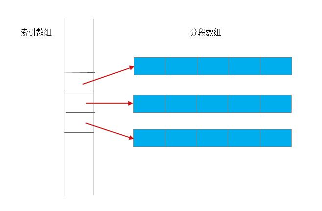
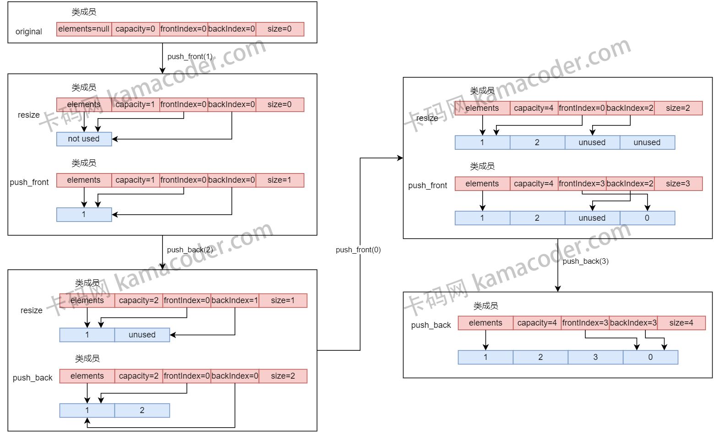

# deque
deque 是STL里的一种`双端队列结构`, 它支持在两端添加和删除元素.

## deque 的特性
- 双端操作:
  - deque 支持在前端和后端执行快速插入和删除操作, 适用于经常需要**在前后两端增删元素的场景**.

- 随机访问:
  - deque 支持常量时间内的随机访问, 即`支持使用元素下标直接访问元素, 并且时间复杂度为 O(1)`.
    - deque 能支持随机访问是因为内部使用了`分段数组`, 每个分段都是一个固定大小的数组, 因此**可以直接计算索引的位置, 而不需要遍历整个容器**. 
      - 虽然 deque 允许常量时间内进行随机访问, 但与`std::vector`相比, `std::deque`在访问元素时可能涉及更多的间接层次, 因此, **在某些情况下 vector 的性能可能会更优秀一些**.
    - list 的内部实现是链表, 因此使用元素下标访问时需要使用迭代器遍历, 时间复杂是 `O(n)`

    ```cpp
    #include <iostream>
    #include <deque>
    using namespace std;

    int main(void)
    {
        std::deque<int> myDeque = {1, 2, 3, 4, 5};

        // 随机访问的时间复杂为 O(1)
        cout << "Element at index 2: " << myDeque[2] << endl;
        cout << "Element at index 4: " << myDeque[4] << endl;

        return 0;
    }
    ```


- 动态扩展:
  - deque 的大小可以动态调整, 无需事先分配固定大小的内存.
  - deque 适用于需要动态增长和缩小的情况.

- 保持迭代器有效性
  - deque 在进行插入和删除操作时, 能更好地**保持迭代器的有效性**. 进行增删元素之后, 不会导致所有迭代器失效.

- 内存局部性:
  - deque 内部结构利用了**多个缓冲区**, 有助于提高内存局部性, 从而在某些情况下提供更好的性能.

## STL 中 deque 的使用方法

```cpp
// 包含头文件
#include <deque>   

// 声明一个 deque 对象
std::deque<int> myDeque;

// 使用 push_front 和 push_back 在前、后端插入元素
myDeque.push_front(1);
myDeque.push_back(2);

// 使用 pop_front 和 pop_back 从 deque 的前、后端删除元素
myDeque.pop_front();
myDeque.pop_back();
```

## deque 的工作原理
STL 中的 deque (双端队列) 规定了接口和时间复杂度, 但**没有规定特定的实现细节**. C++ 标准描述了每个容器的行为和性能要求, 具体实现留给了实现者. 

下面是 `std::deque` 内部的实现原理图:

- 双端队列的数据被表示为一个分段数组，容器中的元素分段存放在`一个个大小固定的数组中`，此外容器还需要**维护一个存放这些数组首地址的索引数组**.
- 由于分段数组的大小是固定的，并且它们的首地址被连续存放在索引数组中，因此**可以对其进行随机访问，但效率比vector低很多**。

- 向两端加入新元素时:
  - 如果这一端的分段数组未满，则可以直接加入； 
  - 如果这一端的分段数组已满，只需**创建新的分段数组，并把该分段数组的地址加入到索引数组中即可**。
  - 无论哪种情况，都**不需要对已有元素进行移动**，因此在双端队列的两端加入新的元素都具有较高的效率。

- 当删除双端队列容器两端的元素时，由于**不需要发生元素的移动**，效率也是非常高的。

- 双端队列`中间`插入元素时，需要将插入点到某一端之间的所有元素向容器的这一端移动 (总而言之就是需要搬数据)，因此向中间插入元素效率较低，而且往往插入位置**越靠近中间，效率越低**。
- 删除队列中元素时，情况也类似，由于被删元素到某一端之间的所有元素都要向中间移动，删除的位置**越靠近中间，效率越低**。

注意： 
- 在`除了首尾两端`的**其他地方**插入和删除元素，都将会导致指向 deque 元素的`任何pointers`、`references`、`iterators`失效。不过，**deque的内存重分配优于 vector**，因为其内部结构显示不需要复制所有元素。

---


这里介绍的只是一种简单的实现方法:
- 定义一个模板类, 内部使用`循环数组`来模拟双端队列.

### 总体思路
数据结构：
- elements: 动态数组存储队列元素
- capacity: 数组容量
- size: 数组长度(已使用的容量)
- frontIndex 和 backIndex : 分别指向队列的前端和后端元素。
  > 注意: 
    >> 此处的 frontIndex 和 backIndex **类似标准STL中的 begin 和 end** 
    >> frontIndex 位置指向的数据是已存在的 (除了deque为空的情况), 
    >> backIndex 指向的位置是**当前末尾元素的下一个位置**, 也就是**还没有有效的数据** (**如果容量满了, 其会指向frontIndex的位置**)
- 循环数组：通过模运算来实现数组的循环效果，使得队列可以在数组的任意一端进行插入和删除操作, 因为**索引越界后直接取模从另一端开始就可以了**。
- 动态调整大小：当数组达到容量限制时，**会自动扩展容量（加倍扩展）**，并**将所有现有元素复制到新的更大的数组**中。
- 索引计算：利用**模运算**来正确计算新的 frontIndex 和 backIndex，无论是添加或删除操作。

图示- 前后位置插入元素:

- 无论是 `push_front` 还是 `push_back`, 都需要判断当前数组是否已满, 已满的话就申请一块新的内存, 大小为原来的2倍, 然后将原来的数组元素拷贝到新的数组中.
- push_front 需要将 frontIndex 自减之后, 在 frontIndex 位置插入;
  - **frontIndex 自减步骤中, 自减后需要 加上 capacity**, 然后对 capacity 取模, 这可以保证当 frontIndex 自减为负时, 计算后将指向数组末尾.
- push_back 直接在 index_back 位置插入, 然后将 backIndex 自增, 然后对 capacity 取模
  -  取模这一步确保了如果自增后的 backIndex 越界的话, 就会指向数组开始的位置.


--- 
# 实现 deque

```cpp
#include <iostream>
#include <stdexcept>
#include <algorithm>
#include <sstream>
#include <string>

template <typename T>
class Deque
{
private:  // 定义内部用于控制状态的成员
    T* elements;      // 动态数组指针
    size_t capacity;  // 动态数组总容量
    size_t size;      // 动态数组中元素的个数
    size_t frontIndex; // 前端 index
    size_t backIndex;  // 末尾 index

public:
    // 构造函数
    Deque() : elements(nullptr), capacity(0), size(0), frontIndex(0), backIndex(0) {}

    // 析构函数
    ~Deque()
    {
        clear();             // 逐一清空元素, 注意这里不负责释放数组元素指针
        delete[] elements;   // 释放动态数组指针
    }

    // 清空 deque 元素, 注意动态数组指针还在
    void clear()
    {
        while(size > 0){
            pop_front();
        }
    }

    // deque 前端插入元素
    void push_front(const T& value)
    {
        // 判断数组是否已满
        if(size == capacity){
            resize();           // 扩容 + 搬数据 + 更新所有deque的状态成员
        }

        // 计算前端 index
        frontIndex = (frontIndex - 1 + capacity) % capacity; // 加 capacity 后取模, 防止出现负数

        // 放入新元素
        elements[frontIndex] = value;

        ++size;
    }

    // deque 末尾插入元素
    void push_back(T& value)
    {
        // 检查容量
        if(size == capacity){
            resize();
        }

        // 先插入新元素 (因为 backIndex 本身就指向能直接插入元素的未使用位置)
        elements[backIndex] = value;

        // 计算末尾 index
        backIndex = (backIndex + 1) % capacity;  // 取模, 防止越界

        ++size;
    }

    // 从 deque 的前端移除元素
    void pop_front()
    {
        // 判断是否为空
        if(size == 0){
            throw std::out_of_range("Deque is empty");
        }

        // 删除元素并不需要释放空间, 只需要修改 index 即可, 后面进来的新元素会覆盖旧的
        frontIndex = (frontIndex + 1) % capacity;  // 取模, 防止越界

        --size;
    }

    // 从 deque 末尾移除元素
    void pop_back()
    {
        // 判断是否为空
        if(size == 0){
            throw std::out_of_range("Deque is empty");
        }

        // 删除元素并不需要释放空间, 只需要修改 index 即可, 后面进来的新元素会覆盖旧的
        backIndex = (backIndex - 1 + capacity) % capacity; // 防止出现负数

        --size;
    }

    // 随机访问元素
    T& operator[](int index)
    {
        if(index < 0 || index >= size){
            throw std::out_of_range("Index out of range");
        }
        return elements[(frontIndex + index) % capacity];  // 注意取元素得从 frontIndex 开始计算, 取模防止越界
    }

    // 获取元素数量
    size_t getSize() const
    {
        return size;
    }

    void printElements() const
    {
        size_t index =frontIndex;
        for(size_t i = 0; i < size; ++i){
            std::cout << elements[index] << " ";
        }
        std::cout << std::endl;
    }

private:
    // 调整容量
    void resize()
    {
        // 计算新容量大小
        size_t newCapacity = (capacity == 0) ? 1 : 2 * capacity;

        // 创建新数组
        T* newElements = new T[newCapacity];

        // 复制旧元素
        size_t index = frontIndex;         // index 是旧数组下标
        for(size_t i = 0; i < size; ++i){  // i 是新数组下标
            newElements[i] = elements[index];
            index = (index + 1) % capacity; // 更新 & 防止越界
        }

        // 释放旧数组
        delete[] elements;

        elements = newElements; // 更新数组指针
        capacity = newCapacity; // 更新容量
        frontIndex = 0;         // 对于新数组而言, 0 就是开头
        backIndex = size;       // size 刚好指向数组末端有效元素的下一个位置
    }
};

```

测试函数:
```cpp
int main() {
        // 创建一个 Deque 对象
    Deque<int> myDeque;

    int N;
    std::cin >> N;
    // 读走回车
    getchar();
    std::string line;
    // 接收命令
    for (int i = 0; i < N; i++) {
        std::getline(std::cin, line);
        std::istringstream iss(line);
        std::string command;
        iss >> command;
        int value;

        if (command == "push_back") {
            iss >> value;
            myDeque.push_back(value);
        }

        if (command == "push_front") {
            iss >> value;
            myDeque.push_front(value);
        }

        if (command == "pop_back") {
            if (myDeque.getSize() == 0) {
                continue;
            }
            myDeque.pop_back();
        }

        if (command == "pop_front") {
            if (myDeque.getSize() == 0) {
                continue;
            }
            myDeque.pop_front();
        }

        if (command == "clear") {
            myDeque.clear();
        }

        if (command == "size") {
            std::cout << myDeque.getSize() << std::endl;
        }

        if (command == "get") {
            iss >> value;
            std::cout << myDeque[value] << std::endl;
        }

        if (command == "print") {
            if (myDeque.getSize() == 0) {
                std::cout << "empty" << std::endl;
            } else {
                myDeque.printElements();
            }
        }
    }
    return 0;
}
```

测试用例:
```txt
输入:

15
push_back 20
push_back 10
push_front 30
push_front 40
size
print
pop_back
print
pop_front
print
size
get 1
clear
print
size


--- 
输出:

4
40 40 40 40 
40 40 40 
30 30 
2
20
empty
0
```


----
值得特别注意的成员函数 -- resize:
```cpp
void resize() {
    // 计算新的容量
    size_t newCapacity = (capacity == 0) ? 1 : capacity * 2;

    // 创建新的数组
    T* newElements = new T[newCapacity];

    // 复制元素到新数组
    size_t index = frontIndex;
    for (size_t i = 0; i < size; ++i) {
        newElements[i] = elements[index];
        index = (index + 1) % capacity;
    }

    // 释放旧数组的内存
    delete[] elements;

    // 更新成员变量
    elements = newElements;
    capacity = newCapacity;
    frontIndex = 0;
    backIndex = size;
}
```
- 当数组容量不足以容纳更多元素时，创建一个新的数组，将现有元素复制到新数组中，释放旧数组，并更新相关成员变量。需要注意的是, 原来的数组中, 逻辑上索引为0的位置 (也就是frontIndex) **并不一定存储在数组实际上的0索引处**, 但resize后将逻辑索引和实际索引都统一起来。


对于上面的这种实现方式:
- 这个实现并**没有提供迭代器**，也没有实现一些可能有用的函数，比如 front、back、empty 和构造函数以支持自定义初始容量。
- 此外，resize 函数在**复制元素时是线性的**，但由于使用了二倍增长策略，push_front 和 push_back 操作的**均摊复杂度仍然是常数**。


## 这里的实现版本与 C++ STL 标准库实现版本的区别
- 数据结构
  - 标准库中的 `std::deque` (双端队列) 通常是**一个或者多个连续存储区域** (即一堆数组) 来实现的, 而不是像这里的单个连续的数组. STL 中, 多个一维数组连起来才组成了 deque 数组, **这里的实现**采用的是 `循环数组`, 缺点是 `resize` 时需要复制旧数组, 而官方的 `std::deque`**只需要再串联一个一维数组就可以了**, 效率更高. 
    - 这里提供的实现的优点:
      - 不需要 resize 时, 性能好
      - 实现逻辑简单

- 内存管理
  - 在实际的 STL 中, 内存管理通常会更加复杂和高效. **STL 会使用分配器(allocator) 来分配内存**, 而**不是直接使用 new 和 delete**. 分配器允许用户提供**自定义的内存管理策略**.

- 异常安全性
  - 实际 STL 通常会考虑异常安全性. 
  - 在这里的实现中，如果 pop_front 或 pop_back 操作遇到空的 Deque，它会抛出异常。在 STL 中，许多操作都设计成具有一定的异常安全性，以确保在发生异常时不会导致资源泄漏。
- 迭代器和算法支持:
  - STL 提供了丰富的迭代器和算法支持, 允许通用的方式操作容器. 这里的实现中, 尽管提供了基本的迭代器, 但没有涉及 STL 中的迭代器范围(range)和算法.

- 性能优化:
  - 实际的 STL 库通常会进行更多性能优化, 包括使用复杂的数据结构、考虑缓存友好性等。此外， STL 容器和算法通常会根据使用情况自动选择.

- 标准兼容性
  - STL 遵循 C++ 标准, 确保在不同平台和编译器上的一致行为. 它还提供许多其他功能, 如分配器的定义、迭代标签（iterator tags）等，以满足 C++标准的要求.


# 经典面试题

## deque 和 vector 的主要区别是什么?
- 内存分配
  - vector 使用的是**单一的连续内存空间**来存储元素, deque 使用的是**多个分散的内存块(每一内存块也是连续的)**, 这意味着 deque 可以在两端进行高效的插入和删除操作, 而 vector 只能在尾部高效地进行这种操作.
- 插入效率
  - deque 的前端和后端插入或删除元素的操作效率很高, 但在中间插入或删除元素的效率较低, 因为它需要移动多个内存块中的元素. 
  - vector 在尾部插入和删除的操作效率都很高, 但在前端或中间进行这些操作的效率较低, 因为可能要移动大量元素.
- 随机访问
  - vector 提供了较快的随机访问性能, 因为它的数据区域是一整块连续的内存空间, 而 deque 由于用了多个连续内存块, 随机访问的性能会稍微低一些.
- 内存耗费:
  - vector 在扩展时可能有较大的内存重新分配成本, 而 deque 由于分块存储, 所以通常不需要大量的内存重新分配.

---

## 可以用 deque 实现一个固定大小的滑动窗口吗? 如果可以, 怎么实现?
回答是: `可以`

比如下面这个函数, 这个函数接受一个整数数组 nums 和**一个整数 k 作为窗口大小**，然后**打印出每次滑动窗口中的最大值**。
```cpp
#include <iostream>
#include <vector>
#include <deque>

using namespace std;

void slidingWindowMaximum(const std::vector<int>& nums, int k)
{   
    // 用 deque 定义一个窗口, 窗口中存放的是数组的下标
    // 窗口里的元素按照 "从大到小" 的顺序排列
    std::deque<int> window; 
    for (size_t i = 0; i < nums.size(); ++i){
        // 调整窗口大小: 移除窗口左边界之外的元素
        if(!window.empty() && window.front() == i - k){
            window.pop_front();
        }

        // 保持 deque 的递减顺序
        // 注意这里调整窗口大小的时候可能会使窗口为空 
        while (!window.empty() &&
                nums[i] > nums[window.back()]){
            window.pop_back();
        }

        // 添加当前元素的索引
        window.push_back(i);  // 注意在末尾插入元素一般来说更安全, 它不会引起迭代器/引用/指针的失效.

        // 输出窗口的最大值 (只有遍历的元素数量达到了窗口大小才会输出)
        if(i >= k-1){
            std::cout << nums[window.front()] << " ";
        }
    }
    std::cout << std::endl;
}
```
- 这里需要注意的是, 窗口内的元素并不一定时时刻刻都装满, 但是窗口内的元素一定能满足 "输出大小为 k 的窗口里的最大值" 这个需求.

---

## 在 deque 的前端插入元素时, 会发生什么?

插入和删除操作
- 头部插入（push_front）： 在 deque 的头部插入新元素时，如果当前头部块已满，deque 会分配一个新的块并将其连接到指针数组的前面。这种情况下，**不会导致所有**的迭代器、指针、引用失效，但指向头部的迭代器、指针、引用可能会失效。
- 尾部插入（push_back）： 类似地，在尾部插入新元素时，如果当前尾部块已满，deque 会分配一个新的块并将其连接到指针数组的后面。这**也不会导致所有**的迭代器、指针、引用失效，但指向尾部的迭代器、指针、引用可能会失效。

迭代器、指针和引用的有效性
- 头部操作：在头部插入或删除元素时，指向头部的迭代器、指针、引用可能会失效，但不会影响指向其他部分的迭代器、指针、引用。
- 尾部操作：在尾部插入或删除元素时，指向尾部的迭代器、指针、引用可能会失效，但不会影响指向其他部分的迭代器、指针、引用。
- 中间插入/删除：如果在中间插入或删除元素，则**所有指向该元素之后**的迭代器、指针、引用可能会失效。
  - 前面的deque工作原理中的图片中有提到, deque本质上是一个`二层结构`, 它一共有两层实现, 第一层是一个保存着分段数组头指针的结构 (也是一个数组), 第二层才是各个分段数组, 那么, 当中间位置插入新元素的时候, 如果需要分配一个新的数组块来存放新元素, 那么此时新数组块的指针将插入到`第一层指针数组`的相应位置, 此时, 插入位置后面的元素所对应的数组指针**在第一层指针数组里的位置将发生改变**, 导致迭代器可能失效.

总的来说，deque 的设计使得在头部和尾部进行插入和删除操作相对高效，但这些操作可能会影响部分迭代器、指针和引用的有效性。

```cpp
#include <iostream>
#include <deque>

int main() {
    std::deque<int> mydeque = {1, 2, 3, 4, 5};
    std::deque<int>::iterator it = mydeque.begin();

    std::cout << "Before insertion, first element: " << *it << std::endl;

    // 在前端插入一个元素
    mydeque.push_front(0);

    // 迭代器 it 现在失效了，不能再安全地使用
    // std::cout << "After insertion, first element: " << *it << std::endl; // 这行代码会导致未定义行为

    // 正确的做法是重新获取迭代器
    it = mydeque.begin();
    std::cout << "After insertion, first element: " << *it << std::endl;

    return 0;
}
```

---

## 在 deque 中使用 [ ] 操作符和 at( ) 方法有何区别？
答案:
- operator[] 提供对元素的`无检查访问`，这意味着如果使用超出范围的索引，**它不会抛出异常，而是导致未定义行为**。
- at() 方法提供`边界检查的访问`。如果指定的索引超出了 deque 的范围，at() 方法**会抛出一个 std::out_of_range 异常**。因此，at() 比 operator[] 更安全，但可能会略微降低性能。

> 使用 `at()`方法可以帮助调试中发现越界错误，而 `operator[]` 在确定不会越界时可以提供更好的性能.

---

## 解释 deque 的内部工作机制。它是如何实现两端插入和删除操作的高效性的？

答案: std::deque 维护了**一系列定长数组（称为块或缓冲区）**，并且有一个`中央控制器`（通常是**指针数组**）来管理这些块。每个块可以独立地增长和收缩，这意味着当在两端添加或删除元素时，只有相关联的块受到影响。

在前端插入：如果第一个块有空间，则在该块的开始插入新元素。如果没有空间，deque 会分配一个新块并将其链接到现有的块序列中。
在后端插入：如果最后一个块有空间，则在该块的末尾插入新元素。如果没有空间，deque 会分配一个新块并将其链接到现有的块序列中。
在前端删除：移除第一个块的第一个元素。**如果该块变空，则释放该块资源并更新中央控制器**。
在后端删除：移除最后一个块的最后一个元素。**如果该块变空，则释放该块资源并更新中央控制器**。
通过这种方式，deque 可以在两端进行高效的插入和删除操作，而不需要移动除了操作点之外的其他元素，这在 vector 中是必须的。

## deque 有多少种构造函数，它们分别是用来做什么的？
1. 默认构造函数
   ```cpp
    std::deque<int> dq;  // 创建空的deque
   ```
2. 填充构造函数
   ```cpp
   std::deque<int> dq(10, 5); // 10个元素, 每个元素都是5
   ```
   - 创建一个包含给定数量元素的 deque，每个元素都是拷贝自给定的初始值 
3. 范围构造函数
   ```cpp
    std::vector<int> vec{1, 2, 3, 4, 5};
    std::deque<int> dq(vec.begin(), vec.end());
   ```
   - 使用`两个迭代器作为参数`，创建一个新的 deque，复制给定迭代器范围内的元素
4. 拷贝构造函数
   ```cpp
    std::deque<int> dq1(10, 5);
    std::deque<int>de2(dq1);    // 拷贝dq1
   ```
   - 创建一个新的 deque，为另一个 deque 的拷贝 (逐元素复制的深拷贝)。
5. 移动构造函数 (C++11 引入)
    ```cpp
    std::deque<int> dq1(10, 5);
    std::deque<int> dq2(std::move(dq1));  // 移动dq1
    ```
6. 初始化列表构造函数(C++11引入)
   ```cpp
   std::deque<int> dq{1,2,3,4,5};
   ```
7. 带有分配器的默认构造函数
    ```cpp
    std::allocator<int> alloc; // 可以换成完全自定义的而非STL提供的分配器
    std::deque<int, std::allocator<int>> dq(alloc);  // 可以换成完全自定义的而非STL提供的分配器
    ```
    - 使用了指定的分配器 ( 这里的`std::allocator<int>` 可以换成自定定义的分配器) 来创建一个空的 deque, 之后在使用这的 deque 的时候将采用自定义的内存分配策略.
8. 带有分配器的填充构造函数
   ```cpp
    std::allocator<int> alloc; // 可以换成完全自定义的而非STL提供的分配器
    std::deque<int, std::allocator<int>> dq(10, 5, alloc);  // 可以换成完全自定义的而非STL提供的分配器
   ```
9.  带有分配器的范围构造函数
    ```cpp
    std::vector<int> vec{1,2,3,4,5};
    std::allocator<int> alloc;      // 可以换成完全自定义的而非STL提供的分配器
    std::deque<int, std::allocator<int>> dq(vec.begin(), vec.end(), alloc);  // 可以换成完全自定义的而非STL提供的分配器
    ```
10. 带有分配器的拷贝构造函数
    ```cpp
    std::deque<int> dq1(10, 5);
    std::allocator<int> alloc;      // 可以换成完全自定义的而非STL提供的分配器
    std::deque<int, std::allocator<int>> dq2(dq1, alloc);  // 可以换成完全自定义的而非STL提供的分配器
    ```
11. 带有分配器的移动构造函数
    ```cpp
    std::deque<int> dq1(10, 5);
    std::allocator<int> alloc; // 可以换成完全自定义的而非STL提供的分配器
    std::deque<int, std::allocator<int>> dq2(std::move(dq1), alloc);  // 可以换成完全自定义的而非STL提供的分配器
    ```

12. 带有分配器的初始化列表构造函数(C++引入)
    ```cpp
    std::allocator<int> alloc;
    std::deque<int, std::allocator<int>> dq({1,2,3,4,5}, alloc);
    ```


另: 
下面是一个完全自定义的分配器例子 (GPT4生成):
```cpp
#include <iostream>
#include <deque>
#include <memory>

// 自定义分配器
template <typename T>
class CustomAllocator {
public:
    using value_type = T;

    CustomAllocator() = default;

    template <typename U>
    constexpr CustomAllocator(const CustomAllocator<U>&) noexcept {}

    T* allocate(std::size_t n) {
        std::cout << "Allocating " << n << " elements" << std::endl;
        return static_cast<T*>(::operator new(n * sizeof(T)));
    }

    void deallocate(T* p, std::size_t n) noexcept {
        std::cout << "Deallocating " << n << " elements" << std::endl;
        ::operator delete(p);
    }

    template <typename U, typename ...Args>
    void construct(U* p, Args&& ...args) {
        std::cout << "Constructing element" << std::endl;
        new(p) U(std::forward<Args>(args)...);
    }

    template <typename U>
    void destroy(U* p) noexcept {
        std::cout << "Destroying element" << std::endl;
        p->~U();
    }
};

template <typename T, typename U>
bool operator==(const CustomAllocator<T>&, const CustomAllocator<U>&) { return true; }

template <typename T, typename U>
bool operator!=(const CustomAllocator<T>&, const CustomAllocator<U>&) { return false; }

int main() {
    // 使用自定义分配器创建 deque
    std::deque<int, CustomAllocator<int>> dq(10, 5);  // 注意这里的分配类型名称也要写成自定义的

    // 打印 deque 的内容
    for (const auto& elem : dq) {
        std::cout << elem << " ";
    }
    std::cout << std::endl;

    return 0;
}
```

代码解释
```txt
1.	CustomAllocator 类：
	•	value_type：定义分配器管理的值类型。
	•	allocate：分配内存，用于存储 n 个 T 类型的元素。
	•	deallocate：释放内存。
	•	construct：在已分配的内存上构造元素。
	•	destroy：销毁元素并调用其析构函数。
2.	main 函数：
	•	使用 CustomAllocator<int> 创建一个 std::deque<int, CustomAllocator<int>> 对象。
	•	初始化 deque，并填充 10 个值为 5 的元素。
	•	打印 deque 的内容。

另外:
    ::operator 是一种全局作用域的操作符，通常用于调用全局的 new 和 delete 操作符，特别是在自定义分配器中。下面是对这种用法的详细解释：
        ::operator new 和 ::operator delete
            ::operator new：调用全局 new 操作符，从自由存储（堆）分配内存。
            ::operator delete：调用全局 delete 操作符，释放从自由存储分配的内存。

使用全局作用域操作符的原因
    在自定义分配器中使用 ::operator new 和 ::operator delete 确保调用的是全局的内存分配和释放操作，而不是类或其他作用域中重载的 new 和 delete。
    这样做是为了避免潜在的命名冲突和确保正确的内存管理行为。
```
