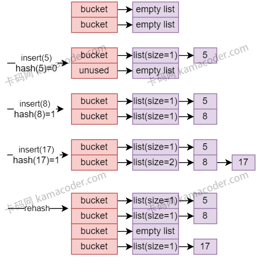

# 哈希表 (HashTable)

哈希表是STL中非常重要的底层结构, 诸如 `unordered_set`, `unordered_map`等无序关联容器的内部都是基于哈希表实现的.

这里主要用一个简单的哈希表实现来讲述`哈希表`, `哈希冲突`, `迭代器`, `性能优化`等方面的问题.

## 哈希表原理分析
1. 哈希表基础知识
    > 哈希表是一种`通过哈希函数将 键(key) 映射为 索引(index) 的数据结构`. 
    
    > 哈希函数负责将任意大小的输入映射到固定大小的输出, 即哈希值. 哈希值用作数组中关联 key-value 的索引.

2. 哈希冲突
    > 由于哈希函数的映射不是一对一的, 可能会`存在两个不同的key映射为同一个index的情况`, 这就是哈希冲突.

    > 哈希冲突可以使用`链地址法`来解决, 即在哈希表的每一个 bucket 中维护一个链表, 将哈希值相同的元素存储在同一个 bucket 的链表中.

3. 哈希表的扩容与 **rehashing**
   > 为了避免哈希表中链表过长导致的性能下降, 通常会在需要时对哈希表进行扩容.

   > 扩容的过程涉及`重新计算所有元素的哈希值`, 并将他们分布到新的更大的哈希表中. 这个过程就称为**rehashing**.

4. 性能优化
   > 为了提高性能, 哈希表的实现通常包含一系列优化策略, 比如: 使用`二次哈希函数`, `空间配置器`, `内存池`等等, 以减少内存分配的开销, 提高访问速度.

5. 并发性与多线程安全性
    > 在多线程环境中, 确保数据结构的正确性至关重要.
    
    > 多线程哈希表的视线通常需要考虑并发性和多线程安全性, 通过`锁`或者其他机制来保护共享的数据结构.

    - 下图是一个哈希表的插入元素的例子:
    
      - 上述过程中, 假设每个bucket链表长度大于1就开始rehash
      - 可以看到, 每个bucket用一个链表来存储重复的元素, 如8和17


# HashTable 的简单实现

这里的简单版本没有STL中的那么复杂和高效, 只包含很常用的基本功能, 包括`插入`, `删除`, `查找`, `打印`, `集合大小`等.


```cpp
#include <iostream>
#include <algorithm>
#include <functional>
#include <cstddef>
#include <list>     // 解决哈希冲突用到链表
#include <utility>
#include <vector>
#include <sstream>
#include <string>

// 三个泛型: Key, Value, Hash
template <typename Key, typename Value, typename Hash = std::hash<Key>>  
class HashTable
{
private:
    class HashNode
    {
    public:
        Key key;
        Value value;

        // 从Key构造节点, Value使用默认构造
        explicit HashNode(const Key &key) : key(key), value() {}

        // 从Key和Value构造节点
        HashNode(const Key &key, const Value &value) : key(key), value(value) {}

        // 比较运算符重载, 只按照key进行比较
        bool operator==(const HashNode &other) const { return key == other.key; }

        bool operator!=(const HashNode &other) const { return key != other.key; }

        bool operator<(const HashNode &other) const { return key < other.key; }

        bool operator>(const HashNode &other) const { return key > other.key; }
        
        bool operator==(const Key &key_) const { return key == key_; }

        void print() const
        {
            std::cout << key << " " << value << " ";
        }
    };

private:
    using Bucket = std::list<HashNode>;  // 指定桶的类型为 "存储key的链表"
    std::vector<Bucket> buckets;         // 存储所有桶的动态数组
    Hash hashFunction;                   // 哈希函数对象 (这里用的是标准库自带的哈希函数)
    size_t tableSize;                    // 哈希表大小 (桶的大小)
    size_t numElements;                   // 哈希表中元素的数量 (key-value pair的数量)

    float maxLoadFactor = 0.75;                 // 默认的最大负载因子
    
    // 计算key的哈希值, 并将其映射到桶的索引
    size_t hash(const Key &key) const { return hashFunction(key) % tableSize; }   // 先用哈希函数计算一个映射值, 然后用tableSize换算到对应的bucket

    // 当元素数量超过最大负载因子定义的容量时, 增加桶的数量并重新分配所有的key
    void rehash(size_t newSize)
    {
        std::vector<Bucket> newBucket(newSize);     // 创建新的桶数组

        // 搬移旧数据
        for (Bucket & bucket : buckets){            // 遍历旧桶
            for (HashNode &hashNode : bucket){      // 遍历桶里的每一个 key
                size_t newIndex = hashFunction(hashNode.key) % newSize;
                newBucket[newIndex].push_back(hashNode);
            }
        }
        buckets = std::move(newBucket);            // 移动语义, 更新桶数组
        tableSize = newSize;                        // 更新大小
    }

public:
    // 构造函数初始化哈希表
    HashTable(size_t size = 10, const Hash &hashFunc = Hash()) 
                : buckets(size), hashFunction(hashFunc), tableSize(size), numElements(0) {}

    // 插入新的 key-value 到哈希表
    void insert(const Key &key, const Value &value)
    {
        if((numElements + 1) > maxLoadFactor * tableSize){  // 判断是否需要rehash
            // 处理 clear 后再次插入元素时 tableSize 为 0 的场景, 否则下面的rehash可能并没有扩容
            if(tableSize == 0) tableSize = 1;
        
            rehash(tableSize * 2);                  // rehash, 桶的数量翻倍 
        }

        size_t index = hash(key);                       // 计算新key的index
        std::list<HashNode> &bucket = buckets[index];   // 获取对应的桶 (桶在这里就是指一个链表, 获取的是链表头)

        // 如果key不在桶里, 则添加到桶中
        if (std::find(bucket.begin(), bucket.end(), key) == bucket.end()){  // 找到迭代器末尾都没找到key
            bucket.push_back(HashNode(key, value));  
            ++numElements;
        }
    }

    void insertKey(const Key &key) { insert(key, Value{}); }    // value是空的, 用Value的默认构造初始化了一个值塞进去

    // 删除哈希表中指定的key
    void erase(const Key &key)
    {
        size_t index = hash(key);
        auto &bucket = buckets[index];  // 获取桶的引用, 注意是引用类型.
        auto it = std::find(bucket.begin(), bucket.end(), key);  // 在指定的桶里查找key的位置
        if(it != bucket.end()){         // 找到key, 进行删除操作
            bucket.erase(it);           // bucket本质上是一个vector, 删除的时候用erase比较安全
            numElements--;
        }
    }

    // 查找键是否存在于哈希表中, 找到的话就返回 Value 的指针, 没找到返回 nullptr
    Value *find(const Key &key)
    {
        size_t index = hash(key);
        auto &bucket = buckets[index];  // 获取桶的引用, 注意是引用类型.
        auto ans = std::find(bucket.begin(), bucket.end(), key);  // 在指定的桶里查找key的位置, 
        if(ans != bucket.end()){
            return &ans->value;         // ans 的具体类型是一个迭代器, 并且是 HashNode 类型
        }
        return nullptr;
    }

    size_t size() const { return numElements; }

    // 打印哈希表中的所有元素
    void print() const
    {
        for (size_t i = 0; i < buckets.size(); ++i){        // 遍历所有的桶 (每一个桶里都是链表, 链表的节点是 HashNode 类型)
            for (const HashNode &element : buckets[i]){     // 遍历桶(链表)里的每一个节点
                element.print();
            }
        }
        std::cout << std::endl;
    }

    void clear()
    {
        this->buckets.clear();          // 清空桶, 桶的类型是 std::vector<HashNode>
        this->numElements = 0;
        this->tableSize = 0;
    }
};


// 用来测试的主函数
int main() {
  // 创建一个哈希表实例
  HashTable<int, int> hashTable;

  int N;
  std::cin >> N;
  getchar();

  std::string line;
  for (int i = 0; i < N; i++) {
      std::getline(std::cin, line);
      std::istringstream iss(line);
      std::string command;
      iss >> command;
      
      int key;
      int value;

      if (command == "insert") {
          iss >> key >> value;
          hashTable.insert(key, value);
      }

      if (command == "erase") {
          if (hashTable.size() == 0) {
              continue;
          }
          iss >> key;
          hashTable.erase(key);
      }

      if (command == "find") {
          if (hashTable.size() == 0) {
              std::cout << "not exist" << std::endl;
              continue;
          }
          iss >> key;
          int* res = hashTable.find(key);
          if (res != nullptr) {
              std::cout << *res << std::endl;
          } else {
              std::cout << "not exist" << std::endl;
          }
      }

      if (command == "print") {
          if (hashTable.size() == 0) {
              std::cout << "empty" << std::endl;
          } else {
              hashTable.print();
          }
      }

      if (command == "size") {
          std::cout << hashTable.size() << std::endl;
      }

      if (command == "clear") {
          hashTable.clear();
      }
  }
  return 0;
}
```
- bucket: 桶, 在代码中是一个链表, 链表的节点为自定义的 `HashNode`.


在这个哈希表的实现中，冲突解决是通过`链地址法`（使用桶里的链表）来实现的。当一个键的哈希值映射到一个已经有其他键存在的桶时，这个键会被加入到桶对应的链表中。

需要注意的是，在 HashTable 的构造函数中，**buckets 数组被初始化为 size 长度两次，一次是在成员初始化列表中，另一次是在构造函数体中**。

## 值得注意的成员函数
rehash 方法:
```cpp
void rehash(size_t newSize) 
{
    std::vector<Bucket> newBuckets(newSize); // 创建新的桶数组

    for (Bucket &bucket : buckets) {      // 遍历旧桶
    for (HashNode &hashNode : bucket) {   // 遍历桶中的每个键
        size_t newIndex =
            hashFunction(hashNode.key) % newSize; // 为键计算新的索引
        newBuckets[newIndex].push_back(hashNode); // 将键添加到新桶中
    }
    }
    buckets = std::move(newBuckets); // 使用移动语义更新桶数组
    tableSize = newSize;             // 更新哈希表大小
}
```
> 当哈希表的负载因子超过预设的最大负载因子时，会调用这个私有成员函数来重新分配和初始化一个更大的桶数组，并重新将所有的键映射到新的桶中。这个过程称为重哈希（rehashing）。新桶的数量通常是当前桶数量的两倍。

insert 方法:
```cpp
void insert(const Key &key, const Value &value) 
{
    if ((numElements + 1) > maxLoadFactor * tableSize) { // 检查是否需要重哈希
    // 处理 clear 后再次插入元素时 tableSize = 0 的情况
    if (tableSize == 0) tableSize = 1;
    rehash(tableSize * 2); // 重哈希，桶数量翻倍
    }
    size_t index = hash(key);                     // 计算键的索引
    std::list<HashNode> &bucket = buckets[index]; // 获取对应的桶
    // 如果键不在桶中，则添加到桶中
    if (std::find(bucket.begin(), bucket.end(), key) == bucket.end()) {
    bucket.push_back(HashNode(key, value));
    ++numElements; // 增加元素数量
    }
}
```
> 首先检查是否需要重哈希，如果需要，则进行重哈希。
> 然后，它计算键的哈希值以找到对应的桶，如果键还不存在于桶中，则将其添加到桶的末尾，并增加元素计数。


erase 方法:
```cpp
void erase(const Key &key) 
{
    size_t index = hash(key);      // 计算键的索引
    auto &bucket = buckets[index]; // 获取对应的桶
    auto it = std::find(bucket.begin(), bucket.end(), key); // 查找键
    if (it != bucket.end()) {                               // 如果找到键
    bucket.erase(it);   // 从桶中移除键, 这里使用的是 vector 容器里的 erase()
      numElements--;    // 减少元素数量
    }
}
```
> 它计算键的哈希值，找到对应的桶，并在桶中遍历查找该键。找到后删除该键，并减少元素计数。


find 方法:
```cpp
Value *find(const Key &key) {
    size_t index = hash(key);      // 计算键的索引
    auto &bucket = buckets[index]; // 获取对应的桶 (引用类型)
    // 返回键是否在桶中
    auto ans = std::find(bucket.begin(), bucket.end(), key);
    if (ans != bucket.end()) {
    return &ans->value;             // 注意返回类型是 Value 指针
    };
    return nullptr;
}
```
> 这个方法用于查找一个键是否存在于哈希表中。
>> 它计算键的哈希值，找到对应的桶，然后在桶中使用 std::find() 查找该键。如果找到，则返回指针，否则返回空指针。

---


