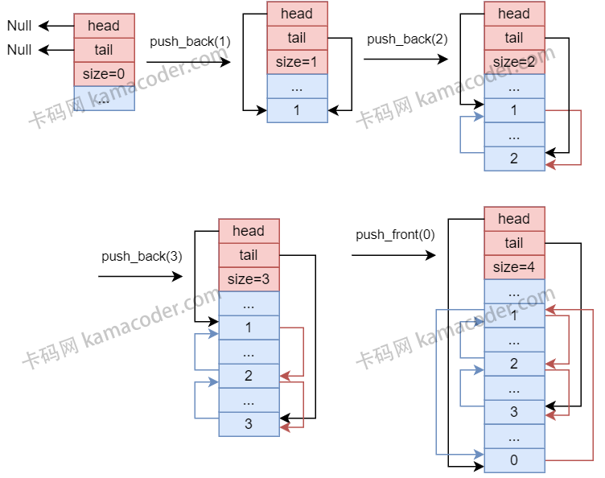

# List

`std::vector` 和 `std::list` 是两种不同的数据结构, vector是基于数组的动态数组, 而 std::list 是**基于双向链表的数据结构**.

list 适用于需要在序列中执行频繁插入、删除操作的场景.

## list 的特性
- 双向链表
  - list 是一个双向链表, 允许在序列的`两端和中间执行高效的插入和删除操作`.

- 不支持随机访问
  - list 与 vector、deque 不同, list不支持通过索引进行`常量时间内的随机访问`, 要访问list中的元素, **必须通过迭代器进行**.

- 动态内存管理
  - list 的内部实现使用节点, 每一个节点都包含一个元素和指向前后节点的指针 (双向链表节点的特征). 这种结构使得 list 在执行插入和删除操作时能更好地管理内存.

- 保持迭代器的有效性
  - list 在进行插入和删除操作时, 能够更好地保持迭代器的有效性. 这意味着在进行这些操作后, 不会导致所有迭代失效.
    - vector的迭代器容易在执行 reserve 操作后失效 (插入元素的时候如果触发扩容, 则会调用 reserve, 导致迭代器失效)

- 高效的插入和删除操作
  - 由于list是双向链表, 插入和删除操作在两端、中间都是**常量时间**的, 这使得它成为增删频繁场景下的理想容器.

## list的性能考虑
- 插入和删除
  - 如果主要进行频繁的删除和操作, 并不需要进行随机访问, 那么使用 list 要比 vector 更好
- 随机访问:
  - 如果需要通过索引进行随机访问元素, 使用vector会更合适, 因为它能以 $O(1)$ 的时间复杂度进行访问
- 内存使用: 
  - 由于 list 使用了链表结构, 可能引入一些额外的内存开销, 在内存使用方面, vector 和 deque 可能更为紧凑.


## C++ 标准库中list的基本用法
```cpp
#include <list>  // 引入头文件

int main(void)
{
    std::list<int> myList;  // 声明一个list对象

    myList.push_back(1);     // 后端插入一个元素
    myList.push_front(2);    // 前端插入一个元素

    myList.pop_back();       // 删除后端的一个元素
    myList.pop_front();      // 删除前端的一个元素
    return 0;
}
```


## list 的工作原理


图例说明
- 蓝色矩形框：堆内存
- 红色矩形块：栈内存
- 红色箭头：next指针（参见实现）
- 蓝色箭头：prev指针（参见实现）

图中展示了一个list从初始化到完成多次插入的流程。List类也有一个控制结构, 包含`head`, `tail`, `size`三个成员, 分别控制链表的头尾指针和大小, 让我们梳理其生命流程:
1. 初始时刻, 其链表为空, size=0, 均为空指针, 只有这些**控制结构**存储在`栈上`

2. 执行`push_back(1)`, 在堆内存中分配了一个Node(参考后文实现, 其实就是个双向链表节点), 将head, tail指向这个节点, 更新size=1

3. 执行`push_back(2)`, 在堆内存中分配了一个Node, 需要注意的是, 这个新的节点不需要和旧的节点内存连续, 更新原tail指向节点的next, 将tail指向这个节点, 并且将新的节点的prev指向原来的tail, 更新size=2

4. 执行`push_back(3)`, 操作与3相同, 此过程完成后, size=3

5. 执行`push_front(3)`, 在堆内存中分配了一个Node, 需要注意的时, 这个新的节点不需要和旧的节点内存连续, 此时更新原head指向节点的prev, 将head指向这个节点, 并且将新的节点的next指向原来的head, 更新size=4

# 实现一个简单的list
```cpp
// #pragma once 
#include <iostream>
#include <stdexcept>
#include <algorithm>
#include <sstream>
#include <string>

template <typename T>
class List
{
public:
    template <typename L>
    friend std::ostream &operator<<(std::ostream &os, const List<L> &pt); // 友元函数

private:  // private区域定义受保护的数据成员
    struct Node
    {
        T data;         // 数据指针
        Node *next;     // 指向下一个节点
        Node *pre;      // 指向前一个节点

        // 构造函数
        Node (const T &value, Node *nextNode = nullptr, Node *preNode = nullptr) : data(value), next(nextNode), pre(preNode){} 
    };

    Node *head;         // List 类的头节点指针
    Node *tail;         // List 类的尾节点指针
    size_t size;        // List 中节点的数量

public:   // public区域定义各类功能函数
    // 构造函数
    List() : head(nullptr), tail(nullptr), size(0) {}

    // 析构函数
    ~List() { clear(); }  // 在下面定义了一个 clear 函数来清理节点

    void push_back(const T &value)
    {
        // 1. 创建新节点
        Node *newNode = new Node(value, nullptr, tail); // pre指向未插入元素前的tail节点

        if (tail){  // List 非空, 只需要更新尾指针
            tail->next = newNode;  
        }
        else{       // List 为空, 只需要更新头指针
            head = newNode;  
        }

        // 更新尾指针和链表大小
        tail = newNode;
        ++size;
    }

    void push_front(const T &value)
    {
        Node *newNode = new Node(value, head, nullptr); // next 指向原有的head

        if (head){ // List 不为空
            head->pre = newNode;
        }
        else{      // List 为空
            tail = newNode;
        }

        head = newNode;
        ++size;
    }

    size_t getSize() const
    {
        return size;
    }

    // 注意: std::list 没有提供[]运算符重载! 因为它不能保证O(1)的时间复杂度!
    // 访问List中的元素 (并非随机访问, 需要寻址)  
    T &operator[](size_t index)
    {
        Node *cur = head;   // 用于寻址
        for(size_t i = 0; i < index; ++i){
            if (!cur){      // 用户指定的index超出链表长度
                throw std::out_of_range("index out of range!");
            }
            cur = cur->next;
        }
        return cur->data;
    }

    const T &operator[](size_t index) const
    {
        Node *cur = head;
        for(size_t i = 0; i < index; ++i){
            if(!cur){
                throw std::out_of_range();
            }
            cur = cur->next;
        }
        return cur->data;
    }

    void pop_back()
    {
        if(size > 0){
            // 获取尾节点的前一个节点, 防止指针丢失
            Node * newTail = tail->pre;

            // 删除尾节点
            delete tail;

            tail = newTail;   // 更新尾节点指针
            if(tail){  // 非空指针
                tail->next = nullptr;
            }
            else {      // 空指针 (如果原来的List只有一个节点, tail就会是空的)
                head = nullptr;
            }

            -- size;
        }
    }

    void pop_front()
    {
        if(size > 0){
            Node *newHead = head->next;

            delete head;

            head = newHead;
            if(head){
                head->pre = nullptr;
            }
            else{
                tail = nullptr;
            }

            --size;
        }
    }

    // 获取指定值的节点
    void *getNode(const T &val){
        Node *node = head;
        while(node != nullptr && node->data != val){
            node = node->next;
        }
        return node;
    }

    // 或者指定值的节点的 数据指针
    T *find(const T &val){
        Node *node = getNode(val);
        if(node == nullptr){
            return nullptr; 
        }
        return &node->data;
    }

    // 删除指定节点
    void remove(const T &val)
    {
        Node *node = head;

        // 找待删除节点
        while(node != nullptr && node->data != val){
            node = node->next;
        }

        if(node == nullptr){  // 没找到目标
            return;
        }

        if(node != head && node != tail){       // 非头尾指针
            // 直接绕开被删节点
            node->pre->next = node->next;   
            node->next->pre = node->pre;
        }
        else if(node == head && node == tail){  // 是头节点也是尾节点
            head = nullptr;
            tail = nullptr;
        }
        else if(node == head){                  // 是头节点
            head = node->next;
            head->pre = nullptr;
        }
        else{                                   // 是尾节点
            tail = node->pre;
            tail->next = nullptr;
        }

        --size;
        delete node;        // 别忘了释放内存
        node = nullptr;     // 防止出现垂悬指针
    }

    bool empty() { return size == 0; }

    // 清空链表
    void clear()
    {
        while(head)
        {
            Node *temp = head;
            head = head->next;      // 先更新头节点, 防止地址丢失
            delete temp;
        }

        // 走到这里就删完了, 更新其他控制成员
        tail = nullptr;
        size = 0;
    }

    // 迭代器
    Node *begin() { return head; }
    
    // 需要特别注意:  end() 返回一个指向链表末尾之后位置的迭代器，这个位置被称为“past-the-end”元素。
    // 这个迭代器不指向任何实际的元素，因此不能被解引用
    Node * end() { return nullptr; }       
    
    // const 版本 (保证只读模式)
    const Node *begin() const { return head; }
    const Node *end() const { return nullptr; }   // 同上, 都是past-the-end元素, 不能被解引用

    // 打印链表中的元素
    void printElements() const
    {
        for (Node *cur = head; cur != nullptr; cur = cur->next){
            std::cout << cur->data << " ";
        }
        std::cout << std::endl;
    }
};

// 运算符重载 (前面已经声明为友元函数)
template<typename T>
std::ostream &operator<<(std::ostream os, const List<T> &pt)
{
    
    // for(typename List<T>::Node *cur = pt.head; cur != nullptr; cur = cur->next){  // 访问List类中的结构体, 需要用 typename List<T>::Node
    //     os << " " << cur->data;
    // }
    // os << std::endl;
    // return os;

    typedef typename List<T>::Node myNode;
    for(myNode *cur = pt.head; cur != nullptr; cur = cur->next){  // 访问List类中的结构体, 需要用 typename List<T>::Node
        os << " " << cur->data;
    }
    os << std::endl;
    return os;
}

```

测试函数:
```cpp
int main() {
    // 创建一个 List 对象
    List<int> myList;
    
    int N;
    std::cin >> N;
    // 读走回车
    getchar();
    std::string line;
    // 接收命令
    for (int i = 0; i < N; i++) {
        std::getline(std::cin, line);
        std::istringstream iss(line);
        std::string command;
        iss >> command;
        int value;

        if (command == "push_back") {
            iss >> value;
            myList.push_back(value);
        }

        if (command == "push_front") {
            iss >> value;
            myList.push_front(value);
        }

        if (command == "pop_back") {
            myList.pop_back();
        }

        if (command == "pop_front") {
            myList.pop_front();
        }

        if (command == "remove") {
            iss >> value;
            myList.remove(value);
        }

        if (command == "clear") {
            myList.clear();
        }

        if (command == "size") {
            std::cout << myList.getSize() << std::endl;
        }

        if (command == "get") {
            iss >> value;
            std::cout << myList[value] << std::endl;
        }

        if (command == "print") {
            if (myList.getSize() == 0) {
                std::cout << "empty" << std::endl;
            } else {
                myList.printElements();
            }
        }
    }
    return 0;
}
```

测试用例:
```txt
17
push_back 10
push_back 20
push_front 30
push_front 40
size
print
get 1
pop_back
print
pop_front
print
remove 10
print
size
clear
print
size
```


