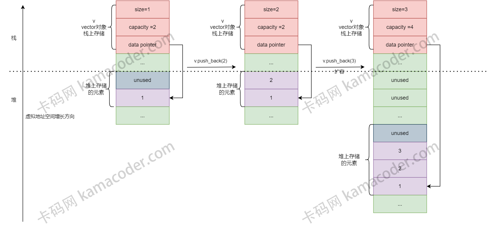
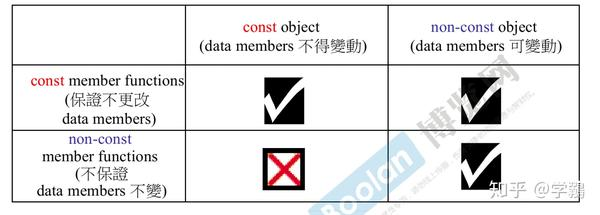

# vector

`std::vector`是一个**动态数组**，他在内存中以连续的块存储元素。与静态数组相比，`std::vector`允许在运行时动态调整大小，而**无序手动管理内存**。

## 内存管理
`std::vector`维护了两个重要的状态信息：
- 容量（capacity）
  - 指当前vector**分配的空间大小**
- 大小（size）
  - 表示当前vector内包含的**元素数量**

当想vector中添加元素时，如果**元素数量超过了容量(size > capacity)**，则需要进行内存的重新分配。

内存分配和释放是`std::vector`内部的重要操作：
- 当容量不足时，它会分配一块新的内存空间，然后**将原有元素复制到新的内存中**，然后释放内存。`“复制”这个操作确保了元素的连续存储！`

### 动态扩容策略
为了提高性能，`std::vector`采用了一种称为“指数增长（exponential growth）”的策略进行动态扩容。
- 当需要进行扩容时，`std::vector`通常会**将容量翻倍**，以避免频繁的内存分配操作，从而减少系统开销。
- 这种指数增长策略确保了**平均情况下**的插入操作具有常数时间复杂度`O(1)`，而不是线性的时间复杂度。

### 随机访问和迭代器
`std::vector`提供了高效的随机访问能力，即通过索引直接访问元素。
- 这是因为元素在内存中都是`连续存储`的，通过简单的指针运算就可以实现`O(1)`时间复杂度的元素访问。


### 性能考虑
`std::vector`在许多场景下表现都很出色，但是在`频繁插入或删除`的情况下，`std::vector`并不是最佳选择，因为这会触发频繁的动态扩容，导致性能下降。

这种情况下，应选择`std::deque`或`std::list`这样的容器，它们对插入和删除操作有更优秀的性能。

## 基本用法
使用时，应包含头文件：
```cpp
#include <vector>
```

创建和初始化元素访问
```cpp
#include <iostream>
#include <vector>

int main()
{
    // 空 vector
    std::vector<int> myVector;

    // 使用列表初始化创建 vector
    std::vector<int> myVector2 = {1, 2, 3, 4, 5};

    // 在尾部插入元素
    myVector.push_back(42);

    // 使用下标访问元素
    std::cout << "First element: " << myVector[0] << std::endl; 

    // 打印 vector 大小
    std::cout <<  "Size of myVector: "<< myVector.size() << std::endl;

    return 0;
}
```

# vector的工作原理
C++中的vector的**数组内存**通常是在`堆`上分配的。当创建一个vector对象时，对象本身(指vector的控制结构，包括指向数组的指针、大小和容量等)通常存储在`栈`上(针对局部变量)或者其他存储区域(如全局/静态存储区)，但**实际的元素数据**是在`堆`上分配的。

这种设计允许vector在运行时动态增长和收缩，因为`堆是用于动态内存分配的区域`，没有固定的大小限制（除了可用内存的物理限制）。当调用vector的push_back等方法时，vector可能会重新分配其底层的动态数组以适应新元素。这通常涉及申请新的更大的内存块，复制现有元素到新内存，添加新元素，然后释放旧的内存块。在C++官方实现的vector中，这种动态内存管理通常是`通过分配器来完成`的，vector使用一个默认的分配器`std::allocator`，它封装了动态内存分配函数，如new和delete。**开发者也可以为vector提供自定义的分配器，以适应特定的内存分配策略**。


上图：
- 虚线以上的内存为栈内存，虚线以下的内存为堆内存
- 红色区域为vector对象控制结构存储的位置
- 紫色区域和灰色区域为存储元素的数组的位置, 其中紫色区域表示已经使用, 灰色区域表示未使用
> 在这个案例中, 有一个 vector\<int> v对象, 其控制结构存储在在了栈上, 包括size, capacity, data pointer,分别表示数组已经使用的大小、数组的容量、数组的首地址, 最左边表示初始时刻的堆栈状态, 某时刻调用 v.push_back(2), 检查发现此操作不会超出容量上限, 因此在中间的堆栈示意图中插入了2, 并更新控制结构中的 size = 2, 下一时刻调用 v.push_back(3), 此时检查发现此操作要求的容量不足, 因此需要重新在堆内存申请容量为4的内存空间, 如最右边的示意图所示, 并且复制原来的内容到新的地址, 完成此操作后可以丢弃原来的堆内存空间, 并插入3。


# 实现vector
vector类中包括以下基本组成部分：
1. 构造函数（constructor）
2. 析构函数（destructor，简称 dtor）
3. 拷贝构造函数
4. 拷贝赋值操作符
5. 添加元素
6. 获取元素个数
7. 获取容量
8. 访问元素


先看整体代码：
```cpp
#include <iostream>
#include <algorithm>
#include <sstream>
#include <string>
#include <stdexcept>

template <typename T>
class Vector
{
private:
    T *elements;      // 指向动态数组的指针
    size_t capacity;  // 数组的容量
    size_t size;      // 数组中元素的个数

public:
    // 构造函数
    Vector() : elements(nullptr), capacity(0), size(0){}

    // 析构函数
    ～Vector()
    {
        delete[] elements;  // 析构数组
    }

    // 拷贝构造函数
    Vector(const Vector& other) : capacity(other.capacity), size(other.size)
    {
        elements = new T[capacity];
        std::copy(other.elements, other.elements + size, elements);
    }

    // 拷贝赋值操作符
    Vector &operator=(const Vector &other)
    {
        if (this != &other){   // 判断两个对象是否相同（用内存地址来判断）
            // 释放自身原有数组空间
            delete[] elements;

            // 拷贝
            capacity = other.capacity;
            size = other.size;
            
            // 数组需要重新分配空间
            elements = new T[capacity];
            std::copy(other.elements, other.elements + size, elements);
        }
        return *this;  // 返回当前对象的引用
    }

    // 添加元素到末尾
    void push_back(const T &value)
    {
        // 如果当前数组已满，就扩张为当前容量的两倍(不足时, 扩容+拷贝元素)
        if (size == capacity){
            // 扩容时需要检查0的边界情况, 原来是0的话, 容量扩张为1
            reserve(capacity == 0 ? 1 : 2 * capacity);  // 这个函数在下面的private中定义
        }
        elements[size++] = value; // 放入新元素，size++
    }

    // 获取数组中元素的个数
    size_t getSize() const    // 不要忘了const!
    {
        return size;
    }

    // 获取数组容量
    size_t getCapacity const  // 不要忘了const!
    {
        return capacity;
    }

    // 访问数组中元素的个数
    T &operator[](size_t index)   // 这里返回的是“引用”, 这样可以方便调用多次这个[]运算符, 如 a[i][j]
    {
        // 检查索引是否越界
        if(index >= size){
            throw std::out_of_range("Index out of range");
        }
        return elements[index];
    }

    // const 版本的访问数组中的元素
    const T &operator[](size_t index) const  // 最右侧的const为了保护“成员变量”不被修改(此时this指针无法修改成员变量), 最左侧的const表示返回的是const对象
    {
        if(index >= size){
            throw std::out_of_range("Index out of range");
        }
        return elements[index];
    }


    // 在指定位置插入元素
    void insert(size_t index, const T &value)   
    {
        // 检查越界
        if (index > size){
            throw std::out_of_range("Index out of range");
        }
        // 检查容量 (不足时, 扩容+拷贝元素)
        if (size == capacity){
            reserve(capacity == 0 ? 1 : capacity * 2);
        }

        for(size_t i = size; i > index; --i){ // 数组从0计数, 故下标为size的元素是插入新元素后的数组的最后一个元素
            elements[i] = elements[i-1];
        }

        elements[index] = value;
        ++size;
    }

    // 删除数组末尾元素 (capacity 并没有发生改变)
    void pop_back()
    {
        if (size > 0){
            --size;   // 只需要做一个标记, 被“删除”的元素就当作垃圾值了
        }
    }

    // 清空数组 (capacity并没有变)
    void clear()
    {
        size = 0;
    }

    // 使用迭代器遍历数组的开始位置
    T *begin()                  // 返回指针类型
    {
        return elements;        // 数组名就是数组指针, 而迭代器本身可以当作指针一样使用
    }

    // 使用迭代器遍历数组的结束位置
    T *end()                    // 返回指针类型
    {
        return elements + size; // 返回数组的末尾指针
    }

    // 使用迭代器遍历数组的开始位置(const 版本, 仅用于读取访问)
    const T *begin() const
    {
        return elements;
    }

    // 使用迭代器遍历数组的结束位置(const 版本, 仅用于读取访问)
    const T *end() const
    {
        return elements + size;
    }

    // 打印数组中的元素
    void printELements() const
    {
        for (size_t i = 0; i < size; ++i){
            std::cout << elements[i] << " ";
        }
        std::cout << std::endl;
    }

private:
    /// 给数组扩容并拷贝原来的数组数据到扩容后的数组空间
    void reserve(size_t newCapacity)
    {
        if(newCapacity > capacity){
            T *newElements = new T[newCapacity];  // 在“堆”上申请新的数组
            std::copy(elements, elements + size, newElements);
            delete[] elements;
            elements = newElements;
            capacity = newCapacity;
        }
    }
};

```


# 题外话 - const的使用
## const 返回值
这种多用在函数返回值是`引用类型`的情况下, 为了避免返回值被修改的情况.
> 返回值为 引用 的函数, 可以肯定一点是这个引用必然“不是临时对象的引用”, 因此一定是类的成员变量或者函数参数, 所以在返回的时候为了避免其成为`左值`被修改, 就需要加上const关键字进行修饰.

举例:
```cpp
#include<iostream>

using namespace std;

class A
{
private:
    int data;
public:
    A(int num):data(num){}
    ~A(){};
    const int& get_data()   // 返回值是引用, 加了const, 防止私有变量 data 被修改
    {
        return data;
    }
};

int main()
{
    A a(1);
    a.get_data() = 3;             // 这里会报错, 因为 get_data() 的返回值加了const
    cout<<a.get_data()<<endl; 
    return 0;
}
```
> 报错为: error: cannot assign to return value because function 'get_data' returns a const value

## const 修饰实参
在函数传递参数的时候, 尤其针对某种自定义类型, 我们通常使用的是`按值传递(pass by reference)`, 这样可以避免对象的拷贝, 节省内存以及各类系统开销, 并起到改变实参的目的. 而如果我们不希望实参被修改, 就需要加上 const 关键字.

比较值得深思的是:
- 在**构造接口之前**一定要思考**函数是否会修改参数**，如果不会修改的话一定要加上const，这个是代码写的是否大气的一个标准.

## const 成员函数
这种情况通常很容易被忽略, 比如:
```cpp
const String str("hello world.");  // 注意这个str对象是被const修饰的

str.print();   // 假设String类型内有一个成员函数 print, 如果这个函数定义中没有加上const关键字, 则会编译失败.
```

具体的例子:
```cpp
#include<iostream>

using namespace std;

class A
{
private:
    int data;
public:
    A(int num):data(num){}
    ~A(){};
    int& get_data()  // 这里没有任何const修饰
    {
        return data;
    }
};

int main()
{
    const A a(1);   // 注意这里使用了const
    a.get_data();
    return 0;
}
```
这里编译的时候会报错:
> error: 'this' argument to member function 'get_data' has type 'const A', but function is not marked const。

- 这里的报错中提到了`this`指针, 其实任何成员函数的参数都是含有 this 指针的，好比**py中的 self**，只不过c++中规定全部不写这个参数， 其实这个参数就是对象本身， 即谁调用成员函数， 这个 this 就是谁！

- 我们的例子中 a 是一个const 对象， 它调用了 get_data 方法，所以函数签名应该是：
    > get_data(a){}

- 而 **a 是一个 const 对象， 我们默认的 this 指针并不是 const 类型，所以参数类型不匹配**， 编译无法通过！

所以, const 修饰成员函数， **根本上是修饰了 this 指针**。



- `const成员函数`对于 const-object 和 non-const-object 都不允许修改数据成员.
- `non-const成员函数` 与 const-object 之间会直接造成编译出错, 原因是 `this 指针(此时this指针被const修饰)`与这个`成员函数(函数声明中的 this 指针没有const修饰)`之间类型不匹配.
- 如果成员函数中没有const版本, 此时允许 non-const-object 调用 const 修饰的成员函数, 因为 non-const-object 会触发隐式类型转换, 把 non-const this 指针 转换成 const this 指针, 此时这个成员函数依旧不会改变成员变量的值.


还需要特别留意:
> 类的成员数中, “加const” 和 “不加const” 修饰的两个成员函数是 **不同的成员函数**, 它们的函数签名是不一样的!!!
- 如果成员函数`同时具有` const 和 non-const 两个版本的话， **const 对象只能调用const成员函数**， **non-const 对象只能调用 non-const 成员函数**.
  - 因此, 上面的vector容器的成员函数中好几个成员函数需要增加一个 const 版本, 防止调用的时候发生类型不匹配错误.


## const默认修饰左侧类型, 否则修饰右侧类型
对于以下三种情况:
```cpp
const int *p;    // case 1
int const *p;    // case 2
int * const p;   // case 3
```
> case 1: const 左侧没有类型, 再看右侧, 是 `int 类型`, 修饰的是`指针指向的变量`, 这个变量不可被修改.
>
> case 2: const 左侧是 `int 类型`, 修饰`指针指向的变量`, 该变量不可修改, 同 case 1.
>
> case 3: const 左侧是`int *`类型, 修饰指针, 这个指针`不能修改指向的对象`


# 题外话 - 面试常见相关问题

## std::vector 扩容过程
当向 std::vector 添加元素并且当前容量不足以容纳新元素时，std::vector 会进行扩容。这通常涉及以下步骤：
```txt
1. 分配一个更大的内存块，通常是当前大小的 两倍（这个增长因子取决于实现）。

2. 将当前所有元素移到新分配的内存中。

3. 销毁旧元素，并释放旧内存块。

4. 插入新元素。
```
需要注意, 因为vector只是一个容器, 它里面的元素可以是**自定义的类的对象**, 因此, 这个过程中的复制和移动操作可能会导致不小的性能开销，尤其当元素具有复杂的拷贝构造函数或移动构造函数时。


## push_back 和 emplace_back 的区别
`std::vector::push_back` 和 `std::vector::emplace_back` 都是在 `std::vector` 的末尾添加一个新元素，但它们添加元素的方式不同。
- push_back 会对给定的对象进行**拷贝或移动构造**，以将元素添加到 vector 的末尾。
- emplace_back 则使用给定的参数**直接在 vector 的末尾构造一个元素**，**无需拷贝或移动操作**，这通常更高效。


## 什么时候会使用 std::vector::reserve()？
`std::vector::reserve()` 用于预分配内存，以避免在添加新元素时重新分配内存。当**知道将要存储大量元素**，但又不想在每次插入时都可能发生内存重新分配时，使用 reserve() 可以提高性能。这样可以减少因扩容导致的不必要的内存分配和元素拷贝。


## 如何减少 std::vector 占用的空间？
可以使用 `std::vector::shrink_to_fit` 方法来请求移除未使用的容量，减少 vector 的内存使用。这个函数是`C++11 引入的`，它会尝试压缩 std::vector 的容量，使其等于其大小。但是，**这只是一个请求，并不保证容量会减少，因为这依赖于实现**。


## 如何检查 std::vector 是否为空？
使用 `std::vector::empty()` 方法可以检查 vector 是否没有元素。这比使用 size() 方法（比较 size() == 0）更首选，因为 **empty() 通常可以保证是常数时间复杂度**的操作。
> 在C++标准中, empty() 方法在所有标准容器中都保证了是 常数时间复杂度$O(1)$
>
> 在某些实现中, size() 的操作可能会比较复杂, 而 empty() 则会有更加优化的实现, 比如有些实现会比较指针或者迭代器, 而不是计算元素数量. 

## 什么是迭代器失效? 如何避免?
当 vector 进行操作，如**增加或删除元素，尤其是在中间插入或删除元素**时，迭代器可能会失效。例如：
- 如果 vector 进行了重新分配，所有指向元素的迭代器都会失效(因为数组存储空间发生了更换)。
- 如果在 vector 中间插入或删除元素，从该点到末尾的所有迭代器都会失效。

解决方案是最好使用标准库提供的算法，如 `std::remove` 和 `std::remove_if` 结合 `vector::erase` 方法来删除元素。这些算法在设计时已经考虑了迭代器失效的问题。


## 如果 std::vector 的元素是指针，需要注意什么？
当 vector 的元素是指针对 std::vector 元素为指针的情况，需要注意以下几点：

1. `内存管理`：
   - 如果 std::vector 存储的是原始指针，那么仅仅清空 vector 或者让 vector 被销毁，并不会释放指针所指向的内存。因此，**需要确保在 vector 被销毁之前，逐个删除所有动态分配的对象**。


2. `所有权和生命周期`：
   - 需要确保在 vector 所包含的指针被使用期间，指向的对象是有效的。同时，需要清楚地定义谁拥有这些对象的所有权，以及在何时何地进行释放。


3. `异常安全`：
   - 如果在创建和填充 vector 的过程中遇到异常，需要有一个**清晰的机制来处理已经分配的内存，以避免内存泄漏**。


4. `智能指针`：
   - 为了简化内存管理，**推荐使用智能指针**（如 `std::unique_ptr` 或 `std::shared_ptr`）作为 vector 的元素类型。这样，当 vector 被清空或销毁时，智能指针会自动释放它们所拥有的资源。


5. `避免悬垂指针`：
   - 当指针指向的对象被删除或移动时，需要确保没有悬垂指针指向无效的内存地址。同样，当 vector 被重新分配时，如果存储的是指向其他元素的指针，这些指针也会失效。


6. `深拷贝与浅拷贝`：
   - 如果需要复制这样的 vector，就需要决定是进行`深拷贝（复制指针指向的对象）`还是`浅拷贝（仅复制指针本身）`。正确地选择取决于应用需求和所有权策略.


