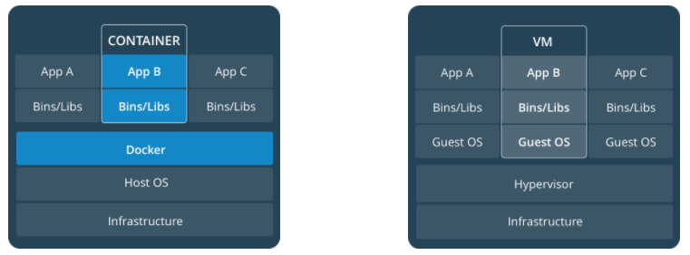
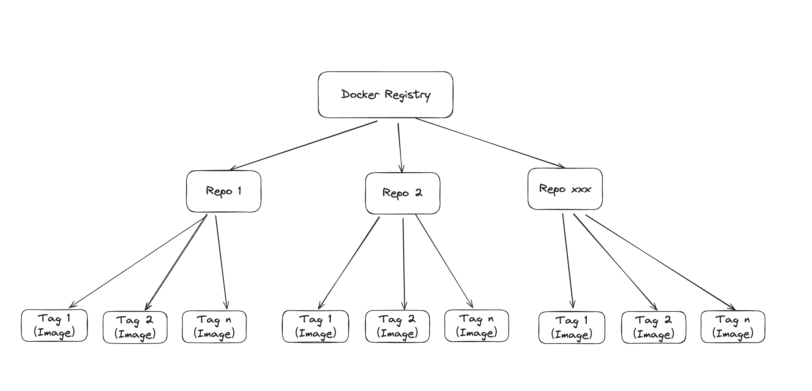
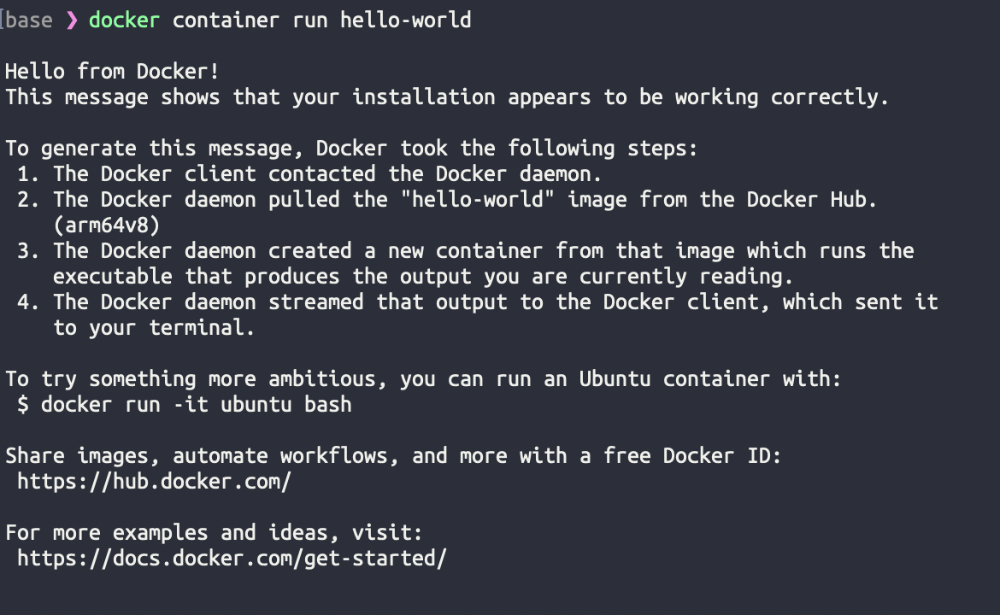
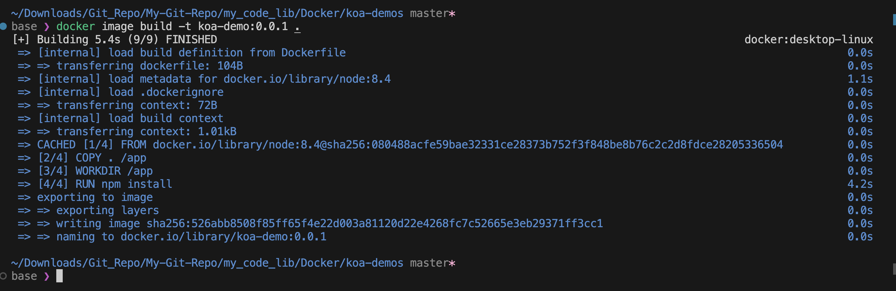
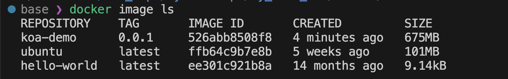
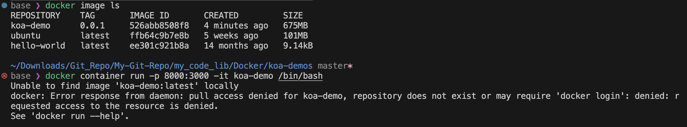

# 什么是 Docker
> Docker 属于 Linux 容器的一种封装，提供简单易用的容器使用接口。

Docker 将`应用程序`与`运行该程序依赖的软件包`一起装到**一个文件里面**。当运行这个文件时，就会生成一个**虚拟容器**. 我们打包的应用程序将在这个虚拟容器中运行，就像在一台真实的电脑上运行一样。
- 简而言之，使用 Docker 的一个重要目的就是**不用担心环境配置问题**，也不需要重头开始配置运行环境。
- 容器还可以进行**版本管理**、**复制**、**分享**、**修改**，就像管理普通的代码一样


## 细说 Docker 优点
* **更快速的启动时间**：Docker 容器是直接运行在宿主内核，不需要启动完整的操作系统，所以启动速度非常快。
* **一致的运行环境**：开发环境、测试环境、生产环境的一致性。(Docker 镜像提供除了内核以外的完整的运行时环境，确保运行时环境的一致性，便于 debug.)
* **持续交付和部署**：容器可以通过版本控制系统进行管理、追踪、复制和分享。
  - 通过 Dockerfile 来构建镜像文件，并由此实现`持续集成和持续部署(Continue Integration and Continue Deployment)`。[Dockerfile 使镜像构建](https://yeasy.gitbook.io/docker_practice/image/build)透明化，不仅仅开发团队可以理解应用运行环境，也方便运维团队理解应用运行所需条件，帮助更好的生产环境中部署该镜像
* **更轻松的迁移**：Docker 可以在不同的平台之间迁移。
* **更轻松的维护和扩展**：Docker 使用的分层存储以及镜像的技术，使得应用重复部分的复用更为容易，也使得应用的维护更新更为简单，基于基础镜像进一步扩展镜像也变得非常简单。

* **更高效的利用系统资源**：Docker 是轻量级的虚拟化技术 (无需针对硬件进行虚拟化并且没有运行完整操作系统的开销)，因此可以在一台物理主机上运行更多的应用。



## Docker 的主要用途 
**提供一次性的环境**
- 比如，本地测试他人的软件、持续集成的时候提供单元测试和构建的环境。

**提供弹性的云服务**
- 因为 Docker 容器可以随开随关，很适合动态扩容和缩容。

**组建微服务架构**
- 通过多个容器，一台机器可以跑多个服务，因此在本机就可以模拟出微服务架构。


## Docker 的核心概念
一共有 4 个：镜像、分层存储、容器、仓库。

### 镜像 (Image)
> Docker 把应用程序以及依赖包都装进了`镜像(image)`文件里面。
  - 操作系统分为**内核**和**用户空间**。对于 Linux 而言，内核启动后，会挂载 root 文件系统为其提供用户空间支持。而 **Docker 镜像（Image），就相当于是一个 root 文件系统**。
  - **Docker 镜像是一个特殊的文件系统**，除了提供容器运行时所需的程序、库、资源、配置等文件外，还包含了一些为运行时准备的一些配置参数（如匿名卷、环境变量、用户等）。
  - **镜像不包含任何动态数据，其内容在构建之后也不会被改变。**

### 分层存储 (Union FS)
因为镜像包含操作系统完整的 root 文件系统，其体积往往是庞大的，因此在 Docker 设计时，就充分利用 Union FS 的技术，将其设计为分层存储的架构。
 - **Docker 镜像并非是像一个 ISO 那样的打包文件**，镜像只是一个虚拟的概念，其实际体现并非由一个文件组成，而是**由一组文件系统组成，或者说，由多层文件系统联合组成**。
 - **镜像构建时，会一层层构建，前一层是后一层的基础。每一层构建完就不会再发生改变，后一层上的任何改变只发生在自己这一层**。
      > 比如，删除前一层文件的操作，实际不是真的删除前一层的文件，而是仅在当前层标记为该文件已删除。在最终容器运行的时候，虽然不会看到这个文件，但是实际上该文件会一直跟随镜像。
      >> 在构建镜像的时候，需要额外小心，每一层尽量只包含该层需要添加的东西，任何额外的东西应该在该层构建结束前清理掉。

  - **分层存储的特征还使得镜像的复用、定制变的更为容易**。甚至可以用之前构建好的镜像作为基础层，然后进一步添加新的层，以定制自己所需的内容，构建新的镜像。


### 容器 (Container)
容器与镜像的关系，就像是面向对象程序设计中的`对象`与`类`的关系一样。
  > **镜像是静态的定义，容器是镜像运行时的实体**。容器可以被创建、启动、停止、删除、暂停等。

容器的实质是`进程`，但与直接在宿主执行的进程不同，容器进程运行于属于自己的独立的 [命名空间](https://en.wikipedia.org/wiki/Linux_namespaces)。
  > 因此**容器可以拥有自己的 root 文件系统、自己的网络配置、自己的进程空间，甚至自己的用户 ID 空间**。
  >> **容器内的进程是运行在一个隔离的环境里**，使用起来，就好像是在一个独立于宿主的系统下操作一样。
  >> 这种特性使得容器封装的应用比直接在宿主运行更加安全。也因为这种隔离的特性，很多人初学 Docker 时常常会混淆容器和虚拟机。

**镜像使用的是分层存储，容器也是如此**。
> 每一个容器运行时，是以镜像为基础层，在其上创建一个当前容器的存储层，我们可以称这个为容器运行时读写而准备的存储层为**容器存储层**。

**容器存储层的生存周期和容器一样**，容器消亡时，容器存储层也随之消亡。因此，任何保存于容器存储层的信息都会随容器删除而丢失。
> 按照 Docker 最佳实践的要求，**容器不应该向其存储层内写入任何数据，容器存储层要保持无状态化**。所有的文件写入操作，都应该使用 [数据卷（Volume）](https://yeasy.gitbook.io/docker_practice/data_management/volume)、或者绑定宿主目录。
>>在这些位置的读写会跳过容器存储层，直接对宿主（或网络存储）发生读写，其性能和稳定性更高。

**数据卷的生存周期独立于容器，容器消亡，数据卷不会消亡**。因此，使用数据卷后，容器删除或者重新运行之后，数据却不会丢失。


### 仓库 (Repository)
构建好 Docker 镜像后，我们需要一个可以集中存储和分发镜像的服务。这种服务被称为 [Docker Registry](https://yeasy.gitbook.io/docker_practice/repository/registry.html)。

一个 Docker Registry 中可以包含：
- 多个仓库 (Reposiroty), 
- 每个仓库可以包含多个标签 (Tag),
- 每个标签对应一个镜像 (Image)。


通常，一个仓库会包含同一个软件不同版本的镜像，而标签就常用于对应该软件的各个版本。我们可以通过 `<Repo>:<Tag>` 的格式来指定具体是这个软件哪个版本的镜像。如果不给出标签 (tag)，将以 `latest` 作为**默认标签**。
> 以 [Ubuntu 镜像](https://store.docker.com/images/ubuntu)为例，ubuntu 是仓库的名字，其内包含有不同的版本标签，如，16.04, 18.04。我们可以通过 `ubuntu:14.04`，或者 `ubuntu:18.04` 来具体指定所需哪个版本的镜像。如果忽略了标签，比如 ubuntu，那将视为 `ubuntu:latest`。

仓库名经常以 **两段式路径** 形式出现，比如 `jwilder/nginx-proxy`，前者往往意味着 Docker Registry 多用户环境下的**用户名**，后者则往往是对应的**软件名**, 即完整表达为 `用户名/软件名:软件版本tag`。但这并非绝对，取决于所使用的具体 Docker Registry 的软件或服务。

---

# Docker 安装和启动
不同的操作系统安装 Docker 的方式稍有不同，可以直接看[官方](https://docs.docker.com/get-docker)的。
- 验证安装是否成功，在终端下运行：
  ```bash
  docker --version
  docker info
  ```

Docker 需要用户具有 `sudo` 权限，为了避免每次命令都输入 sudo，可以把用户加入 Docker 用户组 ([官方教程](https://docs.docker.com/engine/install/linux-postinstall/#manage-docker-as-a-non-root-user))：
```bash
sudo usermod -aG docker $USER
```

Docker 是 "服务器 - 客户端" 架构。命令行运行 docker 命令的时候，需要本机有 Docker 服务。如果这项服务没有启动，可以用下面的命令启动 ([官方教程](https://docs.docker.com/config/daemon/proxy))：
```bash
# 基于 service 命令启动方式
sudo service docker start

# 基于 systemctl 命令启动方式
sudo systemctl start docker
```

## hello world 示例
用 hello world 开光！首先从 [Docker Hub](https://hub.docker.com/_/hello-world) 上面拉取 hello-world 镜像：
```bash
docker image pull library/hello-world
```
- `docker image pull` 是抓取 image 文件的命令。`library/hello-world` 是 image 文件在仓库里面的位置，其中 `library` 是 image 文件所在的组，hello-world 是 image 文件的名字，这里没有指定 tag, 所以默认使用的是 latest。
  - 由于 Docker 官方提供的 image 文件，都放在 [library](https://hub.docker.com/r/library/) 组里面，所以它的是默认组，可以省略。因此，上面的命令可以简化成下面这样：
    ```shell
    docker image pull hello-world
    ```

抓取成功后，可以在本机看到这个 Image:
```bash
docker image ls
```

运行这个 Image:
```bash
docker container run hello-world
```
- `docker container run`命令会用 image 文件生成一个正在运行的容器实例。
  > 注意，`docker container run`命令具有**自动抓取 image 文件**的功能。如果发现本地没有指定的 image 文件，就会从仓库自动抓取。因此，前面的 docker image pull 命令并不是必需的步骤。
- 运行结果为：
  
  - 输出这段提示以后，hello world 就会停止运行，这个容器自动终止 (这仅仅是 hello-world 容器自带的设置，有些提供服务的容器就不会自动终止!)。 


运行提供服务的容易一般不会自动终止，比如运行 Ubuntu 的 Image, 就可以在命令行体验 Ubuntu 系统：
```bash
docker container run -it ubuntu bash
```
- `-it` 参数的作用是打开交互模式，`ubuntu` 是 image 文件的名字，`bash` 则会在启动容器后执行 bash 命令。


对于那些不会自动终止的容器，必须使用[docker container kill](https://docs.docker.com/engine/reference/commandline/container_kill/) 命令手动终止。
```shell
docker container kill <container_id>
```

---

# 制作 Docker 容器
这里以 koa-demons 为例。

## 编写 Dockerfile
首先下载 koa-demons 项目：
```bash
git clone https://github.com/ruanyf/koa-demos.git
cd koa-demos
```

为了避免不需要的文件被打包到 Image 中，这里新建一个 `.dockerignore`文件：
```shell
# 创建 .dockerignore 文件
touch .dockerignore       

# 在 .dockerignore 文件中写入下面三行, 表示打包 Image 时排除这三个文件
.git
node_modules
npm-debug.log
```
- 如果没有要排除的文件，可以跳过这一步


在项目的根目录下，新建一个文本文件`Dockerfile`, 写入：
```Dockerfile
FROM node:8.4
COPY . /app
WORKDIR /app
RUN npm install --registry=https://registry.npm.taobao.org
EXPOSE 3000
```
下面是对上述 5 行内容的解释：
  > FROM node:8.4
    >> 该 image 文件继承官方的 node image，冒号后表示标签 (tag)，这里标签是 8.4，即 8.4 版本的 node。
  >
  > COPY . /app
  >> 将当前目录下的所有文件（除了.dockerignore 排除的路径），都拷贝进入 image 文件的/app 目录。
  >
  > WORKDIR /app
  >> 指定接下来的工作路径为/app。
  > 
  > RUN npm install
  >>在/app 目录下，运行 npm install 命令安装依赖。注意，安装后所有的依赖，都将打包进入 image 文件。
  >> 
  >
  > EXPOSE 3000
  >>将容器 3000 端口暴露出来，允许外部连接这个端口。

## 创建 Image 文件

编写好 Dockerfile 之后，就可以用 `docker image build` 命令创建 Image 文件了：
```bash
docker image build -t koa-demo .

# 或者使用下面的命令来指定Image的版本号
docker image build -t toa-demo:0.0.1 .   # 不要漏掉最后那个 "."
```
- 上面代码中，`-t` 参数用来指定 image **文件的名字**，后面还可以**用冒号指定标签**。
  - 如果不指定标签，默认的标签就是 `latest`。
- 最后的那个`.`表示 **Dockerfile 文件所在的路径**，上例是当前路径，所以是一个点。


- 上面的`RUN npm install --registry=https://registry.npm.taobao.org`表示使用指定的 registry 参数表示从指定的地址下载安装包，这里可能会因为网络问题或者服务器证书问题遇到报错，在构建的时候可以先尝试在终端跑一把。这个参数不是必须的，去掉之后会使用默认的 registry 地址。

如果运行成功，就可以看到新生成的 image 文件 koa-demo 了。


## 用构建好的 Image 生成容器
`docker container run`命令会从 Image 文件生成容器：
```bash
docker container run -p 8000:3000 -it koa-demo:0.0.1 /bin/bash

# 或者使用下面的命令
docker container run -p 8000:3000 -it koa-demo /bin/bash
```
- `-p` 参数是容器的端口映射，`8000:3000`表示将容器的 3000 端口映射到主机的 8000 端口。
- `-it` 参数是交互模式，将容器的 shell 映射到当前 shell, 此时在本机窗口输入的命令都会传递给容器中运行。
- `koa-demo`是 image 文件的名字，如果 Image 有标签还需要提供准确的标签。
- `/bin/bash` 指定容器启动以后，**内部执行的第一条命令**。这里启动的是 bash，确保用户可以使用 shell.

如果提供的 Image 的标签不正确，就会遇到如下错误：


如果成功启动容器的话，就会看到类似下面的提示符信息：
```shell
root@22faa2285c81:/app# 
```

接下来测试内部的一些功能：
在提示符中输入：
```shell
node demos/01.js
```
然后在浏览器中访问`http://127.0.0.1:8000`，就可以看到 koa-demos 项目的第一个示例了，但此网页显示"Not Found"，这是**因为这个 demo 没有写路由**。
> Node 进程运行在 Docker 容器的虚拟环境里面，进程接触到的文件系统和网络接口都是虚拟的，与本机的文件系统和网络接口是隔离的，因此需要定义容器与物理机的端口映射（map）。


在构建容器与物理机端口映射之前，需要停止容器的运行：
```shell
# 方法1: 直接在刚刚的容器的terminal中使用 ctrl+c 停止 node 指令的运行, 然后用 ctrl+d 退出容器

# 方法2: 打开另一个 terminal 窗口, 找到容器ID, 再停止它
docekr container ls   # 从输出内容中找到容器ID

docker container kill <container_id>
```

容器停止运行之后，并不会消失，用下面的命令删除容器文件。
```shell
# 查出容器的 ID
docker container ls --all

# 删除指定的容器文件
docker container rm [containerID]
```

也可以使用 docker container run 命令的--rm 参数，在容器终止运行后自动删除容器文件。

```shell
docker container run --rm -p 8000:3000 -it koa-demo /bin/bash
```

此时再根据需要，去 koa-demos 对应的 `.js` 文件中修改路由映射 (比如这里是`01.js`)，然后重新构建 Image 文件，生成容器，并运行容器即可。


## CMD 命令
上面的例子中，容器启动以后我们需要手动输入命令`node demos/01.js`运行对应的 demo。但其实可以把这个命令写在 Dockerfile 里面，这样容器启动以后，这个命令就已经执行了，不用再手动输入了。

即，把 Dockerfile 中的内容改写为：
```Dockerfile
FROM node:8.4
COPY . /app
WORKDIR /app
RUN npm install 
EXPOSE 3000
# 用CMD指定容器创建之后要自动运行的命令
CMD ndoe demos/01.js 
```

RUN 命令与 CMD 命令的区别在哪里？
- 简单说，**RUN 命令在 image 文件的构建阶段执行**，**执行结果都会打包进入 image 文件**；
- **CMD 命令则是在容器启动后执行**。

注意：
- [x] **一个 Dockerfile 可以包含多个 RUN 命令**，但是**只能有一个 CMD 命令**。

- [x] 指定了 CMD 命令以后，`docker container run` 命令就**不能附加命令了（比如前面的/bin/bash）**，**否则它会覆盖 CMD 命令**。


现在，更新 Dockerfile 后，启动容器可以使用下面的命令。
```shell
# 用 docker image build 重新打包镜像
docker image build -t koa-demo:0.0.1 .

# 用 docker container run 生成并启动容器
docker container run --rm -p 8000:3000 -it koa-demo:0.0.1  # --rm 命令表示当容器停止运行后自动删除容器文件
```

## 发布 Image 文件
当构建好 Image 后，我们可以将它发布到网上，方便他人使用。最常用的网上仓库是 [Docker Hub](https://hub.docker.com/)。

1. 首先去 hub.docker.com 或 cloud.docker.com 注册一个账户，然后在本地登录：
    ```shell
    docker login
    ```

2. 接着，为本地的 Image 标注用户名和版本
    ```shell
    docekr image tag [imageName] [username]/[repository]:[tag]

    # 例如：
    docker iamge tag koa-demos:0.0.1 ning/koa-demos:0.0.1
    ```
    - 也可以不标注用户名，重新构建一下 image 文件。
    ```shell
    docker image build -t [UserName]/[repository]:[tag]
    ```


3. 发布 Image 文件
    ```shell
    docker image push [username]/[repository]:[tag]
    ```


发布之后，去到 hub.docker.com 就能看到发布的 Image 文件了。


---

# 常用的 docker 命令

1. docker container start
    前面使用的 `docker container run` 命令是新建容器，每运行一次就会新建一个容器 (同一条命令跑两次就会新建两个容器), 因此，如果只是想**启动一个已创建并且已经停止运行的容器**，可以用这条指令：
    ```shell
    docker container start [containerID]
    ```
2. docker container stop
    前面使用的 `docker container kill`命令是终止一个容器的运行，相当于想容器里的主进程发出 `SIGKILL` 信号。而这里的 stop 命令虽然也是停止一个正在运行的容器，但它是`先发送 SIGTERM 信号, 过一段时间再发送 SIGKILL信号`：
    ```shell
    docker container stop [containerID]
    ```
    - 它与 kill 命令的区别在于，**应用程序收到 SIGTERM 信号以后，可以自行进行收尾清理工作，但也可以不理会这个信号**。**如果收到 SIGKILL 信号，就会强行立即终止，那些正在进行中的操作会全部丢失**。


3. docker container logs
    它的作用是查看容器的 shell 的标准输出，如果在 `docker run` 的时候如果**没有** `-it` 参数，则想要查看容器的输出就需要用这个命令了：
    ```shell
    docker container logs [containerID]
    ```


4. docker container exec
    用于**进入一个正在运行的 docker 容器**。如果 docker run 命令运行容器的时候，**没有使用** `-it` 参数，就要用这个命令进入容器。一旦进入了容器，就可以在容器的 Shell 执行命令了。
    ```shell
    docker container exec -it [containerID] /bin/bash
    ```

5. docker container cp
    用于从正在运行的 Docker 容器里面，**将文件拷贝到本机**。
    ```shell
    docker container cp [containerID]:[/path/to/file] [path/to/file]
    ```

---

# 参考资料
[阮一峰的博客](https://www.ruanyifeng.com/blog/2018/02/docker-tutorial.html)
[Docker-从入门到实践](https://github.com/yeasy/docker_practice)


