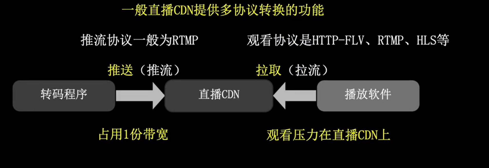

# 简介
一般常见的音、视频基础框架有：
- 编解码处理器：FFmpeg，Gstreamer
- 图像分析：OpenCV
- 复杂图像生成：OpenGL（可以生成 3d）

> 它们通常可以协同工作，有时候我们会在 OpenCV 中见到它对 Gstreamer 的支持

---

# 直播推流场景 -- 需要流媒体服务
首先看看视频转码过程（直接播放视频文件过程）：

- 流程大致为：视频文件 —> 解封装 —> （音频、视频）解码 —> 转码 —> 编码 —> 封装 —> 新视频文件（转成本地播放器支持的播放格式）

然后是`直播过程`与`视频转码过程`的对比：

- 最大的区别是`封装格式`，在直播流程的一头一尾要做特殊的处理。

使用流媒体服务（media-server）的直播流程：

- 根据推流协议和直播观看协议的不同，可能会使用两个不同的流媒体服务（如果推流和直播观看是相同协议，则可以只用一个流媒体服务）
    
    - 流媒体服务软件一般用的是 `SRS`、Nginx（带 rtmp 插件）
    - 流媒体使用的协议一般是 `RTMP`、`HLS`、`HTTP-FLV`

## 不需要流媒体服务器的场景
### 转播场景 -- 不需要流媒体服务

- 与直播不同，转播场景可以不需要自身系统的流媒体服务参与接收，直接让视频转码软件从对方系统的流媒体服务器拉去视频流进行转码播放即可。
- 此时的协议可以是 `RTMP`、`HLS`、`HTTP-FLV` 和 `RTSP`

### 文件直播场景（文件推流）-- 不需要流媒体服务

## 直播转码

在直播转码中，我们可以对直播流加上`水印`, `高清/流畅转换`, `码率限制`, `直播录像`等操作。

## 直播流输出以及直播 CDN
直播流直接输出到用户端的过程如下：

- HLS 的数据流是不一样的，hls 是将视频切分成很多个小文件放在本地，然后看直播的用户通过 `HTTP` 协议拉取这些小文件进行播放，如果要求低延迟，则一般使用 `RTMP` 和 `WebRTC` 
  - 注意：
    - 由于现在主流的浏览器禁用了 Flash, 所以主流浏览器不支持 RTMP (多半不支持)
    - 用户直接拉取流媒体视频数据的方法虽然是可以直接观看，但是这会占用很大带宽，视频码率的单位和带宽单位一致，这就导致同时观看的人数会受到限制。比如我们的总带宽只有 100Mbps, 视频码率如果是 2Mbps 的话，则理论上最多可以有 50 人同时观看。

为了避免带宽限制带来的用户数量限制问题，就需要使用`直播CDN`来解决这个问题。

- 转码程序只需要将视频流推送到 CDN 即可，不需要管那么多，推流协议一般为 RTMP 协议。
- 直播 CDN 虽然支持多协议，但是它并不支持转码服务，比如高清/流畅转换，码率限制，水印，录像等操作。

