主要协议有：RTMP, HLS, HTTP-FLV, RTSP, WebRTC 等。

# RTMP 和 HTTP-FLV
这两个协议都是在 FLV 封装格式的基础上推出的.
- RTMP 一般用于`直播源推流`，直播`系统内直播流数据传递`
- HTTP-FLV 一般用于`客户端直播观看`

## RTMP 
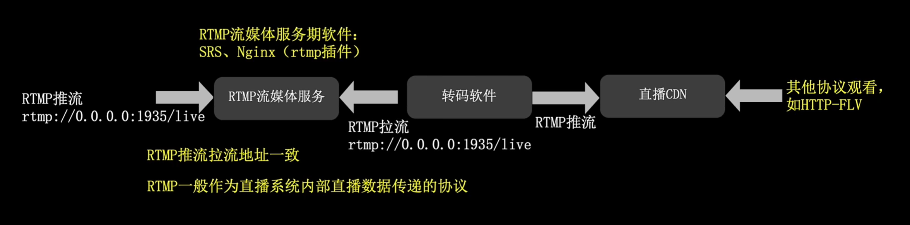
- RTMP 的通信建立在 `TCP` 的长连接通道上。
- RTMP 的地址以`rtmp://`开头，推流地址与播放地址相同
  - 严格来说，RTMP 既可以用来`推流`也可以用来`拉流`。但是由于现在的浏览器已经摒弃了 Flash, 而且据说在高并发场景下 RTMP 存在问题，所以 RTMP 一般用于`直播源推流`和`推流到直播CDN`。
- RTMP 需要特定的`流媒体服务(音视频数据的中转站)`软件，比如 SRS, Nginx-RTMP (带 RTMP 的 Nginx) 等。
  - 这种流媒体服务中专的音视频文件一般只在 RAM 中进行，**不会写入磁盘**。
- RTMP 的延迟一般比较低，大约在 1-3 秒。
  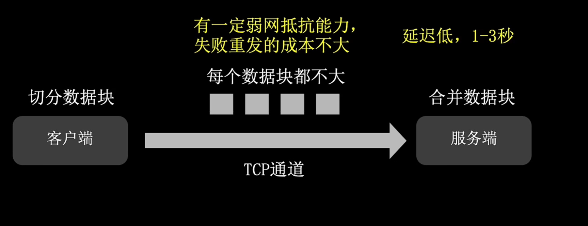
  - RTMP 在封装音视频数据时会强制切片，能一定程度上抵抗弱网，因为切块的文件一般不大 (每个文件大小不固定)，重传的成本低。
  - 由于在服务端需要合并数据切片，因此**存在一定的性能损耗**。

RTMP 的变种协议:
- RTMPT: 在 RTMP 的基础上增加了 TLS 加密
- RTMPS

## HTTP-FLV
这种协议的地址以`http://`开头，**只用于直播播放**。
- 它是机遇 HTTP 协议开发的，可以简单理解为 RTMP 的 HTTP 协议版本。
- 同样具有数据切片的特性，能一定程度上抵抗弱网，延迟 1-3 秒，比 RTMP 略高。
- HTTP-FLV 直播流一般需要加入插件才能播放，即在网页中引入 flv.js 库 (哔哩哔哩开源的)。
  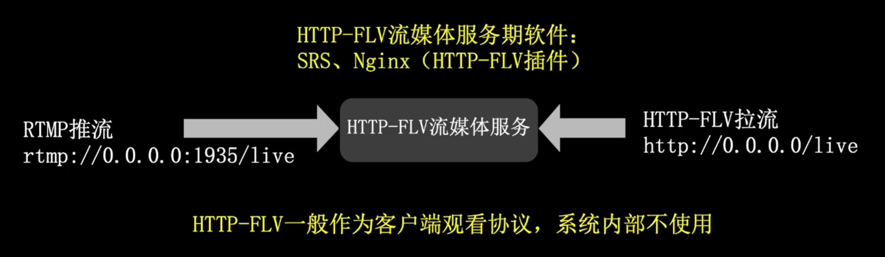

流行方案：
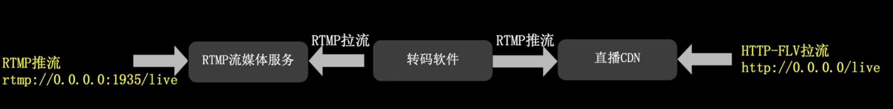

---

# HLS
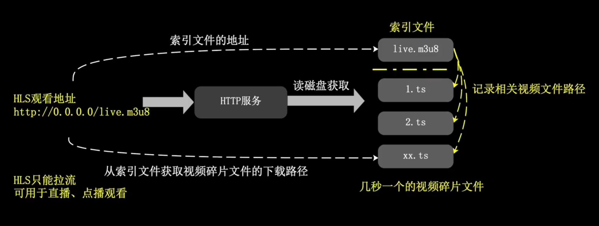
- HLS 严格来说并不是流媒体协议，而是`静态文件传输协议`。
  - HLS 将静态视频文件写入到磁盘，然后用户请求时 (通过 HTTP 协议 )，先下载一个以`m3u8`结尾的**索引文件**，再从磁盘读取静态视频文件，这些静态视频文件一般称为`ts`文件。
  - 这会造成硬盘的寿命缩短，建议的做法是将一部分 RAM 空间挂在到某个位置进行写入，然后用户请求时，再从 RAM 中读取视频文件，这样就可以避免反复擦写磁盘。
  - 播放的时候，网页中需要加入 `hls.js` 库
    - Apple 设备是原生支持 HLS 协议的。

点播场景 (点击进度条马上播放对应的视频片段)：
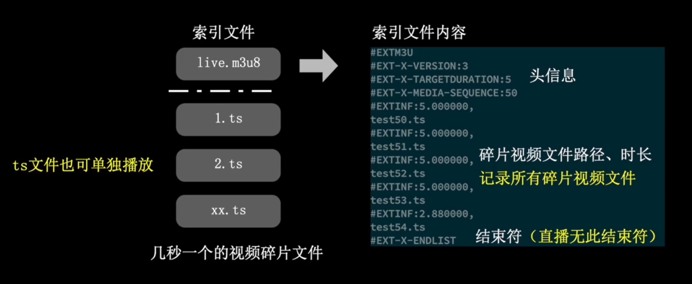
- 由于 ts 文件都是**静态且无状态**的，因此 HLS 对 CDN 直播的支持非常友好，可以轻松实现**秒开**, 比 MP4, FLV 视频的播放速度更快。

直播场景：
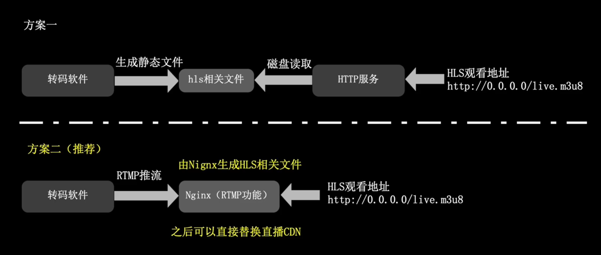
- 方案一是转码软件直接生成 HLS 协议的 ts 文件，然后保存到磁盘上，用户用过 HTPP 协议下载这些 ts 文件进行播放。
- 方案二 (推荐): 是转码软件通过 RTMP 推流到 Nginx(带 RTMP 插件), 然后由 Nginx 生成 ts 相关文件 (之后可以将它直接替换为直播 CDN)，用户这一端只需要走 HTTP 协议在 Nginx (或直播 CDN) 这一层下载静态文件进行播放。

直播时的 HLS 文件
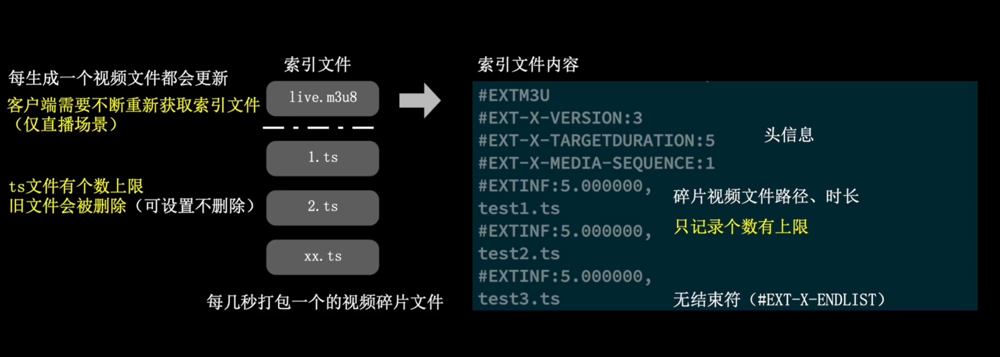
- 每次生成新 ts 文件时，m3u8 文件都会被更新
- 值得留意的是 ts 文件的数量和大小都是有限的，因此经过一段时间后，最旧的 ts 文件会被删除，此时**客户端需要不断定时获取 m3u8 文件**，以获取最新的 ts 文件。
- 注意：
  - HLS 协议在直播方面是没有什么延迟优势的，它的延迟在 5-30 之间，甚至有可能到达 1 分钟的延迟。
  - HLS 的直播优势是 ts 视频碎片文件可以一直保留不删除，这就不需要花额外的计算资源去保存录像。它在点播和录播是比较简单的，只需要修改 m3u8 文件即可。

HLS 的二级索引
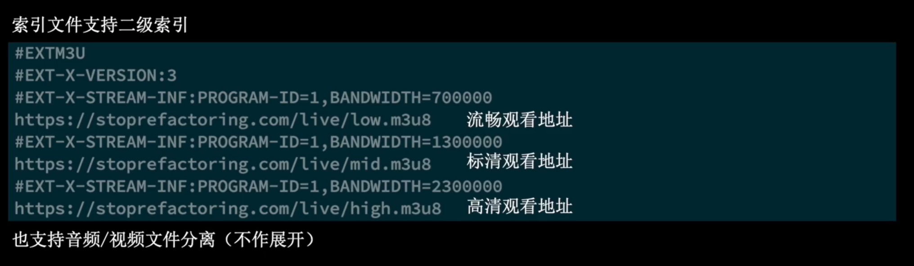
- 可以将不同分辨率的 ts 文件整合到一个索引文件中，很多视频网站在分辨率的选择上会使用的`auto`就来自于此。

使用 HLS 时缓解磁盘压力的办法：
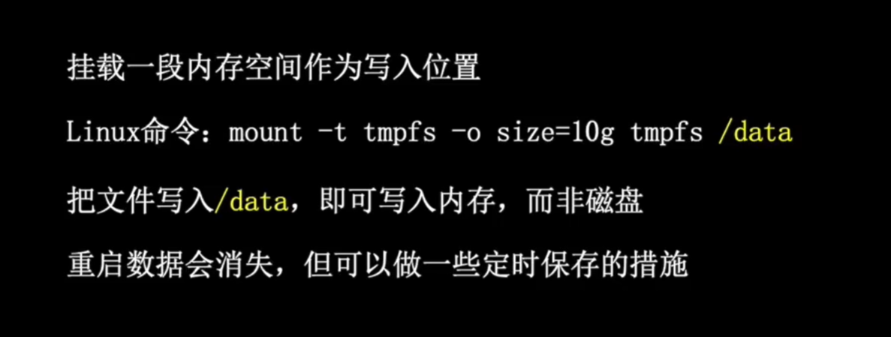
- 使用`mount -t tmpfs -o size=1g tmpfs /data` 将 RAM 挂载到 /data 目录下，然后使用`/data` 目录保存 HLS 的 ts 文件就相当于写入到内存而不是磁盘中了。但是需要注意，如果服务器重启，RAM 中的数据会丢失。
  - 根据 RAM 的大小修改 size 的值

---

# WebRTC
WebRTC 是谷歌推出的实时点对点的音视频传输协议，它支持`音视频通话`和`音视频直播`。建立通信后，它可以不断以流式发送数据。
- 延迟很低，理论上可以做到 1s 以内。
- 播放地址以`webrtc://`开头，推流地址与播放地址相同。

WebRTC 在直播时需要搭建服务器：
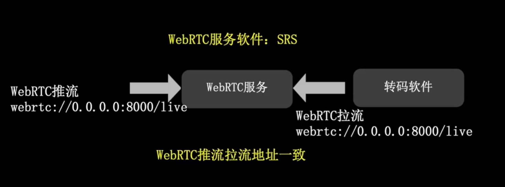
- 流媒体服务软件可以使用 SRS
    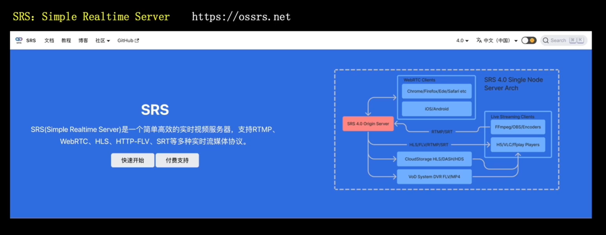
    - 4.0 版本已经囊括了 RTMP, HLS, WebRTC, HTTP-FLV 等主流协议。

---

# RTSP
一般不用做直播场景，因为现代的主流浏览器不播放。
- RTSP 一般用在摄像头等硬件设备的实时视频流观看和推送上。
- 优点:
  - 支持 TCP/UDP切换, 支持推流/拉流，支持点播/直播
- web 领域一般不使用 RTSP

----
问:
1. 什么是 B 帧？
2. 什么是 I 帧？