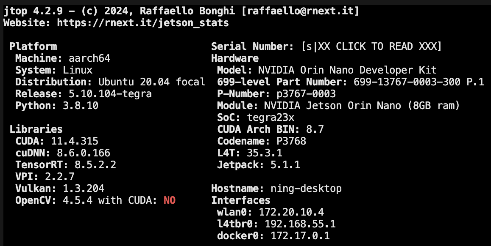

# 给 Jetson Orin Nano 安装支持 CUDA 的 OpenCV 4.10
在[intro 笔记](./intro.md#安装必备库)中，通过安装`jetson-stats`工具包，我们可以借助`sudo jtop`命令，并用键盘的数字 7 切换到`7 info`页面，查看当前系统中已经安装的依赖库，以及还缺少哪些依赖库。

在这里，我们会看到除了`OpenCV with CUDA`之外的依赖库都已经安装好了。



## 下载源码
1. 下载 OpenCV 源码
    ```shell
    git clone https://github.com/opencv/opencv.git
    ```
    - 如果想要编译指定版本的 OpenCV, 推荐去 [release](https://github.com/opencv/opencv/releases) 页面找对应的源码包。

2. [可选，但是推荐] 为了方便后续学习，可以下载 OpenCV 的 Contrib 扩展模块的源码
    ```shell
    git clone https://github.com/opencv/opencv_contrib.git
    ```
    - 同理，如果 OpenCV 是某个特定版本 (而非仓库源码直接提供的最新版), 则需要去选择对应版本的 contrib 扩展模块源码包，指定的 OpenCV 版本可以在[tag](https://github.com/opencv/opencv_contrib/tags)中找到。
    - contrib 的代码需要与 OpenCV 的源码分开放，方面后面操作。


## 编译前的准备工作
1. 卸载原有的 OpenCV
    ```shell
    sudo apt-get purge libopencv*
    sudo apt-get update
    ```
    - 不建议使用`sudo apt-get autoremove`!! 这个命令会把一些卸载 OpenCV 之后的无关软件包一同卸载，容易影响到未来的某些应用。

2. 更新 pip
    ```shell
    pip3 install --upgrade pip
    ```


3. 更新 numpy
   - **更新 numpy 之前不要直接安装最新版的 numpy**!! 多个 numpy 版本的留存很容易出现 `core dumped` 错误！
    ```shell
    sudo pip3 uninstall numpy
    pip3 list | grep numpy # 检查 numpy 是否已经被卸载
    pip3 install numpy
    ```


4. 确保已经安装 CMake
    ```shell
    sudo apt install cmake g++ 
    ```

5. 安装编译需要的依赖包
    ```shell
    # 以下依赖包列表是整合了网上搜到的所有可能用到的包，不知道有没有用，反正都装了一遍，编译没有出问题...
    sudo apt-get install \
    build-essential cmake git unzip pkg-config \
    libglew-dev \
    libtiff5-dev \
    zlib1g-dev \
    libjpeg-dev \
    libpng-dev \
    libjasper-dev \
    libavcodec-dev \
    libavformat-dev \
    libavutil-dev \
    libpostproc-dev \
    libswscale-dev \
    libeigen3-dev \
    libtbb-dev \
    libgtk2.0-dev \
    libcanberra-gtk* \
    python3-dev python3-numpy python3-pip \
    libxvidcore-dev libx264-dev libgtk-3-dev \
    libtbb2 libdc1394-22-dev \
    libv4l-dev v4l-utils \
    libgstreamer1.0-dev libgstreamer-plugins-base1.0-dev \
    libavresample-dev libvorbis-dev libxine2-dev \
    libfaac-dev libmp3lame-dev libtheora-dev \
    libopencore-amrnb-dev libopencore-amrwb-dev \
    libopenblas-dev libatlas-base-dev libblas-dev \
    liblapack-dev gfortran \
    libhdf5-dev protobuf-compiler \
    libprotobuf-dev libgoogle-glog-dev libgflags-dev
    ```
    - 一些比较老的博客会让安装`libpng12-dev`这个包，但是在 ubuntu 16.04 之后这个包就不再被支持了，替代方案是安装`libpng-dev` 
    - 如果安装`libjasper-dev`时出现`E: Unable to locate package libjasper-dev`，这是因为 ubuntu 20.04 系统的软件源中已经移除了这个软件包。 
      - 暂时不安装它，后续编译的时候也不开启 `JPEG2000` 功能的支持，即 CMake 的时候使用参数`-D BUILD_JASPER=OFF`.

6. 再次执行指令检查并安装 python3 环境
    ```shell
    sudo apt-get install python3-dev python3-numpy python3-py python3-pytest
    ```


7. 为了确保有足够的内存进行编译，需要扩展 swap 空间 (用磁盘空间模拟 RAM)
    ```shell
    sudo fallocate -l 4G /var/swapfile    # 增加 4G 的 swap 空间
    sudo chmod 600 /var/swapfile
    sudo mkswap /var/swapfile
    sudo swapon /var/swapfile
    ```
      - 使用`sudo jtop`来查看 swap 是否已经扩展：
      
      


## 开始编译
1. 进入到 OpenCV 源码目录 并创建一个 build 目录存放临时文件
    ```shell
    cd opencv-xxx # xxx 是版本号
    mkdir build 
    cd build 
    ```

2. 使用 CMake 配置项目 (复制没有注释的版本，并且在终端中粘贴时选择`粘贴为一行`)
   - 有部分注释的 cmake 指令：
        ```bash
        cmake -D CMAKE_BUILD_TYPE=Release \
                -D CMAKE_INSTALL_PREFIX=/usr/local \   # 不要随便修改这个安装路径，不然 python3 无法正常索引，手动添加索引路径很麻烦
                -D BUILD_PNG=ON \ 	# 启用 PNG 图片格式的支持。
                -D OPENCV_ENABLE_NONFREE=ON \  # 启用 OpenCV 中的非自由算法，如 SIFT 和 SURF 等。
                -D INSTALL_PYTHON_EXAMPLES=ON \ 
                -D BUILD_TIFF=OFF \  # 不编译 TIFF 文件格式支持。
                -D BUILD_TBB=OFF \  # 不编译 TBB 支持。
                -D BUILD_JPEG=ON \  # 启用 JPEG 图片格式支持。
                -D BUILD_JASPER=OFF \  # 不编译 Jasper 库，即不添加 JPEG2000 格式支持。
                -D BUILD_ZLIB=OFF \  # 不编译 ZLIB 支持，通常用于压缩和解压缩。
                -D BUILD_EXAMPLES=OFF \	 # 不编译例程，这可以加快编译的速度
                -D BUILD_JAVA=OFF \     # 不编译 java 接口
                -D BUILD_opencv_python2=OFF \   # 不编译 python2 的库
                -D BUILD_opencv_python3=ON \	 # 编译 python3 的库
                -D ENABLE_PRECOMPILED_HEADERS=OFF \  # 不使用预编译头文件，有时可以减少编译时间。
                -D ENABLE_NEON=ON \  # 启用 ARM NEON 优化，适用于 ARM 架构。
                -D WITH_OPENCL=OFF \  # 不使用 OpenCL 进行加速。
                -D WITH_OPENMP=OFF \  # 不使用 OpenMP 进行加速。
                -D WITH_FFMPEG=ON \  # 启用 FFMPEG 支持，用于视频处理。
                -D WITH_GSTREAMER=ON \		#使能 CSI 硬件管道	如果要在 opencv 使用 Jetson 的 CSI 摄像头的话这两个指令一定要加上并打开
                -D WITH_GSTREAMER_0_10=ON \	    # 使能 CSI 硬件管道 (启用对旧版 GStreamer 的支持。)
                -D WITH_CUDA=ON \       # 启用 CUDA 加速
                -D WITH_CUDNN=ON \      # 如果要在 dnn 模块中使用 CUDA 加速，需要打开该指令
                -D OPENCV_DNN_CUDA=ON \	 # 如果要在 dnn 模块中使用 CUDA 加速，需要打开该指令
                -D ENABLE_FAST_MATH=1 \  # 计算加速，建议打开这个指令，但是这会让编译时间增加
                -D CUDA_FAST_MATH=1  \  # CUDA 加速，快速数学库
                -D WITH_CUBLAS=1 \      # 基本线性代数子程序的加速。
                -D WITH_LIBV4L=ON \     # 启用 Video4Linux，用于摄像头支持。
                -D WITH_GTK=ON \        # 启用 GTK，用于图形用户界面。
                -D WITH_VTK=OFF \       # 不使用 Visualization Toolkit，通常用于 3D 图像处理。
                -D WITH_TBB=ON \        # 启用 Intel Threading Building Blocks 进行并行计算优化。
                -D WITH_1394=OFF \      # 不使用 IEEE 1394 驱动，用于处理某些类型的摄像头。
                -D WITH_OPENEXR=OFF \   # 不使用 OpenEXR 格式支持，通常用于处理高动态范围的图像。
                -D CUDA_TOOLKIT_ROOT_DIR=/usr/local/cuda-11 \    # 指定 CUDA 工具包的安装路径。这里要根据当前设备使用 cuda 设置路径！
                -D CUDA_ARCH_BIN=5.3 \   # 指定 CUDA 架构，这个参数需要根据你的 GPU 型号来设置。
                -D CUDA_ARCH_PTX="" \    # 不生成 PTX 代码，PTX 为中间代码，可以在不同的 CUDA 版本间提供一定的兼容性
                -D INSTALL_C_EXAMPLES=OFF \  # 不安装 C 语言示例代码。
                -D INSTALL_TESTS=OFF \      # 不安装测试代码。
                -D OPENCV_EXTRA_MODULES_PATH=../../opencv_contrib-4.10.0/modules \  # 指定 opencv_contrib 扩展包的路径，这里需要检查和你自己的路径相同
                ..     # 用来指定 CMakeList.txt 文件的位置
        ```
    - 无注释版本：
        ```bash
        cmake -D CMAKE_BUILD_TYPE=Release \
                -D CMAKE_INSTALL_PREFIX=/usr/local  \
                -D BUILD_PNG=ON \
                -D OPENCV_ENABLE_NONFREE=ON \
                -D INSTALL_PYTHON_EXAMPLES=ON \
                -D BUILD_TIFF=OFF \
                -D BUILD_TBB=OFF \
                -D BUILD_JPEG=ON \
                -D BUILD_JASPER=OFF \
                -D BUILD_ZLIB=OFF \
                -D BUILD_EXAMPLES=OFF \
                -D BUILD_JAVA=OFF \
                -D BUILD_opencv_python2=OFF \
                -D BUILD_opencv_python3=ON \
                -D ENABLE_PRECOMPILED_HEADERS=OFF \
                -D ENABLE_NEON=ON \
                -D WITH_OPENCL=OFF \
                -D WITH_OPENMP=OFF \
                -D WITH_FFMPEG=ON \
                -D WITH_GSTREAMER=ON \
                -D WITH_GSTREAMER_0_10=ON \
                -D WITH_CUDA=ON \
                -D WITH_CUDNN=ON \
                -D OPENCV_DNN_CUDA=ON \
                -D ENABLE_FAST_MATH=1 \
                -D CUDA_FAST_MATH=1  \
                -D WITH_CUBLAS=1 \
                -D WITH_LIBV4L=ON \
                -D WITH_GTK=ON \
                -D WITH_VTK=OFF \
                -D WITH_TBB=ON \
                -D WITH_1394=OFF \
                -D WITH_OPENEXR=OFF \
                -D CUDA_TOOLKIT_ROOT_DIR=/usr/local/cuda-11 \
                -D CUDA_ARCH_BIN=5.3 \
                -D CUDA_ARCH_PTX="" \
                -D INSTALL_C_EXAMPLES=OFF \
                -D INSTALL_TESTS=OFF \
                -D OPENCV_EXTRA_MODULES_PATH=../../opencv_contrib-4.10.0/modules\
                ..
        ```

3. 编译并安装
    ```shell
    make -j$(nproc)      # 使用所有 CPU 核心来进行编译，也可以手动指定数量，比如 make -j8
    sudo make install    # 安装编译好的代码
    sudo ldconfig        # 更新动态链接库 (它会自动查看配置文件/etc/ld.so.conf 及其包含的目录（通常包括/usr/local/lib），并更新缓存。)
    ```
    - 安装完成后，可以用`sudo jtop`, 用数字按键 7 切换到 info 查看是否已经安装好了 CUDA 版本的 OpenCV
    

4. 简单测试一下 OpenCV 的 python 接口是否能正常使用
    ```shell
    python3 -c "import cv2; print(cv2.__version__)" 
    ```
    - 如果没有报错，且输出的版本号是你刚刚编译的 OpenCV 版本号，那么恭喜你，OpenCV 安装成功！

    - 如果报错`ModuleNotFoundError: No module named 'cv2'`, 则说明 Python 环境没有正确找到 OpenCV 的 Python 绑定。
    - 解决方法 1 (推荐):
        ```shell
        # 找出 OpenCV 的 python 接口：
        sudo find /usr/local/lib/ -type f -name "cv2*.so"
            # 比如输出 /usr/local/lib/python3.8/site-packages/cv2/python-3.8/cv2.cpython-38-aarch64-linux-gnu.so
        # 找到 python 库的标准路径
        python3 -m site --user-site   
            # 比如输出：/home/ning/.local/lib/python3.8/site-packages

        # 将 cv2 模块复制到上面输出的 python 标准库路径中
        cp "第一步输出的 cv2.*.so 文件路径" "第二步输出的 site-packages 路径" 
            # 比如：cp /usr/local/lib/python3.8/site-packages/cv2/python-3.8/cv2.cpython-38-aarch64-linux-gnu.so /home/ning/.local/lib/python3.8/site-packages/
        ```
    - 解决方法 2:
        ```shell
        # 找出 OpenCV 的 python 接口 (.so 文件)：
        sudo find /usr/local/lib/ -type f -name "cv2*.so"   
            # 比如输出 /usr/local/lib/python3.8/site-packages/cv2/python-3.8/cv2.cpython-38-aarch64-linux-gnu.so

        # 添加 OpenCV 的 python 接口临时输出到 PYTHONPATH 中 (这种方式要永久生效的话需要修改 .bashrc 文件)
        export PYTHONPATH=$PYTHONPATH:/usr/local/lib/python3.8/site-packages  
            # python 的版本以及 so 文件的路径要根据上一个命令的输出情况修改
        ```
    - 解决方法 3:
        ```shell
        # 找出 OpenCV 的 python 接口：
        sudo find /usr/local/lib/ -type f -name "cv2*.so"
            # 比如输出 /usr/local/lib/python3.8/site-packages/cv2/python-3.8/cv2.cpython-38-aarch64-linux-gnu.so
        # 找到 python 库的标准路径
        python3 -m site --user-site   
            # 比如输出：/home/ning/.local/lib/python3.8/site-packages
        # 创建软连接 (这种方式存在的风险是如果误删了编译好的文件，OpenCV 就会无法使用)
        ln -s "cv2.*.so 文件路径" "python 标准库的 site-packages 路径/cv2.so"
        ```


5. 网上抄了一个 cpp 写的人脸检测代码 (**要用到摄像头**)，测一下除了 python 之外，cpp 能不能用上编译好的 OpenCV:
    ```cpp
    #include <iostream>
    #include <string>
    #include <opencv2/opencv.hpp>
    #include <opencv2/core.hpp>
    #include <opencv2/highgui.hpp>
    #include <opencv2/imgproc.hpp>
    #include <opencv2/objdetect.hpp>
    #include <opencv2/imgproc/types_c.h>
    #include <opencv2/videoio.hpp>
    #include <opencv2/cudaobjdetect.hpp>
    #include <opencv2/cudaimgproc.hpp>

    using namespace std;
    using namespace cv;


    int main( int argc, char** argv )
    {
        // Initialize OpenCV with CUDA support
        cv::cuda::setDevice(0); // Use the first CUDA device
        cv::cuda::printCudaDeviceInfo(0);


        VideoCapture cap(1);
        //创建显示窗口
        namedWindow("faceWithCUDA", WINDOW_AUTOSIZE);

        cv::Mat img;

        cv::cuda::GpuMat gpuImg, gpuImgGray;

        cv::cuda::GpuMat objbuf;


        cv::Ptr<cv::cuda::CascadeClassifier> faceCascade = cv::cuda::CascadeClassifier::create("/home/tuotuo/opencv-4.5.3/data/haarcascades_cuda/haarcascade_frontalface_alt.xml");


        //逐帧显示
        while(true)
        {

            cap >> img;

            gpuImg.upload(img);

            cv::cuda::cvtColor(gpuImg, gpuImgGray, cv::COLOR_BGR2GRAY);

            faceCascade->detectMultiScale(gpuImgGray, objbuf);


            std::vector<cv::Rect> faces;
            faceCascade->convert(objbuf, faces);

            for (int i = 0; i < faces.size(); i++)
            {
                cv::rectangle(img, faces[i], cv::Scalar(255, 0, 0), 2);
            }


            imshow("faceWithCUDA",img);

            int keycode = cv::waitKey(30) & 0xff ; //ESC 键退出
                if (keycode == 27) break ;
        }

        cap.release();
        destroyAllWindows() ;
    }
    ```
   - 运行代码后，记得运行`sudo jtop`查看一下 GPU 和 CPU 使用情况。

---
# 恢复 swap 空间为原来的状态
1. 停止使用前面创建的 swap 空间
    ```shell
    sudo swapoff /var/swapfile
    ```
2. 删除 swap 空间
    ```shell
    sudo rm /var/swapfile
    ```
    - 如果不删除 swap 空间，下次开机的时候会继续使用这个 swap 空间，但是这个 swap 空间是我们手动创建的，不是系统默认的，所以不建议保留。

---

# 一些可能存在的编译问题

## 关于非法指令核心转储修正的报错
这个错误大多时候是应为`包重复`或者`包版本有错导`致的。但也有少数情况下，包没错，版本也没错，还是报错，可以尝试这样解决，在终端中使用 python 的时候指定架构：
```shell
OPENBLAS_CORETYPE=ARMV8 python
```
或者直接写为启动 shell 时必定执行的命令：
```shell
sudo vim ~/.bashrc               # 打开 .bashrc 文件
export OPENBLAS_CORETYPE=ARMV8   # 写入到 .bashrc 文件中并用 "wq" 退出编辑
source ~/.bashrc                 # 使配置生效
```


---

# 参考资料
- [x] OpenCV 的官方 tutorial: https://docs.opencv.org/4.10.0/d6/d15/tutorial_building_tegra_cuda.html#autotoc_md859
  - 注意它的代码都是以安装 OpenCV 3.1.0 为例子的，不要直接照搬代码进行编译！

- [x] 演示 OpenCV 4.5.1 版本的编译&安装：https://blog.csdn.net/weixin_47407066/article/details/123954474

- [x] 测试 & 安装好的 OpenCV: https://blog.csdn.net/m0_53284507/article/details/134499858

