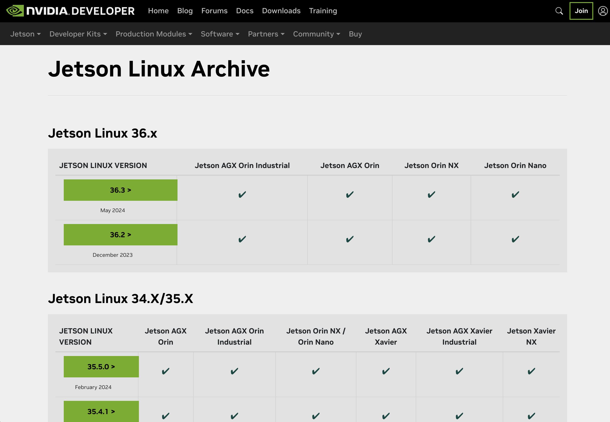
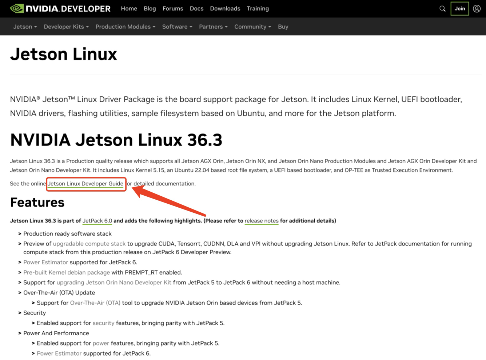
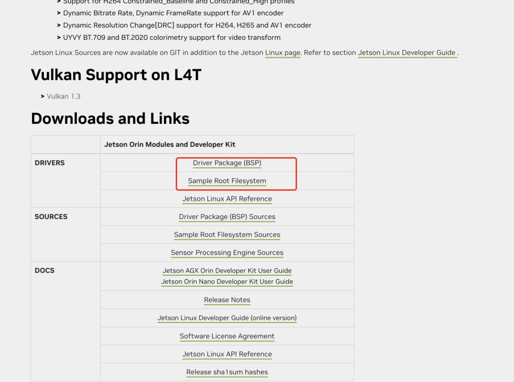
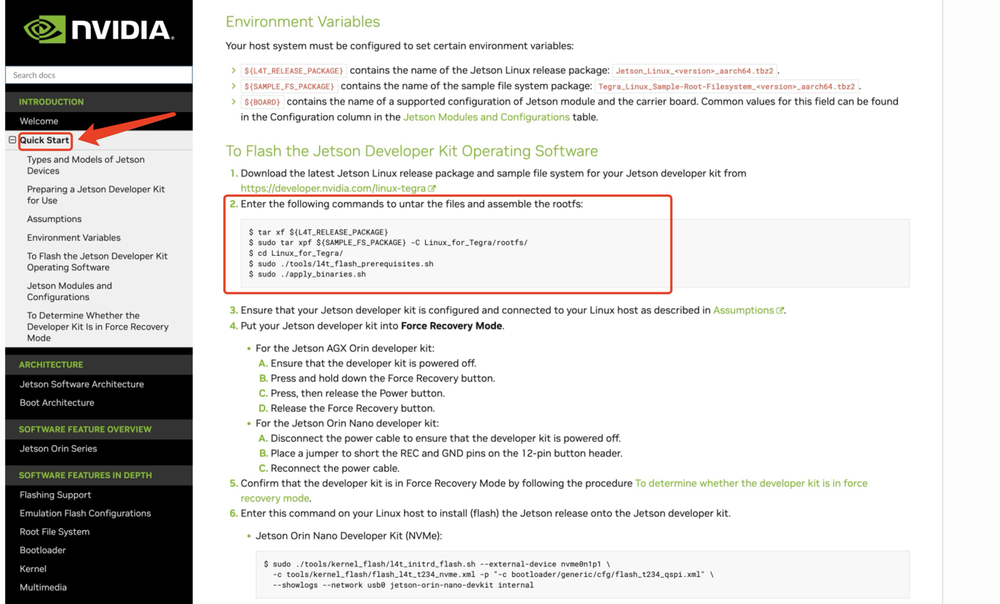
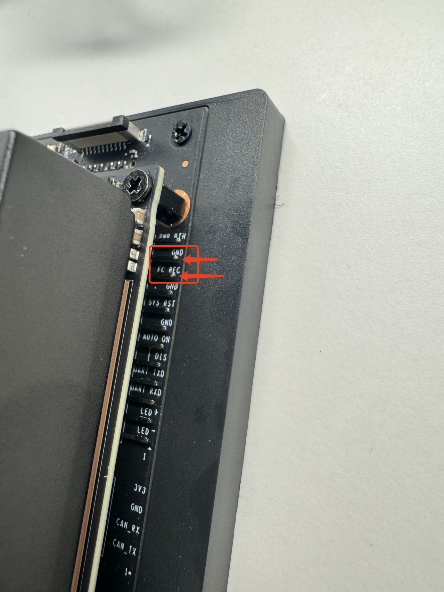
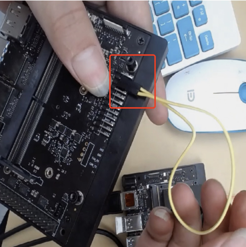
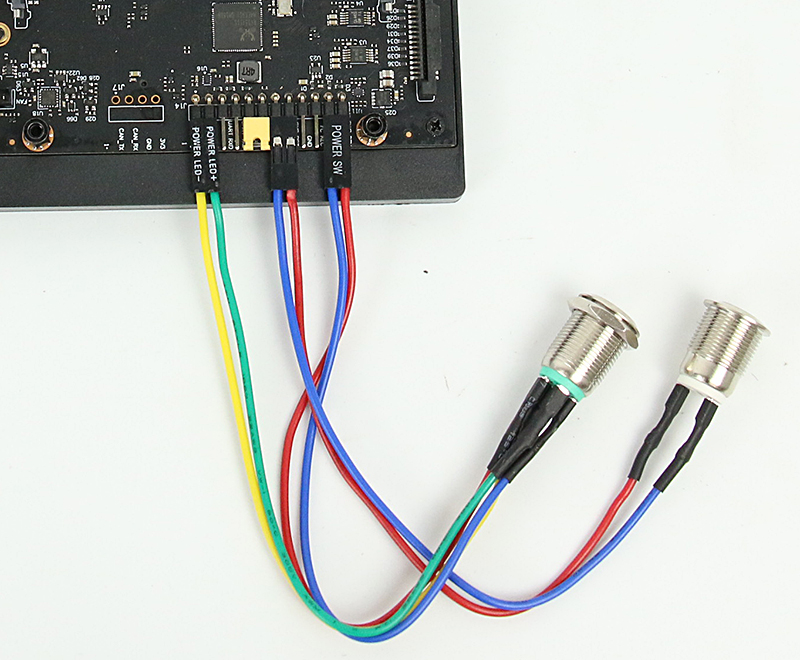
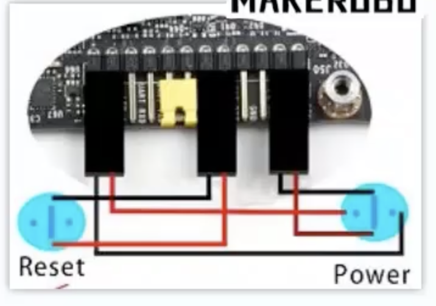

# 系统烧录
Jetson 系列产品的系统烧录方法有两种：
- [x] 使用英伟达官方提供的烧录工具 `SDK manager` 进行烧录 (此软件运行在 Linux 系统上)。
  - SDK manger 下载链接：https://developer.nvidia.com/sdk-manager
- [x] 使用 Ubuntu 系统上搭建系统烧录目录 Linux_for_Tegra, 使用 `flash.sh` 进行烧录。
  - 这种方式还可以直接进行 Jetson 系统进行`系统备份和恢复`!


SDK manager 的烧录方式基本就是按照软件提示进行，不是很复杂，整个过程比较麻烦的就是需要一个 NVIDIA 账号。这里主要介绍一下第二种方式。

---

## 使用 Ubuntu 系统进行烧录 (mac 虚拟机)
由于英伟达官方提供的烧录工具是需要使用 Ubuntu 系统的，因此我们首先需要准备一个 Ubuntu 系统。
- 这里用的是 M1 max (64GB) 的 MacBook pro, 所以要安装 Ubuntu 系统的话，需要准备一个 parallel Desktop 虚拟机 (或者其他功能可以兼容的虚拟机)
  - ubuntu 20.04.5 for arm 的镜像下载地址：https://cdimage.ubuntu.com/releases/20.04.5/release/
    - 安装可以参考教程，里面提到的"与 Mac 隔离"可以不勾选：https://todoit.tech/k8s/install/ubuntu.html#%E5%88%9B%E5%BB%BA%E8%99%9A%E6%8B%9F%E6%9C%BA%E5%AE%9E%E4%BE%8B
    - 如果安装 server 的话，是没有图形界面的，[需要自己安装一个图形界面包](https://blog.csdn.net/badboy_1990/article/details/121412618)
  - 除了安装 server 之外，parallel desktop 本身就提供一键下载&安装 Ubuntu 镜像的功能，直接创建一个新虚拟机之后点 Ubuntu 系统的图标下载就可以了。


安装完虚拟机之后，**确保能联网**之后，安装一些依赖库：
```shell
sudo apt-get update
sudo apt-get install qemu-user-static
sudo sudo apt-get install python    # 可能会报错找不到安装包, 忽略也没事, 因为默认是去找python2, 这个早就被废弃了, 后面安装烧录驱动的时候, 跑preliminary脚本会安装python3的
```

下面的步骤默认 Ubuntu 系统**有图形界面**。

1. 下载 Jetson 设备要用的**系统驱动** (推荐在虚拟机里面直接打开浏览器进入网站操作)：
   - 下载链接：https://developer.nvidia.com/embedded/linux-tegra-archive
    1. 选择 jetson linux 镜像版本
    
    2. 选择好版本之后，页面上也有对应这个**系统版本的开发指导说明书**(最全面的文档资料), 在新标签中打开它备用：
       
    3. 在第一步选择系统镜像的页面，往下滑，下载驱动包：
    

2. 去到开发指导说明书，找到`quick start`分类，按照提供的命令解压&安装驱动包：
    
    ```shell
    tar xf  <下载的 driver package 的名字>     # 解压过程比较久，看起来可能像卡住
    sudo tar xpf <下载的 sample-root 压缩包> -C Linux_for_Tegra/rootfs/     # -C 表示解压到指定目录，这个解压过程也比较久，因为压缩包有 1.4G 左右
    cd Linux_for_Tegra/         # 这个是解压出来的文件夹
    sudo ./tools/l4t_flash_prerequisites.sh
    sudo ./apply_binaries.sh
    ```


4. 烧录系统到 Jetson Orin Nano
    1. 将 Jetson Orin Nano 关机，**拔掉电源线以确保设备完全断电**，然后用杜邦线短接 `FC_REC` 和 `GND` 两个引脚。
    
    

    2. 用 type-C 数据线连接电脑和 Jetson 设备
    3. 重新接上电源线
       - 此时，**如果使用的是虚拟机，虚拟机软件会弹出一个选项框，我们要选择将设备连接到虚拟机中**, 然后去`设备`.
    4. 从上面提到的对应系统的开发文档说明书中，确保打开的是左侧的`quick start`分类，然后下滑，找到对应的存储设备烧录命令，复制对应的终端命令。
        - 比如 SSD 硬盘的烧录命令对应的是`Jetson Orin Nano Developer Kit and Jetson Orin NX Developer Kit (NVMe)`下给出的指令。
        - 这里**一定要确保打开了对应系统版本的开发文档说明书**，已经确认过，不同版本的系统烧录命令略有不同!!!
    5. 确认当前位于`Linux_for_Tegra`目录下，然后执行复制好的烧录命令。
       - 在执行烧录的过程中，**系统可能会进入休眠，导致烧录超时**!! 所以最好是一直在电脑旁边等，时不时动一下鼠标!!!


烧录过程中，执行到下图的`step 3: start the flashing process`时，我们还需要额外的操作：

- 此时，**Jetson 设备会自动重启**，如果是使用虚拟机的话，这时候虚拟机软件会再次询问是否要将设备连接到虚拟机系统上，这一步要快速操作！
  - 如果操作不及时，就要重新跑烧录命令，重新开始烧录过程！


烧录结束后，Jetson 设备开机，第一次进系统时，设置完时间，wifi, 用户名和密码之后，会有一个询问，这里没截图，意思是`App partition size`的空间要设置多大，默认填入的数值是当前存储设备 (比如 SSD) 剩余的全部空间，此时一般是直接用它写入的那个数值，这个操作的意思是：`将设备剩余的空间全部格式化, 用作Jetson系统的存储空间`.

--- 

# Jetson Orin Nano 外接实体开关
按照下图的方式接线即可，需要注意有个黄色的跳线，它是用来`禁用上电时自动开机`功能的。




---

# Jetson Orin Nano 远程桌面连接
这里推荐使用 NoMachine 软件进行远程桌面连接，需要在 Jetson Orin Nano 上安装 NoMachine 服务端，在本地电脑上安装 NoMachine 客户端。
- Jetson orin nano 上的服务端下载地址：https://downloads.nomachine.com/download/?id=114&distro=ARM
  - 下载之后用 scp 上传到 Jetson 上 (或者用 ftp 上传), 然后用命令安装：`sudo dpkg -i nomachine_xxx版本_arm64.deb`

