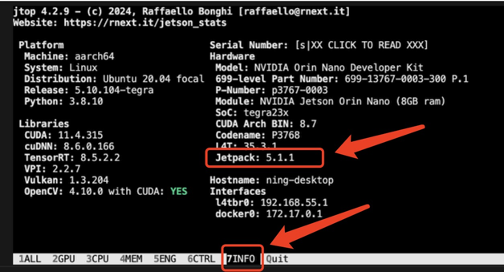
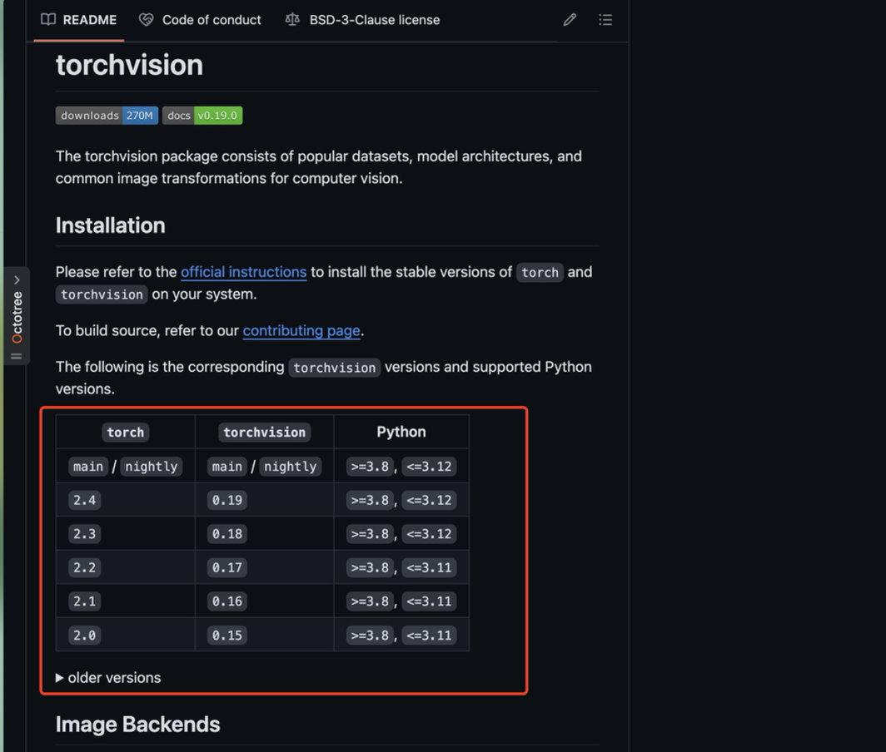

# 系统烧录
Jetson 系列产品的系统烧录方法有两种：
- [x] 使用英伟达官方提供的烧录工具 `SDK manager` 进行烧录 (此软件运行在 Linux 系统上)。
  - SDK manger 下载链接：https://developer.nvidia.com/sdk-manager
- [x] 使用 Ubuntu 系统上搭建系统烧录目录 Linux_for_Tegra, 使用 `flash.sh` 进行烧录。
  - 这种方式还可以直接进行 Jetson 系统进行`系统备份和恢复`!


SDK manager 的烧录方式基本就是按照软件提示进行，不是很复杂，整个过程比较麻烦的就是需要一个 NVIDIA 账号。这里主要介绍一下第二种方式。

---

## 使用 Ubuntu 系统进行烧录 (mac 虚拟机)
由于英伟达官方提供的烧录工具是需要使用 Ubuntu 系统的，因此我们首先需要准备一个 Ubuntu 系统。
- 这里用的是 M1 max (64GB) 的 MacBook pro, 所以要安装 Ubuntu 系统的话，需要准备一个 parallel Desktop 虚拟机 (或者其他功能可以兼容的虚拟机)
  - ubuntu 20.04.5 for arm 的镜像下载地址：https://cdimage.ubuntu.com/releases/20.04.5/release/
    - 安装可以参考教程，里面提到的"与 Mac 隔离"可以不勾选：https://todoit.tech/k8s/install/ubuntu.html#%E5%88%9B%E5%BB%BA%E8%99%9A%E6%8B%9F%E6%9C%BA%E5%AE%9E%E4%BE%8B
    - 如果安装 server 的话，是没有图形界面的，[需要自己安装一个图形界面包](https://blog.csdn.net/badboy_1990/article/details/121412618)
  - 除了安装 server 之外，parallel desktop 本身就提供一键下载&安装 Ubuntu 镜像的功能，直接创建一个新虚拟机之后点 Ubuntu 系统的图标下载就可以了。


安装完虚拟机之后，**确保能联网**之后，安装一些依赖库：
```shell
sudo apt-get update
sudo apt-get install qemu-user-static
sudo sudo apt-get install python    # 可能会报错找不到安装包, 忽略也没事, 因为默认是去找python2, 这个早就被废弃了, 后面安装烧录驱动的时候, 跑preliminary脚本会安装python3的
```

下面的步骤默认 Ubuntu 系统**有图形界面**。

1. 下载 Jetson 设备要用的**系统驱动** (推荐在虚拟机里面直接打开浏览器进入网站操作)：
   - 下载链接：https://developer.nvidia.com/embedded/linux-tegra-archive
    1. 选择 jetson linux 镜像版本
    
    2. 选择好版本之后，页面上也有对应这个**系统版本的开发指导说明书**(最全面的文档资料), 在新标签中打开它备用：
       
    3. 在第一步选择系统镜像的页面，往下滑，下载驱动包：
    

2. 去到开发指导说明书，找到`quick start`分类，按照提供的命令解压&安装驱动包：
    
    ```shell
    tar xf  <下载的 driver package 的名字>     # 解压过程比较久，看起来可能像卡住
    sudo tar xpf <下载的 sample-root 压缩包> -C Linux_for_Tegra/rootfs/     # -C 表示解压到指定目录，这个解压过程也比较久，因为压缩包有 1.4G 左右
    cd Linux_for_Tegra/         # 这个是解压出来的文件夹
    sudo ./tools/l4t_flash_prerequisites.sh
    sudo ./apply_binaries.sh
    ```


4. 烧录系统到 Jetson Orin Nano
    1. 将 Jetson Orin Nano 关机，**拔掉电源线以确保设备完全断电**，然后用杜邦线短接 `FC_REC` 和 `GND` 两个引脚。
    
    

    2. 用 type-C 数据线连接电脑和 Jetson 设备
    3. 重新接上电源线
       - 此时，**如果使用的是虚拟机，虚拟机软件会弹出一个选项框，我们要选择将设备连接到虚拟机中**, 然后去`设备`.
    4. 从上面提到的对应系统的开发文档说明书中，确保打开的是左侧的`quick start`分类，然后下滑，找到对应的存储设备烧录命令，复制对应的终端命令。
        - 比如 SSD 硬盘的烧录命令对应的是`Jetson Orin Nano Developer Kit and Jetson Orin NX Developer Kit (NVMe)`下给出的指令。
        - 这里**一定要确保打开了对应系统版本的开发文档说明书**，已经确认过，不同版本的系统烧录命令略有不同!!!
    5. 确认当前位于`Linux_for_Tegra`目录下，然后执行复制好的烧录命令。
       - 在执行烧录的过程中，**系统可能会进入休眠，导致烧录超时**!! 所以最好是一直在电脑旁边等，时不时动一下鼠标!!!


烧录过程中，执行到下图的`step 3: start the flashing process`时，我们还需要额外的操作：

- 此时，**Jetson 设备会自动重启**，如果是使用虚拟机的话，这时候虚拟机软件会再次询问是否要将设备连接到虚拟机系统上，这一步要快速操作！
  - 如果操作不及时，就要重新跑烧录命令，重新开始烧录过程！


烧录结束后，Jetson 设备开机，第一次进系统时，设置完时间，wifi, 用户名和密码之后，会有一个询问，这里没截图，意思是`App partition size`的空间要设置多大，默认填入的数值是当前存储设备 (比如 SSD) 剩余的全部空间，此时一般是直接用它写入的那个数值，这个操作的意思是：`将设备剩余的空间全部格式化, 用作Jetson系统的存储空间`.

----

## [可选] 修改 apt 源为国内镜像源
先备份原来的源文件，再修改源文件。
```shell
sudo cp /etc/apt/sources.list /etc/apt/sources.list.bak
sudo vim /etc/apt/sources.list
```
  - 修改内容为 (这是 ubuntu 20.04 用的)：
    ```bash
    deb http://mirrors.aliyun.com/ubuntu/ focal main restricted universe multiverse
    deb http://mirrors.aliyun.com/ubuntu/ focal-security main restricted universe multiverse
    deb http://mirrors.aliyun.com/ubuntu/ focal-updates main restricted universe multiverse
    deb http://mirrors.aliyun.com/ubuntu/ focal-backports main restricted universe multiverse

    # deb-src http://mirrors.aliyun.com/ubuntu/ focal main restricted universe multiverse
    # deb-src http://mirrors.aliyun.com/ubuntu/ focal-security main restricted universe multiverse
    # deb-src http://mirrors.aliyun.com/ubuntu/ focal-updates main restricted universe multiverse
    # deb-src http://mirrors.aliyun.com/ubuntu/ focal-backports main restricted universe multiverse

    ## 预发布源，不建议启用
    # deb http://mirrors.aliyun.com/ubuntu/ focal-proposed main restricted universe multiverse
    # deb-src http://mirrors.aliyun.com/ubuntu/ focal-proposed main restricted universe multiverse
    ```
    - 源地址可能会因各种原因不可用，到时候上网搜一份新的替换即可。

---

## 安装必备库

1. 安装 pip
```shell
sudo apt-get install python3-pip
sudo pip3 install -U pip           # 更新最新版本
```

2. 用 pip 安装 jetson-stats
```shell
sudo pip3 install jetson-stats
```
- 使用方式：在终端直接输入 `sudo jtop`
  - 通过按下键盘上方的数字切换不同的显示界面，一般刚安装的时候会比较关注`7 info`, 查看有哪些依赖没有安装。
    
    

3. 安装 jtop 中显示缺少的依赖库
```shell
sudo apt update                     # 或者 sudo apt-get update
sudo apt install nvidia-jetpack     # 这个库挺大的, 比较耗时, 装完大概消耗5-6GB的空间, 所以需要确保网速和空间都足够
```
 - 安装完成后，再使用一次 `sudo jtop` 查看除了`OpenCV`之外的依赖库是否都安装好了。
    


## 安装支持 CUDA 的 OpenCV (根据需求安装)
安装过程查看笔记 [OpenCV_CUDA_install](./OpenCV_CUDA_install.md).

----

## 配置 CUDA
nvidia-jetpack 中已经帮我们装好了 CUDA, 所以这里只需要配置一下即可：
1. 打开`~/.bashrc`文件
    ```shell
    sudo vim ~/.bashrc
    ```

2. 在文档末尾添加以下内容
    ```shell
    export CUDA_HOME=/usr/local/cuda-11.4
    export LD_LIBRARY_PATH=/usr/local/cuda-11.4/lib64:$LD_LIBRARY_PATH
    export PATH=/usr/local/cuda-11.4/bin:$PATH
    ```
    - 具体 cuda 版本可以根据`/usr/local`里的 cuda 文件夹版本号进行修改

3. 保存并查看配置
    ```shell
    source ~/.bashrc
    nvcc -V
    ```


---
## 安装 pytorch
1. 首先用`jtop`, 切换到 Info, 查看 JetPack 的版本，这里的版本是`5.1.1`


2. 去[NVIDIA 官网](https://catalog.ngc.nvidia.com/orgs/nvidia/containers/l4t-pytorch)和[pytorch 仓库](https://github.com/pytorch/vision)找到兼容的版本号
    
    
    - [博客](https://blog.csdn.net/jam12315/article/details/130264074) 中提到：实际上，在官网提供的轮子包里显示的 `Jetpack 5.1.1` 可用的版本组合是 `pytorch 1.14.0`，而 torchvision 对应的版本为`torchvision 0.15.1`. 

3. 安装依赖
    ```shell
    sudo apt-get -y install autoconf bc build-essential g++-8 gcc-8 clang-8 lld-8 gettext-base gfortran-8 iputils-ping libbz2-dev libc++-dev libcgal-dev libffi-dev libfreetype6-dev libhdf5-dev libjpeg-dev liblzma-dev libncurses5-dev libncursesw5-dev libpng-dev libreadline-dev libssl-dev libsqlite3-dev libxml2-dev libxslt-dev locales moreutils openssl python-openssl rsync scons python3-pip libopenblas-dev
    ```

4. 在[NVIDIA 官方仓库](https://developer.download.nvidia.com/compute/redist/jp/)里下载 torch 轮子
    - 先找到`V51`(因为 JetPack 版本是 5.1.1), 然后去到 pytorch 文件夹下，找到`torch-1.14.0a0+44dac51c.nv23.02-cp38-cp38-linux_aarch64.whl`进行下载。(pytorch 2.0.0 的编译模型功能我们目前用不到)
    - 安装
        ```shell
        pip3 install torch-1.14.0a0+44dac51c.nv23.02-cp38-cp38-linux_aarch64.whl
        ```


5. 用下面的命令从源码安装 torchvision
    ```shell
    # 装依赖
    sudo apt install libjpeg-dev zlib1g-dev libpython3-dev libavcodec-dev libavformat-dev libswscale-dev

    # 更新 pillow
    pip3 install --upgrade pillow

    # 下载 torchvision 源码安装包 (根据前面查到的匹配的版本进行调整)
    wget https://github.com/pytorch/vision/archive/refs/tags/v0.15.1.zip
    unzip v0.15.1.zip
    cd vision-0.15.1
    export BUILD_VERSION=0.15.1   # 根据情况调整版本号

    # 编译安装
    python3 setup.py install --user
    ```
    - 这个过程有点慢，需耐心等候，如果失败，再多试几次。


6. 验证安装
    ```shell
    python3
    import torch
    import torchvision
    print(torch.cuda.is_available())	# 这一步如果输出 True 那么就成功了！
    ```

---

## (可选) 将 swap 空间调整为内存的两倍，防止内存不足
1. 编辑`/etc/systemd/nvzramconfig.sh`文件
    ```shell
    sudo vim /etc/systemd/nvzramconfig.sh
    ```

2. 找到`mem=$((("${totalmem}" / 2 / "${NRDEVICES}") * 1024))`这一行，将`/ 2`改为`* 2`
    ```bash
    #!/bin/bash
    #
    # Copyright (c) 2019-2020, NVIDIA CORPORATION.  All rights reserved.
    #

    NRDEVICES=$(grep -c ^processor /proc/cpuinfo | sed 's/^0$/1/')
    if modinfo zram | grep -q ' zram_num_devices:' 2>/dev/null; then
            MODPROBE_ARGS="zram_num_devices=${NRDEVICES}"
    elif modinfo zram | grep -q ' num_devices:' 2>/dev/null; then
            MODPROBE_ARGS="num_devices=${NRDEVICES}"
    else
            exit 1
    fi
    modprobe zram "${MODPROBE_ARGS}"

    # Calculate memory to use for zram (1/2 of ram)
    totalmem=`LC_ALL=C free | grep -e "^Mem:" | sed -e 's/^Mem: *//' -e 's/  *.*//'`
    # ------- 这里就是要修改的地方 -------
    mem=$((("${totalmem}" / 2 / "${NRDEVICES}") * 1024))     # 将这一行修改为 mem=$((("${totalmem}" * 2 / "${NRDEVICES}") * 1024)), 即把 2 前面的除号改成乘号
    # ---------------------------------

    # initialize the devices
    for i in $(seq "${NRDEVICES}"); do
            DEVNUMBER=$((i - 1))
            echo "${mem}" > /sys/block/zram"${DEVNUMBER}"/disksize
            mkswap /dev/zram"${DEVNUMBER}"
            swapon -p 5 /dev/zram"${DEVNUMBER}"
    done
    ```

3. 保存退出，然后重启系统
4. 用`free -h` 查看 swap 空间是否为内存的两倍


---

## 备份和恢复系统
To be continued...


---

# 安装 CSI 摄像头
这里使用的型号是 IMX219 的摄像头。
实物安装的时候只需要注意：
- 系统关机，拔掉电源线，确保设备完全断电。
- 金手指触点没有装反，并且卡到位


- 一共可以安装两个摄像头。

测试摄像头是否可以正常使用：
1. 到[这个仓库](https://github.com/JetsonHacksNano/CSI-Camera?tab=readme-ov-file)中 clone 代码。
    ```shell
    git clone https://github.com/JetsonHacksNano/CSI-Camera.git
    ```
2. 进入到`CSI-Camera`目录下，运行`simple_camera.py`脚本，在 jetson 设备的屏幕上就能看到摄像头画面了。
    ```shell
    cd CSI-Camera
    python3 simple_camera.py
    ```
    - 可以用 [NoMachine](#jetson-orin-nano-远程桌面连接) 远程桌面来看这个摄像头窗口。
    - 如果使用的是 Windows 系统，还可以用`MobaXterm`软件进行 ssh, 然后运行这个脚本，此时这个软件会通过 X11 转发画面到本地电脑上，但是由于数据传输速率的问题可能会有卡顿现象。

3. 跑一下`python face_detect.py`进行人脸检测。

---

# SSH 连接
SSH 连接比较基础也简单，这里主要提一些注意事项：
1. 要使用 SSH 连接，jetson 设备上一定要安装 `openssh-server`, 检查命令为：
    ```shell
    sudo apt list | grep openssh-server 
    ```
    

通过 wifi 连接的话，直接用`ifconfig`找到 jetson 设备的 ip 地址，然后`ssh 用户名@ip地址`即可连接。


**如果当前手头没有网线，也没有 wifi 可以连接**，可以使用 `type-C` 线将 jetson 设备连接到电脑上，通过此方式连接时，**jetson 设备提供了一个固定的 ip 地址**`192.168.55.1`, 此时用下面的命令就可以确保连接上
```shell
ssh 用户名@192.168.55.1
```

# Jetson Orin Nano 外接实体开关
按照下图的方式接线即可，需要注意有个黄色的跳线，它是用来`禁用上电时自动开机`功能的。


---

# Jetson Orin Nano 远程桌面连接
这里推荐使用 NoMachine 软件进行远程桌面连接，需要在 Jetson Orin Nano 上安装 NoMachine 服务端，在本地电脑上安装 NoMachine 客户端。
- Jetson orin nano 上的服务端下载地址：https://downloads.nomachine.com/download/?id=114&distro=ARM
  - 下载之后用 scp 上传到 Jetson 上 (或者用 ftp 上传), 然后用命令安装：`sudo dpkg -i nomachine_xxx版本_arm64.deb`

Jetson 上安装好服务端后，还要去 NoMachine 官网下载电脑的客户端，然后在客户端输入 Jetson 的 IP 地址，然后再去 config 那里配置一下用户名和密码即可连接。

- 输入地址的时候有三种连接方式，如下图：
  

---

# 无线网卡 (Jetson Nano)
在网上搜到一些关于 Jetson Nano 的外置无线网卡的参考资料：
- https://d246810g2000.medium.com/nvidia-jetson-nano-for-jetpack-4-4-01-%E7%92%B0%E5%A2%83%E5%AE%89%E8%A3%9D-fd48d5658a13

Jetson Nano 是没有自带无线网卡的 (但是 Jetson Orin Nano 有)，如果需要连接 wifi 的话，可以通过 USB 接口插入一个无线网卡，然后通过配置文件进行连接。
- 参考资料说`EDIMAX EW-7811UN V1`这款无线网卡可以正常使用，注意是 V1 版本而不是 V2 版本; 
  - 使用时，推荐跑一下脚本修复联网不稳定的问题：
    ```shell
    # 先用這個指令讓網路能使用
    $ echo options rtl8xxxu ht40_2g=1 dma_aggregation=1 | sudo tee /etc/modprobe.d/rtl8xxxu.conf
    $ sudo reboot
    # 再安裝完整版本
    $ sudo apt-get update
    $ sudo apt-get install git linux-headers-generic build-essential dkms
    $ git clone https://github.com/pvaret/rtl8192cu-fixes.git
    $ sudo dkms add ./rtl8192cu-fixes
    $ sudo dkms install 8192cu/1.11
    $ sudo depmod -a
    $ sudo cp ./rtl8192cu-fixes/blacklist-native-rtl8192.conf /etc/modprobe.d/
    $ sudo reboot
    ```
    - 这里使用的驱动代码仓库是：https://github.com/pvaret/rtl8192cu-fixes


