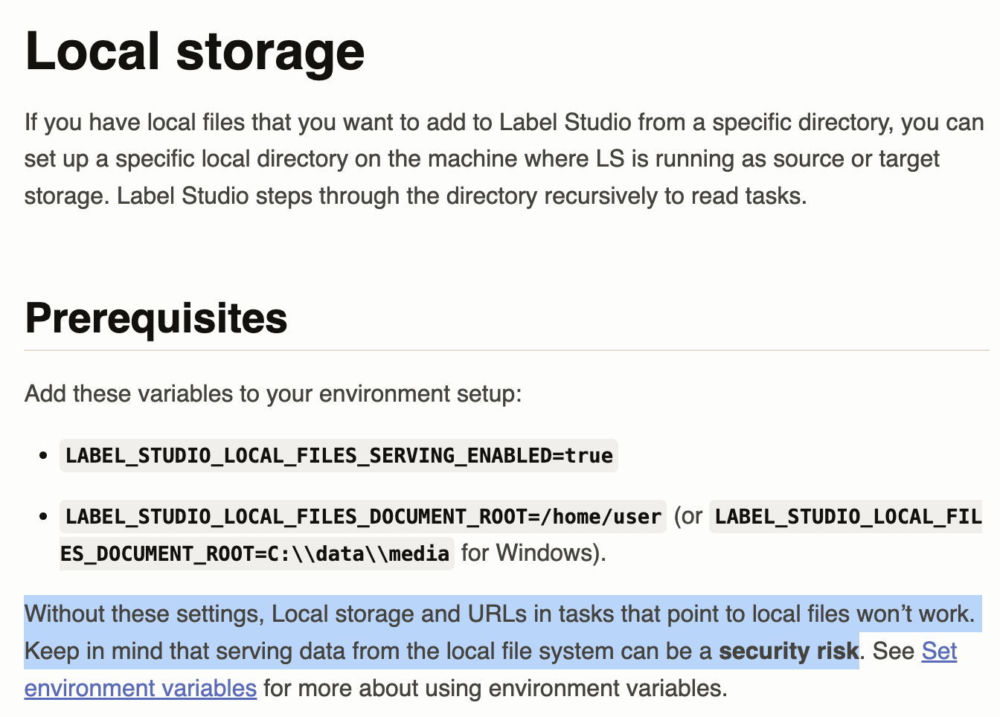
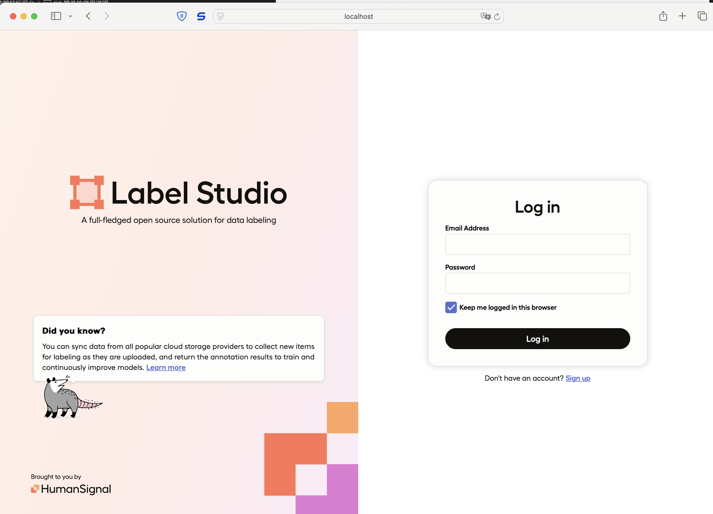
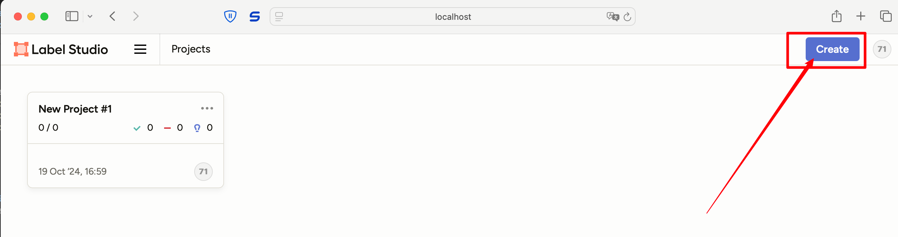
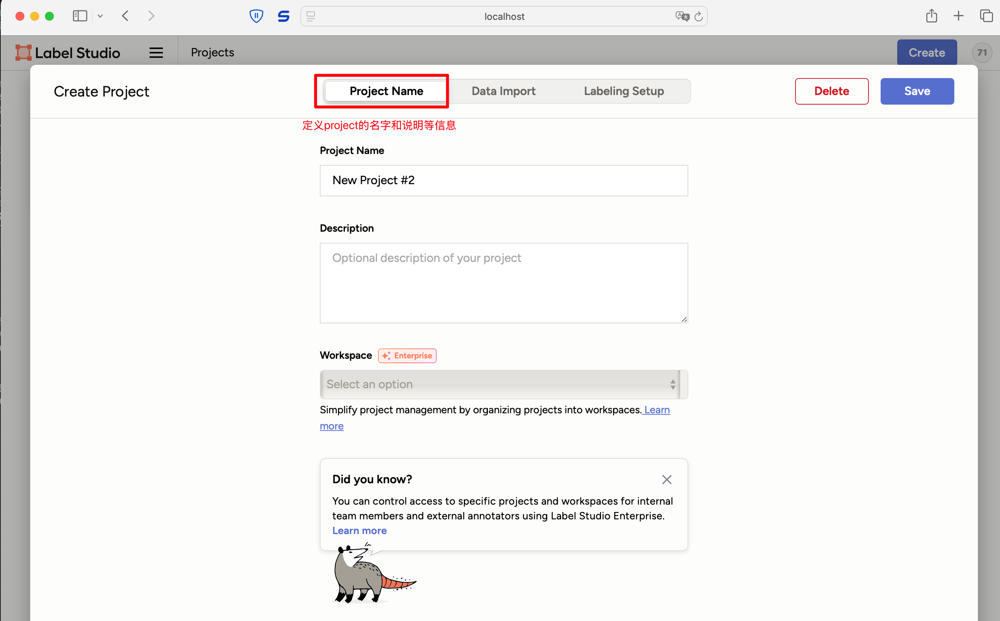
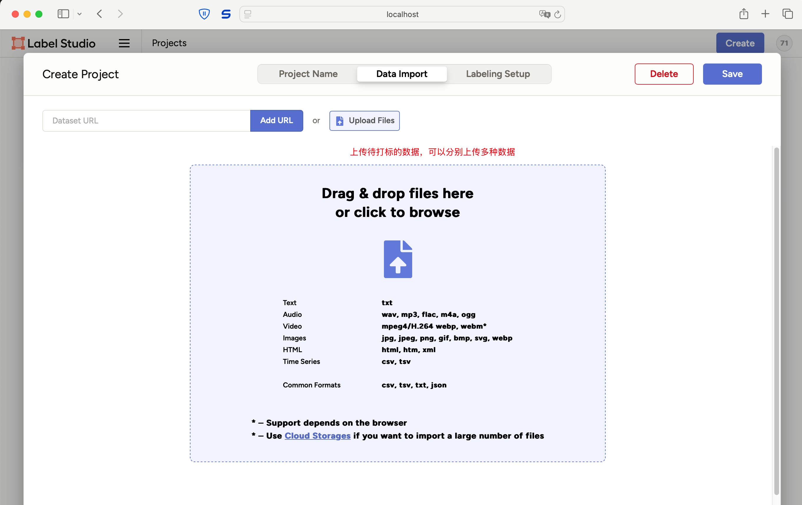
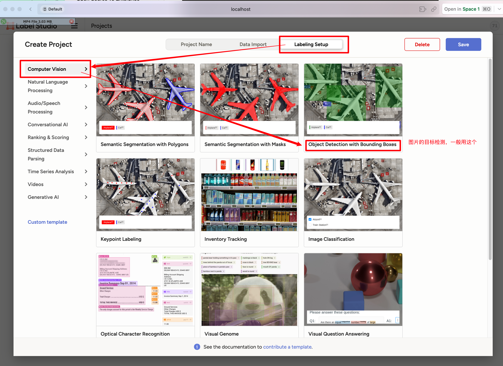
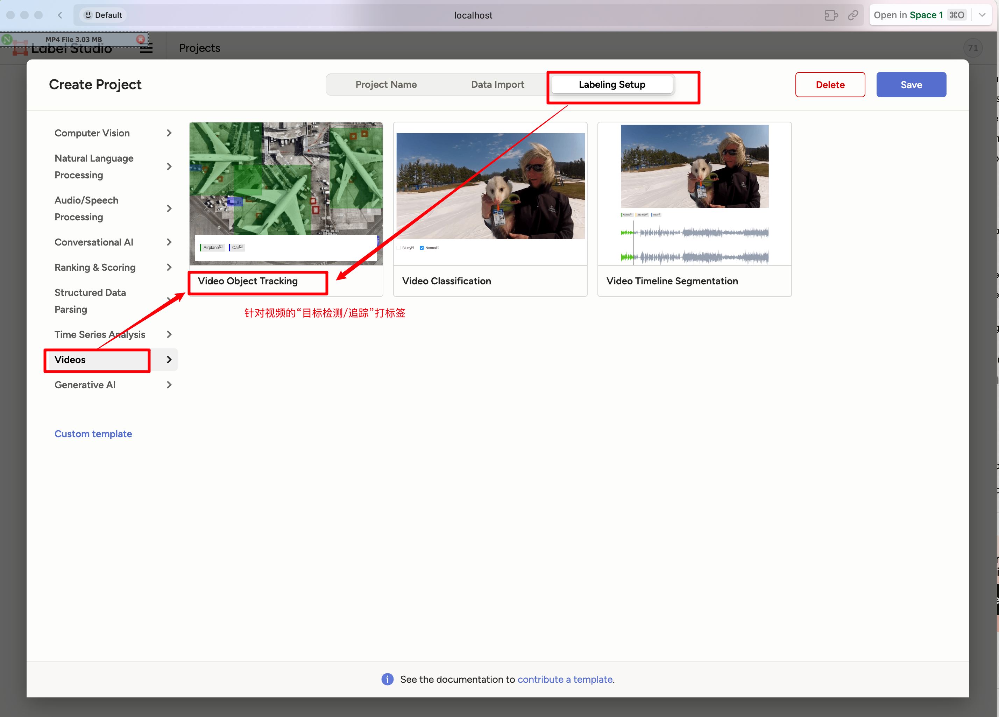
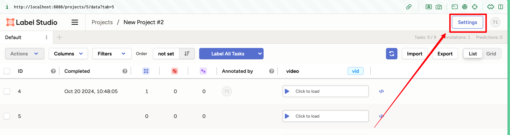
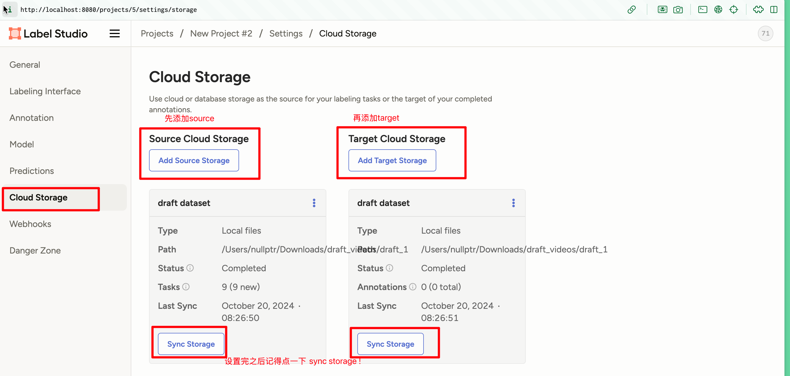
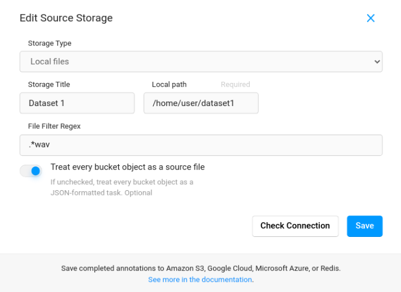

# label studio 数据打标平台
特点：
- 开源
- 本地部署


官方网站：
- https://labelstud.io/guide/start


## quick start


### 用 pip
```shell
python3 -m venv env
source env/bin/activate
python -m pip install label-studio

pip install label-studio
```
- 注意：python 版本必须大于等于`3.8`

### [Mac] 使用 homebrew
```shell
brew tap humansignal/tap

brew install humansignal/tap/label-studio
```

### 用 docker
首先需要说明的是，下面的命令会把所有 label 数据存放到`./mydata`中，**需要修改的路径话记得修改命令**!
```shell
docker run -it -p 8080:8080 -v $(pwd)/mydata:/label-studio/data heartexlabs/label-studio:latest
```
- **As this is a non-root container, the mounted files and directories must have the proper permissions for the UID 1001.**
- 更多详细操作参考官方链接：https://labelstud.io/guide/install

### 在 Linux 上安装 (本质上只是用了 venv)
```shell
python3 -m venv env
source env/bin/activate
sudo apt install python3.9-dev
python -m pip install label-studio
```

### 基于 anaconda 安装
```shell
conda create --name label-studio
conda activate label-studio
conda install psycopg2  # required for LS 1.7.2 only
pip install label-studio
```

---

## 升级 Label-Studio
```shell
pip install --upgrade label-studio
```

迁移使用了旧版 label-Studio 创建的项目到新版本上：
```shell
label-studio start path/to/old/project
```

---

## start & stop

### 准备工作
如果你需要直接对`本地的数据`打标签，则一定需要设置环境变量！
```shell
export LABEL_STUDIO_LOCAL_FILES_SERVING_ENABLED=true
export LABEL_STUDIO_LOCAL_FILES_DOCUMENT_ROOT= "文件路径"   
  # 注意: 这里一般提供的是文件夹!! Label Studio 会自动递归地读取文件
  # 例如:  export LABEL_STUDIO_LOCAL_FILES_DOCUMENT_ROOT=/Users/nullptr/Downloads/draft_videos

```
- 官方说明链接：
  - https://labelstud.io/guide/storage#Local-storage
  - https://labelstud.io/guide/start#Set-environment-variables
- 官方对于直接使用本地文件的**安全警告**：
  


### 后台启动与关闭 Label Studio 
```shell
# 启动
nohup label-studio > nohub.out 2>&1 &     # nohub 的目的是在后台运行

# 关闭
ps -ef | grep label-studio | grep -v grep | awk '{print $2}' | xargs kill -9 
```
- `grep -v grep` 表示去掉 `grep` 这个进程
- `awk '{print $2}'` 表示找第二列的值，也就是 `pid`
- 启动成功后，用`http://localhost:8080` 即可访问，注意默认使用的是 8080 端口，如果需要修改，则可以使用`-p` 指定端口号
  - 更多操作，参考官方指导：https://labelstud.io/guide/start


---

## 简单的使用说明
1. 启动之后，打开`http://localhost:8080`, 然后注册一个账号 (账号会存在本地数据库)



2. 创建一个新的打标 project (推荐给每一个 project 独立打标签)





- 对于视频打标签的模板，它的配置可能需要自定义，参考官方的说明：https://labelstud.io/templates/video_object_detector#About-the-labeling-configuration


### [本地数据文件] 需要特殊配置
如果数据文件放在本地，Label Studio 处于数据安全考虑，并不推荐这么使用，因为这个软件**不提供原始数据的备份功能**。

启动并创建了 project 之后，需要设置一下`Cloud Storage`:
1. 从 project 中找一下 `setting` 的设置界面，然后找到`Settings > Cloud Storage.`


- 配置 source storage 和 target Storage

  - 注意 storage type 选择 local file
  - Storage title 是给自己看的，随便设置
  - Local path `必须是绝对路径`, 这里填写**存放了数据的文件夹路径**, 并且这个路径必须包含前面设置 `env` 的时候`LABEL_STUDIO_LOCAL_FILES_DOCUMENT_ROOT`所指定的路径
    - 图片中 `/home/user` 是我们设置的`LABEL_STUDIO_LOCAL_FILES_DOCUMENT_ROOT`, 然后`dataset1`是存放了数据的文件夹
  - 如果这个数据文件夹中包含了多种类型的数据，比如 mp3, mp4, jpg 等，然后打标签只对其中一些类型的文件进行，这里就需要一个 `File Filter Regex`, 如果对所有文件都操作，则写`.*`
  - `Treat every bucket object as a source file` 设置为`打开`时表示将所有同类型的数据文件归为一类，统一进行打标签，勾选后，导出标签数据时，不同文件的标签数据会被整合到一个 JSON 中。

  - 这些设置项的具体说明参考这个链接：https://labelstud.io/guide/storage.html#Source-storage-permissions


