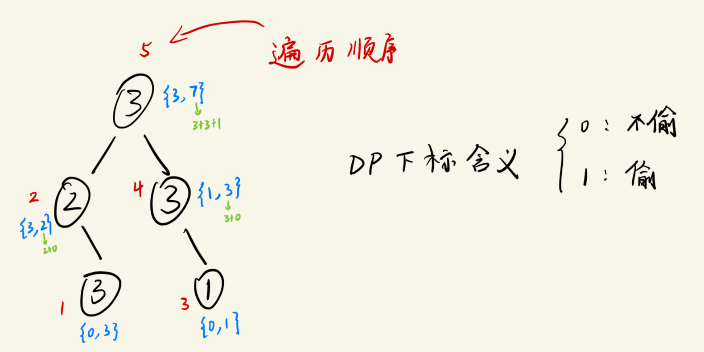

# 题目
LeetCode 337. 打家劫舍3
- https://leetcode.cn/problems/house-robber-iii/description/


The thief has found himself a new place for his thievery again. There is only one entrance to this area, called root.

Besides the root, each house has one and only one parent house. After a tour, the smart thief realized that all houses in this place form a binary tree. **It will automatically contact the police if two directly-linked houses were broken into on the same night.**

Given the `root` of the binary tree, return the maximum amount of money the thief can rob without alerting the police.

**Example 1:**


>Input: root = [3,2,3,null,3,null,1]
Output: 7
Explanation: Maximum amount of money the thief can rob = 3 + 3 + 1 = 7.

**Example 2:**


>Input: root = [3,4,5,1,3,null,1]
Output: 9
Explanation: Maximum amount of money the thief can rob = 4 + 5 = 9.

**Constraints:**

>The number of nodes in the tree is in the range [1, 10^4].
0 <= Node.val <= 10^4


## 思路1 - 按照二叉树暴力求解
最明显的限制条件是：相邻节点不能偷（只要树里有线连接的节点就不能选）

对于二叉树来说，通常都会使用递归去处理，因此，这里也可以使用递归，并且递归的时候需要**记住已经遍历过的节点**（使用一个位于递归外部的map来存储）。


## 思路2 - 树形DP

1. DP数组的定义 & 初始化
    - 树里的每一个节点只有两种状态： `偷`，`不偷`
      - **dp数组长度可以设置为2，下标为0表示不偷，下标为1表示偷；dp[0]表示不偷当前节点的情况下的最大金钱，dp[1]表示偷当前节点的情况下的最大金钱。**
      - 由于使用了递归，那么作为参数的这个DP数组就是用来`表示当前层的节点状态`，而不是全局的状态。（每一层有一个DP数组）
2. 递归函数定义（递推公式）
   
3. 遍历顺序
    - 遍历的顺序采用`后续遍历`: 左-右-中
      - 这是因为当前节点的状态（偷或不偷）是由左右孩子的状态决定的。


### 代码
```cpp
#include <iostream>
#include <map>
using namespace std;

struct TreeNode
{
    int val;
    TreeNode* left;
    TreeNode* right;
    TreeNode() : val(0), left(nullptr), right(nullptr){}
    TreeNode(int x) : val(x),left(nullptr), right(nullptr){}
    TreeNode(int x, TreeNode* l, TreeNode* r): val(x), left(l), right(r){}
};

vector<int> robTree(TreeNode * cur)  // 传入当前需要遍历的节点，返回当前层的 DP 数组
{
    // 递归停止条件
    if(cur == nullptr){
        return vector<int>{0,0};  // 返回 DP 数组，长度为2，偷和不偷当前节点，最大的金钱数量都是0 （因为此时遍历到了树的最底层）
    }

    // 递归处理 （遍历顺序）
    // 左：
    vector<int> left_dp = robTree(cur->left);
    // 右：
    vector<int> right_dp = robTree(cur->right);
    // 中：
    int val1 = cur->val + left_dp[0] + right_dp[0];  // 偷当前节点 + 不偷左孩子 + 不偷右孩子
    int val0 = max(left_dp[0], left_dp[1]) + max(right_dp[0], right_dp[1]); // 不偷当前节点 + [体现DP思想的地方] 根据左右孩子的状态来决定偷不偷左右孩子

    return vector<int>{val0, val1};  // 放入的顺序也要注意， 因为下标是有实际意义的！
}

int rob(TreeNode* root)
{
    vector<int> result = robTree(root);
    return max(result[0], result[1]);   // 到根节点的时候返回偷到金钱最多的case
}
```

状态分析：

