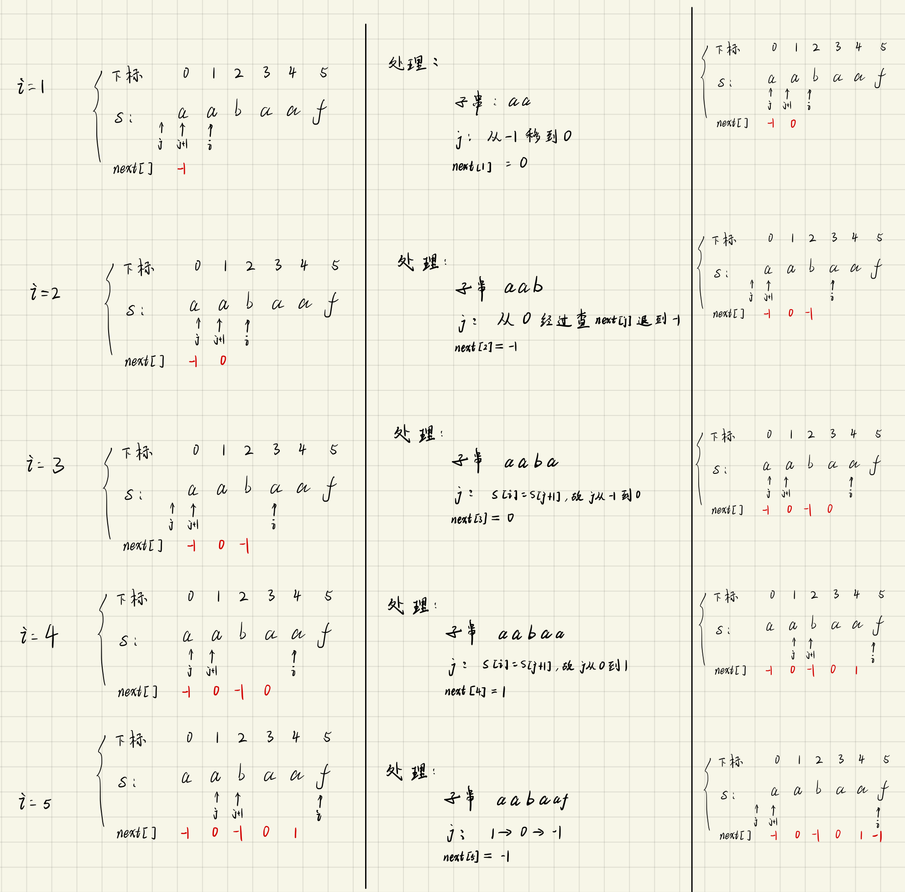

# KMP 算法
名字来源: 三个学者名字首字母...

用途:
- 主要用于字符串匹配, 习惯上将这两个字符串称为:
  - `文本串`: 原始字符串
  - `模式串`: 准备去原始字符串中寻找的字符串

算法优点:
- 之前匹配过的元素, 不再重复进行匹配, 而是直接跳过.
  - 效果如下图
  

需要依靠的辅助工具:
- 前缀表
- 最长相等前后缀

## 前缀表
前缀表的用处:
- 前缀表是用来回退的，它记录了`模式串`与`主串(文本串)`不匹配的时候，**模式串应该从哪里开始**继续进行匹配。


正式介绍前缀表之前, 需要先明确一些概念:
- 前缀
- 后缀
- 子串的最长相等前后缀长度


---
### 前缀
- 包含首字母, 但**不包含最后一个字母**的所有子串的集合.
```txt
对于字符串 aabaaf 来说, 它的前缀有:
    a, 
    aa,
    aab,
    aaba, 
    aabaa
```

### 后缀
- 包含最后一个字母, 但**不包含首字母**的所有子串的结合.
```txt
对于子串 aabaaf 来说, 它的后缀有: 
  f,
  af,
  aaf,
  baaf,
  abaaf

  注意这里的后缀字母候选区域是 [1,5], 去掉了第一个字母, 字母顺序依旧是 "从左到右".
```

### 最长相等前后缀
最长相等前后缀, 顾名思义:
- 前后缀: 比较当前子串的所有前缀和后缀
- 最长相等: 比较前后缀, 选择相等, 且长度最长的前缀或后缀.

最长相等前后缀, 我们一般不关注这个前后缀具体是什么, 而是要记录这个子串的长度.
```txt
子串            最长相等前后缀长度    
  a                   0
  aa                  1
  aab                 0
  aaba                1
  aabaa               2
  aabaaf              0

由此, 我们从短子串到长子串就能对应得到一个数字序列(从上到下): 010120
```

这里**由短子串到长子串**对应得到的`最长相等前后缀`数字序列就是`前缀表`.
- 前缀表记录了**下标i之前（包括i）的字符串中，有多大长度的相同前缀后缀**。
- 前缀表具有**告诉我们当前位置匹配失败，跳到之前已经匹配过的地方的能力**。


在一些博客的代码实现里, 会看到`prefix`或者`next数组`这样的变量, 他们其实目的都是一样的, 都是用来指定下一次循环时, 应该从什么位置开始匹配.
  - prefix 完全等价于我们这里提到的前缀表数字序列.
  - next数组 则一般指的是 `前缀表所有元素减1`或"`将前缀表所有元素右移一个位置, 空出来的第一个位置用-1填充`
    - **直接使用上面得到的前缀表序列作为 next数组**, 也能实现KMP算法效果, 这仅仅是代码风格的不一样罢了.

### 利用前缀表进行匹配
直接利用前缀表进行匹配的过程如下图所示:
- 
  - 此时, 如果比较的过程遇到冲突, 重新比较的位置可以从 前缀表里查找"冲突位置的前一个下标" 获得, 从图里来看, 冲突位置是5, 我们就去前缀表的4位置, 得到的值是2, 于是重新匹配的时候, 从模式串下标为2的元素开始匹配.

如果next数组是上面提到的前缀表元素统一减1得来, 那么, 匹配的过程将是:
- 
  - 匹配冲突时, 重新匹配的位置也是记录在 "冲突位置的前一个下标" (图中5是冲突位置, 去读取next数组的4位置, 得到的数值+1之后, 就是重新匹配时模式串使用的下标)

## KMP 算法的代码实现.

### next数组构建原理
再次强调一下next数组的定义:
- `next[i]` 记录的是`i位置(包含i)之前的元素构成的子串中, 最长相等前后缀的长度`.

那么, 在实现KMP算法时, 最重要的一步就是先构造前缀表 ==> 获取next数组.
- 步骤主要分成三步:
  ```txt
  1. 初始化
  2. 处理前后缀末尾 "不同" 的情况
  3. 处理前后缀末尾 "相同" 的情况
  ```

  - 对于初始化:
    ```txt
    在计算**前缀表**的时候, 定义两个指针:
      i指针: 指向当前遍历到的子串 "最长后缀的末尾" 位置
      j指针: 指向当前遍历到的子串中 "某个前缀的末尾" 位置, 同时也是前缀表记录的值
              由于next数组记录的就是最长相等前后缀的长度, 所以刚好就是j

    这时候, 初始化工作一共有两部分:
      1. 初始化j指针
      2. 初始化next[0]

    如果next数组采用 "前缀表元素统一减1" 的定义, 那么就初始化为:
      int j = -1;
      next[0] = j;

    如果next数组 "直接使用前缀表", 则初始化为:
      int j = 0;
      next[0] = j;
    ```

  - 处理 "前后缀末尾不同" 的情况
    ```txt
    - 如果next数组采用 "前缀表元素统一减1" 的定义, 那么此时遍历模式串的循环是:
      for(int i = 1; i < s.size(); ++i)       
          // 这时候已经不是初始化了(初始化对应子串是s[0]), 所以i应该从1开始遍历, 不然第一次进入循环时, 单个字母无法取到后缀
          // 且此时子串为s[0]~s[i], 比较起来才有意义
        
        处理前后缀不同时, 处理逻辑是:
        1. 将模板串的子串 s[0]~s[i] 中 "最长的后缀固定为s[1]~s[i]", 
        2. 然后从前一次最长相等前后缀的下一个位置获取前缀(因为这样可以免去大部分相同前后缀字母的重复比较), 
        3. 如果此时的后缀末尾与前缀末尾不相等, 就需要将前缀缩短到j-1位置上的最长相等前后缀的位置(这个值是前一次遍历中获得的结果, 或者由初始化时获得), 看看此时是否能匹配上.
             j-1位置上的最长相等前后缀的位置也就是 next[j] 中记录的位置(如果不清楚为什么是next[j]需要再看一下next数组的定义)
          
        这里需要强调一下: 
          在前缀表中, j是指向前缀末尾的, 但是在 "前缀表元素统一减1" 定义下的next数组中, j+1 才是指向前缀末尾.
        
        缩短前缀可能不止1次, 所以这里需要使用 while循环 来完成
            while(j >= 0; s[i] != s[j+1]){
              j = next[j];    
            }

            回退的原理是:
              当子串新增的元素导致前后缀不相等时, 最长相等前后缀长度肯定在之前循环得到的结果中, 所以通过逐步回退的方式一定能找到最长相等前后缀的长度.
    ``` 
    - 理解这个next构造过程很重要的一点是: `后缀的选取也是从左到右的顺序`
      - 如: 
        ```txt
        子串 aab: 
          前缀有: a, aa
          后缀有: b, ab

        子串 aaba:
          前缀有: a, aa, aab
          后缀有: a, ba, aba

        子串 aabaa:
          前缀有: a, aa, aab, aaba
          后缀有: a, aa, baa, abaa

        子串 aabaaf:
          前缀有: a, aa, aab, aaba, aabaa
          后缀有: f, af, aaf, baaf, abaaf
        ```


next数组构建过程动图:
 
 - 这是按照 "next数组为前缀表统一减1" 的定义实现的.


### next数组代码实现
由前缀表元素减1实现的next数组:
```cpp
void getNext(int* next, const string& s){
    int j = -1;
    next[0] = j;
    for(int i = 1; i < s.size(); i++) {       // 注意i从1开始
        while (j >= 0 && s[i] != s[j + 1]) {  // 后缀固定为当前子串的最长后缀, 只有前缀在不断变化
            j = next[j]; // 向前回退
        }
        if (s[i] == s[j + 1]) {               // 找到相同的前后缀
            j++;
        }
        next[i] = j;                          // 将j（前缀的长度）赋给next[i]
    }
}
```

过程推演:


---

直接用前缀表实现的next数组:
```cpp
void getNext(int* next, const string& s) {
    int j = 0;                              // 前缀表的最小元素是0 (毕竟长度不可能是负数)
    next[0] = 0;
    for(int i = 1; i < s.size(); i++) {
        while (j > 0 && s[i] != s[j]) {     // j要保证大于0，因为下面有取j-1作为数组下标的操作
            j = next[j - 1];                // 注意这里，是要找前一位的对应的回退位置了
        }
        if (s[i] == s[j]) {
            j++;
        }
        next[i] = j;
    }
}
```

### 用前缀表进行匹配
匹配操作:
- 在循环的过程中, 当模式串的某个字符与文本串某个字符不一致时:
  - 假设文本串走到 i位置, 模式串走到 j位置
  - 查询next数组, 拿到 index = next[j-1]
  - i继续往前走, 模式串从 index 开始继续匹配. 

代码:
前缀表元素减1作为next数组:
```cpp
class Solution {
public:
    void getNext(int* next, const string& s) {
        int j = -1;
        next[0] = j;
        for(int i = 1; i < s.size(); i++) { // 注意i从1开始
            while (j >= 0 && s[i] != s[j + 1]) { // 前后缀不相同了
                j = next[j]; // 向前回退
            }
            if (s[i] == s[j + 1]) { // 找到相同的前后缀
                j++;
            }
            next[i] = j; // 将j（前缀的长度）赋给next[i]
        }
    }
    int strStr(string haystack, string needle) {
        if (needle.size() == 0) {
            return 0;
        }
        int next[needle.size()];
        getNext(next, needle);
        int j = -1; // // 因为next数组里记录的起始位置为-1
        for (int i = 0; i < haystack.size(); i++) { // 注意i就从0开始
            while(j >= 0 && haystack[i] != needle[j + 1]) { // 不匹配
                j = next[j]; // j 寻找之前匹配的位置
            }
            if (haystack[i] == needle[j + 1]) { // 匹配，j和i同时向后移动
                j++; // i的增加在for循环里
            }
            if (j == (needle.size() - 1) ) { // 文本串s里出现了模式串t
                return (i - needle.size() + 1);
            }
        }
        return -1;
    }
};
```


---

直接使用前缀表作为next数组:
```cpp
class Solution {
public:
    void getNext(int* next, const string& s) {
        int j = 0;
        next[0] = 0;
        for(int i = 1; i < s.size(); i++) {
            while (j > 0 && s[i] != s[j]) {
                j = next[j - 1];
            }
            if (s[i] == s[j]) {
                j++;
            }
            next[i] = j;
        }
    }
    int strStr(string haystack, string needle) {
        if (needle.size() == 0) {
            return 0;
        }
        int next[needle.size()];
        getNext(next, needle);
        int j = 0;
        for (int i = 0; i < haystack.size(); i++) {
            while(j > 0 && haystack[i] != needle[j]) {
                j = next[j - 1];
            }
            if (haystack[i] == needle[j]) {
                j++;
            }
            if (j == needle.size() ) {
                return (i - needle.size() + 1);
            }
        }
        return -1;
    }
};
```
