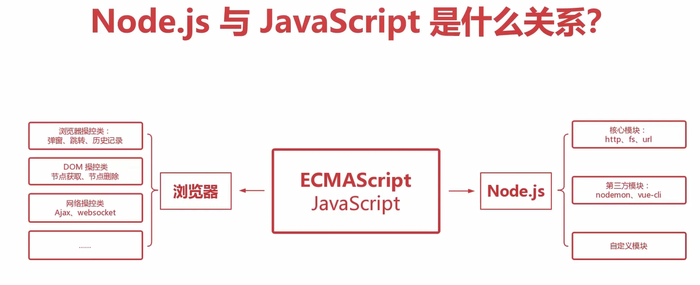

# 什么是 nodejs
Nodejs 本质上并不**是一种独立的编程语言**，nodejs 仅仅是一个`非浏览器但是能运行JavaScript的环境`, nodejs **不是 JavaScript 框架**

nodejs 的运行需要一个解析器，比较出名的是`V8`引擎，V8 引擎是由 Google 开发的，用于解析 JavaScript 代码的引擎，V8 引擎可以独立运行，也可以嵌入到任何应用中，V8 引擎是目前公认的解析速度最快的 JavaScript 引擎。
- 这个解析引擎能完成的功能其实只是将 JavaScript 代码转换为机器码，然后交给操作系统执行，它**只能解析语法部分**，那些特效什么的其实是**浏览器的功能**，与 nodejs 无关

# Nodejs 与 JavaScript 的区别

# nodejs 能做什么？
1. 后端 web 服务器开发与网络爬虫开发
2. 脚手架命令行工具
3. 图形界面应用程序开发

等等...

---
# 发展史
- 2008 年 V8 引擎随着 Chrome 浏览器的发布而问世

- 2009 年 Ryan Dahl 在 V8 引擎的基础上开发了 Node.js 项目
