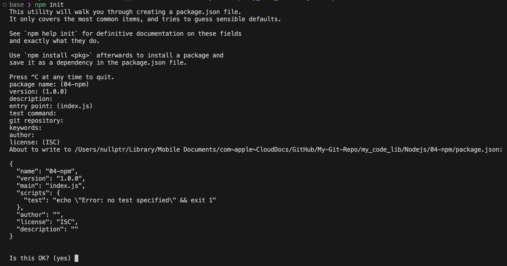
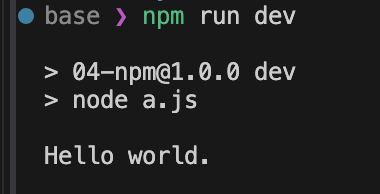

# NPM (Node Package Manager)
在 nodejs 中一般使用 npm 去管理小模块，类似 python 的 pip.
- npm 的官方网站：https://www.npmjs.com
- npm 是世界上最大的软件注册表，拥有超过 200 万个包 
- 它是 Node.js 的默认包管理器，由 GitHub 公司维护 
- 不仅用于 Node.js 后端开发，同时也广泛应用于前端 JavaScript 开发

基本命令：
```shell
npm init             # 创建新的 package.json
npm install          # 安装所有依赖
npm update           # 更新包
npm test             # 执行项目测试指令 (npm init 中定义的命令)
npm run <script>     # 运行脚本
npm uninstall        # 卸载包
npm --version        # 查看 npm 版本
npm version          # 查看 npm 内部使用的包的版本
npm --help           # 查看帮助
```

安装依赖包：
```bash
npm install <package-name>    # 安装单个包
npm install                   # 安装项目所有依赖

npm install <package-name>@<version> # 安装指定版本的包
```
- 依赖类型：
  - dependencies：生产环境依赖
  - devDependencies：开发环境依赖（使用 --save-dev 或 -D 标志）
  - optionalDependencies：可选依赖


项目脚本管理
- 通过 package.json 文件中的 scripts 字段定义命令
- 使用 npm run <script-name> 执行命令
- 常见用例：
    ```json
    {
        "scripts": {
            "start": "node server.js",
            "dev": "webpack --config webpack.conf.js",
            "build": "NODE_ENV=production webpack"
        }
    }
    ```


--- 
## npm init 初始化项目
在一个项目中运行`npm init`会生成一个`package.json`文件，其中包含了项目的基本信息，如项目名称、版本、作者、依赖等。


## npm run 执行脚本
执行完 npm init 之后，我们获得了一个 package.json 文件，比如下面的例子：
```json
{
  "name": "04-npm",
  "version": "1.0.0",
  "main": "index.js",
  "scripts": {
    "test": "echo \"Error: no test specified\" && exit 1"
  },
  "author": "",
  "license": "ISC",
  "description": ""
}

// 我们在 scripts 中增加一个执行脚本的命令，并将这个命令命名为`dev`
{
  "name": "04-npm",
  "version": "1.0.0",
  "main": "index.js",
  "scripts": {
    "dev":"node a.js"     // 定义一个叫 dev 的脚本指令，它会测试 a.js 脚本
  },
  "author": "",
  "license": "ISC",
  "description": ""
}
```
运行效果：

