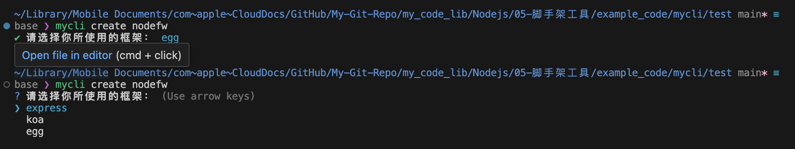
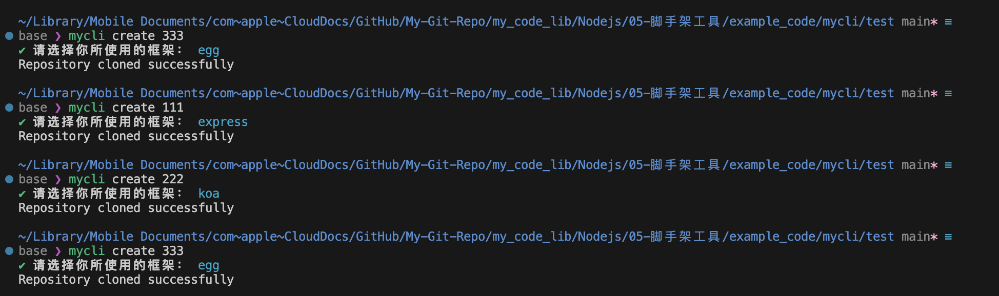
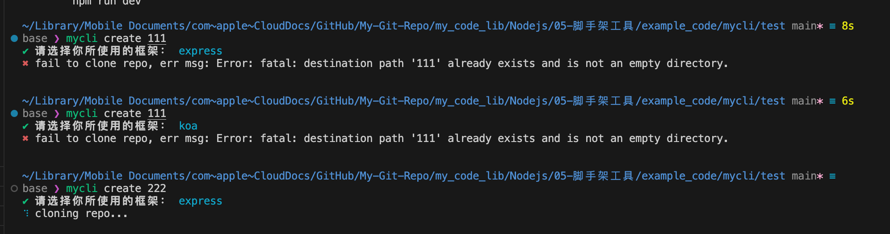
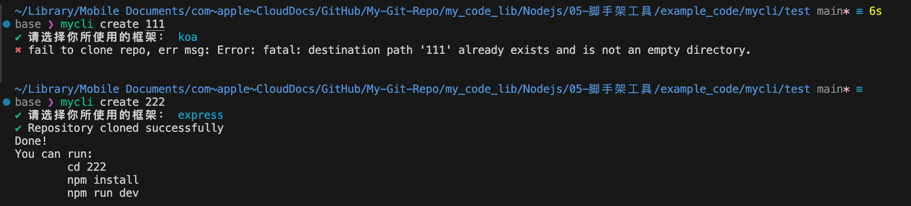
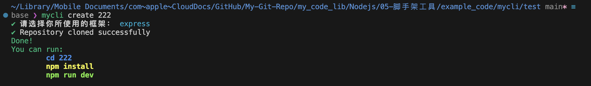

# 创建自定义全局命令
1. 在项目根目录下创建一个`bin`文件夹，然后在`bin`文件夹下创建一个`cli.js`文件，内容如下：
    > 这里的根目录用 `mylci` 为例

2. 在项目根目录下利用 `npm init` 初始化一个项目，此时会看到一个`package.json`文件，然后在`package.json`文件中添加一个`bin`字段，内容如下
    ```json
    {
    "name": "mycli",
    "version": "1.0.0",
    "main": "index.js",
    "bin": {                        // 由于第一步创建了 bin 目录以及 cli.js 文件，所以这里才会出现这个字段
        "mycli": "bin/cli.js"
    },
    "scripts": {
        "test": "echo \"Error: no test specified\" && exit 1"
    },
    "author": "",
    "license": "ISC",
    "description": ""
    }
    ```

3. 创建全局的命令，实现逻辑是`将当前项目的根目录连接到 npm 的全局目录下`
    ```shell
    cd 项目根目录
    npm link
    ```
    

4. 在`mycli/bin/cli.js`文件中添加如下代码
    ```js
    #!/usr/bin/env node      // 这行代码是告诉系统，此文件需要借助 /usr/bin/env 里的 node 环境才能执行; 不可以缺少这行代码!!
    
    console.log('mycli');    // 测试是否能在任意目录中执行
    ```

5. 在 `cli.js` 中定义想要执行的命令
    ```md
    使用系统自带的方法获取命令行参数：`process.argv`
    
    - 测试的时候可以用 console.log(process.argv) 查看
        [
        '/opt/homebrew/Cellar/node/23.6.1/bin/node',    // 执行命令的环境
        '/opt/homebrew/bin/mycli',                      // 脚本所在位置
        '--help'                                        // 这里的 --help 是在命令行中输入的参数
        ]
    ```


---

# 利用 commander 处理命令行参数
以`--help`这个最基本的命令行参数为例，commander 本身会提供一些默认的模板以及自定义的方法，可以直接使用：
1. 安装 commander
    ```shell
    npm install commander
    ```
    - 安装完之后会在 `package.json` 中看到多了一个依赖的相关信息

2. 在`cli.js`中使用并自定义 commander 的 help 参数模板。
    ```js
    #! /usr/bin/env node 

    const {program} = require('commander');                    // 导入 commander 模块
    program.option('-f, --framework <framework>', '设置框架');  // 修改 --help 里的提示信息
    program.parse(process.argv);                               // 解析命令行参数
    ```
    


## 在 commander 中添加 command 指令
1. 在`cli.js`中添加 command 指令
    ```js
    #! /usr/bin/env node 

    const {program} = require('commander');
    program.option('-f, --framework <framework>', '设置框架');  // 修改 --help 里的提示信息

    program
        .command('create <project> [other...]')   // 添加一个叫做 create 的执行指令，这个指令要接收超过 1 个参数的话，就要用 [other...] 来占位，注意是 3 个点
        .alias('crt')                             // 给 create 增加一个别名 crt
        .description('创建项目')                   // 在 help 信息中，为 create 指令增加说明信息
        .action(                                  // action 中写的是 create 指令真正要做的事情，这是一个回调函数
            (project, args)=>{
                // 这个代码块才是命令行的执行逻辑代码
                console.log(project);
                console.log(args);
        });

    program.parse(process.argv);
    ```
    
    - 可以看到，使用 `.command` 增加指令并且使用`.description`添加信息之后，`--help` 中也会有对应的说明信息。

---

## 将功能拆分成小模块
这里将对上面的 commander 例子拆解成下面几个模块：
- help 信息管理模块
- commander 管理 command 指令的模块
- command 具体执行逻辑 (action) 的管理模块

拆分之后的代码如下：
- `bin/cli.js`:
    ```js
    #! /usr/bin/env node 

    // ----------------- 用 commander 处理命令行参数 --------------
    const {program} = require('commander');
    const myHelp = require('../lib/core/help');  // 在 lib/core/help.js 中对 help 信息的管理进行了模块化封装
    const myCommander = require('../lib/core/mycommander');

    myHelp(program);
    myCommander(program);

    program.parse(process.argv);
    ```

- `lib/core/help.js`:
    ```js
    const myhelp = function(program){
        program.option('-f, --framework <framework>', '设置框架');  // 修改 --help 里的提示信息
    }

    module.exports = myhelp;   // 注意 exports 不要漏了 s
    ```

- `lib/core/mycommander.js`:
    ```js
    const myAction = require("./action");             // 导入 action 模块

    const myCommander = function(program){
        program
            .command('create <project> [other...]')   // 添加一个叫做 create 的执行指令，这个指令要接收超过 1 个参数的话，就要用 [other...] 来占位，注意是 3 个点
            .alias('crt')                             // 给 create 增加一个别名 crt
            .description('创建项目')                   // 在 help 信息中，为 create 指令增加说明信息
            .action(                                  // action 中写的是 create 指令真正要做的事情，这是一个回调函数
                myAction                              // 这里直接使用了 action 模块
            );
    }

    module.exports = myCommander;   // 注意 exports 不要漏了 s
    ```

- `lib/core/action.js`:
    ```js
    const myAction = (project, args)=>{             // 这里直接用匿名函数的方式定义，就不用再写 function 了
        // 这个代码块才是命令行的执行逻辑代码
        console.log(project);
        console.log(args);
    }

    module.exports = myAction;  // 注意 exports 不要漏了 s
    ```

---

## 使用 inquirer 实现交互式命令行
这里直接修改前面搭建好的代码例子。
1. 安装 inquirer 模块
    ```shell
    npm install inquirer
    ```

2. 测试一下使用 inquirer, 创建`test/inquirer.js`:
    ```js
    var {default:inquirer} = require('inquirer');  
        // 似乎在新版本的 inquirer 中，
        //  const inquirer = require('inquirer') 是无法使用的，原因可能是模块导出的 [不是] 默认导出（default export）


    // 用 prompt 方法进行提问
    inquirer.prompt([
        {
            // type 用来指定问题的类型
            type: 'input',
            name:'username',      // 用户回答的内容将存储到 "username" 这个属性中
            message:'你的名字',
        }
    ]).then((answer)=>{           // 用 answer 暂存用户的回答
        console.log(answer);
    })
    ```
    - 执行效果：
        

3. 直接修改前面例子中的`lib/core/action.js`:
    ```js
    var {default:inquirer} = require('inquirer');
    const config = require('../../config');           // 借助模块化 (其实是配置文件) 的方式方便扩充框架的选项，好处是不需要改代码，只改配置即可

    const myAction = (project, args)=>{
        inquirer.prompt([
            {
                type:'list',                        // 用 list 来存放选项
                name:'framework',
                choices: config.framework,          // 用 choices 来提供具体的选项内容
                message:'请选择你所使用的框架：',
            }
        ]).then((answer)=>{
            console.log(answer);
        })
    }

    module.exports = myAction; 
    ```
    - 这里的 `config.js` 其实是用作一个配置文件，内容如下：
        ```js
        module.exports = {
            framework:['express','koa','egg']
        }
        ```
    - 执行效果：
        


## 使用 simple-git 克隆仓库
这里直接修改前面模块化之后的例子：
1. 增加`download.js`模块：
    ```js
    var download = require('simple-git');   // 视频例子使用的是 download-git-repo，但是这个模块已经被废弃了，所以这里使用 simple-git
    const downloadFn = function(url, projectName){
        try{
            download().clone(url, projectName);
            console.log('Repository cloned successfully');
        }
        catch (err){
            console.log("fail to clone repo, err msg: ", err);
        }
    }
    module.exports = downloadFn;
    ```

2. 修改`lib/core/action.js`:
    ```js
    var {default:inquirer} = require('inquirer');
    var downloadFn = require('./download')          // 引入 download 模块
    var config = require('../../config');           // 借助模块化 (其实是配置文件) 的方式方便扩充框架的选项，好处是不需要改代码，只改配置即可

    // ----- 默认是 promise + then 的方式 ---------
    // const myAction = (project, args)=>{
    //     inquirer.prompt([
    //         {
    //             type:'list',                        // 用 list 来存放选项
    //             name:'framework',
    //             choices: config.framework,          // 用 choices 来提供具体的选项内容
    //             message:'请选择你所使用的框架：',
    //         }
    //     ]).then((answer)=>{
    //         console.log(answer);
    //     })
    // }

    // ----- 为了方便使用，改成 async + await 的方式 ---------
    const myAction = async (project, args)=>{
        const answer = await inquirer.prompt([
            {
                type:'list',                        // 用 list 来存放选项
                name:'framework',
                choices: config.framework,          // 用 choices 来提供具体的选项内容
                message:'请选择你所使用的框架：',
            }
        ]);

        // console.log(answer);  // 验证前面 promise + then 的逻辑是否一致

        // 下载代码模板
        downloadFn(config.frameworkUrl[answer.framework], project)
    }

    module.exports = myAction; 
    ```
    - 这里修改了配置文件`config.js`，方便通过选择的方式直接指定仓库的 url
        ```js
        module.exports = {
            // 可选择的框架
            framework:['express','koa','egg'],
            // 框架的下载地址 (这些地址都是随便找的，不具备参考价值，仅用于测试 git clone 功能)
            frameworkUrl:{
                express:"https://github.com/jstibenpb/nodejs-express-template.git",
                koa:"https://github.com/koajs/examples.git",
                egg:"https://github.com/xiedajian/egg-template.git"
            }
        }
        ```
    - 执行效果：
    

---

## 使用 ora 仓库实现下载过程的 loading 效果

1. 安装 ora 模块
    ```shell
    npm install ora@5
    ```
      - 注意，由于前面的例子中一直使用的都是`commonjs`的模块导入方式，而`ora`模块从`6.x`版本开始就使用`ECSMAScript`的模块导入方式，所以这里并没不是下载最新的版本而是使用了`5.x`的最后一个版本。

2. 测试 ora 模块，创建`test/ora.js`:
    ```js
    const ora = require('ora');
    const spinner = ora().start();

    spinner.text = 'loading...';
    setTimeout(()=>{
        console.log('\n111');
        // spinner.succeed("process ended.");  // 运行成功提示
        // spinner.fail("process ended.");  // 运行失败提示
        spinner.info("process ended.");  // 提示一些信息，不表示成功或失败

    }, 1000)
    ```

3. 修改`lib/core/download.js`:
    ```js
    var download = require('simple-git');
    const ora = require('ora');

    const downloadFn = function(url, projectName){
        const spinner = ora().start();
        spinner.text = 'cloning repo...';

        // 使用回调函数方式来实现等待交互 (用异步的方式会立即返回，从而跳过这个回显)
        download().clone(url, projectName, (err, result) => {
            if (err) {
                spinner.fail(`fail to clone repo, err msg: ${err}`);
                return;
            }
            spinner.succeed('Repository cloned successfully');
            console.log("Done! \nYou can run: ");
            console.log('\tcd ' + projectName);
            console.log('\tnpm install ');
            console.log('\tnpm run dev ');
            
        });
    }
    module.exports = downloadFn;
    ```
    - 这里为了能看到下载等待的过程，针对克隆仓库的部分没有使用异步的方式，而是使用了回调函数的方式，这样才可以在下载过程中看到 loading 效果。
    - 执行效果：
    
    


---

## 使用 chalk 模块实现终端输出文字的颜色控制
1. 安装 chalk 模块
    ```shell
    npm install chalk@4   // 下载 4.x 版本的 chalk 模块
    ```
    - 这里也是使用了一个不是最新版本的模块，因为最新版本的模块使用了`ECSMAScript`的模块导入方式，而这里一直使用的是`commonjs`的模块导入方式。

2. 测试 chalk 模块，创建`test/chalk.js`:
    ```js
    const chalk = require('chalk');

    // 颜色处理
    console.log(chalk.blue('哈哈哈'));
    console.log(chalk.red('哈哈哈'));
    console.log(chalk.yellow('哈哈哈'));
    console.log(chalk.rgb(255,60,90)('哈哈哈'));

    // 加粗
    console.log(chalk.bold('哈哈哈'));
    ```

3. 修改`lib/core/download.js`:
    ```js
    var download = require('simple-git');
    const ora = require('ora');
    const chalk = require('chalk');

    const downloadFn = function(url, projectName){
        const spinner = ora().start();
        spinner.text = 'cloning repo...';

        // 使用回调函数方式来实现等待交互 (用异步的方式会立即返回，从而跳过这个回显)
        download().clone(url, projectName, (err, result) => {
            if (err) {
                spinner.fail(`fail to clone repo, err msg: ${err}`);
                return;
            }
            spinner.succeed('Repository cloned successfully');
            console.log(chalk.green("Done! \nYou can run: "));
            console.log(chalk.blue.bold('\tcd ' + projectName));
            console.log(chalk.yellow.bold('\tnpm install '));
            console.log(chalk.rgb(123,234,66).bold('\tnpm run dev '));
            
        });
    }
    module.exports = downloadFn;
    ```
    - 执行效果：
    
