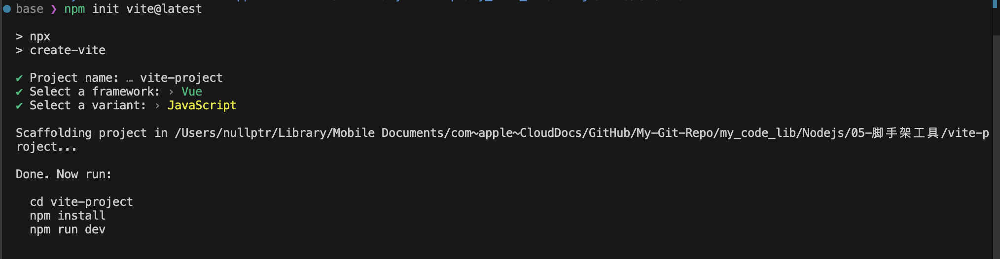

# 什么是"脚手架"工具
所谓的脚手架在这里只是指：
- 能作为`全局命令行`的一种命令工具，比如`vue-cli`, `create-react-app`等
- **创建项目初始化代码文件及目录**的工具

脚手架工具的基本能力：
- 全局命令行执行能力
- 命令行的交互能力
- 项目初始化代码的下载能力

# 实现脚手架工具的基本框架
- [ ] 创建自定义全局命令
- [ ] 命令参数接收处理
- [ ] 终端交互
- [ ] 下载远程项目代码
- [ ] 项目初始化完成提示

使用 vite 脚手架工具的示例：

- 在运行`npm init vite@latest`命令之后，它自动进入交互模式，让我们输入或者选择这个工具需要的所有参数，在参数配置配置完成后，他还会提示如何执行运行这个项目
.

