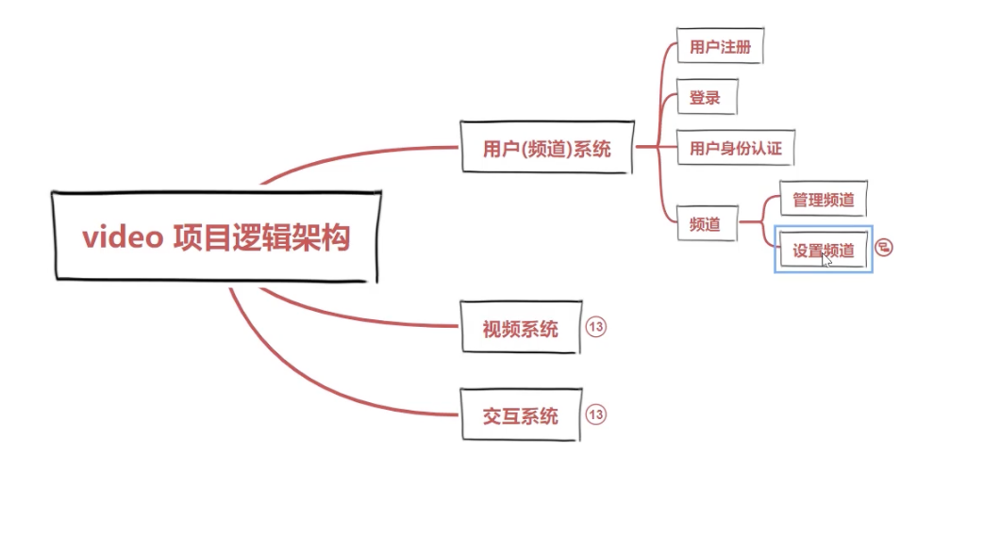
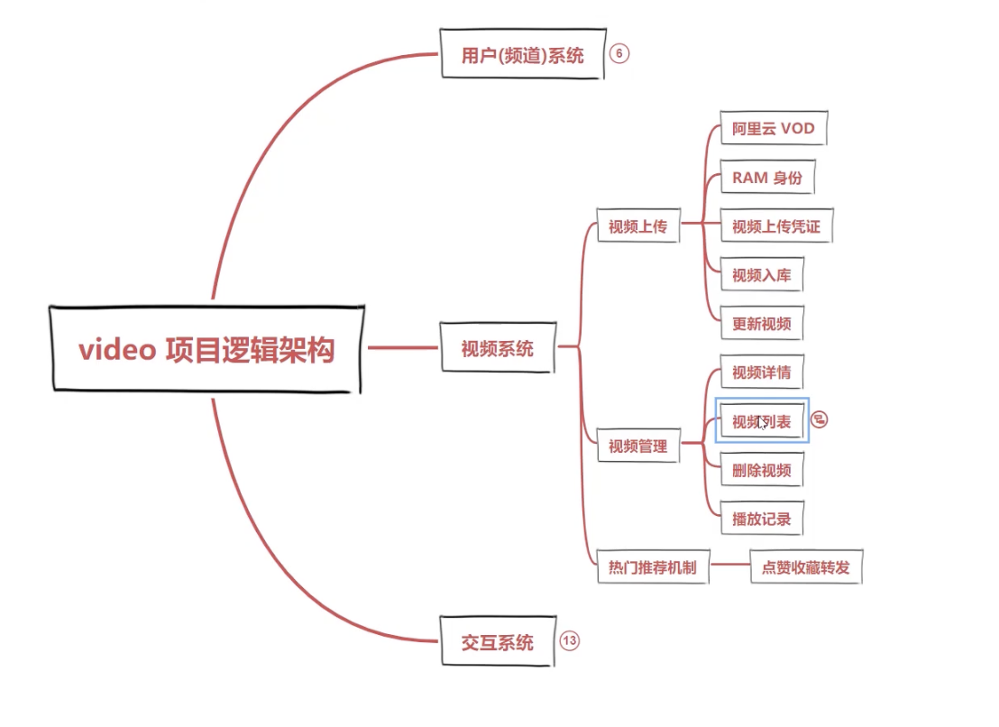
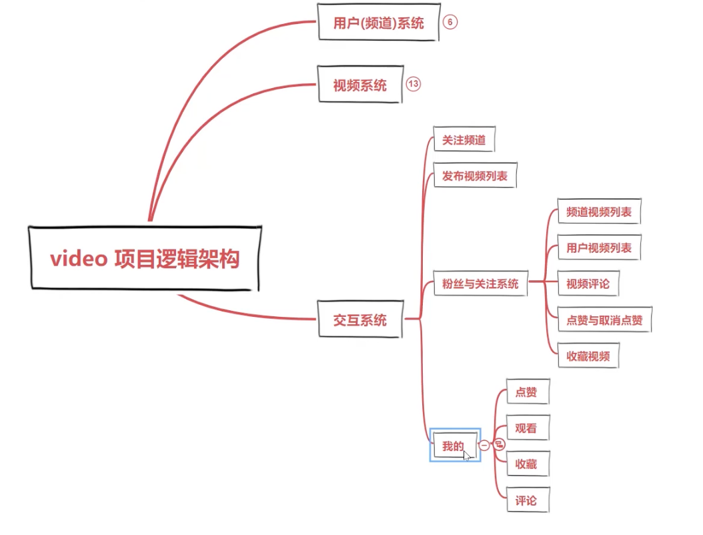
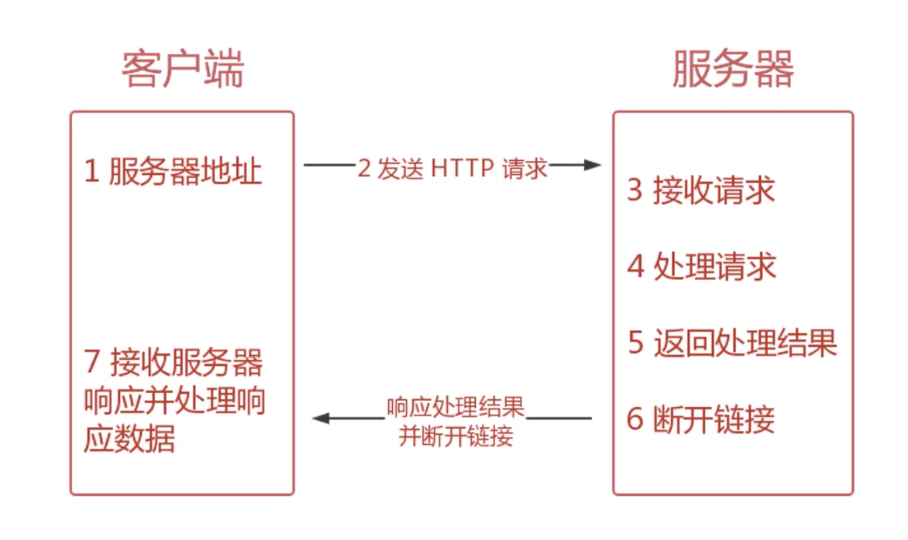

# 这个小章节准备开发一个 Node 原生的 video 网站
网站包含三个模块：
- 用户系统
- 视频系统
- 交互系统

---

## 基本架构
架构：

--- 

## 服务端逻辑梳理
1. 使用 Node 创建一个 HTTP 服务器，并能够接收客户端发来的请求

2. 获取到客户端具体的请求数据后，根据不同的请求数据进行处理

3. 将处理的结果返回给客户端，断开本次连接。

