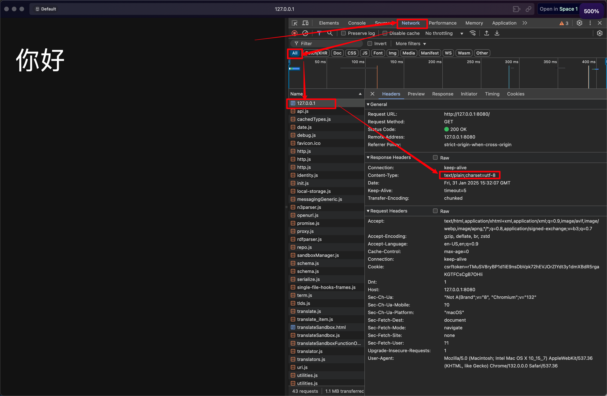
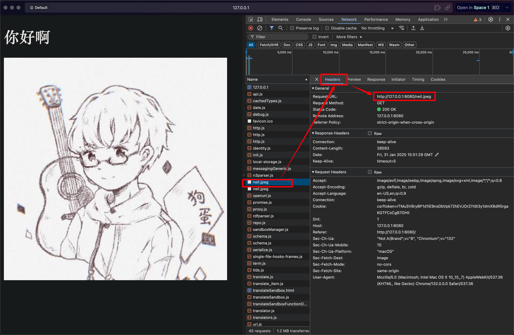
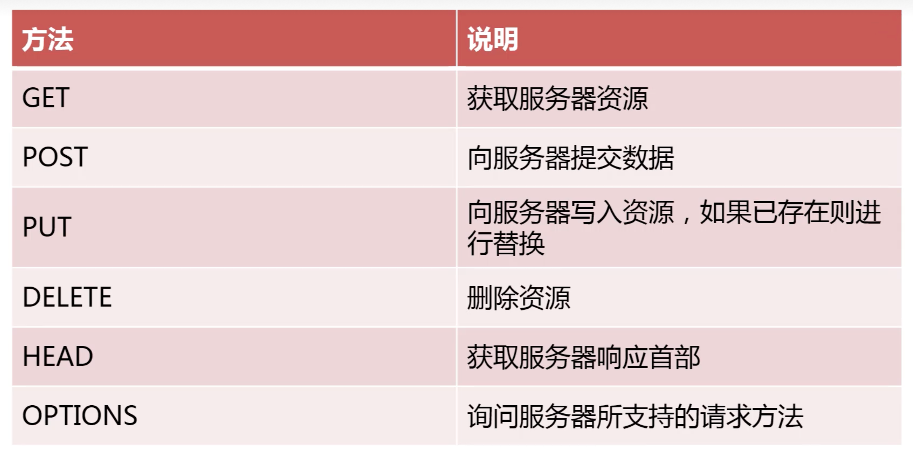

# 创建 HTTP 服务
首先去 Nodejs 官方网站的找到自己当前使用的 nodejs 版本的文档：
- 比如 23.7.0 的文档地址：https://nodejs.org/docs/latest/api/http.html

基础 http 服务器的代码，创建`http-server/server.js`：
```js
// 1. 导入 node 原生的 http 模块
var http = require('http');

// 2. 获取 http server 实力对象
var server = http.createServer();
server.listen(8080, function(){    // 用 listen 方法监听本机系统端口，只要不与其他服务冲突的端口均可
    console.log('http://127.0.0.1:8080')
})

server.on('request', function(req, res){   // 用 on 方法监听客户端的请求事件
    console.log('666');                    // 测试 http 服务器是否接收到客户端请求
    res.write('Hello');                     // 测试返回给客户端的响应信息
    res.end();                             // 断开与客户端的当前连接，如果不断开的话，客户端会认为服务器仍然需要继续处理某些事情，从而卡在加载的页面
})   
```
- `server.listen(port, callback)`：监听本机系统端口，只要不与其他服务冲突的端口均可

- `server.on('request', callback)`：监听客户端的请求事件
  - `req`：请求对象，包含了客户端的所有请求的信息
  - `res`：响应对象，用来给客户端发送响应信息

- 为了避免每次修改服务器都手动重新启动 http 服务，我们可以用 `nodemon` 这个工具来自动检测服务器代码的变化，然后自动重启服务。
  - 安装 `nodemon`：`npm install -g nodemon`.  
    - `-g` 表示全局安装
    - 安装好之后，启动服务就不再使用 `node server.js`, 而是`nodemon server.js`命令。


---

# 服务器响应不同的数据类型
在上面的代码中，我们返回给客户端的是英文数据`res.write('Hello')`，但是实际开发中，我们可能需要返回不同的数据类型，比如返回中文`res.write('你好')`, 此时浏览器会显示乱码，为了解决这个问题，就需要**在服务端返回数据的响应头中设置响应的数据类型**。

- `响应纯文本字符`的情况，我们可以按照如下方式设置响应头：
    ```js
    // 1. 导入 node 原生的 http 模块
    var http = require('http');

    // 2. 获取 http server 实力对象
    var server = http.createServer();
    server.listen(8080, function(){    // 用 listen 方法监听本机系统端口，只要不与其他服务冲突的端口均可
        console.log('http://127.0.0.1:8080')
    })

    server.on('request', function(req, res){   // 用 on 方法监听客户端的请求事件
        console.log('666');                    // 测试 http 服务器是否接收到客户端请求

        res.setHeader('Content-type', 'text/plain;charset=utf-8');   // Content-type 用来说明我要设置的是内容的类型，text/plain;charset=utf-8 表示具体返回的是纯文本信息并且使用 utf-8 字符编码，
        
        res.write('你好');                      // 测试返回给客户端的响应信息
        res.end();                             // 断开与客户端的当前连接，如果不断开的话，客户端会认为服务器仍然需要继续处理某些事情，从而卡在加载的页面
    })   
    ```
    

- 响应`html`的情况，我们可以按照如下方式来写：
  - `http-server/server.js`：
    ```js
    // 1. 导入 node 原生的 http 模块
    var http = require('http');

    // 2. 获取 http server 实力对象
    var server = http.createServer();
    server.listen(8080, function(){    // 用 listen 方法监听本机系统端口，只要不与其他服务冲突的端口均可
        console.log('http://127.0.0.1:8080')
    })


    // ----- 响应纯文本 并 指定响应内容的类型 ---------
    // server.on('request', function(req, res){   // 用 on 方法监听客户端的请求事件
    //     console.log('666');                    // 测试 http 服务器是否接收到客户端请求

    //     res.setHeader('Content-type', 'text/plain;charset=utf-8');   // Content-type 用来说明我要设置的是内容的类型，text/plain;charset=utf-8 表示具体返回的是纯文本信息并且使用 utf-8 字符编码，
        
    //     res.write('你好');                      // 测试返回给客户端的响应信息
    //     res.end();                             // 断开与客户端的当前连接，如果不断开的话，客户端会认为服务器仍然需要继续处理某些事情，从而卡在加载的页面
    // })   


    // --------- 响应 html 文件 同时在 html 中插入其他类型的资源 ------
    var fs = require('fs');    // 借助 node 提供的 fs 模块去读取本地文件

    server.on('request', function(req, res){
        if (req.url == '/'){
            fs.readFile('./index.html', 'utf-8', function(err, data){
                res.write(data);  // 注意，我们是在 html 文件的内容中定义了响应类型以及字符编码，所以这里不用设置
                res.end();
            })
        }
        else{
            fs.readFile('./neil.jpeg', function(err, data){  // 由于读取的是图片，我们可以不指定读取的字符编码，直接写回调函数即可
                res.end(data);          // 可以直接将数据丢给 end 方法，它的作用其实跟上面先 writer 再 end 是一样的
            })
        }
    })
    ```
  - `http-server/index.html`：
    ```html
    <!DOCTYPE html>
    <html lang="en">
    <head>
        <meta charset="UTF-8">              // 这里设置了字符编码!!!!!
        <meta name="viewport" content="width=device-width, initial-scale=1.0">
        <title>Document</title>
    </head>
    <body>
        <h1>
            你好啊
        </h1>
             // 静态资源标签，浏览器会触发二次请求
    </body>
    </html>
    ```
  - 客户端解析的流程：
    - 首先客户端发起请求，此时请求的 url 是`/`, 服务器会返回`index.html`文件的内容。
    - 在浏览器读取 html 文本的过程中，发现存在``````这样的**静态文件**标签，于是浏览器会**再次向服务器发起请求**，此时请求的 url 是`/neil.jpeg`, (**注意这里用的是不严谨的条件判断**) 服务器会根据 url 的请求路径返回`neil.jpeg`文件的内容，浏览器会解析这个图片文件并显示在页面上。
    


---

## 服务器响应不同的请求
客户端常见的请求方法一般是下面几个类型：


### GET 请求

- 代码例子 `http-server/server.js`:
    ```js
    var http = require('http');
    var fs = require('fs'); 
    var url = require('url')     // 导入处理 url 的包
    var server = http.createServer();

    server.listen(8080, function(){
        console.log('http://127.0.0.1:8080')
    })

    server.on('request', function(req, res){
        // console.log(req.method)   // 查看客户端的请求方法

        if (req.method == 'GET'){
            // ---- 以访问 127.0.0.1:8080/user?id=123 为例
            // console.log(req.url)    // 如果客户端访问的时候带参数的话，这里会打印出 /user?id=123
            // console.log(url.parse(req.url, true))  // 借助 url 模块可以解析客户端请求时附带的参数，true 表示处理参数字符串，此时会返回一个对象
            console.log(url.parse(req.url,true).query.id)  // 这里会打印客户端请求参数中的具体参数，打印出 123
            
            if (req.url == '/'){
                fs.readFile('./index.html', 'utf-8', function(err, data){
                    res.write(data);
                    res.end();
                })
            }
            else{
                fs.readFile('./neil.jpeg', function(err, data){  
                    res.end(data);         
                })
            }
        }
        else if (req.method == 'POST'){

        }
    })

    ```

