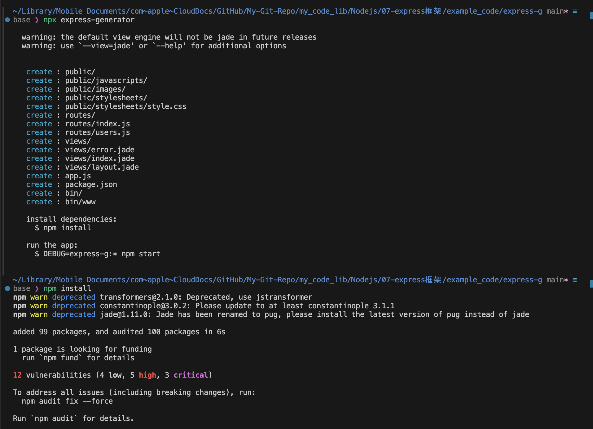

# 用 express 构建 nodejs 项目
由于是 nodejs 项目，所以我们最开始应该用 npm 对项目进行初始化，生成 `package.json` 文件。在项目根目录下执行：
```bash
cd node 项目的目录
npm init -y
```

---

## 用 npx 来使用 express 框架提供的项目模板

这里介绍一个轻量级的项目构建方法 `npx`, npx 是一个强大的命令行工具，它是从 npm 5.2.0 版本开始随 npm 一起安装的。以下是 npx 的主要特点和用途：
- 基本功能：
  - npx 全称是 Node Package eXecute，它是一个用于执行 npm 包的工具 
  - 它允许开发者直接运行 npm 包，而无需全局安装这些包

- 工作原理：
  - 首先检查本地项目中是否已安装该包
  - 如果本地已安装，则直接执行
  - 如果未安装，则会从 npm 仓库临时下载到缓存中并执行
  - 执行完成后自动清理，不会占用本地空间 

- 最佳使用场景：
  - 一次性命令的执行（如项目初始化）
  - 测试不同的 npm 包
  - 运行项目脚手架工具
  - 避免全局安装很少使用的包

- 不建议使用 npx 的场景：
  - 频繁使用的工具（建议全局安装）
  - 需要严格版本控制的项目依赖
  - 需要频繁更新的包
  - 长期运行的进程 

- npx 相比于传统的 npm 方式的优势在于：
  - 无需全局安装包
  - 确保使用最新版本
  - 避免全局环境污染
  - 节省磁盘空间
  - 简化了包的执行过程


这里针对 express 框架进行测试：
- 创建目录`express-g`, 并进入这个目录
    ```bash
    mkdir express-g
    cd express-g
    ```

- 使用 `npx` 安装 express-generator
    ```bash
    npx express-generator    # 会提示确认，按 y 确认
    npm install              # 由于版本太旧，会提示存在安全漏洞的警告，这里只是测试，可以不理他
    ```
    

这种方法仅适用于我们已经知道 express 框架如何使用的场景，由于目前还是学习阶段，这个方法就先介绍到这里。

---

