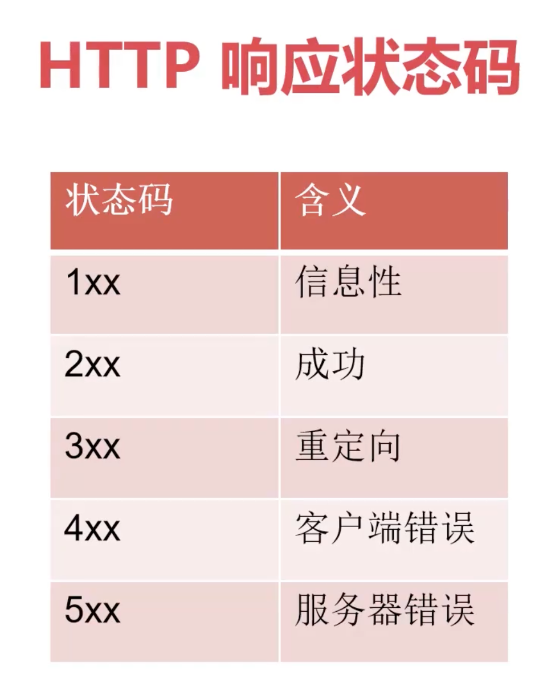

# 用 express 构建 nodejs 项目
由于是 nodejs 项目，所以我们最开始应该用 npm 对项目进行初始化，生成 `package.json` 文件。在项目根目录下执行：
```bash
cd node 项目的目录
npm init -y
```

---

## 用 npx 来使用 express 框架提供的项目模板

这里介绍一个轻量级的项目构建方法 `npx`, npx 是一个强大的命令行工具，它是从 npm 5.2.0 版本开始随 npm 一起安装的。以下是 npx 的主要特点和用途：
- 基本功能：
  - npx 全称是 Node Package eXecute，它是一个用于执行 npm 包的工具 
  - 它允许开发者直接运行 npm 包，而无需全局安装这些包

- 工作原理：
  - 首先检查本地项目中是否已安装该包
  - 如果本地已安装，则直接执行
  - 如果未安装，则会从 npm 仓库临时下载到缓存中并执行
  - 执行完成后自动清理，不会占用本地空间 

- 最佳使用场景：
  - 一次性命令的执行（如项目初始化）
  - 测试不同的 npm 包
  - 运行项目脚手架工具
  - 避免全局安装很少使用的包

- 不建议使用 npx 的场景：
  - 频繁使用的工具（建议全局安装）
  - 需要严格版本控制的项目依赖
  - 需要频繁更新的包
  - 长期运行的进程 

- npx 相比于传统的 npm 方式的优势在于：
  - 无需全局安装包
  - 确保使用最新版本
  - 避免全局环境污染
  - 节省磁盘空间
  - 简化了包的执行过程


这里针对 express 框架进行测试：
- 创建目录`express-g`, 并进入这个目录
    ```bash
    mkdir express-g
    cd express-g
    ```

- 使用 `npx` 安装 express-generator
    ```bash
    npx express-generator    # 会提示确认，按 y 确认
    npm install              # 由于版本太旧，会提示存在安全漏洞的警告，这里只是测试，可以不理他
    ```
    

这种方法仅适用于我们已经知道 express 框架如何使用的场景，由于目前还是学习阶段，这个方法就先介绍到这里。

---

## 从开始创建 express 的 nodejs 项目
1. 初始化项目`express-fm`
    ```bash
    mkdir express-fm
    cd express-fm
    npm init -y 
    npm install express
    ```

2. 创建 http 服务端代码 `express-fm/app.js`
    ```js
    const express = require('express');
    const fs = require('fs');
    const app = express();

    // --------- case1: 使用 "回调函数" 的方式处理 GET 请求，优点是性能较高，缺点是当出现多层回调函数嵌套时会出现回调地狱，代码难以读懂 -------
    app.get('/', function (req, res) {                 // 这里接收到的 req 和 res 都是经过 express 封装过的对象，可以使用 express 提供的方法哦！
        fs.readFile("./db.json", "utf-8", (err, data) => {
            if (!err) {
                // 1. 返回读取到的所有数据
                // res.send(data);                     // 调用 express 提供的 send 方法，它可以解析流数据并发送给客户端，然后执行 end

                // 2. 返回 json 中指定的某一部分数据
                var back = JSON.parse(data);            // 用 node 自带的 JSON 模块解析流数据
                res.send(back.users);                   // 只返回 users 部分的数据
            }
            else {
                res.status(500).json(err);              // 一般服务端发生错误都返回状态码 500, 在返回状态码的同时，还可以将错误信息用 json 格式包装一下丢给客户端
            }
        });
    })

    // 由于 express 本质上只是对 http 这个核心模块进行了扩展，所以类似监听这种操作还是需要手动完成的
    app.listen(3000, () => {
        console.log('Run http://127.0.0.1:3000');
    });
    ```
    - 需要手动指定监听端口：`app.listen()`
    - 需要使用 GET 方法时，可以直接使用 express 封装好的方法 `app.get()`, 注意此时的**请求参数 req 和 res 都是 express 封装过的对象**。
      - 需要返回数据给客户端时，使用 express 提供的`app.send()`相当于完成了`write(), end()` 这两个操作
      - 使用 express 提供的 `res.status()` 可以指定状态码
      - 使用 nodejs 自带的 `JSON.parse()` 可以将 fs.readFile 读取到的流数据进行解析并转换为 json 格式

3. 创建一个简单的 json 文件作为临时测试用的"数据库": `db.json`
    ```json
    {
      "users":[
          {
              "id": 1,
              "username": "neil",
              "age":18
          },
          {
              "id":2,
              "username":"嘿嘿",
              "age":12
          }
      ],
      "video":[]
    }
    ```

---

### 改进 - 使用 promisify 来避免"回调地狱"

>`回调函数 (Callback)` 是最基础的异步处理方式，它是一个作为参数传递给另一个函数的函数

>`Promise` 提供了更好的方式来处理异步操作，它代表一个异步操作的最终完成或失败。
Async/Await 是建立在 Promise 之上的语法糖，使异步代码看起来更像同步代码，提升代码的可读性。


修改`app.js`:
```js
const express = require('express');
const fs = require('fs');
const app = express();

// // --------- case1: 使用 "回调函数" 的方式处理 GET 请求，优点是性能较高，缺点是当出现多层回调函数嵌套时会出现回调地狱，代码难以读懂 -------
// app.get('/', function (req, res) {                 // 这里接收到的 req 和 res 都是经过 express 封装过的对象，可以使用 express 提供的方法哦！
//     fs.readFile("./db.json", "utf-8", (err, data) => {
//         if (!err) {
//             // 1. 返回读取到的所有数据
//             // res.send(data);                     // 调用 express 提供的 send 方法，它可以解析流数据并发送给客户端，然后执行 end

//             // 2. 返回 json 中指定的某一部分数据
//             var back = JSON.parse(data);            // 用 node 自带的 JSON 模块解析流数据
//             res.send(back.users);                   // 只返回 users 部分的数据
//         }
//         else {
//             res.status(500).json(err);              // 一般服务端发生错误都返回状态码 500, 在返回状态码的同时，还可以将错误信息用 json 格式包装一下丢给客户端
//         }
//     });
// })

// ------------ case2: 借助 promisify 避免使用回到函数 ---------------
const { promisify } = require('util');             // 借助 promisify 使用 async/await 来避免回调地狱
const readFile = promisify(fs.readFile);           // 使用 promisify 将 fs.readFile 变成 promise 流程

app.get('/', async function(req, res){             // 使用 async/await 异步操作，避免回调函数嵌套
    try{
        let back = await readFile('./db.json', 'utf-8');          // 这个 readFile 是 promise 的，也就是在异步处理的过程中，必须等待 readFile 执行结束才会继续往下执行
        const jsonObj = JSON.parse(back).users;
        res.send(jsonObj);
    }
    catch(err){
        res.status(500).json(err);
    }
})

// 由于 express 本质上只是对 http 这个核心模块进行了扩展，所以类似监听这种操作还是需要手动完成的
app.listen(3000, () => {
    console.log('Run http://127.0.0.1:3000');
});
```

---

## 处理 post 请求
上面的代码只处理了 GET 请求，现在我们来处理 POST 请求。

我们的场景是 "客户端要操作数据库里的数据".

### 识别客户端发送过来的数据
- 需要能识别客户端发过来的数据，修改`express-fm/app.js`:
  ```js
  const express = require('express');
  const fs = require('fs');
  const app = express();

  // // --------- case1: 使用 "回调函数" 的方式处理 GET 请求，优点是性能较高，缺点是当出现多层回调函数嵌套时会出现回调地狱，代码难以读懂 -------
  // app.get('/', function (req, res) {                 // 这里接收到的 req 和 res 都是经过 express 封装过的对象，可以使用 express 提供的方法哦！
  //     fs.readFile("./db.json", "utf-8", (err, data) => {
  //         if (!err) {
  //             // 1. 返回读取到的所有数据
  //             // res.send(data);                     // 调用 express 提供的 send 方法，它可以解析流数据并发送给客户端，然后执行 end

  //             // 2. 返回 json 中指定的某一部分数据
  //             var back = JSON.parse(data);            // 用 node 自带的 JSON 模块解析流数据
  //             res.send(back.users);                   // 只返回 users 部分的数据
  //         }
  //         else {
  //             res.status(500).json(err);              // 一般服务端发生错误都返回状态码 500, 在返回状态码的同时，还可以将错误信息用 json 格式包装一下丢给客户端
  //         }
  //     });
  // })

  // ------------ case2: 借助 promisify 避免使用回到函数 ---------------
  const { promisify } = require('util');             // 借助 promisify 使用 async/await 来避免回调地狱
  const readFile = promisify(fs.readFile);           // 使用 promisify 将 fs.readFile 变成 promise 流程

  app.use(express.urlencoded());                       // 用 express 提供的 urlencoded() 方法来表明服务端可以处理 urlencoded 这种类型的数据
  app.use(express.json());                             // 增加可处理的数据格式

  app.get('/', async function (req, res) {             // 使用 async/await 异步操作，避免回调函数嵌套
      try {
          let back = await readFile('./db.json', 'utf-8');          // 这个 readFile 是 promise 的，也就是在异步处理的过程中，必须等待 readFile 执行结束才会继续往下执行
          const jsonObj = JSON.parse(back).users;
          res.send(jsonObj);
      }
      catch (err) {
          res.status(500).json(err);
      }
  })


  app.post('/', async function (req, res) {
      console.log(req.headers);   // 打印客户端请求的所有 head 信息，从中可以知道客户端发送过来的数据是什么格式类型
                                  // 如果我们测试的时候用的是 "x-www-form-urlencoded", 那么打印信息中我们会看到 'content-type': 'application/x-www-form-urlencoded',
                                  //  根据这个信息，我们需要 app 初始化之后添加 app.use(express.urlencoded()) 来表明服务器需要处理这个格式的数据
                                  //  如果需要处理更多格式，则继续增加其他格式的声明，比如 json 格式 app.use(express.json())

      console.log(req.body);      // express 提供的 body 方法可以直接拿到客户端发过来的所有请求数据, 
                                  // 但是能否解析需要提前用 app.use() 声明客户端可能发过来什么格式的数据
  })

  // 由于 express 本质上只是对 http 这个核心模块进行了扩展，所以类似监听这种操作还是需要手动完成的
  app.listen(3000, () => {
      console.log('Run http://127.0.0.1:3000');
  });
  ```

---

### 将客户端发送的数据写入文件
修改`express-fm/app.js`:
```js
const express = require('express');
const fs = require('fs');
const app = express();

const { promisify } = require('util');             // 借助 promisify 使用 async/await 来避免回调地狱
const readFile = promisify(fs.readFile);           // 使用 promisify 将 fs.readFile 变成 promise 流程
const writeFile = promisify(fs.writeFile);

const db = require('./db');

// app.use(express.urlencoded());                       // 用 express 提供的 urlencoded() 方法来表明服务端可以处理 urlencoded 这种类型的数据
app.use(express.json());                             // 增加可处理的数据格式

app.get('/', async function (req, res) {
    try {

        //  ---- 代码重新封装前 -----
        // let back = await readFile('./db.json', 'utf-8');          // 这个 readFile 是 promise 的，也就是在异步处理的过程中，必须等待 readFile 执行结束才会继续往下执行
        // const jsonObj = JSON.parse(back).users;
        // res.send(jsonObj);

        //  ---- 重新封装后 -----
        let back = await db.getDb();
        res.send(back.users);
    }
    catch (err) {
        res.status(500).json(err);
    }
})

app.post('/', async function (req, res) {
    let body = req.body;
    if (!body){                     // 空数据 
        res.status(403).json({
            error: "缺少用户信息"
        })
    }

    //  ---- 代码重新封装前 -----
    // let back = await readFile('./db.json', 'utf-8');
    // const jsonObj = JSON.parse(back);
    
    //  ---- 重新封装后 -----
    let jsonObj = await db.getDb();
    body.id = jsonObj.users[jsonObj.users.length-1].id + 1;             // 获取最末尾用户的 id, +1 之后就是新用户的 id 
    jsonObj.users.push(body);                                           // 这里的 body 已经包含一个 user 需要的所有信息，所以直接使用 push 把数据添加到进去
    
    try{
        //  ---- 代码重新封装前 -----
        // let w =  await writeFile("./db.json", JSON.stringify(jsonObj)); // 注意写入 json 之前需要先将对象转成 json 数据
        
        //  ---- 重新封装后 -----
        let w =  await db.saveDb(jsonObj); // 注意写入 json 之前需要先将对象转成 json 数据
        
        if (!w){
            res.status(200).send({
                msg:"添加成功"
            });
        }
    }
    catch(err){
        res.status(500).json(err);
    }
})

app.listen(3000, () => {
    console.log('Run http://127.0.0.1:3000');
});
```
 - 这里还对代码进行了模块化封装，增加了`express-fm/db.js`:
    ```js
    const { promisify } = require("util");
    const fs = require('fs')
    const readFile = promisify(fs.readFile)
    const writeFile = promisify(fs.writeFile)

    exports.getDb = async () => {
        let data = await readFile("./db.json", 'utf-8')
        return JSON.parse(data);
    }

    exports.saveDb = async (data) => {
        let stringData = JSON.stringify(data);
        return await writeFile("./db.json", stringData);
    }
    ```

值得注意的操作：
- 需要将新的数据追加到原来的 json 数据对象中，可以使用`push()`方法，例如`jsonObj.users.push(body)`;
- 写入 JSON 文件之前，需要确保数据是符合 JSON 格式的，这里使用了`JSON.stringify()` 


--- 

## 处理 PUT 请求
一般来说，如果要请求修改服务端的数据都使用 `PUT` 请求。这里以修改上面`db.json`中的用户信息为例。



修改`express-fm/app.js`:
```js
const express = require('express');
const fs = require('fs');
const app = express();

const { promisify } = require('util');             // 借助 promisify 使用 async/await 来避免回调地狱
const readFile = promisify(fs.readFile);           // 使用 promisify 将 fs.readFile 变成 promise 流程
const writeFile = promisify(fs.writeFile);

const db = require('./db');

// app.use(express.urlencoded());                       // 用 express 提供的 urlencoded() 方法来表明服务端可以处理 urlencoded 这种类型的数据
app.use(express.json());                             // 增加可处理的数据格式

app.get('/', async function (req, res) {
    try {

        //  ---- 代码重新封装前 -----
        // let back = await readFile('./db.json', 'utf-8');          // 这个 readFile 是 promise 的，也就是在异步处理的过程中，必须等待 readFile 执行结束才会继续往下执行
        // const jsonObj = JSON.parse(back).users;
        // res.send(jsonObj);

        //  ---- 重新封装后 -----
        let back = await db.getDb();
        res.send(back.users);
    }
    catch (err) {
        res.status(500).json(err);
    }
})

app.post('/', async function (req, res) {
    let body = req.body;
    if (!body) {                     // 空数据 
        res.status(403).json({
            error: "缺少用户信息"
        })
    }

    //  ---- 代码重新封装前 -----
    // let back = await readFile('./db.json', 'utf-8');
    // const jsonObj = JSON.parse(back);

    //  ---- 重新封装后 -----
    let jsonObj = await db.getDb();
    body.id = jsonObj.users[jsonObj.users.length - 1].id + 1;             // 获取最末尾用户的 id, +1 之后就是新用户的 id 
    jsonObj.users.push(body);                                           // 这里的 body 已经包含一个 user 需要的所有信息，所以直接使用 push 把数据添加到进去

    try {
        //  ---- 代码重新封装前 -----
        // let w =  await writeFile("./db.json", JSON.stringify(jsonObj)); // 注意写入 json 之前需要先将对象转成 json 数据

        //  ---- 重新封装后 -----
        let w = await db.saveDb(jsonObj); // 注意写入 json 之前需要先将对象转成 json 数据

        if (!w) {
            res.status(200).send({
                msg: "添加成功"
            });
        }
    }
    catch (err) {
        res.status(500).json(err);
    }
})

app.put('/:id', async (req, res) => {       // "/:id" 中的冒号表示接受 url 中的参数，这是固定写法！然后把接收的参数赋值给一个属性，这里使用的是"id" 作为属性名
    // console.log(req.params.id);    // 用 req.params 可以获取到 url 中的参数，由于前面使用了 id 作为属性名，所以这里 req.params.id 就能拿到这个属性的值
    // console.log(req.body);         // 查看客户端请求中的具体信息
    try {
        let userInfo = await db.getDb();
        let userId = Number.parseInt(req.params.id);  // Number.parseInt() 将字符串转换为整数

        let user = userInfo.users.find(item => item.id === userId);   // 用 find() 方法查找是否存在请求信息中的 user id
        if (!user) {
            res.status(403).json({
                error: "用户不存在！"
            })
        }

        // res.send(user);  // debug: 返回找到的用户的信息

        const body = req.body;
        user.username = body.username ? body.username : user.username;  // 三元运算符，如果 body.username 不为空，则将它赋值给 user.username, 否则保持不变
        user.age = body.age ? body.age : user.age;
        
        userInfo.users[userId - 1] = user;         // 注意，这在索引用户的时候，需要确保数据库中的 user 的 index 与这个用户的 id 能正确关联起来！(代码例子中，index 从 0 开始计数，id 从 1 开始计数，所以这里减 1)
        if (!await db.saveDb(userInfo)) {          // db.saveDb() 执行成功时返回 null, 取反表示 true
            res.status(201).json({
                msg: "修改成功！"
            })
        }
    }
    catch (err) {
        res.status(500).json(err);
    }
})

app.listen(3000, () => {
    console.log('Run http://127.0.0.1:3000');
});
```
- 要处理 url 中附带的参数，这里需要使用`/:`的写法，冒号`:`表示占位符。代码中`/:id` 表示将 url 中附带的参数存放到属性`id`中，属性的名字是可以自定义的。
  - 要拿回属性中的值，则需要使用 express 提供的 `params`属性，也就是 `req.params`, 然后再具体拿出自定义的属性名称的值 `req.params.id`
- 如果需要将 string 转数字，可以使用 nodejs 自带的 `Number.parseInt()`
- 对于代码中信息查找部分，我们使用的是 `JSON` 模块提供的 `find()` 方法，因为我们在`db.js`中返回的是 JSON 模块提供的对象`return JSON.parse(data)`.


