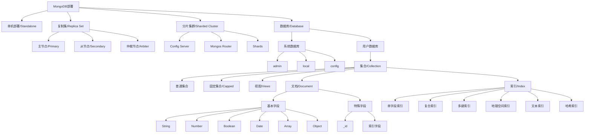
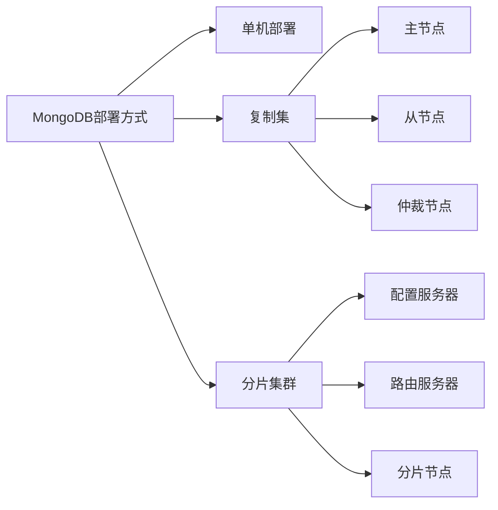
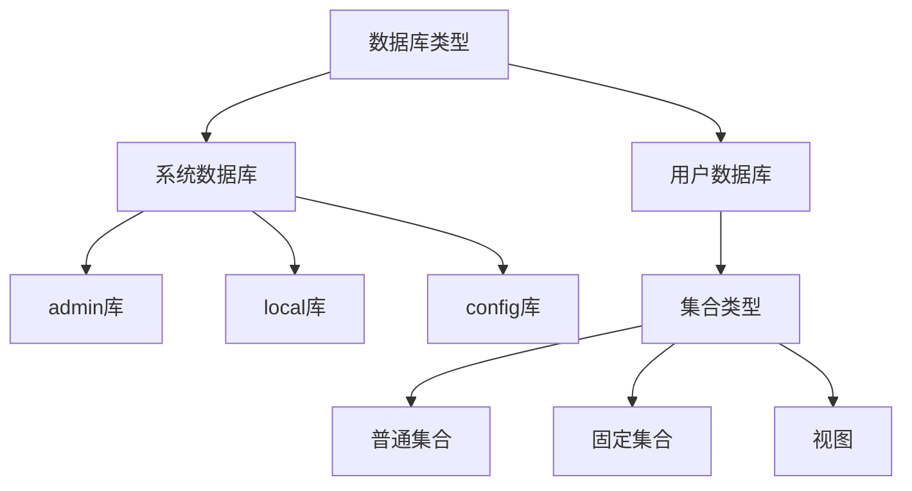
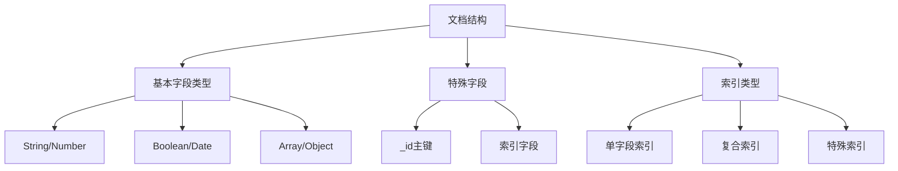

# MongoDB 简介


MongoDB 的特性

1. 文档型数据库
- 数据模型：MongoDB 使用 JSON 类似的 BSON (Binary JSON) 格式来存储数据，称为"文档"。文档是键值对的集合，键是字符串，值可以是各种数据类型（如字符串、数字、日期、数组、嵌套文档等）。
- 灵活性：文档的结构是动态的，这意味着同一个集合中的不同文档可以有不同的字段。这为数据建模提供了更大的灵活性，更容易适应不断变化的需求。

2. 高性能
- 索引：MongoDB 支持各种索引类型，包括单字段索引、复合索引、文本索引、地理空间索引等，以加速查询性能。
- 内存映射：MongoDB 使用内存映射技术来读取和写入数据，这可以提高 I/O 性能。
- 查询优化器：MongoDB 具有内置的查询优化器，可以自动选择最佳的查询执行计划。

3. 高可扩展性
- 水平扩展 (Sharding)：MongoDB 支持数据分片（sharding），将数据分布到多个服务器上，以实现水平扩展，处理大量数据和高并发访问。
- 副本集 (Replica Sets)：MongoDB 使用副本集来提供高可用性和数据冗余。副本集由多个 MongoDB 实例组成，其中一个为主节点，其他为辅助节点。如果主节点发生故障，辅助节点会自动接管，保证系统的连续性。

4. 丰富的查询语言
- 类 JSON 查询：MongoDB 的查询语言非常直观，使用 JSON 类似的语法，易于学习和使用。
- 聚合框架：MongoDB 提供了强大的聚合框架，可以执行复杂的数据分析和转换操作。
- 全文搜索：MongoDB 支持全文索引和全文搜索，方便用户查找文档中的文本信息。

5. 易于使用
- 动态模式：无需预先定义表结构，可以随时添加、修改或删除字段。
- 驱动支持：MongoDB 提供了多种编程语言的官方驱动程序，方便开发者使用。
- 管理工具：MongoDB 提供了丰富的管理工具，如 MongoDB Compass 和 MongoDB Atlas，方便用户管理和监控数据库。

6. 其他特性
- 事务支持：MongoDB 4.0 及更高版本支持 ACID 事务，可以保证多个操作的原子性、一致性、隔离性和持久性。
- 地理空间数据支持：MongoDB 支持地理空间索引和查询，方便用户处理地理位置相关的数据。
- Change Streams：MongoDB 提供了 Change Streams 功能，可以实时监听数据库中的数据变更。
- 多种存储引擎：MongoDB 提供了多种存储引擎，如 WiredTiger、In-Memory，可根据不同的需求选择。


---

# 安装
特别留意：
- 奇数版本是开发版 (测试版)，偶数版本是稳定版
- 3.2 版本之后不再支持 32 位系统

- Ubuntu 版本的安装指导：https://www.mongodb.com/docs/manual/tutorial/install-mongodb-on-ubuntu/
- Windows 版本：https://www.mongodb.com/docs/manual/tutorial/install-mongodb-on-windows-unattended/
- MacOS 版本：https://www.mongodb.com/docs/manual/tutorial/install-mongodb-on-os-x/

验证安装：
```bash
mongosh --version
```

---
# 基础指令
- 切换数据库
    ```bash
    use mydb;
    ```
- 查看当前数据库
    ```bash
    db;
    ```
- 查看集合
    ```bash
    show collections;
    ```
- 退出
    ```bash
    exit;
    quit();
    # ctrl + c 也可以退出
    ```

## MongoDB 的 shell 指令
```bash
# 进入 mongo shell
mongosh

# 查看数据库以及占用的大小
show dbs;

# 查看当前所处数据库
db;

# 切换 或 创建 数据库
use mydb;    # 允许切换到一个不存在的数据库, 此时只是在 RAM 中创建了一个临时的数据库, 当我们往里面添插入内容后就会被真正创建并写入磁盘

# 创建集合
db.createCollection("mycollection");   
## 创建集合同样允许直接使用一个"不存在的集合", 比如使用 db.mycollection , 此时就已经在RAM中临时创建 mycollection 这个集合了.

# 插入数据
db.mycollection.insert({name: "Alice", age: 25});   # 当成功执行插入数据时, 如果数据库, 集合都还没有被真正创建, 那么这个命令执行完之后就会完成创建 

# 查询当前数据库中的所有 collection
show collections

# 删除某个 collection
db.cc.drop();           # 删除当前数据库中名为 cc 的 collection

# 查询数据
db.mycollection.find();

# 删除数据库
db.dropDatabase();    # 注意: 必须进入这个数据库中才运行删除数据库; 属于一种 "自杀行为", 不可以"杀别人"
```
- 数据库名字是`不区分大小写的`, 请习惯**使用全小写进行命名**. 
- 数据库名称**不可以包含空格**！
  - 尽可能不要使用任何特殊字符
- 创建集合 (collection) 时，集合的名字不能以`$`, `空格`, `点(.)` 开头，集合名字最长不可超过 `255` 个字节。


## 增删改查
```bash

use mydata

// ---------- 增 ----------
db.cc.insertOne({username:"lisi", age:12})
db.cc.insertMany([
    {username:"lisi1", age:12},
    {username:"lisi2", age:13},
    {username:"lisi3", age:14}
    ])

// ---------- 查 ----------
db.cc.find()  // 查找cc中的所有内容
db.cc.find({username:'lisi'})
db.cc.find({age:{$gt:11}})   // gt 表示 greater than, 返回所有满足条件的数据
db.cc.findOne({age:{$gt:11}})   // gt 表示 greater than， 只返回满足条件的第一条数据

// --------- 改 ----------
db.cc.updateOne({username:'lisi'},{$set:{age:30}})  // 只修改找到的第一条数据，$set 用来操作设置的值
db.cc.updateMany({age:{$gt:15}},{$set:{username:'八嘎'}})  // 修改多条数据，$set 用来操作设置的值

// ---------- 删 ---------
db.cc.deleteOne({age:{$gt:0}})   // 删找到的第一条数据
db.cc.deleteMany({age:{$gt:0}})
```

---

# 基本概念
## MongoDB 自带的三个数据库
MongoDB 默认带有三个 database, 这些数据库通常需要特殊权限才能访问：
- `admin` 里的权限控制着整个 MongoDB 实例
  - 权限管理
    - 存储所有用户认证和授权信息
    - 包含系统角色和用户自定义角色信息
    - 存储在 admin.system.users 和 admin.system.roles 集合中 
  - 特殊权限
    - 某些管理命令必须从 admin 数据库运行
    - 包含最高级别的管理权限（如 userAdmin 和 userAdminAnyDatabase 角色）
    - 可以创建具有集群级别权限的角色
- `config` 用于分片集群的元数据存储
  - 分片信息管理
    - 存储分片集群的配置信息
    - 记录数据块（chunks）的分布情况
    - 追踪集群中所有分片的位置和状态
  - 重要集合
    - config.shards：记录所有分片服务器信息
    - config.chunks：存储数据块的分布信息
    - config.mongos：记录当前活动的 mongos 实例
    - config.databases：存储数据库分片配置
- `local` 用于存储单个服务器实例的本地信息
  - 复制集信息
    - 存储复制集的配置信息
    - 保存复制集操作日志（oplog）
    - 记录复制集成员状态 
  - 特点
    - 数据不会被复制到其他节点
    - 每个节点的 local 数据库都是独立的
    - 主要用于复制集的内部管理

---

## MongoDB 的数据组织结构
MongoDB 的组织结构如下：


对于**部署**部分，可以简化为：


对于**数据库和集合**部分：


对于**文档和索引的结构**:


MongoDB 的文档结构，我们可以借助 JSON 文件的样式进行理解 (在 MongoDB 实际存储的时候使用的是`Binary JSON`, 也就是二进制的 json 数据，它比 JSON 支持更丰富的数据类型)，比如将下面的 JSON 内容整体看做是本地存储的 MongoDB 数据库实例：
```json
// 整个 JSON 看做是一个 MongoDB 实例
{
    // Database 1
    "京东":{
        // Collection 1
        "用户":[
            // Document 1
            {
                // Field
                "id": 1,
                "username": "张三",
                "passwd": "25"
            },
            // Document 2
            {
                // Field
                "id":2,
                "username":"李四",
                "passwd": "234"
            }
            //...
        ],
        // Collection 2
        "商品":[
            //...
        ]
    }
}
```
- "京东" 就是 MongoDB 里的 `database`, 等同于 MongoDB 里自带的 "admin", "config", "local" 这个级别的数据
- "用户" 是 MongoDB 里的 `collection`, 对应于 SQL 中的 `table`
- 用户里存放的是多个数组，每一个数组元素在 MongoDB 中被称为一个 `document`, 对应于 SQL 中的 `Row`, 
- "id, username, passwd" 这些属性在 MongoDB 中被称为 `Field`, 对应于 SQL 中的 `column`

在 MongoDB 中，每一条数据的 Field 属性中都会看到一个系统生成的`_id`, 比如：
```json
{
  "_id": ObjectId("679f8615620081c3eb128bbe"),   // 系统生成的 数据哈希 值，方便快速索引
  "aa": 1,
  "vv": 2
}`
```
- 我们最好不要自己去赋值这个`_id`, 自己赋值的话就会覆盖掉系统生成的哈希值，导致索引性能下降

---

# 第三方连接工具
- MongoDB Compass: https://www.mongodb.com/try/download/compass
- navicat trial: https://www.navicat.com/en/download/navicat-premium
  - reset trial:
    ```bash
    ### Navicat trial reset
    navicat() {
        NAVICAT_FOLDER=~/Library/Application\ Support/PremiumSoft\ CyberTech/Navicat\ CC/Navicat\ Premium

        # Check if the Navicat folder exists before deleting it
        if [ -d "$NAVICAT_FOLDER" ]; then
            rm -rf "$NAVICAT_FOLDER"
        else
            echo "Navicat folder not found"
            return 1
        fi

        # Find the Navicat preferences file
        NAVICAT_FILENAME=$(ls -d ~/Library/Preferences/* | grep -i navicat)

        # Check if the preferences file exists before using it
        if [ -f "$NAVICAT_FILENAME" ]; then
            TRIAL_KEY=$(plutil -p "$NAVICAT_FILENAME" | grep -E "[0-9A-F]{32,32}" | head -n 1 | awk '{print $1}' | tr -d \")

            # Check if the TRIAL_KEY is not empty before removing it
            if [ -n "$TRIAL_KEY" ]; then
                plutil -remove "$TRIAL_KEY" "$NAVICAT_FILENAME" > /dev/null
            else
                echo "Trial key not found"
                return 1
            fi
        else
            echo "Navicat preferences file not found"
            return 1
        fi

        open -a "Navicat Premium"
        exit
    }
    ```


