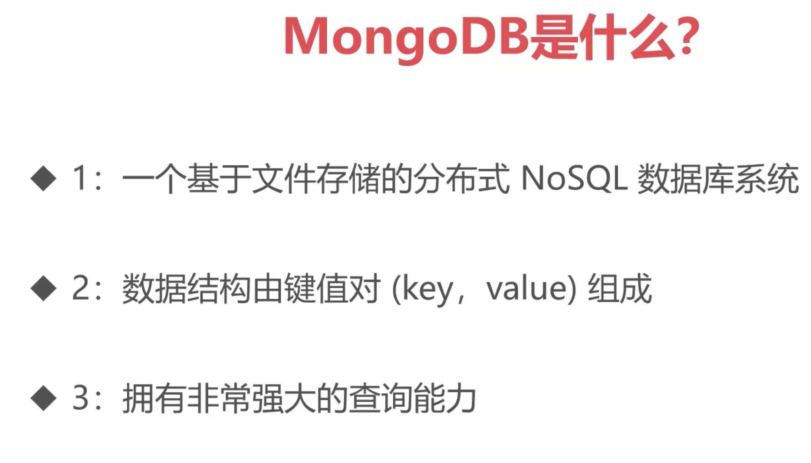

# MongoDB 简介


MongoDB 的特性

1. 文档型数据库
- 数据模型：MongoDB 使用 JSON 类似的 BSON (Binary JSON) 格式来存储数据，称为"文档"。文档是键值对的集合，键是字符串，值可以是各种数据类型（如字符串、数字、日期、数组、嵌套文档等）。
- 灵活性：文档的结构是动态的，这意味着同一个集合中的不同文档可以有不同的字段。这为数据建模提供了更大的灵活性，更容易适应不断变化的需求。

2. 高性能
- 索引：MongoDB 支持各种索引类型，包括单字段索引、复合索引、文本索引、地理空间索引等，以加速查询性能。
- 内存映射：MongoDB 使用内存映射技术来读取和写入数据，这可以提高 I/O 性能。
- 查询优化器：MongoDB 具有内置的查询优化器，可以自动选择最佳的查询执行计划。

3. 高可扩展性
- 水平扩展 (Sharding)：MongoDB 支持数据分片（sharding），将数据分布到多个服务器上，以实现水平扩展，处理大量数据和高并发访问。
- 副本集 (Replica Sets)：MongoDB 使用副本集来提供高可用性和数据冗余。副本集由多个 MongoDB 实例组成，其中一个为主节点，其他为辅助节点。如果主节点发生故障，辅助节点会自动接管，保证系统的连续性。

4. 丰富的查询语言
- 类 JSON 查询：MongoDB 的查询语言非常直观，使用 JSON 类似的语法，易于学习和使用。
- 聚合框架：MongoDB 提供了强大的聚合框架，可以执行复杂的数据分析和转换操作。
- 全文搜索：MongoDB 支持全文索引和全文搜索，方便用户查找文档中的文本信息。

5. 易于使用
- 动态模式：无需预先定义表结构，可以随时添加、修改或删除字段。
- 驱动支持：MongoDB 提供了多种编程语言的官方驱动程序，方便开发者使用。
- 管理工具：MongoDB 提供了丰富的管理工具，如 MongoDB Compass 和 MongoDB Atlas，方便用户管理和监控数据库。

6. 其他特性
- 事务支持：MongoDB 4.0 及更高版本支持 ACID 事务，可以保证多个操作的原子性、一致性、隔离性和持久性。
- 地理空间数据支持：MongoDB 支持地理空间索引和查询，方便用户处理地理位置相关的数据。
- Change Streams：MongoDB 提供了 Change Streams 功能，可以实时监听数据库中的数据变更。
- 多种存储引擎：MongoDB 提供了多种存储引擎，如 WiredTiger、In-Memory，可根据不同的需求选择。


---

# 安装
特别留意：
- 奇数版本是开发版 (测试版)，偶数版本是稳定版
- 3.2 版本之后不再支持 32 位系统

- Ubuntu 版本的安装指导：https://www.mongodb.com/docs/manual/tutorial/install-mongodb-on-ubuntu/
- Windows 版本：https://www.mongodb.com/docs/manual/tutorial/install-mongodb-on-windows-unattended/
- MacOS 版本：https://www.mongodb.com/docs/manual/tutorial/install-mongodb-on-os-x/

验证安装：
```bash
mongosh --version
# 进入 mongo shell
mongosh
# 查看数据库
show dbs;
# 创建数据库
use mydb;
# 创建集合
db.createCollection("mycollection");
# 插入数据
db.mycollection.insert({name: "Alice", age: 25});
# 查询数据
db.mycollection.find();
# 删除数据库
db.dropDatabase();
```


