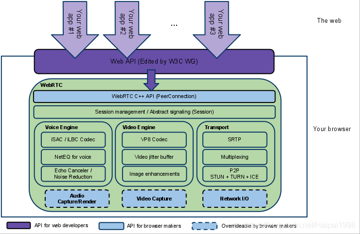
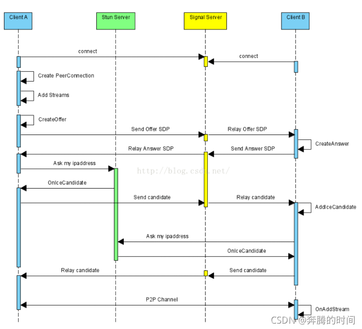
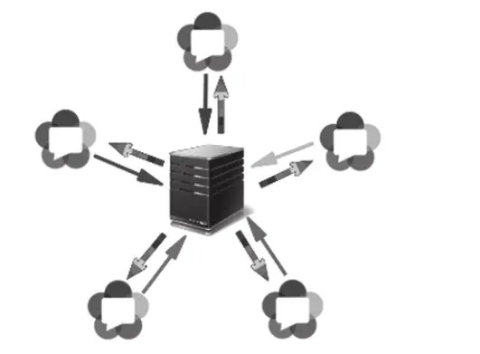
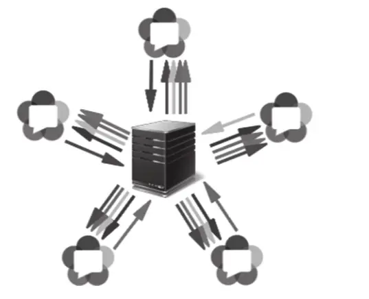

# 什么是 WebRTC

webrtc 是用来实现实时通信的开源项目，它提供了一系列的 API，可以让浏览器之间直接进行音视频通信，而不需要任何插件或者第三方软件的支持。

- [支持 WebRTC 的浏览器](https://caniuse.com/?search=webrtc)
- [WebRTC 原理](https://www.zhihu.com/question/571333555/answer/2794554060)

## ICE 建立过程

connect 这个过程应该就是用浏览器打开服务端的网页 (访问聊天室网页) , 然后点击连接到房间的操作。
1. PeerConnection 是 WebRTC 中非常重要的类，如果我们构建的是一个聊天室，那么 client A 要进入房间的时候，首先就会创建一个 PeerConnection 对象。

2. 创建好 PeerConnection 对象之后，client A 就会开始收集自己的各种流信息 (比如音频视频流), 以及自己的音视频参数信息 (供对方解码音视频使用), 当然了，自己的网络 ip 之类的信息也会被收集。

3. Create offer 是 js 层的 webrtc 接口，offer 的内部其实就是音视频的描述信息。

4. send offer SDP(会话描述协议), 对于音频来说，里面装的是采样率，通道数等信息; 对于视频来说，就是分辨率，高宽等信息

5. Signal Server 是一个信令服务器。如果是聊天室，当聊天室中只有 Client A 时，服务器会把 A 的信息保存起来，等 Client B 进来之后，就会把 A 的信息中继 (Relay) 给 Client B. 也就是给 B 发送 SDP 帧。

6. 图片中 B 收到 A 的 SDP 之后，create Answer 的过程其实也走了一次 1~4 步骤。

7. Client B 把自己 create 的 Answer 走 SDP 协议发回 Signal server. 之后 Signal server 会把 B 的 Answer 信息发给 A。
   - 到这里，A 与 B 的音视频信息已经交换完毕，但是他们之间的网络信息还没有交换完毕，这个时候就需要下面的 STUN Server 了。
     - 这里先不详细介绍 STUN server, 只需要知道兼具了打通 tunnel 和 中继的功能即可 (实在不行就模糊地理解为一个牛逼的路由器就好了)。
     - 如果需要自己部署的话，可以搜一下`Coturn`的部署。

8. Client A 为了能将自己的音视频流量包以低延迟的方式发送给 B, 它首先需要找到 B 的网络地址，而由于不是内网，所以需要借助 STUN server 获取可以访问的公网 ip 和端口。
   1. A 首先向 STUN server 请求一个网络地址，然后 STUN server 会返回一个地址给 A。
   2. A 将自己的网络地址传给 Signal server. 然后 Signal server 会把 A 的网络地址发给 B。
   3. 当 B 收到了 A 的地址后，意味着 B 自己知道即将有一方要给自己发送大量数据包了，于是 B 向 STUN server 请求&获得一个网络地址，拿到地址之后，B 会将自己的网络地址传给 Signal server. 同样的，Signal server 会把 B 的网络地址发给 A。
    - 到这里，A 与 B 之间的点对点连接就完成了。

走完 8 这个过程，A B 双方就应该可以看到对方的音频和视频了。

## WebRTC 的网络拓扑
Mesh 拓扑结构

- 这种属于多个 p2p 连接的拓扑结构，每个节点都要和其他节点建立连接，这样的话，节点之间的连接数会随着节点的增加而指数级增加。
- 适合人少的场景
  - 人多的话，同一份音视频就要同时分别发送给好几个人，网络带宽会成为瓶颈。 

MCU(Multipoint Control Unit) 拓扑结构

- 参与者仅与中心的 MCU 媒体服务器连接。**MCU 媒体服务器合并所有参与者的视频流，生成一个包含所有参与者画面的视频流**，**参与者只需要拉取合流画面**。
  - 降低了参与者的带宽压力，但是增加了服务器的压力。同时由于合流画面固定，界面布局也不够灵活。

SFU(Selective Forwarding Unit) 拓扑结构 (更常用)

- 仍然有中心节点媒体服务器，但是**中心节点只负责转发，不做合流、转码等资源开销较大的媒体处理工作**，所以服务器的压力会小很多，服务器配置也不像 MCU 的要求那么高。

- 参考资料：https://www.jianshu.com/p/167192585ae7

