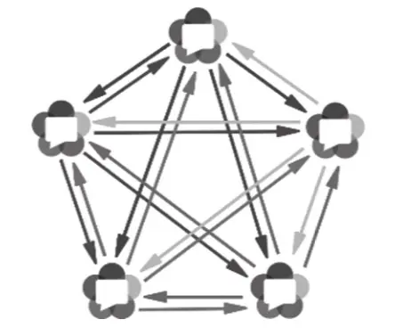

# 什么是 WebRTC

webrtc 是用来实现实时通信的开源项目，它提供了一系列的 API，可以让浏览器之间直接进行音视频通信，而不需要任何插件或者第三方软件的支持。

- 紫色部分是 Web 应用开发者 API 层
- 蓝色实线部分是面向浏览器厂商的 API 层
- 蓝色虚线部分是浏览器厂商可以自定义实现的部分


参考资料：
- [支持 WebRTC 的浏览器](https://caniuse.com/?search=webrtc)
- [WebRTC 原理](https://www.zhihu.com/question/571333555/answer/2794554060)
- [哔哩哔哩上的教程](https://www.bilibili.com/video/BV1vY4y197Wi/?p=3&vd_source=7cf7026bc2c23d0b0b88a3094e5ce55a)


## 诊断当前浏览器是否支持 WebRTC
可以直接借助腾讯云实时音视频的检测工具网站进行诊断：
- https://web.sdk.qcloud.com/trtc/webrtc/demo/detect/index.html

## ICE 建立过程


connect 这个过程指的是用浏览器打开服务端的网页 (访问聊天室网页) , 然后点击连接到房间的操作 (属于聊天室管理的一环，包含通知"有人进入/离开"等)。
1. PeerConnection 是 WebRTC 中非常重要的类，如果我们构建的是一个聊天室，那么 client A 要进入房间的时候，首先就会创建一个 PeerConnection 对象。

2. 创建好 PeerConnection 对象之后，client A 就会开始收集自己的各种流信息 (比如音频视频流), 以及自己的音视频参数信息 (供对方解码音视频使用), 当然了，自己的网络 ip 之类的信息也会被收集。

3. Create offer 是 js 层的 webrtc 接口，offer 的内部其实就是音视频的描述信息。

4. send offer SDP(会话描述协议), 对于音频来说，里面装的是采样率，通道数等信息; 对于视频来说，就是分辨率，高宽等信息

5. Signal Server 是一个信令服务器。如果是聊天室，当聊天室中只有 Client A 时，服务器会把 A 的信息保存起来，等 Client B 进来之后，就会把 A 的信息中继 (Relay) 给 Client B. 也就是给 B 发送 SDP 帧。

6. 图片中 B 收到 A 的 SDP 之后，create Answer 的过程其实也走了一次 1~4 步骤。

7. Client B 把自己 create 的 Answer 走 SDP 协议发回 Signal server. 之后 Signal server 会把 B 的 Answer 信息发给 A。
   - 到这里，A 与 B 的音视频信息已经交换完毕，但是他们之间的网络信息还没有交换完毕，这个时候就需要下面的 STUN Server 了。
     - 这里先不详细介绍 STUN server, 只需要知道兼具了打通 tunnel 的功能即可 (实在不行就模糊地理解为一个牛逼的路由器就好了)。
     - 如果需要自己部署的话，可以搜一下`Coturn`的部署。
       - Coturn 是一个开源项目，它集成了`STUN协议`和`TURN协议`的功能，可以用来解决 NAT 穿透问题。
       - STUN: Session Traversal Utilities for NAT, 用于解决 NAT 穿透问题，比如它会帮当前设备的内网 IP 如`192.168.1.10:300`找到当前设备对应的外网 IP 的可用的端口比如`176.1.55.176:3000`, 如果 A 和 B 互相知道了对方的公网 IP 和端口，此时就可以直接互相发送数据了，这种状态称为 P2P。
       - TURN: Traversal Using Relays around NAT, 用于解决 NAT 穿透问题，它与 STUN 不同的地方是，TURN 并没有帮 A 和 B 分别找出各自公网 IP 下可用的端口，而是借助一个中继服务器 (Relay server) 把 A 和 B 连接起来，这时候，A 和 B 之间互相发数据的时候数据包是一定要经过 Relay Server 的。

8. Client A 为了能将自己的音视频流量包以低延迟的方式发送给 B, 它首先需要找到 B 的网络地址，而由于不是内网，所以需要借助 STUN server 获取可以访问的公网 ip 和端口。
   1. A 首先向 STUN server 请求一个网络地址，然后 STUN server 会返回一个地址给 A。
   2. A 将自己的网络地址传给 Signal server. 然后 Signal server 会把 A 的网络地址发给 B。
   3. 当 B 收到了 A 的地址后，意味着 B 自己知道即将有一方要给自己发送大量数据包了，于是 B 向 STUN server 请求&获得一个网络地址，拿到地址之后，B 会将自己的网络地址传给 Signal server. 同样的，Signal server 会把 B 的网络地址发给 A。
    - 到这里，A 与 B 之间的点对点连接就完成了。

走完 8 这个过程，A B 双方就应该可以看到对方的音频和视频了。


需要留意一下的细节：
```txt
Signal Server 对于房间的管理：
    A 进入聊天房间时，房间内还没有人。
    B 加入房间后，发现房间有 A 存在
        这个过程包含：Signal Server 发通知给 A, 说 B 进来了; 同时，Signal Server 发通知给 B, 说 A 在房间里。
```


## WebRTC 的网络拓扑
Mesh 拓扑结构

- 这种属于多个 p2p 连接的拓扑结构，每个节点都要和其他节点建立连接，这样的话，节点之间的连接数会随着节点的增加而指数级增加。
- 适合人少的场景
  - 人多的话，同一份音视频就要同时分别发送给好几个人，网络带宽会成为瓶颈。 


MCU(Multipoint Control Unit) 拓扑结构

- 参与者仅与中心的 MCU 媒体服务器连接。**MCU 媒体服务器合并所有参与者的视频流，生成一个包含所有参与者画面的视频流**，**参与者只需要拉取合流画面**。
  - 降低了参与者的带宽压力，但是增加了服务器的压力。同时由于合流画面固定，界面布局也不够灵活。


SFU(Selective Forwarding Unit) 拓扑结构 (更常用)

- 仍然有中心节点媒体服务器，但是**中心节点只负责转发，不做合流、转码等资源开销较大的媒体处理工作**，所以服务器的压力会小很多，服务器配置也不像 MCU 的要求那么高。

- 参考资料：https://www.jianshu.com/p/167192585ae7


